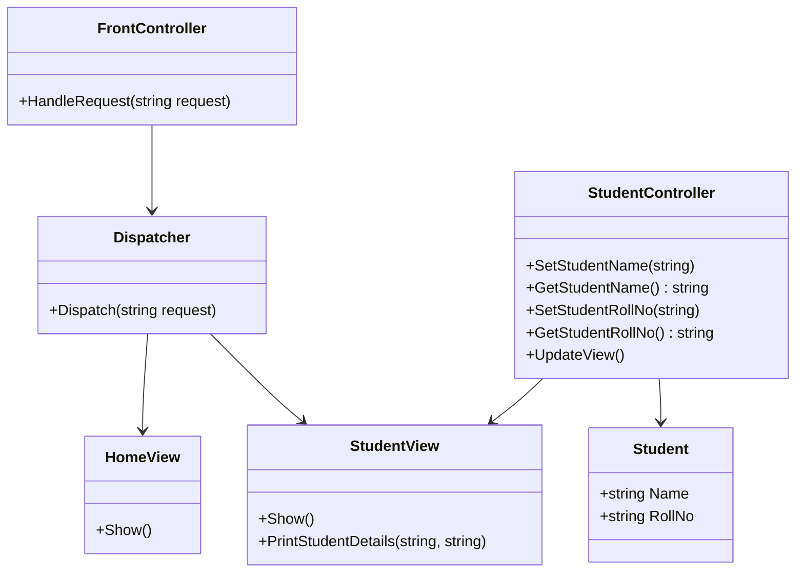

## 18.1 Building a Web Framework Using Design Patterns

Building a web framework is a complex task that requires a deep understanding of software design principles and patterns. In this section, we will explore how to leverage design patterns to construct a robust and efficient web framework using C#. We will delve into the core components of a web framework, such as request handling and response generation, and demonstrate how to implement essential patterns like the Front Controller and Model-View-Controller (MVC). Additionally, we will examine use cases and examples, including the development of a custom lightweight framework and insights from popular frameworks like ASP.NET Core.

### Applying Patterns to Core Components

#### Request Handling and Response Generation

A web framework's primary responsibility is to handle HTTP requests and generate appropriate responses. This involves several steps, including routing requests to the correct handlers, processing input data, and formatting output. Design patterns can significantly enhance the modularity and maintainability of these processes.

##### Front Controller Pattern

**Intent:** The Front Controller pattern centralizes request handling by directing all requests through a single controller. This pattern is particularly useful for managing authentication, logging, and other cross-cutting concerns.

**Key Participants:**
- **Front Controller:** The central point for handling all requests.
- **Dispatcher:** Responsible for dispatching requests to the appropriate handler.
- **View:** The component that generates the response.

**Applicability:** Use the Front Controller pattern when you need a centralized entry point for request handling, especially in applications with complex routing and processing logic.

**Sample Code Snippet:**

```csharp
public class FrontController
{
    private Dispatcher _dispatcher;

    public FrontController()
    {
        _dispatcher = new Dispatcher();
    }

    public void HandleRequest(string request)
    {
        // Authentication and logging logic
        Console.WriteLine("Authenticating request: " + request);
        _dispatcher.Dispatch(request);
    }
}

public class Dispatcher
{
    public void Dispatch(string request)
    {
        if (request.Equals("HOME"))
        {
            new HomeView().Show();
        }
        else if (request.Equals("STUDENT"))
        {
            new StudentView().Show();
        }
    }
}

public class HomeView
{
    public void Show()
    {
        Console.WriteLine("Displaying Home Page");
    }
}

public class StudentView
{
    public void Show()
    {
        Console.WriteLine("Displaying Student Page");
    }
}
```

**Design Considerations:** The Front Controller pattern is ideal for applications that require a consistent approach to request processing. It simplifies the addition of new features like logging and security checks.

##### Model-View-Controller (MVC) Pattern

**Intent:** The MVC pattern separates an application into three interconnected components: Model, View, and Controller. This separation facilitates modular development and testing.

**Key Participants:**
- **Model:** Represents the data and business logic.
- **View:** Displays the data to the user.
- **Controller:** Handles user input and updates the Model.

**Applicability:** Use the MVC pattern when you need to separate concerns in your application, allowing for independent development and testing of components.

**Sample Code Snippet:**

```csharp
// Model
public class Student
{
    public string Name { get; set; }
    public string RollNo { get; set; }
}

// View
public class StudentView
{
    public void PrintStudentDetails(string studentName, string studentRollNo)
    {
        Console.WriteLine("Student: ");
        Console.WriteLine("Name: " + studentName);
        Console.WriteLine("Roll No: " + studentRollNo);
    }
}

// Controller
public class StudentController
{
    private Student _model;
    private StudentView _view;

    public StudentController(Student model, StudentView view)
    {
        _model = model;
        _view = view;
    }

    public void SetStudentName(string name)
    {
        _model.Name = name;
    }

    public string GetStudentName()
    {
        return _model.Name;
    }

    public void SetStudentRollNo(string rollNo)
    {
        _model.RollNo = rollNo;
    }

    public string GetStudentRollNo()
    {
        return _model.RollNo;
    }

    public void UpdateView()
    {
        _view.PrintStudentDetails(_model.Name, _model.RollNo);
    }
}
```

**Design Considerations:** The MVC pattern is highly effective for applications with complex user interfaces. It allows for parallel development of components and simplifies testing.

#### Visualizing the Architecture

To better understand how these patterns fit into a web framework, let's visualize the architecture using a class diagram.



**Diagram Description:** This class diagram illustrates the relationships between the Front Controller, Dispatcher, and Views, as well as the MVC components: Model, View, and Controller.

### Use Cases and Examples

#### Developing a Custom Lightweight Framework

Building a custom lightweight framework allows you to tailor the architecture to specific needs and constraints. This approach is beneficial for applications with unique requirements that are not fully addressed by existing frameworks.

**Steps to Develop a Custom Framework:**

1. **Define Core Components:** Identify the essential components, such as routing, request handling, and response generation.
2. **Select Appropriate Patterns:** Choose design patterns that best fit the requirements of each component.
3. **Implement Core Functionality:** Develop the core functionality using the selected patterns.
4. **Test and Refine:** Continuously test and refine the framework to ensure reliability and performance.

**Example:**

Consider a simple web framework that handles HTTP requests and generates JSON responses. We can use the Front Controller pattern for request handling and the MVC pattern for organizing the application logic.

```csharp
public class SimpleWebFramework
{
    private FrontController _frontController;

    public SimpleWebFramework()
    {
        _frontController = new FrontController();
    }

    public void Start()
    {
        // Simulate handling requests
        _frontController.HandleRequest("HOME");
        _frontController.HandleRequest("STUDENT");
    }
}

class Program
{
    static void Main(string[] args)
    {
        SimpleWebFramework framework = new SimpleWebFramework();
        framework.Start();
    }
}
```

**Design Considerations:** When developing a custom framework, focus on simplicity and extensibility. Avoid over-engineering and ensure that the framework can be easily extended to accommodate future requirements.

#### Learning from Popular Frameworks like ASP.NET Core

ASP.NET Core is a widely-used framework that exemplifies the effective use of design patterns. By studying its architecture, we can gain insights into best practices for building scalable and maintainable web frameworks.

**Key Features of ASP.NET Core:**

- **Middleware Pipeline:** Uses the Chain of Responsibility pattern to process requests through a series of middleware components.
- **Dependency Injection:** Facilitates loose coupling and enhances testability by injecting dependencies at runtime.
- **Routing:** Implements the Strategy pattern to define routing rules and map requests to handlers.

**Example:**

```csharp
public class Startup
{
    public void ConfigureServices(IServiceCollection services)
    {
        services.AddControllers();
    }

    public void Configure(IApplicationBuilder app, IWebHostEnvironment env)
    {
        if (env.IsDevelopment())
        {
            app.UseDeveloperExceptionPage();
        }

        app.UseRouting();

        app.UseEndpoints(endpoints =>
        {
            endpoints.MapControllers();
        });
    }
}
```

**Design Considerations:** ASP.NET Core's architecture demonstrates the importance of modularity and extensibility. By using design patterns, the framework provides a flexible and scalable platform for building web applications.

### Try It Yourself

To deepen your understanding of building a web framework using design patterns, try modifying the code examples provided. Experiment with adding new request handlers, implementing additional design patterns, or extending the framework's functionality.

### Knowledge Check

1. **What is the primary role of the Front Controller pattern in a web framework?**
   - [ ] To handle database interactions.
   - [x] To centralize request handling.
   - [ ] To manage user sessions.
   - [ ] To generate HTML responses.

2. **Which design pattern is used to separate concerns in an application?**
   - [ ] Singleton
   - [x] MVC
   - [ ] Factory Method
   - [ ] Observer

3. **What is the benefit of using the Chain of Responsibility pattern in a middleware pipeline?**
   - [ ] It simplifies database access.
   - [x] It allows requests to be processed by multiple components.
   - [ ] It enhances user interface design.
   - [ ] It improves data validation.

4. **In the MVC pattern, which component is responsible for handling user input?**
   - [ ] Model
   - [ ] View
   - [x] Controller
   - [ ] Dispatcher

5. **How does dependency injection enhance testability in a web framework?**
   - [ ] By centralizing request handling.
   - [x] By allowing dependencies to be injected at runtime.
   - [ ] By simplifying routing logic.
   - [ ] By improving response generation.

### Embrace the Journey

Building a web framework using design patterns is a rewarding endeavor that enhances your understanding of software architecture and design. Remember, this is just the beginning. As you progress, you'll build more complex and interactive web applications. Keep experimenting, stay curious, and enjoy the journey!

## Quiz Time!



### What is the primary role of the Front Controller pattern in a web framework?

- [ ] To handle database interactions.
- [x] To centralize request handling.
- [ ] To manage user sessions.
- [ ] To generate HTML responses.

> **Explanation:** The Front Controller pattern centralizes request handling, allowing for consistent processing of requests and management of cross-cutting concerns.

### Which design pattern is used to separate concerns in an application?

- [ ] Singleton
- [x] MVC
- [ ] Factory Method
- [ ] Observer

> **Explanation:** The MVC pattern separates an application into Model, View, and Controller components, facilitating modular development and testing.

### What is the benefit of using the Chain of Responsibility pattern in a middleware pipeline?

- [ ] It simplifies database access.
- [x] It allows requests to be processed by multiple components.
- [ ] It enhances user interface design.
- [ ] It improves data validation.

> **Explanation:** The Chain of Responsibility pattern allows requests to be processed by multiple middleware components, each handling specific concerns.

### In the MVC pattern, which component is responsible for handling user input?

- [ ] Model
- [ ] View
- [x] Controller
- [ ] Dispatcher

> **Explanation:** The Controller component in the MVC pattern is responsible for handling user input and updating the Model accordingly.

### How does dependency injection enhance testability in a web framework?

- [ ] By centralizing request handling.
- [x] By allowing dependencies to be injected at runtime.
- [ ] By simplifying routing logic.
- [ ] By improving response generation.

> **Explanation:** Dependency injection enhances testability by allowing dependencies to be injected at runtime, facilitating the use of mock objects in testing.

### Which pattern is exemplified by ASP.NET Core's middleware pipeline?

- [ ] Singleton
- [ ] Observer
- [x] Chain of Responsibility
- [ ] Factory Method

> **Explanation:** ASP.NET Core's middleware pipeline uses the Chain of Responsibility pattern to process requests through a series of middleware components.

### What is the purpose of the Dispatcher in the Front Controller pattern?

- [ ] To generate HTML responses.
- [x] To dispatch requests to the appropriate handler.
- [ ] To manage user sessions.
- [ ] To handle database interactions.

> **Explanation:** The Dispatcher in the Front Controller pattern is responsible for dispatching requests to the appropriate handler based on the request type.

### Which component in the MVC pattern is responsible for displaying data to the user?

- [ ] Model
- [x] View
- [ ] Controller
- [ ] Dispatcher

> **Explanation:** The View component in the MVC pattern is responsible for displaying data to the user.

### What is a key advantage of using design patterns in web framework development?

- [ ] They simplify database schema design.
- [x] They enhance modularity and maintainability.
- [ ] They improve network latency.
- [ ] They reduce code complexity.

> **Explanation:** Design patterns enhance modularity and maintainability by providing proven solutions to common design problems.

### True or False: The MVC pattern allows for parallel development of components.

- [x] True
- [ ] False

> **Explanation:** True. The MVC pattern separates concerns, allowing for parallel development of the Model, View, and Controller components.


