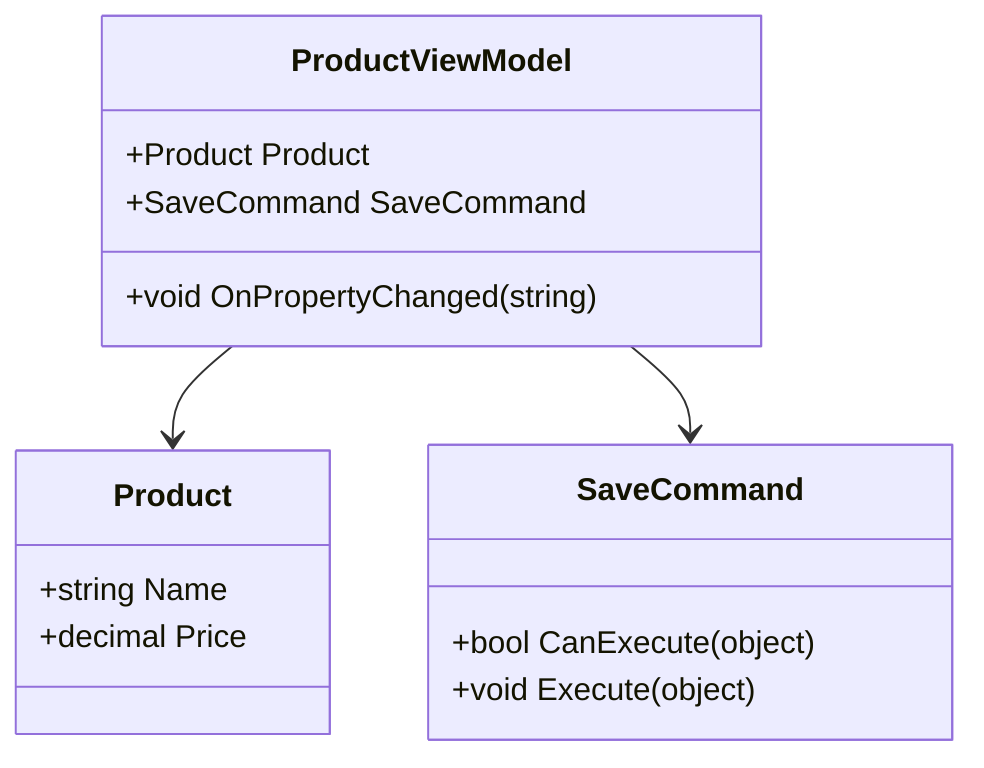

## 18.10 Patterns in Cross-Platform Development

In today's rapidly evolving technological landscape, developing applications that can seamlessly operate across multiple platforms is crucial. Cross-platform development not only reduces the time and cost associated with building separate applications for each platform but also ensures a consistent user experience. In this section, we will delve into the design patterns and strategies that facilitate cross-platform development using Xamarin and .NET MAUI, focusing on code sharing and the Model-View-ViewModel (MVVM) pattern.

### Introduction to Cross-Platform Development

Cross-platform development refers to the practice of building applications that can run on multiple operating systems, such as iOS, Android, and Windows, using a single codebase. This approach offers several advantages, including reduced development time, lower costs, and a unified user experience across devices.

#### Benefits of Cross-Platform Development

- **Cost Efficiency**: By maintaining a single codebase, developers can significantly reduce the resources required for development and maintenance.
- **Faster Time-to-Market**: With a unified codebase, updates and new features can be rolled out simultaneously across all platforms.
- **Consistent User Experience**: Ensures that users have a similar experience regardless of the device or operating system they are using.

### Using Xamarin and .NET MAUI

Xamarin and .NET MAUI (Multi-platform App UI) are powerful frameworks that enable developers to create cross-platform applications using C#. Let's explore how these frameworks support cross-platform development and the design patterns that can be leveraged.

#### Xamarin

Xamarin is a Microsoft-owned framework that allows developers to build native Android, iOS, and Windows applications using C#. It provides a single language and runtime that works across all platforms, enabling code sharing and reuse.

##### Key Features of Xamarin

- **Native User Interfaces**: Xamarin allows developers to create native UIs for each platform, ensuring a high-quality user experience.
- **Access to Native APIs**: Developers can access platform-specific APIs and features using Xamarin.
- **Shared Codebase**: Xamarin.Forms enables code sharing across platforms, reducing duplication and maintenance efforts.

#### .NET MAUI

.NET MAUI is the evolution of Xamarin.Forms, providing a more streamlined and efficient way to build cross-platform applications. It supports a single project structure that targets multiple platforms, simplifying the development process.

##### Key Features of .NET MAUI

- **Single Project Structure**: MAUI consolidates platform-specific projects into a single project, making it easier to manage and deploy.
- **Enhanced Performance**: MAUI offers improved performance and reduced overhead compared to Xamarin.Forms.
- **Unified API**: Provides a consistent API for accessing platform-specific features.

### Implementing Patterns for Mobile Apps

Design patterns play a crucial role in structuring and organizing code in cross-platform applications. Let's explore some of the key patterns that can be implemented using Xamarin and .NET MAUI.

#### Model-View-ViewModel (MVVM) Pattern

The MVVM pattern is widely used in cross-platform development to separate the user interface (UI) from the business logic. This separation enhances code maintainability and testability.

##### Intent

The MVVM pattern aims to decouple the UI from the business logic, allowing developers to change the UI without affecting the underlying logic.

##### Key Participants

- **Model**: Represents the data and business logic of the application.
- **View**: The UI layer that displays data to the user.
- **ViewModel**: Acts as an intermediary between the Model and View, handling data binding and user interactions.

##### Applicability

- Use the MVVM pattern when you need to separate the UI from the business logic.
- Ideal for applications with complex UIs that require frequent updates.

##### Sample Code Snippet

```csharp
// Model
public class Product
{
    public string Name { get; set; }
    public decimal Price { get; set; }
}

// ViewModel
public class ProductViewModel : INotifyPropertyChanged
{
    private Product _product;
    public Product Product
    {
        get => _product;
        set
        {
            _product = value;
            OnPropertyChanged(nameof(Product));
        }
    }

    public event PropertyChangedEventHandler PropertyChanged;

    protected virtual void OnPropertyChanged(string propertyName)
    {
        PropertyChanged?.Invoke(this, new PropertyChangedEventArgs(propertyName));
    }
}

// View (XAML)
<ContentPage xmlns="http://xamarin.com/schemas/2014/forms"
             xmlns:x="http://schemas.microsoft.com/winfx/2009/xaml"
             x:Class="MyApp.ProductPage">
    <StackLayout>
        <Label Text="{Binding Product.Name}" />
        <Label Text="{Binding Product.Price, StringFormat='Price: {0:C}'}" />
    </StackLayout>
</ContentPage>
```

##### Design Considerations

- Ensure that the ViewModel does not have direct references to the View to maintain separation.
- Use data binding to connect the View and ViewModel, allowing for automatic updates.

#### Command Pattern

The Command pattern is often used in conjunction with MVVM to handle user interactions in a decoupled manner.

##### Intent

Encapsulate a request as an object, thereby allowing for parameterization and queuing of requests.

##### Key Participants

- **Command**: Encapsulates the action to be performed.
- **Invoker**: Triggers the command.
- **Receiver**: The object that performs the action.

##### Applicability

- Use the Command pattern to handle user interactions in a decoupled manner.
- Ideal for applications with complex user interactions.

##### Sample Code Snippet

```csharp
// Command
public class SaveCommand : ICommand
{
    private readonly ProductViewModel _viewModel;

    public SaveCommand(ProductViewModel viewModel)
    {
        _viewModel = viewModel;
    }

    public event EventHandler CanExecuteChanged;

    public bool CanExecute(object parameter) => true;

    public void Execute(object parameter)
    {
        // Save logic here
    }
}

// ViewModel
public class ProductViewModel : INotifyPropertyChanged
{
    public ICommand SaveCommand { get; }

    public ProductViewModel()
    {
        SaveCommand = new SaveCommand(this);
    }

    // Other properties and methods
}
```

##### Design Considerations

- Use the Command pattern to encapsulate user actions, making them reusable and testable.
- Ensure that commands are decoupled from the UI to maintain separation.

### Sharing Code Between iOS, Android, and Windows

One of the primary goals of cross-platform development is to maximize code reuse across different platforms. Let's explore some strategies for sharing code effectively.

#### Code Sharing Strategies

- **Shared Projects**: Use shared projects to include common code that can be used across multiple platforms.
- **Portable Class Libraries (PCLs)**: Create libraries that can be used across different platforms, ensuring compatibility.
- **.NET Standard Libraries**: Use .NET Standard to create libraries that can be shared across all .NET platforms.

#### Maximizing Reuse Across Platforms

- **Use Interfaces**: Define interfaces for platform-specific functionality and implement them in platform-specific projects.
- **Dependency Injection**: Use dependency injection to manage dependencies and promote code reuse.
- **Abstraction Layers**: Create abstraction layers to separate platform-specific code from shared code.

### Using MVVM Pattern for UI Decoupling

The MVVM pattern is particularly useful for decoupling the UI from the business logic in cross-platform applications. Let's explore how this pattern can be leveraged to enhance code maintainability and testability.

#### Benefits of MVVM Pattern

- **Separation of Concerns**: Separates the UI from the business logic, making the code easier to maintain and test.
- **Data Binding**: Allows for automatic updates between the View and ViewModel, reducing boilerplate code.
- **Testability**: The ViewModel can be tested independently of the UI, improving test coverage.

#### Implementing MVVM in Xamarin and .NET MAUI

- **Define Models**: Create models that represent the data and business logic of the application.
- **Create ViewModels**: Implement ViewModels that handle data binding and user interactions.
- **Design Views**: Design Views using XAML or C# that bind to the ViewModels.

### Try It Yourself

To reinforce your understanding of cross-platform development patterns, try implementing a simple mobile application using Xamarin or .NET MAUI. Experiment with the MVVM pattern and code sharing strategies to create a reusable and maintainable codebase.

- **Modify the Sample Code**: Change the properties in the `Product` model and observe how the UI updates automatically.
- **Add New Commands**: Implement additional commands in the ViewModel to handle different user interactions.
- **Experiment with Code Sharing**: Create a shared library and use it across different platform projects.

### Visualizing Cross-Platform Development

To better understand the architecture of cross-platform applications, let's visualize the structure using a class diagram.



**Diagram Description**: This class diagram illustrates the relationship between the `Product`, `ProductViewModel`, and `SaveCommand` classes in a cross-platform application using the MVVM pattern.

### References and Links

For further reading on cross-platform development and design patterns, consider the following resources:

- [Xamarin Documentation](https://docs.microsoft.com/en-us/xamarin/)
- [.NET MAUI Documentation](https://docs.microsoft.com/en-us/dotnet/maui/)
- [MVVM Pattern](https://docs.microsoft.com/en-us/xamarin/xamarin-forms/enterprise-application-patterns/mvvm)

### Knowledge Check

- **What are the key benefits of cross-platform development?**
- **How does the MVVM pattern enhance code maintainability?**
- **What are some strategies for sharing code across platforms?**

### Embrace the Journey

Cross-platform development offers a powerful way to build applications that reach a wider audience. By leveraging design patterns and frameworks like Xamarin and .NET MAUI, you can create maintainable and reusable codebases that deliver a consistent user experience. Remember, this is just the beginning. As you continue to explore cross-platform development, you'll discover new patterns and strategies that will enhance your skills and broaden your horizons. Keep experimenting, stay curious, and enjoy the journey!

## Quiz Time!



### What is the primary goal of cross-platform development?

- [x] To create applications that run on multiple operating systems using a single codebase.
- [ ] To develop separate applications for each platform.
- [ ] To focus solely on iOS development.
- [ ] To prioritize Windows applications over others.

> **Explanation:** Cross-platform development aims to create applications that can run on multiple operating systems using a single codebase, reducing development time and costs.

### Which framework is the evolution of Xamarin.Forms?

- [ ] Xamarin
- [x] .NET MAUI
- [ ] React Native
- [ ] Flutter

> **Explanation:** .NET MAUI is the evolution of Xamarin.Forms, providing a more streamlined and efficient way to build cross-platform applications.

### What is the primary benefit of using the MVVM pattern?

- [x] Separation of UI from business logic.
- [ ] Direct interaction between UI and business logic.
- [ ] Increased complexity in code.
- [ ] Reduced testability.

> **Explanation:** The MVVM pattern separates the UI from the business logic, enhancing code maintainability and testability.

### What is a key feature of .NET MAUI?

- [x] Single project structure for multiple platforms.
- [ ] Separate projects for each platform.
- [ ] Limited to Android development.
- [ ] No support for native APIs.

> **Explanation:** .NET MAUI supports a single project structure that targets multiple platforms, simplifying the development process.

### Which pattern is often used with MVVM to handle user interactions?

- [ ] Singleton
- [ ] Factory
- [x] Command
- [ ] Observer

> **Explanation:** The Command pattern is often used with MVVM to handle user interactions in a decoupled manner.

### What is a strategy for maximizing code reuse across platforms?

- [x] Use of shared projects and .NET Standard libraries.
- [ ] Writing platform-specific code for each feature.
- [ ] Avoiding interfaces and abstraction layers.
- [ ] Ignoring dependency injection.

> **Explanation:** Using shared projects and .NET Standard libraries is a strategy for maximizing code reuse across platforms.

### How does data binding benefit the MVVM pattern?

- [x] Allows automatic updates between the View and ViewModel.
- [ ] Requires manual updates between the View and ViewModel.
- [ ] Increases boilerplate code.
- [ ] Reduces testability.

> **Explanation:** Data binding allows for automatic updates between the View and ViewModel, reducing boilerplate code and enhancing maintainability.

### What is a key advantage of using Xamarin for cross-platform development?

- [x] Access to native APIs and features.
- [ ] Limited to web applications.
- [ ] Requires separate codebases for each platform.
- [ ] No support for native user interfaces.

> **Explanation:** Xamarin provides access to native APIs and features, allowing developers to create native user interfaces for each platform.

### Which of the following is NOT a benefit of cross-platform development?

- [ ] Cost efficiency
- [ ] Faster time-to-market
- [ ] Consistent user experience
- [x] Increased development time

> **Explanation:** Cross-platform development reduces development time by allowing developers to maintain a single codebase for multiple platforms.

### True or False: The MVVM pattern is only applicable to mobile applications.

- [ ] True
- [x] False

> **Explanation:** The MVVM pattern is applicable to various types of applications, not just mobile, as it enhances code maintainability and testability by separating the UI from the business logic.


