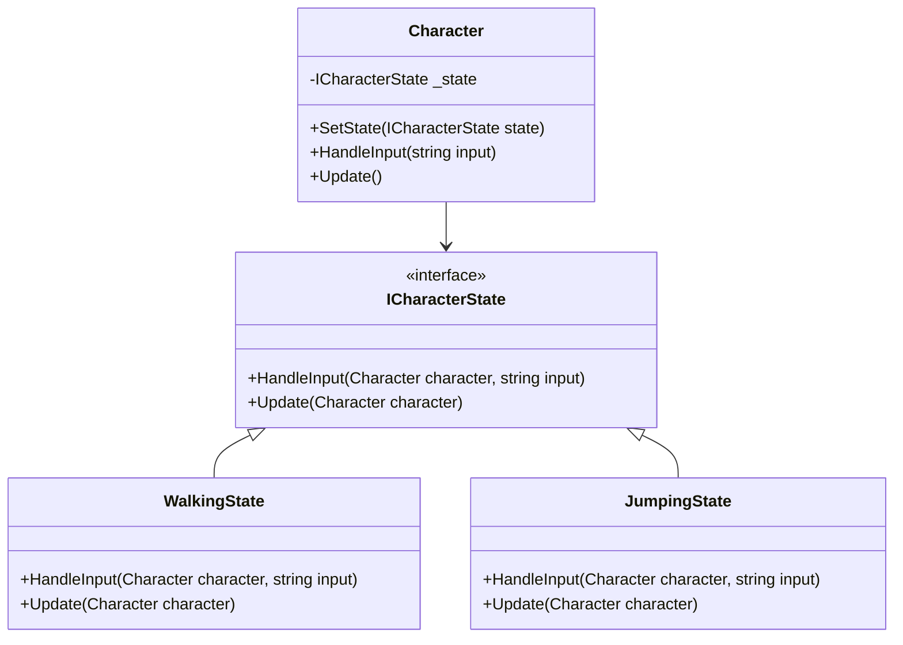
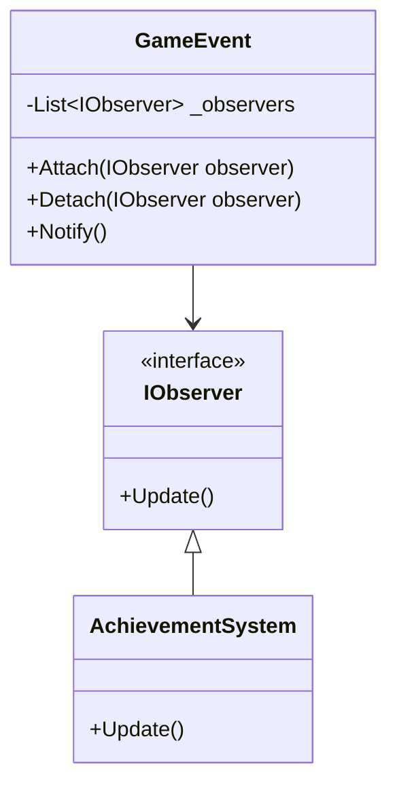
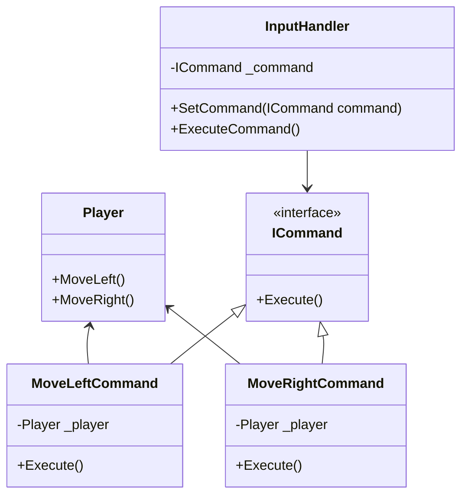
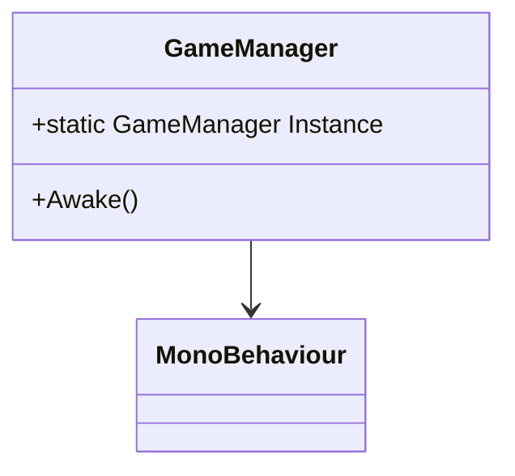
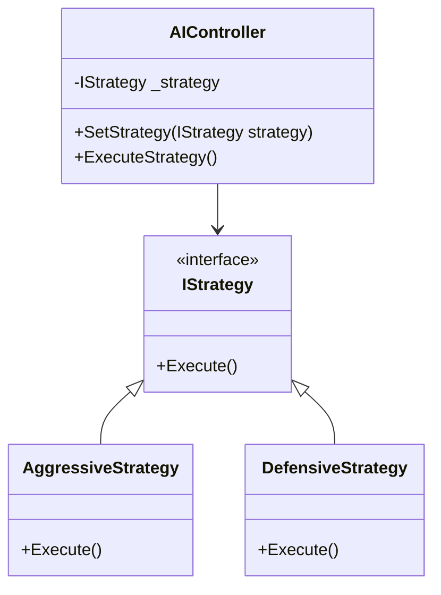
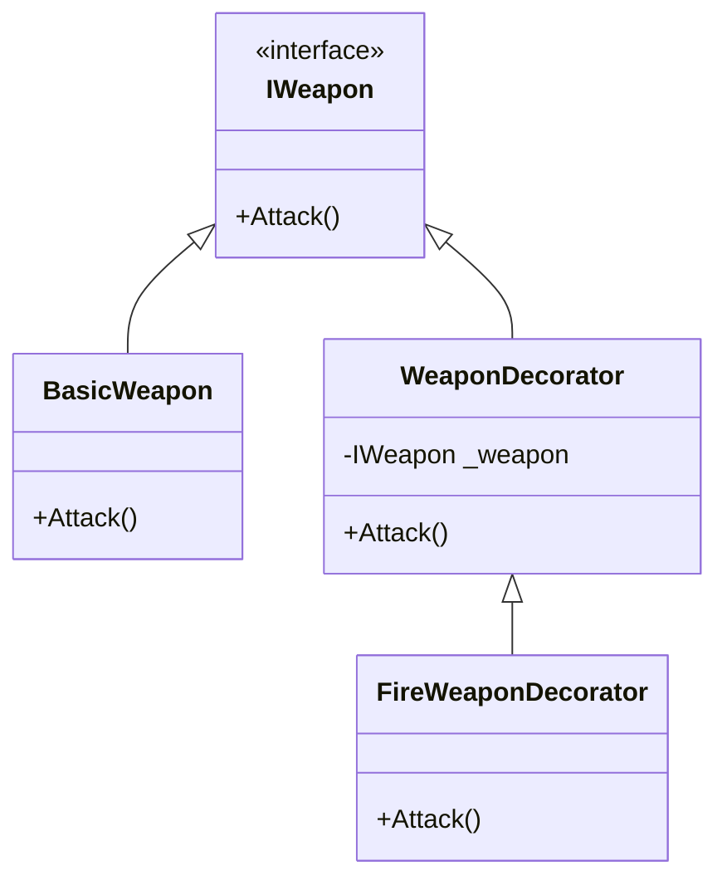

## 18.2 Design Patterns in Game Development with C#

Design patterns are a crucial part of software engineering, providing reusable solutions to common problems. In game development, these patterns help create scalable, maintainable, and flexible codebases. This section explores how design patterns can be effectively applied in game development using C#, focusing on game mechanics, architecture, and practical use cases.

### Patterns for Game Mechanics

Game mechanics are the rules and systems that define how a game operates. Design patterns can streamline the implementation of these mechanics, making them more robust and easier to manage.

#### State Pattern

**Intent:** The State pattern allows an object to alter its behavior when its internal state changes. It is particularly useful in games for managing different states of a game object, such as a character's movement states (walking, running, jumping).

**Key Participants:**
- **Context:** The class that maintains an instance of a ConcreteState subclass defining the current state.
- **State:** An interface or abstract class defining the behavior associated with a state.
- **ConcreteState:** Subclasses that implement the behavior associated with a state.

**Applicability:** Use the State pattern when an object must change its behavior at runtime depending on its state.

**Sample Code Snippet:**

```csharp
// State interface
public interface ICharacterState
{
    void HandleInput(Character character, string input);
    void Update(Character character);
}

// ConcreteState for walking
public class WalkingState : ICharacterState
{
    public void HandleInput(Character character, string input)
    {
        if (input == "jump")
        {
            character.SetState(new JumpingState());
        }
    }

    public void Update(Character character)
    {
        // Walking logic
    }
}

// ConcreteState for jumping
public class JumpingState : ICharacterState
{
    public void HandleInput(Character character, string input)
    {
        if (input == "land")
        {
            character.SetState(new WalkingState());
        }
    }

    public void Update(Character character)
    {
        // Jumping logic
    }
}

// Context
public class Character
{
    private ICharacterState _state;

    public Character()
    {
        _state = new WalkingState(); // Default state
    }

    public void SetState(ICharacterState state)
    {
        _state = state;
    }

    public void HandleInput(string input)
    {
        _state.HandleInput(this, input);
    }

    public void Update()
    {
        _state.Update(this);
    }
}
```

**Design Considerations:** The State pattern is ideal for managing complex state transitions and encapsulating state-specific behavior. It can lead to a cleaner and more organized codebase by separating state logic from the main class.

**Diagram:**



#### Observer Pattern

**Intent:** The Observer pattern defines a one-to-many dependency between objects so that when one object changes state, all its dependents are notified and updated automatically. This pattern is useful for implementing event systems in games.

**Key Participants:**
- **Subject:** The object being observed.
- **Observer:** The interface for objects that should be notified of changes in the subject.
- **ConcreteObserver:** Objects that implement the Observer interface and react to changes in the subject.

**Applicability:** Use the Observer pattern when changes to one object require changes to others, and you don't want these objects tightly coupled.

**Sample Code Snippet:**

```csharp
// Observer interface
public interface IObserver
{
    void Update();
}

// Subject class
public class GameEvent
{
    private List<IObserver> _observers = new List<IObserver>();

    public void Attach(IObserver observer)
    {
        _observers.Add(observer);
    }

    public void Detach(IObserver observer)
    {
        _observers.Remove(observer);
    }

    public void Notify()
    {
        foreach (var observer in _observers)
        {
            observer.Update();
        }
    }
}

// ConcreteObserver
public class AchievementSystem : IObserver
{
    public void Update()
    {
        Console.WriteLine("Achievement unlocked!");
    }
}

// Usage
var gameEvent = new GameEvent();
var achievementSystem = new AchievementSystem();

gameEvent.Attach(achievementSystem);
gameEvent.Notify(); // Output: Achievement unlocked!
```

**Design Considerations:** The Observer pattern is excellent for implementing event-driven systems. It promotes loose coupling and enhances flexibility. However, it can lead to performance issues if not managed properly, especially with a large number of observers.

**Diagram:**



#### Command Pattern

**Intent:** The Command pattern encapsulates a request as an object, thereby allowing for parameterization of clients with queues, requests, and operations. It is useful in games for implementing undo/redo functionality and input handling.

**Key Participants:**
- **Command:** An interface for executing an operation.
- **ConcreteCommand:** A class that implements the Command interface and defines the binding between a receiver and an action.
- **Invoker:** The class that asks the command to carry out the request.
- **Receiver:** The class that knows how to perform the operations associated with carrying out a request.

**Applicability:** Use the Command pattern when you need to parameterize objects with operations, queue operations, or support undoable operations.

**Sample Code Snippet:**

```csharp
// Command interface
public interface ICommand
{
    void Execute();
}

// Receiver class
public class Player
{
    public void MoveLeft()
    {
        Console.WriteLine("Player moves left");
    }

    public void MoveRight()
    {
        Console.WriteLine("Player moves right");
    }
}

// ConcreteCommand for moving left
public class MoveLeftCommand : ICommand
{
    private Player _player;

    public MoveLeftCommand(Player player)
    {
        _player = player;
    }

    public void Execute()
    {
        _player.MoveLeft();
    }
}

// ConcreteCommand for moving right
public class MoveRightCommand : ICommand
{
    private Player _player;

    public MoveRightCommand(Player player)
    {
        _player = player;
    }

    public void Execute()
    {
        _player.MoveRight();
    }
}

// Invoker class
public class InputHandler
{
    private ICommand _command;

    public void SetCommand(ICommand command)
    {
        _command = command;
    }

    public void ExecuteCommand()
    {
        _command.Execute();
    }
}

// Usage
var player = new Player();
var moveLeft = new MoveLeftCommand(player);
var moveRight = new MoveRightCommand(player);
var inputHandler = new InputHandler();

inputHandler.SetCommand(moveLeft);
inputHandler.ExecuteCommand(); // Output: Player moves left

inputHandler.SetCommand(moveRight);
inputHandler.ExecuteCommand(); // Output: Player moves right
```

**Design Considerations:** The Command pattern is beneficial for implementing complex command sequences and undo/redo functionality. It decouples the object that invokes the operation from the one that knows how to perform it.

**Diagram:**



### Unity and C#

Unity is a popular game engine that uses C# for scripting. It provides a component-based architecture that aligns well with design patterns, allowing developers to create modular and reusable game components.

#### Leveraging Patterns in Game Engines

Unity's architecture encourages the use of design patterns to manage game objects and behaviors effectively. Patterns like Singleton, Factory, and Prototype are commonly used in Unity projects.

**Singleton Pattern in Unity**

**Intent:** The Singleton pattern ensures a class has only one instance and provides a global point of access to it. In Unity, it is often used for managers like GameManager, AudioManager, etc.

**Sample Code Snippet:**

```csharp
public class GameManager : MonoBehaviour
{
    public static GameManager Instance { get; private set; }

    private void Awake()
    {
        if (Instance == null)
        {
            Instance = this;
            DontDestroyOnLoad(gameObject);
        }
        else
        {
            Destroy(gameObject);
        }
    }

    // Game management logic
}
```

**Design Considerations:** The Singleton pattern is useful for managing global game states and services. However, it can lead to tight coupling and difficulties in testing if overused.

**Diagram:**



#### Component-Based Architecture

Unity's component-based architecture allows developers to attach multiple components to a GameObject, promoting modularity and reusability.

**Example:**

```csharp
public class PlayerController : MonoBehaviour
{
    private Rigidbody _rigidbody;

    private void Start()
    {
        _rigidbody = GetComponent<Rigidbody>();
    }

    private void Update()
    {
        float moveHorizontal = Input.GetAxis("Horizontal");
        float moveVertical = Input.GetAxis("Vertical");

        Vector3 movement = new Vector3(moveHorizontal, 0.0f, moveVertical);
        _rigidbody.AddForce(movement * speed);
    }
}
```

**Design Considerations:** The component-based architecture in Unity encourages separation of concerns and promotes code reuse. It allows developers to create flexible and extensible game objects by composing them from smaller, reusable components.

### Use Cases and Examples

#### Implementing AI Behaviors

Design patterns can be used to implement AI behaviors in games. The Strategy pattern, for example, can be used to define different AI strategies that can be swapped at runtime.

**Strategy Pattern for AI:**

```csharp
// Strategy interface
public interface IStrategy
{
    void Execute();
}

// ConcreteStrategy for aggressive AI
public class AggressiveStrategy : IStrategy
{
    public void Execute()
    {
        Console.WriteLine("Executing aggressive strategy");
    }
}

// ConcreteStrategy for defensive AI
public class DefensiveStrategy : IStrategy
{
    public void Execute()
    {
        Console.WriteLine("Executing defensive strategy");
    }
}

// Context
public class AIController
{
    private IStrategy _strategy;

    public void SetStrategy(IStrategy strategy)
    {
        _strategy = strategy;
    }

    public void ExecuteStrategy()
    {
        _strategy.Execute();
    }
}

// Usage
var aiController = new AIController();
aiController.SetStrategy(new AggressiveStrategy());
aiController.ExecuteStrategy(); // Output: Executing aggressive strategy

aiController.SetStrategy(new DefensiveStrategy());
aiController.ExecuteStrategy(); // Output: Executing defensive strategy
```

**Design Considerations:** The Strategy pattern is ideal for implementing interchangeable AI behaviors. It promotes flexibility and code reuse by encapsulating algorithms within separate classes.

**Diagram:**



#### Designing Flexible and Reusable Game Components

Design patterns can help create flexible and reusable game components. The Decorator pattern, for example, can be used to add new functionalities to existing components without modifying their structure.

**Decorator Pattern for Game Components:**

```csharp
// Component interface
public interface IWeapon
{
    void Attack();
}

// ConcreteComponent
public class BasicWeapon : IWeapon
{
    public void Attack()
    {
        Console.WriteLine("Basic attack");
    }
}

// Decorator
public abstract class WeaponDecorator : IWeapon
{
    protected IWeapon _weapon;

    public WeaponDecorator(IWeapon weapon)
    {
        _weapon = weapon;
    }

    public virtual void Attack()
    {
        _weapon.Attack();
    }
}

// ConcreteDecorator for fire effect
public class FireWeaponDecorator : WeaponDecorator
{
    public FireWeaponDecorator(IWeapon weapon) : base(weapon) { }

    public override void Attack()
    {
        base.Attack();
        Console.WriteLine("with fire effect");
    }
}

// Usage
IWeapon basicWeapon = new BasicWeapon();
IWeapon fireWeapon = new FireWeaponDecorator(basicWeapon);

fireWeapon.Attack(); // Output: Basic attack with fire effect
```

**Design Considerations:** The Decorator pattern is useful for adding responsibilities to objects dynamically. It promotes flexibility and code reuse by allowing new functionalities to be added without altering existing code.

**Diagram:**



### Try It Yourself

Now that we've explored various design patterns in game development, it's time to experiment. Try modifying the code examples to suit your needs. For instance, add new states to the State pattern example, or create additional strategies for the AI controller. Experiment with different patterns to see how they can enhance your game's architecture and mechanics.

### Knowledge Check

- Explain how the State pattern can be used to manage game states.
- Demonstrate the use of the Observer pattern in an event-driven system.
- Provide an example of how the Command pattern can be used for input handling.
- Discuss the benefits of using a component-based architecture in Unity.
- Implement a new AI strategy using the Strategy pattern.

### Embrace the Journey

Remember, this is just the beginning. As you progress, you'll build more complex and interactive games. Keep experimenting, stay curious, and enjoy the journey!

## Quiz Time!



### What is the primary intent of the State pattern in game development?

- [x] To allow an object to alter its behavior when its internal state changes.
- [ ] To define a one-to-many dependency between objects.
- [ ] To encapsulate a request as an object.
- [ ] To ensure a class has only one instance.

> **Explanation:** The State pattern is used to allow an object to change its behavior when its internal state changes, making it ideal for managing different states of a game object.

### Which pattern is best suited for implementing an event system in games?

- [ ] State Pattern
- [x] Observer Pattern
- [ ] Command Pattern
- [ ] Singleton Pattern

> **Explanation:** The Observer pattern is ideal for implementing event-driven systems, as it defines a one-to-many dependency between objects.

### How does the Command pattern benefit input handling in games?

- [x] It encapsulates requests as objects, allowing for parameterization and queuing.
- [ ] It ensures a class has only one instance.
- [ ] It defines a one-to-many dependency between objects.
- [ ] It allows an object to alter its behavior when its internal state changes.

> **Explanation:** The Command pattern encapsulates requests as objects, making it useful for input handling, undo/redo functionality, and command queuing.

### What is a key advantage of Unity's component-based architecture?

- [x] It promotes modularity and reusability of game components.
- [ ] It ensures a class has only one instance.
- [ ] It encapsulates requests as objects.
- [ ] It defines a one-to-many dependency between objects.

> **Explanation:** Unity's component-based architecture allows developers to create modular and reusable game components by attaching multiple components to a GameObject.

### Which pattern is commonly used for managing global game states in Unity?

- [ ] State Pattern
- [ ] Observer Pattern
- [ ] Command Pattern
- [x] Singleton Pattern

> **Explanation:** The Singleton pattern is often used in Unity to manage global game states and services, such as GameManager and AudioManager.

### How can the Strategy pattern be used in AI development?

- [x] By defining interchangeable strategies that can be swapped at runtime.
- [ ] By encapsulating requests as objects.
- [ ] By ensuring a class has only one instance.
- [ ] By defining a one-to-many dependency between objects.

> **Explanation:** The Strategy pattern allows for defining interchangeable strategies that can be swapped at runtime, making it ideal for implementing different AI behaviors.

### What is the role of the Invoker in the Command pattern?

- [x] To ask the command to carry out the request.
- [ ] To define the behavior associated with a state.
- [ ] To notify observers of changes.
- [ ] To ensure a class has only one instance.

> **Explanation:** The Invoker in the Command pattern is responsible for asking the command to carry out the request.

### Which pattern allows adding new functionalities to existing components without modifying their structure?

- [ ] State Pattern
- [ ] Observer Pattern
- [ ] Command Pattern
- [x] Decorator Pattern

> **Explanation:** The Decorator pattern allows adding new functionalities to existing components without modifying their structure, promoting flexibility and code reuse.

### What is a potential drawback of the Singleton pattern?

- [x] It can lead to tight coupling and difficulties in testing.
- [ ] It defines a one-to-many dependency between objects.
- [ ] It encapsulates requests as objects.
- [ ] It allows an object to alter its behavior when its internal state changes.

> **Explanation:** The Singleton pattern can lead to tight coupling and difficulties in testing if overused, as it provides a global point of access to a class instance.

### True or False: The Observer pattern is used to encapsulate requests as objects.

- [ ] True
- [x] False

> **Explanation:** False. The Observer pattern defines a one-to-many dependency between objects, while the Command pattern is used to encapsulate requests as objects.


