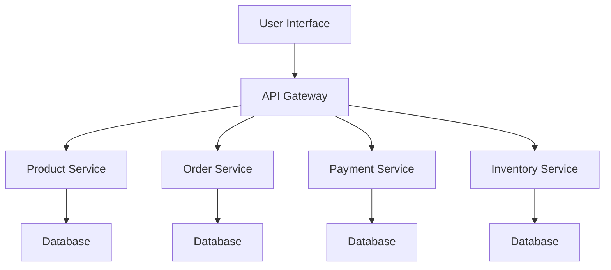
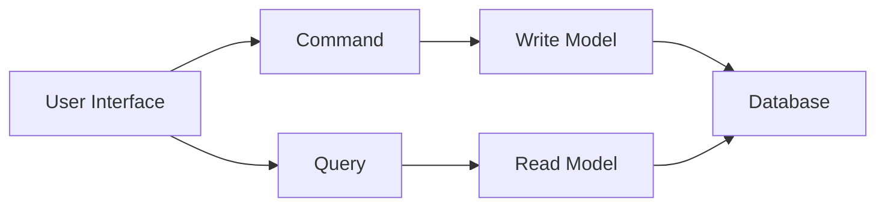
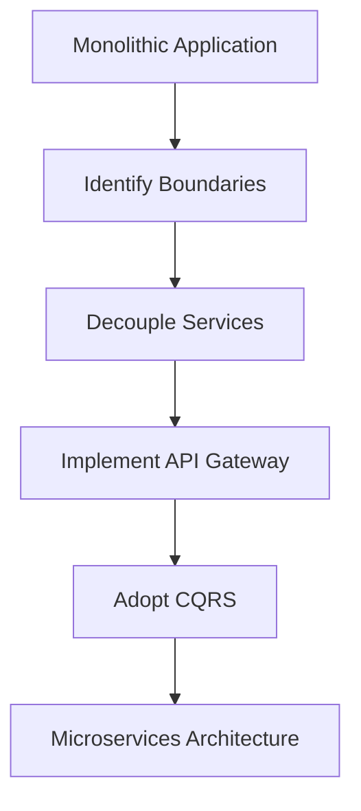

## 18.3 Implementing an E-commerce Platform

In today's digital age, e-commerce platforms are at the forefront of online business. Building a robust, scalable, and maintainable e-commerce platform is a complex task that requires careful consideration of design patterns, architectural strategies, and best practices. This section will guide you through implementing an e-commerce platform using C# design patterns, focusing on scalability and maintainability. We will explore microservices architecture, the Command Query Responsibility Segregation (CQRS) pattern, and lessons learned from transitioning from a monolithic to a distributed architecture.

### Scalability and Maintainability

#### Using Microservices and CQRS

Scalability and maintainability are critical for the success of any e-commerce platform. As the number of users and transactions grows, the system must handle increased load without compromising performance. Let's delve into how microservices and CQRS can help achieve these goals.

##### Microservices Architecture

Microservices architecture is a design approach where an application is composed of loosely coupled services. Each service is independent and can be developed, deployed, and scaled separately. This architecture offers several benefits:

- **Scalability**: Services can be scaled independently based on demand.
- **Resilience**: Failure in one service does not affect the entire system.
- **Flexibility**: Different technologies and languages can be used for different services.
- **Maintainability**: Smaller codebases are easier to manage and update.

###### Diagram: Microservices Architecture



*Caption: A typical microservices architecture for an e-commerce platform, showing independent services for products, orders, payments, and inventory.*

##### Command Query Responsibility Segregation (CQRS)

CQRS is a pattern that separates read and write operations for a data store. This separation allows for optimized data models and improved performance:

- **Command**: Handles write operations, ensuring data consistency.
- **Query**: Handles read operations, optimized for performance.

###### Diagram: CQRS Pattern



*Caption: The CQRS pattern separates command and query responsibilities, allowing for optimized data handling.*

#### Handling High Traffic and Transactions

To handle high traffic and transactions, consider implementing the following strategies:

- **Load Balancing**: Distribute incoming requests across multiple servers to ensure no single server is overwhelmed.
- **Caching**: Use caching mechanisms to store frequently accessed data, reducing database load.
- **Database Sharding**: Split databases into smaller, more manageable pieces to improve performance.
- **Asynchronous Processing**: Use asynchronous operations to handle long-running tasks without blocking the main thread.

### Case Study: From Monolith to Distributed Architecture

Let's explore a real-world case study of transitioning an e-commerce platform from a monolithic to a distributed architecture.

#### Initial Monolithic Architecture

The initial e-commerce platform was built as a monolithic application. While this approach simplified development and deployment initially, it posed several challenges as the platform grew:

- **Scalability Issues**: The entire application had to be scaled, even if only one component required more resources.
- **Complexity**: The codebase became large and difficult to manage.
- **Deployment Risks**: Deploying updates required redeploying the entire application, increasing the risk of downtime.

#### Transition to Microservices

To address these challenges, the platform was re-architected using microservices. The transition involved several key steps:

1. **Identifying Boundaries**: The first step was to identify logical boundaries within the application, such as product management, order processing, and user authentication.
2. **Decoupling Services**: Each identified boundary was decoupled into a separate service with its own database.
3. **Implementing API Gateway**: An API gateway was introduced to route requests to the appropriate service.
4. **Adopting CQRS**: The CQRS pattern was implemented to separate read and write operations, improving performance and scalability.

#### Lessons Learned in Scaling an E-commerce Application

The transition to a distributed architecture provided several valuable lessons:

- **Incremental Transition**: Transitioning incrementally allowed for testing and validation of each service before full deployment.
- **Monitoring and Logging**: Implementing robust monitoring and logging was crucial for identifying and resolving issues quickly.
- **Communication Between Services**: Ensuring reliable communication between services was essential for maintaining data consistency and system integrity.
- **Continuous Integration and Deployment**: Automating the build and deployment process reduced the risk of errors and downtime.

### Code Examples

Let's explore some code examples to illustrate the concepts discussed.

#### Implementing a Microservice

Below is a simple example of a product service implemented as a microservice in C#.

```csharp
using Microsoft.AspNetCore.Mvc;
using System.Collections.Generic;

namespace ProductService
{
    [ApiController]
    [Route("api/[controller]")]
    public class ProductsController : ControllerBase
    {
        private static List<Product> products = new List<Product>
        {
            new Product { Id = 1, Name = "Laptop", Price = 999.99M },
            new Product { Id = 2, Name = "Smartphone", Price = 499.99M }
        };

        [HttpGet]
        public ActionResult<IEnumerable<Product>> GetProducts()
        {
            return Ok(products);
        }

        [HttpPost]
        public ActionResult AddProduct(Product product)
        {
            products.Add(product);
            return CreatedAtAction(nameof(GetProducts), new { id = product.Id }, product);
        }
    }

    public class Product
    {
        public int Id { get; set; }
        public string Name { get; set; }
        public decimal Price { get; set; }
    }
}
```

*Explanation: This code defines a simple product service with endpoints to retrieve and add products. The service is stateless and can be scaled independently.*

#### Implementing CQRS

Below is an example of implementing CQRS in C#.

```csharp
using System;
using System.Collections.Generic;

namespace CQRSExample
{
    public interface ICommand
    {
        void Execute();
    }

    public class AddProductCommand : ICommand
    {
        private readonly ProductRepository _repository;
        private readonly Product _product;

        public AddProductCommand(ProductRepository repository, Product product)
        {
            _repository = repository;
            _product = product;
        }

        public void Execute()
        {
            _repository.AddProduct(_product);
        }
    }

    public interface IQuery<TResult>
    {
        TResult Execute();
    }

    public class GetProductsQuery : IQuery<IEnumerable<Product>>
    {
        private readonly ProductRepository _repository;

        public GetProductsQuery(ProductRepository repository)
        {
            _repository = repository;
        }

        public IEnumerable<Product> Execute()
        {
            return _repository.GetProducts();
        }
    }

    public class ProductRepository
    {
        private readonly List<Product> _products = new List<Product>();

        public void AddProduct(Product product)
        {
            _products.Add(product);
        }

        public IEnumerable<Product> GetProducts()
        {
            return _products;
        }
    }

    public class Product
    {
        public int Id { get; set; }
        public string Name { get; set; }
        public decimal Price { get; set; }
    }
}
```

*Explanation: This code demonstrates the CQRS pattern by separating command and query responsibilities. The `AddProductCommand` handles write operations, while the `GetProductsQuery` handles read operations.*

### Try It Yourself

Experiment with the code examples by:

- **Modifying the Product Service**: Add more endpoints, such as updating or deleting products.
- **Extending CQRS**: Implement additional commands and queries for other operations, such as updating product prices.

### Visualizing the Transition

Below is a diagram illustrating the transition from a monolithic to a microservices architecture.



*Caption: The transition process from a monolithic application to a microservices architecture involves identifying boundaries, decoupling services, implementing an API gateway, and adopting CQRS.*

### References and Links

For further reading, consider the following resources:

- [Microsoft's Guide to Microservices Architecture](https://docs.microsoft.com/en-us/dotnet/architecture/microservices/)
- [CQRS Documentation](https://martinfowler.com/bliki/CQRS.html)
- [ASP.NET Core Microservices](https://docs.microsoft.com/en-us/aspnet/core/microservices/?view=aspnetcore-5.0)

### Knowledge Check

- **What are the benefits of using microservices architecture?**
- **How does the CQRS pattern improve performance?**
- **What are the key steps in transitioning from a monolithic to a microservices architecture?**

### Embrace the Journey

Remember, implementing an e-commerce platform is a journey. As you progress, you'll encounter challenges and opportunities to learn. Keep experimenting, stay curious, and enjoy the process of building scalable and maintainable applications.

### Quiz Time!



### What is a primary benefit of using microservices architecture?

- [x] Scalability
- [ ] Simplicity
- [ ] Single codebase
- [ ] Monolithic design

> **Explanation:** Microservices architecture allows for independent scaling of services, enhancing scalability.

### How does CQRS improve system performance?

- [x] By separating read and write operations
- [ ] By combining read and write operations
- [ ] By using a single data model
- [ ] By reducing the number of services

> **Explanation:** CQRS separates read and write operations, allowing for optimized data handling and improved performance.

### What is a key step in transitioning from a monolithic to a microservices architecture?

- [x] Identifying logical boundaries
- [ ] Combining services
- [ ] Reducing the number of databases
- [ ] Using a single API endpoint

> **Explanation:** Identifying logical boundaries is crucial for decoupling services in a microservices architecture.

### What is the role of an API gateway in a microservices architecture?

- [x] Routing requests to appropriate services
- [ ] Storing data
- [ ] Executing business logic
- [ ] Handling user authentication

> **Explanation:** An API gateway routes requests to the appropriate microservices, acting as a single entry point.

### Which pattern separates command and query responsibilities?

- [x] CQRS
- [ ] Singleton
- [ ] Factory
- [ ] Observer

> **Explanation:** The CQRS pattern separates command and query responsibilities for optimized data handling.

### What is a common challenge when implementing microservices?

- [x] Ensuring reliable communication between services
- [ ] Reducing code complexity
- [ ] Simplifying deployment
- [ ] Using a single database

> **Explanation:** Ensuring reliable communication between services is a common challenge in microservices architecture.

### What is a benefit of using asynchronous processing?

- [x] Handling long-running tasks without blocking
- [ ] Simplifying code
- [ ] Reducing the number of services
- [ ] Using a single thread

> **Explanation:** Asynchronous processing allows for handling long-running tasks without blocking the main thread.

### What is a key advantage of using CQRS?

- [x] Optimized data models for read and write operations
- [ ] Single data model for all operations
- [ ] Reduced code complexity
- [ ] Simplified deployment

> **Explanation:** CQRS allows for optimized data models for read and write operations, improving performance.

### What is a common strategy for handling high traffic in an e-commerce platform?

- [x] Load balancing
- [ ] Reducing the number of servers
- [ ] Using a single database
- [ ] Combining services

> **Explanation:** Load balancing distributes incoming requests across multiple servers to handle high traffic.

### True or False: Microservices architecture allows for using different technologies for different services.

- [x] True
- [ ] False

> **Explanation:** Microservices architecture allows for flexibility in using different technologies and languages for different services.


