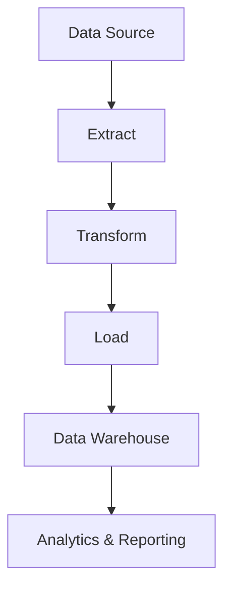

## 18.4 Data Processing Pipelines

In the modern era of big data, designing efficient data processing pipelines is crucial for handling large-scale data. This section delves into the concepts and implementation of data processing pipelines using C#, focusing on Pipeline and Dataflow patterns. We will explore how to manage large-scale data processing, including ETL (Extract, Transform, Load) processes and real-time analytics, particularly in cloud environments.

### Designing Efficient Workflows

#### Understanding Data Processing Pipelines

Data processing pipelines are a series of data processing steps where the output of one step is the input to the next. These pipelines are essential for transforming raw data into actionable insights. They are widely used in various domains, including data engineering, machine learning, and business intelligence.

**Key Characteristics of Data Processing Pipelines:**

- **Modularity:** Pipelines are composed of discrete stages, each performing a specific task.
- **Scalability:** Pipelines can handle increasing volumes of data efficiently.
- **Fault Tolerance:** Pipelines are designed to handle errors gracefully and continue processing.
- **Reusability:** Components of the pipeline can be reused across different workflows.

#### Pipeline Pattern

The Pipeline pattern is a design pattern that allows for the processing of data in a series of steps, where each step is encapsulated in a separate component. This pattern is particularly useful for tasks that can be broken down into a sequence of operations.

**Intent:** To divide a complex processing task into a series of discrete, manageable steps.

**Key Participants:**

- **Pipeline:** The main structure that holds and manages the sequence of processing steps.
- **Stage:** Each step in the pipeline that performs a specific operation on the data.
- **Context:** The data being processed, which is passed through the pipeline.

**Applicability:** Use the Pipeline pattern when you need to process data in a series of steps, each of which can be independently developed and tested.

**Sample Code Snippet:**

```csharp
public interface IPipelineStage<T>
{
    T Process(T input);
}

public class Pipeline<T>
{
    private readonly List<IPipelineStage<T>> _stages = new List<IPipelineStage<T>>();

    public Pipeline<T> AddStage(IPipelineStage<T> stage)
    {
        _stages.Add(stage);
        return this;
    }

    public T Execute(T input)
    {
        return _stages.Aggregate(input, (current, stage) => stage.Process(current));
    }
}

// Example stages
public class Stage1 : IPipelineStage<int>
{
    public int Process(int input)
    {
        // Perform some processing
        return input + 1;
    }
}

public class Stage2 : IPipelineStage<int>
{
    public int Process(int input)
    {
        // Perform some processing
        return input * 2;
    }
}

// Usage
var pipeline = new Pipeline<int>()
    .AddStage(new Stage1())
    .AddStage(new Stage2());

int result = pipeline.Execute(5); // Result is 12
```

**Design Considerations:**

- **Flexibility:** The Pipeline pattern allows for easy modification and extension of the processing steps.
- **Performance:** Consider the overhead of passing data between stages, especially in high-performance applications.
- **Error Handling:** Implement robust error handling to ensure the pipeline can recover from failures.

#### Dataflow Pattern

The Dataflow pattern is another approach to designing data processing pipelines, focusing on the flow of data between processing units. It is particularly useful for parallel and asynchronous processing.

**Intent:** To manage the flow of data between processing units, allowing for parallel and asynchronous execution.

**Key Participants:**

- **Dataflow Block:** A processing unit that performs operations on the data.
- **Dataflow Network:** The structure that connects dataflow blocks, defining the flow of data.
- **Dataflow Link:** The connection between dataflow blocks, facilitating data transfer.

**Applicability:** Use the Dataflow pattern when you need to process data in parallel or asynchronously, and when the order of execution is not strictly linear.

**Sample Code Snippet:**

```csharp
using System;
using System.Threading.Tasks;
using System.Threading.Tasks.Dataflow;

public class DataflowExample
{
    public static async Task RunDataflow()
    {
        // Create the dataflow blocks
        var transformBlock = new TransformBlock<int, int>(n => n * 2);
        var actionBlock = new ActionBlock<int>(n => Console.WriteLine($"Processed: {n}"));

        // Link the blocks
        transformBlock.LinkTo(actionBlock);

        // Post data to the network
        for (int i = 0; i < 10; i++)
        {
            transformBlock.Post(i);
        }

        // Signal completion
        transformBlock.Complete();

        // Wait for completion
        await actionBlock.Completion;
    }
}

// Usage
await DataflowExample.RunDataflow();
```

**Design Considerations:**

- **Concurrency:** The Dataflow pattern is well-suited for concurrent processing, but care must be taken to manage shared resources.
- **Scalability:** Dataflow networks can be scaled by adding more blocks or increasing the degree of parallelism.
- **Complexity:** Designing and debugging dataflow networks can be complex, especially with many interconnected blocks.

### Handling Large-Scale Data Processing

Large-scale data processing involves handling vast amounts of data efficiently. This requires careful consideration of the architecture and design patterns used.

#### Strategies for Large-Scale Data Processing

1. **Parallel Processing:** Utilize parallelism to process data concurrently, reducing processing time.
2. **Batch Processing:** Process data in batches to improve efficiency and manage resource usage.
3. **Stream Processing:** Handle data in real-time as it arrives, suitable for time-sensitive applications.
4. **Distributed Processing:** Distribute processing across multiple nodes to handle large datasets.

#### Implementing ETL Processes

ETL (Extract, Transform, Load) processes are a common use case for data processing pipelines. They involve extracting data from various sources, transforming it into a suitable format, and loading it into a destination system.

**ETL Pipeline Design:**

- **Extract:** Gather data from multiple sources, such as databases, files, or APIs.
- **Transform:** Clean, normalize, and enrich the data to meet business requirements.
- **Load:** Insert the transformed data into a target system, such as a data warehouse.

**Sample ETL Pipeline Code:**

```csharp
public class ETLProcess
{
    public void Execute()
    {
        var data = Extract();
        var transformedData = Transform(data);
        Load(transformedData);
    }

    private IEnumerable<string> Extract()
    {
        // Simulate data extraction
        return new List<string> { "data1", "data2", "data3" };
    }

    private IEnumerable<string> Transform(IEnumerable<string> data)
    {
        // Simulate data transformation
        return data.Select(d => d.ToUpper());
    }

    private void Load(IEnumerable<string> data)
    {
        // Simulate data loading
        foreach (var item in data)
        {
            Console.WriteLine($"Loaded: {item}");
        }
    }
}

// Usage
var etlProcess = new ETLProcess();
etlProcess.Execute();
```

**Design Considerations:**

- **Data Quality:** Ensure data is clean and accurate before loading it into the target system.
- **Performance:** Optimize each stage of the ETL process to handle large volumes of data efficiently.
- **Scalability:** Design the ETL pipeline to scale with increasing data volumes.

#### Real-Time Analytics

Real-time analytics involves processing data as it arrives to provide immediate insights. This is crucial for applications that require timely decision-making, such as fraud detection or monitoring systems.

**Implementing Real-Time Analytics:**

- **Data Ingestion:** Use stream processing to ingest data in real-time.
- **Data Processing:** Apply transformations and aggregations to the data as it flows through the pipeline.
- **Data Visualization:** Present the processed data in dashboards or reports for immediate analysis.

**Sample Real-Time Analytics Code:**

```csharp
using System;
using System.Collections.Concurrent;
using System.Threading.Tasks;

public class RealTimeAnalytics
{
    private readonly BlockingCollection<int> _dataQueue = new BlockingCollection<int>();

    public void Start()
    {
        Task.Run(() => ProcessData());

        for (int i = 0; i < 100; i++)
        {
            _dataQueue.Add(i);
        }

        _dataQueue.CompleteAdding();
    }

    private void ProcessData()
    {
        foreach (var data in _dataQueue.GetConsumingEnumerable())
        {
            Console.WriteLine($"Processed: {data}");
        }
    }
}

// Usage
var analytics = new RealTimeAnalytics();
analytics.Start();
```

**Design Considerations:**

- **Latency:** Minimize latency to ensure data is processed and available for analysis quickly.
- **Scalability:** Design the system to handle increasing data rates without degradation in performance.
- **Fault Tolerance:** Implement mechanisms to recover from failures and ensure continuous operation.

### Use Cases and Examples

#### ETL Processes

ETL processes are widely used in data warehousing and business intelligence. They enable organizations to consolidate data from various sources, transform it into a consistent format, and load it into a centralized repository for analysis.

**Example Use Case:**

A retail company uses an ETL pipeline to extract sales data from multiple stores, transform it to calculate daily sales metrics, and load it into a data warehouse for reporting.

#### Real-Time Analytics

Real-time analytics is essential for applications that require immediate insights, such as monitoring systems, fraud detection, and recommendation engines.

**Example Use Case:**

A financial institution uses a real-time analytics pipeline to monitor transactions for fraudulent activity. The pipeline ingests transaction data, applies anomaly detection algorithms, and alerts analysts to suspicious activity.

#### Implementing in Cloud Environments

Cloud environments provide the scalability and flexibility needed for large-scale data processing. They offer services and tools that simplify the implementation of data processing pipelines.

**Benefits of Cloud-Based Pipelines:**

- **Scalability:** Easily scale resources up or down based on demand.
- **Cost-Effectiveness:** Pay for only the resources you use.
- **Flexibility:** Use a wide range of tools and services to build and manage pipelines.

**Example Cloud Services:**

- **Azure Data Factory:** A cloud-based data integration service that allows you to create data-driven workflows for orchestrating data movement and transformation.
- **AWS Glue:** A fully managed ETL service that makes it easy to prepare and load data for analytics.
- **Google Cloud Dataflow:** A fully managed service for stream and batch processing.

### Visualizing Data Processing Pipelines

To better understand the flow of data through a pipeline, visual representations can be extremely helpful. Below is a diagram illustrating a typical data processing pipeline.



**Diagram Description:** This diagram represents a typical ETL pipeline. Data is extracted from a source, transformed into a suitable format, and loaded into a data warehouse. The data warehouse then serves as the foundation for analytics and reporting.

### Knowledge Check

To ensure you've grasped the concepts covered in this section, consider the following questions:

- What are the key characteristics of data processing pipelines?
- How does the Pipeline pattern differ from the Dataflow pattern?
- What are the main stages of an ETL process?
- How can real-time analytics be implemented in a data processing pipeline?
- What are the benefits of implementing data processing pipelines in cloud environments?

### Embrace the Journey

Remember, mastering data processing pipelines is a journey. As you continue to explore and experiment with these patterns, you'll gain deeper insights into designing efficient workflows for large-scale data. Keep experimenting, stay curious, and enjoy the journey!

## Quiz Time!



### What is a key characteristic of data processing pipelines?

- [x] Modularity
- [ ] Complexity
- [ ] Single-threaded execution
- [ ] Lack of fault tolerance

> **Explanation:** Data processing pipelines are modular, allowing for discrete stages that can be independently developed and tested.

### Which pattern is best suited for parallel and asynchronous data processing?

- [ ] Pipeline Pattern
- [x] Dataflow Pattern
- [ ] Singleton Pattern
- [ ] Observer Pattern

> **Explanation:** The Dataflow pattern is designed for parallel and asynchronous data processing, managing the flow of data between processing units.

### What is the first stage in an ETL process?

- [x] Extract
- [ ] Transform
- [ ] Load
- [ ] Analyze

> **Explanation:** The first stage in an ETL process is Extract, where data is gathered from various sources.

### What is a benefit of real-time analytics?

- [x] Immediate insights
- [ ] Reduced data quality
- [ ] Increased latency
- [ ] Decreased scalability

> **Explanation:** Real-time analytics provides immediate insights, which is crucial for time-sensitive applications.

### Which cloud service is used for orchestrating data movement and transformation?

- [x] Azure Data Factory
- [ ] AWS S3
- [ ] Google Cloud Storage
- [ ] Heroku

> **Explanation:** Azure Data Factory is a cloud-based data integration service used for orchestrating data movement and transformation.

### What is a common use case for ETL processes?

- [x] Data warehousing
- [ ] Real-time gaming
- [ ] Image processing
- [ ] Video streaming

> **Explanation:** ETL processes are commonly used in data warehousing to consolidate and transform data for analysis.

### What is a key benefit of cloud-based data processing pipelines?

- [x] Scalability
- [ ] Increased cost
- [ ] Reduced flexibility
- [ ] Limited tool availability

> **Explanation:** Cloud-based pipelines offer scalability, allowing resources to be adjusted based on demand.

### What is the role of the Transform stage in an ETL process?

- [x] Clean and normalize data
- [ ] Gather data from sources
- [ ] Load data into a target system
- [ ] Visualize data

> **Explanation:** The Transform stage involves cleaning and normalizing data to meet business requirements.

### Which pattern involves a series of discrete, manageable steps?

- [x] Pipeline Pattern
- [ ] Dataflow Pattern
- [ ] Singleton Pattern
- [ ] Observer Pattern

> **Explanation:** The Pipeline pattern divides a complex processing task into a series of discrete, manageable steps.

### True or False: The Dataflow pattern is suitable for linear data processing.

- [ ] True
- [x] False

> **Explanation:** The Dataflow pattern is suitable for parallel and asynchronous processing, not strictly linear processing.


