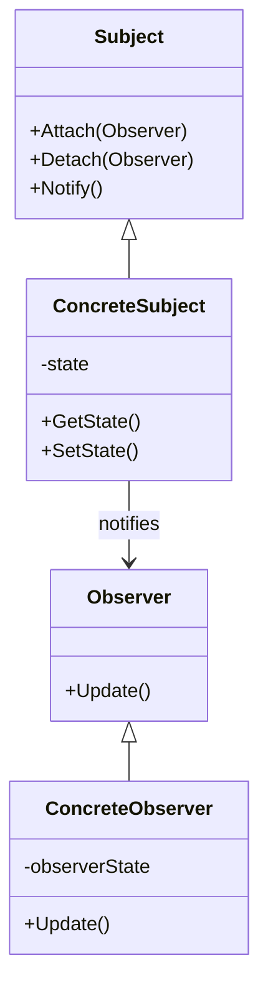
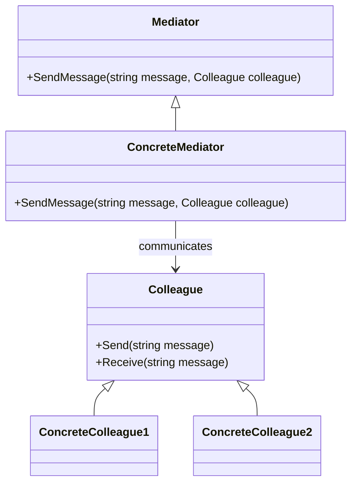

## 18.5 Designing a Real-Time Chat Application

In this section, we will delve into the design and implementation of a real-time chat application using C#. This case study will guide you through managing concurrency and communication effectively, using modern C# features and design patterns. We will explore how to handle concurrency with `async/await` and SignalR, implement communication patterns like Observer and Mediator, and manage client connections. Additionally, we will cover use cases such as group chats and private messaging, and discuss integration with mobile applications.

### Introduction to Real-Time Chat Applications

Real-time chat applications have become an integral part of modern communication, enabling instant messaging and collaboration. Designing such applications requires careful consideration of concurrency, message delivery, and client connection management. Let's explore the key components and challenges involved in building a real-time chat application.

### Handling Concurrency

Concurrency is a critical aspect of real-time chat applications, as multiple users can send and receive messages simultaneously. Proper concurrency management ensures that messages are delivered in the correct order and without delay.

#### Using `async/await` for Concurrency

C# provides the `async/await` keywords to simplify asynchronous programming. By using these keywords, we can write code that performs non-blocking operations, allowing the application to handle multiple tasks concurrently.

```csharp
public async Task SendMessageAsync(string message, string userId)
{
    // Simulate sending a message asynchronously
    await Task.Run(() =>
    {
        // Code to send the message
        Console.WriteLine($"Message sent to {userId}: {message}");
    });
}
```

In the above example, the `SendMessageAsync` method uses `await` to perform the message sending operation asynchronously. This allows the application to continue executing other tasks while waiting for the message to be sent.

#### SignalR for Real-Time Communication

SignalR is a library for ASP.NET that simplifies adding real-time web functionality to applications. It enables server-side code to push content to connected clients instantly.

##### Setting Up SignalR

To use SignalR in your application, you need to install the SignalR package and configure it in your ASP.NET Core application.

```bash
dotnet add package Microsoft.AspNetCore.SignalR
```

In the `Startup.cs` file, configure SignalR in the `ConfigureServices` and `Configure` methods:

```csharp
public void ConfigureServices(IServiceCollection services)
{
    services.AddSignalR();
}

public void Configure(IApplicationBuilder app, IHostingEnvironment env)
{
    app.UseSignalR(routes =>
    {
        routes.MapHub<ChatHub>("/chatHub");
    });
}
```

##### Creating a SignalR Hub

A SignalR hub is a class that serves as a high-level pipeline that handles client-server communication.

```csharp
public class ChatHub : Hub
{
    public async Task SendMessage(string user, string message)
    {
        await Clients.All.SendAsync("ReceiveMessage", user, message);
    }
}
```

In this example, the `ChatHub` class defines a `SendMessage` method that broadcasts messages to all connected clients using the `Clients.All.SendAsync` method.

#### Ensuring Message Delivery and Ordering

Ensuring that messages are delivered in the correct order is crucial for maintaining the integrity of a chat application. SignalR handles message ordering by default, but additional measures can be taken to ensure reliability.

- **Acknowledgments**: Implement message acknowledgments to confirm that messages have been received by the client.
- **Retry Logic**: Implement retry logic for message delivery in case of network failures.

### Patterns for Communication

Design patterns play a vital role in structuring the communication logic of a chat application. Let's explore some patterns that can be used to manage client connections and message flow.

#### Implementing the Observer Pattern

The Observer pattern is useful for implementing a subscription mechanism to allow multiple clients to receive updates from a server.

##### Observer Pattern Structure



In this diagram, the `Subject` class maintains a list of `Observer` objects and notifies them of any state changes. The `ConcreteSubject` and `ConcreteObserver` classes implement the specific behavior.

##### Implementing the Observer Pattern in C#

```csharp
public interface IObserver
{
    void Update(string message);
}

public class ChatClient : IObserver
{
    public void Update(string message)
    {
        Console.WriteLine($"New message: {message}");
    }
}

public class ChatServer
{
    private List<IObserver> observers = new List<IObserver>();

    public void Attach(IObserver observer)
    {
        observers.Add(observer);
    }

    public void Detach(IObserver observer)
    {
        observers.Remove(observer);
    }

    public void Notify(string message)
    {
        foreach (var observer in observers)
        {
            observer.Update(message);
        }
    }
}
```

In this implementation, the `ChatServer` class acts as the `Subject`, and `ChatClient` implements the `IObserver` interface to receive updates.

#### Implementing the Mediator Pattern

The Mediator pattern is useful for managing complex communication between multiple objects without them directly referencing each other.

##### Mediator Pattern Structure



In this diagram, the `Mediator` class defines an interface for communication, and `ConcreteMediator` implements the communication logic. `Colleague` classes interact through the mediator.

##### Implementing the Mediator Pattern in C#

```csharp
public interface IMediator
{
    void SendMessage(string message, Colleague colleague);
}

public class ChatMediator : IMediator
{
    private List<Colleague> colleagues = new List<Colleague>();

    public void Register(Colleague colleague)
    {
        colleagues.Add(colleague);
    }

    public void SendMessage(string message, Colleague sender)
    {
        foreach (var colleague in colleagues)
        {
            if (colleague != sender)
            {
                colleague.Receive(message);
            }
        }
    }
}

public abstract class Colleague
{
    protected IMediator mediator;

    public Colleague(IMediator mediator)
    {
        this.mediator = mediator;
    }

    public abstract void Send(string message);
    public abstract void Receive(string message);
}

public class ChatUser : Colleague
{
    public ChatUser(IMediator mediator) : base(mediator) { }

    public override void Send(string message)
    {
        Console.WriteLine($"Sending message: {message}");
        mediator.SendMessage(message, this);
    }

    public override void Receive(string message)
    {
        Console.WriteLine($"Received message: {message}");
    }
}
```

In this implementation, the `ChatMediator` class manages communication between `Colleague` objects, allowing them to send and receive messages without direct references.

### Use Cases and Examples

Real-time chat applications can support various use cases, such as group chats and private messaging. Let's explore these scenarios and how they can be implemented.

#### Group Chats

Group chats allow multiple users to participate in a conversation. This can be achieved by broadcasting messages to all connected clients.

```csharp
public class GroupChatHub : Hub
{
    public async Task SendMessageToGroup(string groupName, string user, string message)
    {
        await Clients.Group(groupName).SendAsync("ReceiveMessage", user, message);
    }

    public async Task JoinGroup(string groupName)
    {
        await Groups.AddToGroupAsync(Context.ConnectionId, groupName);
    }

    public async Task LeaveGroup(string groupName)
    {
        await Groups.RemoveFromGroupAsync(Context.ConnectionId, groupName);
    }
}
```

In this example, the `GroupChatHub` class provides methods for sending messages to a group and managing group membership.

#### Private Messaging

Private messaging allows users to send messages directly to each other. This can be implemented using SignalR's client-specific methods.

```csharp
public class PrivateChatHub : Hub
{
    public async Task SendPrivateMessage(string connectionId, string message)
    {
        await Clients.Client(connectionId).SendAsync("ReceiveMessage", message);
    }
}
```

In this example, the `SendPrivateMessage` method sends a message to a specific client identified by their connection ID.

#### Integrating with Mobile Applications

Real-time chat applications can be integrated with mobile applications to provide seamless communication across platforms. SignalR supports various clients, including JavaScript, .NET, and Java, making it suitable for cross-platform development.

### Design Considerations

When designing a real-time chat application, consider the following:

- **Scalability**: Ensure the application can handle a large number of concurrent users.
- **Security**: Implement authentication and authorization to protect user data.
- **Reliability**: Ensure messages are delivered reliably and in the correct order.
- **Performance**: Optimize the application for low latency and high throughput.

### Try It Yourself

Experiment with the code examples provided in this section. Try modifying the SignalR hub methods to add new features, such as message history or typing indicators. Explore integrating the chat application with a mobile client using SignalR's JavaScript or Java client libraries.

### Knowledge Check

- What is the purpose of the `async/await` keywords in C#?
- How does SignalR facilitate real-time communication in web applications?
- Describe the Observer pattern and its use in a chat application.
- Explain the Mediator pattern and how it can be used to manage communication between chat clients.
- What are some design considerations for building a scalable real-time chat application?

### Embrace the Journey

Designing a real-time chat application is a rewarding challenge that combines concurrency management, communication patterns, and cross-platform integration. As you explore these concepts, remember that this is just the beginning. Keep experimenting, stay curious, and enjoy the journey of building powerful real-time applications.

## Quiz Time!



### What is the primary purpose of using `async/await` in C#?

- [x] To perform non-blocking operations
- [ ] To improve code readability
- [ ] To handle exceptions
- [ ] To manage memory

> **Explanation:** `async/await` is used to perform non-blocking operations, allowing the application to handle multiple tasks concurrently.

### Which library is used in ASP.NET for real-time web functionality?

- [ ] Entity Framework
- [x] SignalR
- [ ] LINQ
- [ ] Razor

> **Explanation:** SignalR is a library for ASP.NET that simplifies adding real-time web functionality to applications.

### What pattern is useful for implementing a subscription mechanism in a chat application?

- [ ] Singleton
- [ ] Factory
- [x] Observer
- [ ] Strategy

> **Explanation:** The Observer pattern is useful for implementing a subscription mechanism to allow multiple clients to receive updates from a server.

### In the Mediator pattern, what role does the Mediator class play?

- [x] It manages communication between objects
- [ ] It stores data
- [ ] It provides a user interface
- [ ] It handles exceptions

> **Explanation:** The Mediator class manages communication between objects, allowing them to interact without direct references.

### What method is used in SignalR to send a message to a specific client?

- [ ] SendToAll
- [ ] Broadcast
- [x] SendAsync
- [ ] Notify

> **Explanation:** The `SendAsync` method is used in SignalR to send a message to a specific client.

### What is a key design consideration for real-time chat applications?

- [ ] User interface design
- [ ] Code readability
- [x] Scalability
- [ ] Database schema

> **Explanation:** Scalability is a key design consideration to ensure the application can handle a large number of concurrent users.

### Which pattern helps manage complex communication between multiple objects?

- [ ] Singleton
- [x] Mediator
- [ ] Factory
- [ ] Observer

> **Explanation:** The Mediator pattern helps manage complex communication between multiple objects without them directly referencing each other.

### How does SignalR ensure message ordering?

- [ ] By using a queue
- [ ] By using timestamps
- [x] By default
- [ ] By using a database

> **Explanation:** SignalR handles message ordering by default, ensuring messages are delivered in the correct order.

### What is a benefit of using SignalR in a chat application?

- [ ] Improved code readability
- [ ] Reduced memory usage
- [x] Real-time communication
- [ ] Simplified database access

> **Explanation:** SignalR enables real-time communication, allowing server-side code to push content to connected clients instantly.

### True or False: The Observer pattern allows objects to communicate without direct references.

- [x] True
- [ ] False

> **Explanation:** True. The Observer pattern allows objects to communicate through a subscription mechanism without direct references.


