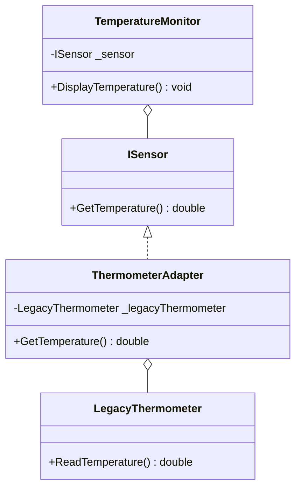
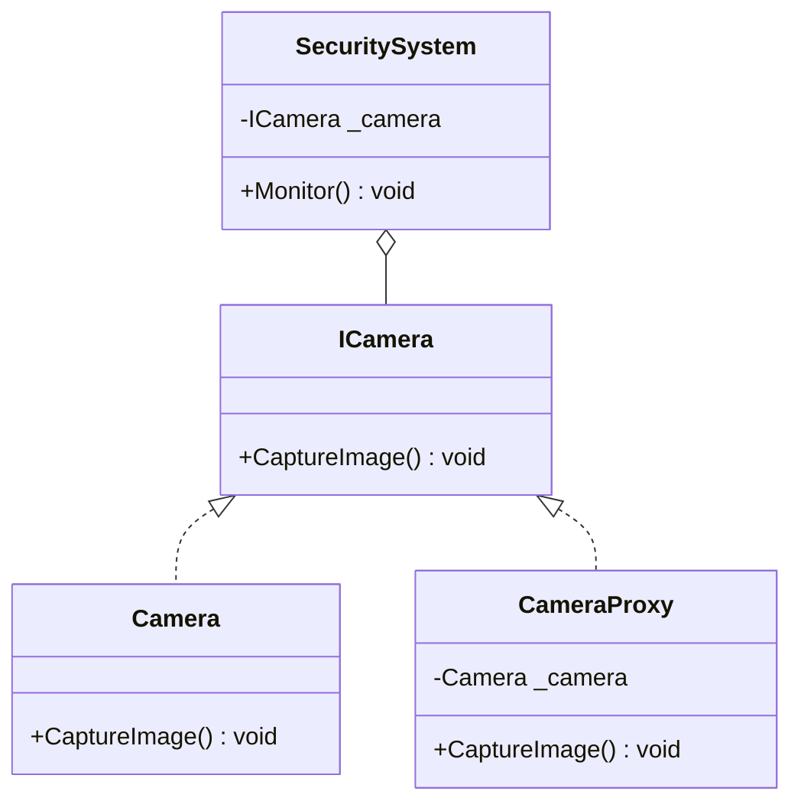
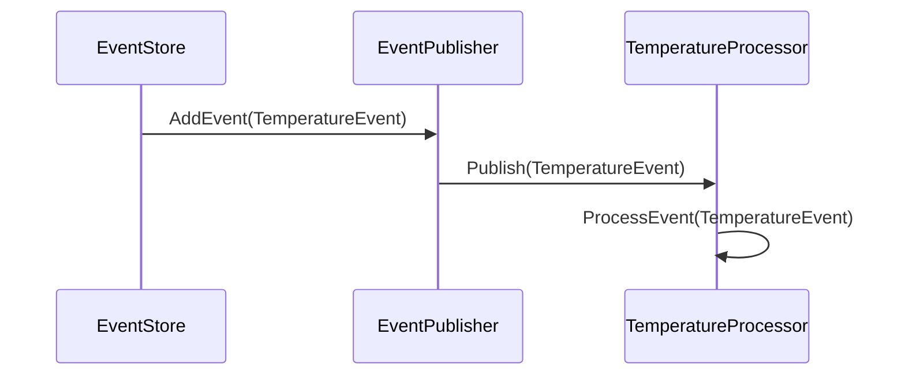
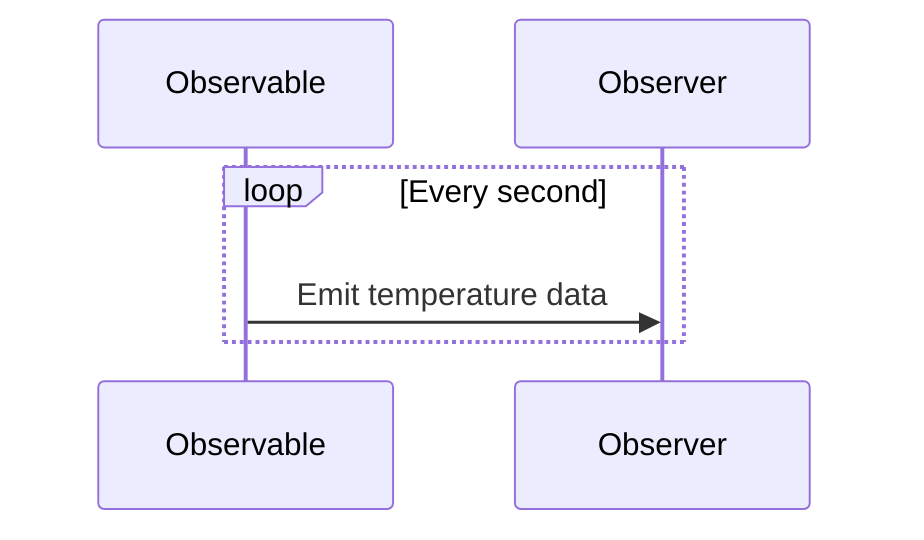

## 18.6 Applying Patterns in IoT Systems with C#

The Internet of Things (IoT) is revolutionizing the way we interact with the world around us. From smart homes to industrial automation, IoT systems are becoming increasingly complex, requiring robust and scalable software architectures. In this section, we will explore how to apply design patterns in IoT systems using C#. We will delve into interfacing with hardware, handling data aggregation and processing, and provide practical use cases and examples.

### Dealing with Hardware Interfaces

Interfacing with hardware is a fundamental aspect of IoT systems. Devices such as sensors, actuators, and controllers need to communicate seamlessly with software applications. Design patterns like Adapter and Proxy can be instrumental in achieving this.

#### Adapter Pattern

**Intent:** The Adapter pattern allows incompatible interfaces to work together. It acts as a bridge between two incompatible interfaces.

**Key Participants:**
- **Target:** Defines the domain-specific interface that the Client uses.
- **Adapter:** Adapts the interface of the Adaptee to the Target interface.
- **Adaptee:** Defines an existing interface that needs adapting.
- **Client:** Collaborates with objects conforming to the Target interface.

**Applicability:** Use the Adapter pattern when you want to use an existing class, and its interface does not match the one you need.

**Sample Code Snippet:**

```csharp
// Target interface
public interface ISensor
{
    double GetTemperature();
}

// Adaptee class
public class LegacyThermometer
{
    public double ReadTemperature()
    {
        // Simulate reading temperature
        return 23.5;
    }
}

// Adapter class
public class ThermometerAdapter : ISensor
{
    private readonly LegacyThermometer _legacyThermometer;

    public ThermometerAdapter(LegacyThermometer legacyThermometer)
    {
        _legacyThermometer = legacyThermometer;
    }

    public double GetTemperature()
    {
        return _legacyThermometer.ReadTemperature();
    }
}

// Client code
public class TemperatureMonitor
{
    private readonly ISensor _sensor;

    public TemperatureMonitor(ISensor sensor)
    {
        _sensor = sensor;
    }

    public void DisplayTemperature()
    {
        Console.WriteLine($"Current Temperature: {_sensor.GetTemperature()}°C");
    }
}

// Usage
var legacyThermometer = new LegacyThermometer();
var adapter = new ThermometerAdapter(legacyThermometer);
var monitor = new TemperatureMonitor(adapter);
monitor.DisplayTemperature();
```

**Design Considerations:** The Adapter pattern is particularly useful in IoT systems where legacy devices need to be integrated with modern applications. It allows for flexibility and reusability of existing code.

**Visualizing the Adapter Pattern:**



#### Proxy Pattern

**Intent:** The Proxy pattern provides a surrogate or placeholder for another object to control access to it.

**Key Participants:**
- **Proxy:** Maintains a reference that lets the proxy access the real subject. Provides an interface identical to the Subject's.
- **Subject:** Defines the common interface for RealSubject and Proxy so that a Proxy can be used anywhere a RealSubject is expected.
- **RealSubject:** Defines the real object that the proxy represents.

**Applicability:** Use the Proxy pattern when you need to control access to an object, such as when the object is resource-intensive to create or is located remotely.

**Sample Code Snippet:**

```csharp
// Subject interface
public interface ICamera
{
    void CaptureImage();
}

// RealSubject class
public class Camera : ICamera
{
    public void CaptureImage()
    {
        Console.WriteLine("Image captured by the camera.");
    }
}

// Proxy class
public class CameraProxy : ICamera
{
    private Camera _camera;

    public void CaptureImage()
    {
        if (_camera == null)
        {
            _camera = new Camera();
        }
        _camera.CaptureImage();
    }
}

// Client code
public class SecuritySystem
{
    private readonly ICamera _camera;

    public SecuritySystem(ICamera camera)
    {
        _camera = camera;
    }

    public void Monitor()
    {
        _camera.CaptureImage();
    }
}

// Usage
var cameraProxy = new CameraProxy();
var securitySystem = new SecuritySystem(cameraProxy);
securitySystem.Monitor();
```

**Design Considerations:** The Proxy pattern is useful in IoT systems for managing access to hardware resources, such as cameras or sensors, especially when these resources are expensive to initialize or are located remotely.

**Visualizing the Proxy Pattern:**



### Data Aggregation and Processing

IoT systems generate vast amounts of data that need to be aggregated and processed efficiently. Patterns like Event Sourcing and Reactive patterns can be leveraged to handle streaming data effectively.

#### Event Sourcing Pattern

**Intent:** Event Sourcing ensures that all changes to the application state are stored as a sequence of events.

**Key Participants:**
- **Event Store:** Stores all the events that have occurred.
- **Event Publisher:** Publishes events to subscribers.
- **Event Processor:** Processes events to update the application state.

**Applicability:** Use Event Sourcing when you need to maintain a complete history of changes to the application state, which is common in IoT systems for auditing and debugging purposes.

**Sample Code Snippet:**

```csharp
// Event class
public class TemperatureEvent
{
    public DateTime Timestamp { get; }
    public double Temperature { get; }

    public TemperatureEvent(DateTime timestamp, double temperature)
    {
        Timestamp = timestamp;
        Temperature = temperature;
    }
}

// Event Store class
public class EventStore
{
    private readonly List<TemperatureEvent> _events = new List<TemperatureEvent>();

    public void AddEvent(TemperatureEvent temperatureEvent)
    {
        _events.Add(temperatureEvent);
    }

    public IEnumerable<TemperatureEvent> GetEvents()
    {
        return _events;
    }
}

// Event Publisher class
public class EventPublisher
{
    public event Action<TemperatureEvent> OnTemperatureEvent;

    public void Publish(TemperatureEvent temperatureEvent)
    {
        OnTemperatureEvent?.Invoke(temperatureEvent);
    }
}

// Event Processor class
public class TemperatureProcessor
{
    public void ProcessEvent(TemperatureEvent temperatureEvent)
    {
        Console.WriteLine($"Processing temperature event: {temperatureEvent.Temperature}°C at {temperatureEvent.Timestamp}");
    }
}

// Usage
var eventStore = new EventStore();
var eventPublisher = new EventPublisher();
var temperatureProcessor = new TemperatureProcessor();

eventPublisher.OnTemperatureEvent += temperatureProcessor.ProcessEvent;

var temperatureEvent = new TemperatureEvent(DateTime.Now, 24.3);
eventStore.AddEvent(temperatureEvent);
eventPublisher.Publish(temperatureEvent);
```

**Design Considerations:** Event Sourcing is beneficial in IoT systems where maintaining a history of events is crucial for analysis and decision-making. It also facilitates debugging and auditing.

**Visualizing the Event Sourcing Pattern:**



#### Reactive Patterns

**Intent:** Reactive patterns are designed to handle asynchronous data streams and the propagation of change.

**Key Participants:**
- **Observable:** Represents the data source.
- **Observer:** Consumes data from the Observable.
- **Scheduler:** Manages the execution of Observables.

**Applicability:** Use Reactive patterns when dealing with real-time data streams, which is common in IoT systems for monitoring and control.

**Sample Code Snippet:**

```csharp
using System;
using System.Reactive.Linq;

// Observable data source
var temperatureStream = Observable.Interval(TimeSpan.FromSeconds(1))
    .Select(_ => new Random().NextDouble() * 30);

// Observer
var temperatureObserver = temperatureStream.Subscribe(temperature =>
{
    Console.WriteLine($"Current temperature: {temperature:F2}°C");
});

// Keep the application running
Console.ReadLine();
temperatureObserver.Dispose();
```

**Design Considerations:** Reactive patterns are ideal for IoT systems that require real-time data processing and responsiveness. They enable efficient handling of data streams and event-driven architectures.

**Visualizing the Reactive Pattern:**



### Use Cases and Examples

To illustrate the application of these patterns in IoT systems, let's explore two practical use cases: smart home systems and industrial automation applications.

#### Smart Home Systems

Smart home systems integrate various devices such as lights, thermostats, and security cameras to provide automation and control. Design patterns play a crucial role in managing the complexity of these systems.

**Example:**

In a smart home system, the Adapter pattern can be used to integrate legacy devices with modern smart home hubs. The Proxy pattern can manage access to security cameras, ensuring that only authorized users can view the footage. Event Sourcing can be employed to maintain a history of events, such as temperature changes and security alerts, for auditing and analysis.

#### Industrial Automation Applications

Industrial automation involves the use of control systems and information technologies to handle different processes and machinery in an industry. Design patterns help in building scalable and maintainable systems.

**Example:**

In an industrial automation application, the Adapter pattern can be used to interface with various sensors and actuators. The Proxy pattern can control access to critical machinery, ensuring that only authorized personnel can operate it. Reactive patterns can be leveraged to process real-time data streams from sensors, enabling timely decision-making and control.

### Try It Yourself

To deepen your understanding of applying design patterns in IoT systems with C#, try modifying the code examples provided. For instance, you can:

- Implement additional sensors or devices using the Adapter pattern.
- Extend the Event Sourcing example to include more event types and processing logic.
- Experiment with different data streams and observers using Reactive patterns.

### Conclusion

Applying design patterns in IoT systems with C# enables developers to build robust, scalable, and maintainable applications. By leveraging patterns like Adapter, Proxy, Event Sourcing, and Reactive patterns, you can effectively interface with hardware, handle data aggregation and processing, and create innovative IoT solutions. Remember, this is just the beginning. As you progress, you'll build more complex and interactive IoT systems. Keep experimenting, stay curious, and enjoy the journey!

## Quiz Time!



### Which design pattern is used to allow incompatible interfaces to work together?

- [x] Adapter
- [ ] Proxy
- [ ] Observer
- [ ] Singleton

> **Explanation:** The Adapter pattern allows incompatible interfaces to work together by acting as a bridge between them.

### What is the primary purpose of the Proxy pattern?

- [x] To control access to an object
- [ ] To adapt an interface
- [ ] To handle asynchronous data streams
- [ ] To store events

> **Explanation:** The Proxy pattern provides a surrogate or placeholder for another object to control access to it.

### In the context of IoT, when is the Event Sourcing pattern particularly useful?

- [x] When maintaining a complete history of changes is crucial
- [ ] When interfacing with legacy devices
- [ ] When controlling access to hardware resources
- [ ] When handling real-time data streams

> **Explanation:** Event Sourcing is useful in IoT systems where maintaining a history of events is crucial for analysis and decision-making.

### Which pattern is ideal for handling real-time data streams in IoT systems?

- [x] Reactive patterns
- [ ] Adapter pattern
- [ ] Proxy pattern
- [ ] Singleton pattern

> **Explanation:** Reactive patterns are designed to handle asynchronous data streams and the propagation of change, making them ideal for real-time data processing.

### What role does the Event Store play in the Event Sourcing pattern?

- [x] It stores all the events that have occurred
- [ ] It processes events to update the application state
- [ ] It publishes events to subscribers
- [ ] It adapts interfaces

> **Explanation:** The Event Store is responsible for storing all the events that have occurred in the system.

### Which pattern can be used to integrate legacy devices with modern applications in IoT systems?

- [x] Adapter pattern
- [ ] Proxy pattern
- [ ] Event Sourcing pattern
- [ ] Reactive patterns

> **Explanation:** The Adapter pattern is particularly useful in IoT systems where legacy devices need to be integrated with modern applications.

### What is the primary function of an Observer in Reactive patterns?

- [x] To consume data from the Observable
- [ ] To store events
- [ ] To control access to an object
- [ ] To adapt interfaces

> **Explanation:** In Reactive patterns, the Observer consumes data from the Observable.

### In the Proxy pattern, what is the role of the RealSubject?

- [x] It defines the real object that the proxy represents
- [ ] It adapts interfaces
- [ ] It stores events
- [ ] It processes data streams

> **Explanation:** The RealSubject defines the real object that the proxy represents, providing the actual functionality.

### Which pattern is used to manage access to hardware resources in IoT systems?

- [x] Proxy pattern
- [ ] Adapter pattern
- [ ] Event Sourcing pattern
- [ ] Reactive patterns

> **Explanation:** The Proxy pattern is useful in IoT systems for managing access to hardware resources, such as cameras or sensors.

### True or False: The Adapter pattern can be used to control access to an object.

- [ ] True
- [x] False

> **Explanation:** The Adapter pattern is used to allow incompatible interfaces to work together, not to control access to an object.


