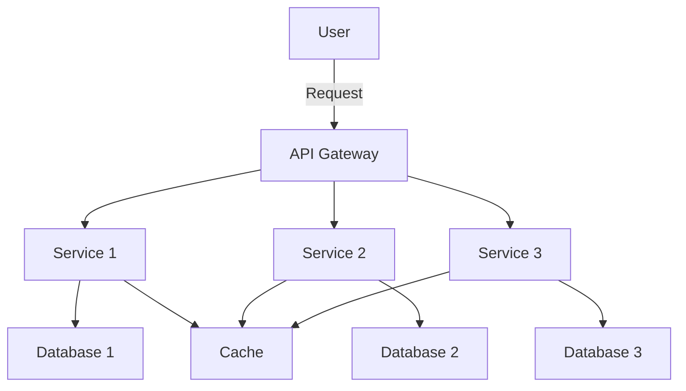

## 18.7 Microservices in a Cloud Environment

In today's rapidly evolving technological landscape, microservices architecture has emerged as a pivotal approach for building scalable, resilient, and flexible applications. This section delves into the deployment and orchestration of microservices within a cloud environment, focusing on tools like Docker and Kubernetes, and strategies for continuous deployment and scaling. We will also explore a comprehensive case study on migrating to a cloud-native architecture and managing microservices orchestration.

### Understanding Microservices Architecture

Microservices architecture is a design pattern where an application is composed of small, independent services that communicate over a network. Each service is self-contained and implements a specific business capability. This architecture offers several advantages, including:

- **Scalability**: Each microservice can be scaled independently based on demand.
- **Resilience**: Failure in one service does not affect the entire system.
- **Flexibility**: Services can be developed, deployed, and maintained independently.

### Deployment Strategies for Microservices

Deploying microservices in a cloud environment requires careful planning and execution. Here, we explore key deployment strategies and tools that facilitate this process.

#### Using Docker for Containerization

Docker is a platform that enables developers to package applications into containers—standardized units that contain everything needed to run the software, including code, runtime, libraries, and dependencies.

- **Benefits of Docker**:
  - **Consistency**: Ensures that the application runs the same way in different environments.
  - **Isolation**: Containers isolate applications from each other, enhancing security.
  - **Efficiency**: Containers are lightweight and start quickly.

- **Docker in Action**:
  - **Dockerfile**: A text file containing instructions to build a Docker image.
  - **Docker Compose**: A tool for defining and running multi-container Docker applications.

```dockerfile
FROM mcr.microsoft.com/dotnet/aspnet:5.0 AS base
WORKDIR /app
EXPOSE 80

FROM mcr.microsoft.com/dotnet/sdk:5.0 AS build
WORKDIR /src
COPY ["MyMicroservice/MyMicroservice.csproj", "MyMicroservice/"]
RUN dotnet restore "MyMicroservice/MyMicroservice.csproj"
COPY . .
WORKDIR "/src/MyMicroservice"
RUN dotnet build "MyMicroservice.csproj" -c Release -o /app/build

FROM build AS publish
RUN dotnet publish "MyMicroservice.csproj" -c Release -o /app/publish

FROM base AS final
WORKDIR /app
COPY --from=publish /app/publish .
ENTRYPOINT ["dotnet", "MyMicroservice.dll"]
```

#### Orchestrating with Kubernetes

Kubernetes is an open-source platform designed to automate deploying, scaling, and operating application containers. It provides a robust framework for running distributed systems resiliently.

- **Key Features**:
  - **Automatic Binpacking**: Efficiently places containers based on resource requirements and constraints.
  - **Self-Healing**: Restarts failed containers, replaces and reschedules them when nodes die.
  - **Horizontal Scaling**: Scales applications up and down automatically based on demand.

- **Kubernetes Components**:
  - **Pods**: The smallest deployable units that can be created and managed.
  - **Services**: Define a logical set of Pods and a policy by which to access them.
  - **Deployments**: Provide declarative updates to Pods and ReplicaSets.

```yaml
apiVersion: apps/v1
kind: Deployment
metadata:
  name: my-microservice
spec:
  replicas: 3
  selector:
    matchLabels:
      app: my-microservice
  template:
    metadata:
      labels:
        app: my-microservice
    spec:
      containers:
      - name: my-microservice
        image: my-microservice-image:latest
        ports:
        - containerPort: 80
```

### Continuous Deployment and Scaling

Continuous deployment (CD) is a software release process that uses automated testing to validate if changes to a codebase are correct and stable for immediate autonomous deployment to a production environment.

#### Implementing Continuous Deployment

- **CI/CD Pipelines**: Automate the process of building, testing, and deploying code.
- **Tools**: Jenkins, GitLab CI/CD, Azure DevOps, and GitHub Actions are popular tools for implementing CI/CD pipelines.

```yaml
name: CI/CD Pipeline

on:
  push:
    branches:
      - main

jobs:
  build:
    runs-on: ubuntu-latest
    steps:
    - uses: actions/checkout@v2
    - name: Set up .NET
      uses: actions/setup-dotnet@v1
      with:
        dotnet-version: '5.0.x'
    - name: Build with dotnet
      run: dotnet build --configuration Release
    - name: Run tests
      run: dotnet test --no-build --verbosity normal
    - name: Publish Docker image
      run: docker build -t my-microservice-image .
```

#### Scaling Microservices

- **Horizontal Scaling**: Adding more instances of a service to handle increased load.
- **Vertical Scaling**: Increasing the resources (CPU, RAM) of an existing instance.

### Case Study: Migrating to Cloud-Native Architecture

In this case study, we explore the journey of a fictional company, TechCorp, as they migrate their monolithic application to a cloud-native microservices architecture.

#### Initial Challenges

TechCorp's monolithic application faced several challenges:

- **Scalability Issues**: The application could not handle increased user demand.
- **Deployment Bottlenecks**: Deploying new features was time-consuming and error-prone.
- **Limited Flexibility**: Changes in one part of the application often required changes in other parts.

#### Migration Strategy

TechCorp adopted the following strategy for migration:

1. **Decompose the Monolith**: Identify and extract business capabilities into individual microservices.
2. **Containerize Services**: Use Docker to package each microservice into a container.
3. **Orchestrate with Kubernetes**: Deploy and manage containers using Kubernetes.
4. **Implement CI/CD**: Set up a CI/CD pipeline to automate testing and deployment.

#### Managing Microservices Orchestration

- **Service Discovery**: Use Kubernetes' built-in service discovery to enable microservices to find and communicate with each other.
- **Load Balancing**: Distribute incoming network traffic across multiple instances of a service.
- **Monitoring and Logging**: Implement tools like Prometheus and Grafana for monitoring, and ELK Stack for logging.

#### Outcomes and Benefits

- **Improved Scalability**: The application can now handle increased load by scaling services independently.
- **Faster Deployment**: New features can be deployed quickly and reliably.
- **Enhanced Flexibility**: Teams can work on different services independently, reducing dependencies and increasing productivity.

### Visualizing Microservices Architecture

Below is a diagram illustrating the microservices architecture deployed in a cloud environment using Docker and Kubernetes.



**Diagram Description**: This diagram represents a typical microservices architecture where an API Gateway routes requests to different services. Each service interacts with its own database, and a shared cache is used to improve performance.

### Knowledge Check

- **Question**: What are the benefits of using Docker for containerization?
- **Question**: How does Kubernetes help in managing microservices?
- **Question**: What is the role of CI/CD in microservices deployment?

### Try It Yourself

Experiment with the provided Dockerfile and Kubernetes deployment script. Try modifying the number of replicas in the Kubernetes deployment to see how it affects scalability. Consider setting up a simple CI/CD pipeline using GitHub Actions to automate the build and deployment process.

### Conclusion

Deploying and orchestrating microservices in a cloud environment is a complex but rewarding endeavor. By leveraging tools like Docker and Kubernetes, and implementing continuous deployment strategies, organizations can build scalable, resilient, and flexible applications. The case study of TechCorp illustrates the transformative impact of migrating to a cloud-native architecture, highlighting the benefits of improved scalability, faster deployment, and enhanced flexibility.

## Quiz Time!



### What is a key benefit of using Docker for microservices?

- [x] Consistency across environments
- [ ] Increased memory usage
- [ ] Slower deployment times
- [ ] Reduced security

> **Explanation:** Docker ensures that applications run the same way in different environments, providing consistency.

### Which tool is used for orchestrating containers in a cloud environment?

- [x] Kubernetes
- [ ] GitHub Actions
- [ ] Jenkins
- [ ] Docker Compose

> **Explanation:** Kubernetes is a platform designed to automate deploying, scaling, and operating application containers.

### What is the primary purpose of a CI/CD pipeline?

- [x] Automate the process of building, testing, and deploying code
- [ ] Increase manual testing efforts
- [ ] Reduce code quality
- [ ] Slow down deployment

> **Explanation:** CI/CD pipelines automate the process of building, testing, and deploying code to ensure quick and reliable releases.

### What is horizontal scaling?

- [x] Adding more instances of a service to handle increased load
- [ ] Increasing the resources of an existing instance
- [ ] Reducing the number of service instances
- [ ] Decreasing resource allocation

> **Explanation:** Horizontal scaling involves adding more instances of a service to handle increased demand.

### Which component in Kubernetes defines a logical set of Pods?

- [x] Services
- [ ] Deployments
- [ ] Nodes
- [ ] Containers

> **Explanation:** Kubernetes Services define a logical set of Pods and a policy by which to access them.

### What is the role of an API Gateway in a microservices architecture?

- [x] Route requests to different services
- [ ] Store data
- [ ] Monitor network traffic
- [ ] Manage databases

> **Explanation:** An API Gateway routes incoming requests to the appropriate microservices.

### What is a common tool for monitoring microservices?

- [x] Prometheus
- [ ] Docker
- [ ] GitHub Actions
- [ ] Jenkins

> **Explanation:** Prometheus is commonly used for monitoring microservices.

### What does the ELK Stack stand for?

- [x] Elasticsearch, Logstash, Kibana
- [ ] Elastic, Log, Kubernetes
- [ ] Elastic, Log, Kafka
- [ ] Elasticsearch, Log, Kafka

> **Explanation:** ELK Stack stands for Elasticsearch, Logstash, and Kibana, used for logging and monitoring.

### What is the benefit of using a shared cache in microservices?

- [x] Improve performance
- [ ] Increase latency
- [ ] Reduce security
- [ ] Slow down response times

> **Explanation:** A shared cache improves performance by reducing the time needed to access frequently used data.

### True or False: Vertical scaling involves adding more instances of a service.

- [ ] True
- [x] False

> **Explanation:** Vertical scaling involves increasing the resources (CPU, RAM) of an existing instance, not adding more instances.



Remember, this is just the beginning. As you progress, you'll build more complex and interactive applications in the cloud. Keep experimenting, stay curious, and enjoy the journey!
