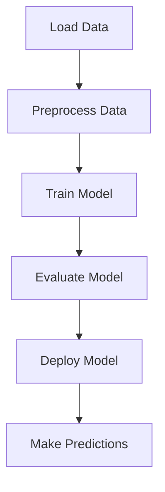
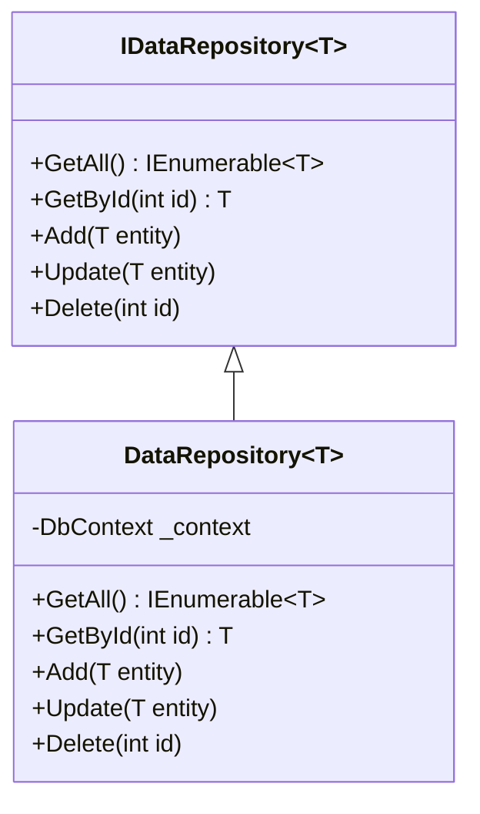

## 18.8 Machine Learning Applications

Incorporating machine learning (ML) into C# applications is a transformative approach that can significantly enhance the capabilities of software systems. With the advent of ML.NET, a cross-platform, open-source machine learning framework for .NET developers, integrating ML into C# applications has become more accessible and efficient. This section will guide you through the process of integrating ML.NET into your applications, focusing on data handling patterns, building and deploying models, and exploring use cases such as predictive analytics and real-time anomaly detection.

### Integrating ML.NET into Applications

ML.NET provides a robust framework for developing machine learning models in C#. It supports a variety of machine learning tasks, including classification, regression, clustering, anomaly detection, and more. Let's delve into how you can integrate ML.NET into your applications effectively.

#### Using Patterns for Data Handling

Data handling is a crucial aspect of any machine learning application. Proper data management ensures that your models are trained on accurate and relevant data, leading to better predictions and insights.

**Data Access Patterns**

Incorporating data access patterns such as the Repository Pattern and Unit of Work Pattern can streamline data operations in your ML applications. These patterns help manage data access logic, ensuring that your application interacts with data sources efficiently and consistently.

- **Repository Pattern**: This pattern abstracts the data access layer, providing a clean API for data operations. It allows you to focus on business logic without worrying about data access details.

- **Unit of Work Pattern**: This pattern maintains a list of objects affected by a business transaction and coordinates the writing out of changes. It ensures that all data operations are executed in a single transaction, maintaining data integrity.

**Example: Implementing the Repository Pattern**

```csharp
public interface IDataRepository<T>
{
    IEnumerable<T> GetAll();
    T GetById(int id);
    void Add(T entity);
    void Update(T entity);
    void Delete(int id);
}

public class DataRepository<T> : IDataRepository<T>
{
    private readonly DbContext _context;

    public DataRepository(DbContext context)
    {
        _context = context;
    }

    public IEnumerable<T> GetAll()
    {
        return _context.Set<T>().ToList();
    }

    public T GetById(int id)
    {
        return _context.Set<T>().Find(id);
    }

    public void Add(T entity)
    {
        _context.Set<T>().Add(entity);
        _context.SaveChanges();
    }

    public void Update(T entity)
    {
        _context.Set<T>().Update(entity);
        _context.SaveChanges();
    }

    public void Delete(int id)
    {
        var entity = _context.Set<T>().Find(id);
        if (entity != null)
        {
            _context.Set<T>().Remove(entity);
            _context.SaveChanges();
        }
    }
}
```

**Data Transformation and Preprocessing**

Before feeding data into a machine learning model, it is essential to preprocess and transform it. ML.NET provides a comprehensive set of data transformation techniques, including normalization, encoding, and feature extraction.

- **Normalization**: Scaling numerical data to a standard range.
- **Encoding**: Converting categorical data into numerical format.
- **Feature Extraction**: Deriving new features from existing data to improve model performance.

**Example: Data Preprocessing with ML.NET**

```csharp
var pipeline = mlContext.Transforms.Conversion.MapValueToKey("Label")
    .Append(mlContext.Transforms.Concatenate("Features", new[] { "Feature1", "Feature2", "Feature3" }))
    .Append(mlContext.Transforms.NormalizeMinMax("Features"));
```

#### Building and Deploying Models

Building a machine learning model involves selecting the right algorithm, training the model with data, and evaluating its performance. ML.NET simplifies this process with its intuitive API and support for a wide range of algorithms.

**Model Training**

Training a model in ML.NET involves defining a learning pipeline, loading data, and fitting the model to the data.

**Example: Training a Model**

```csharp
var model = pipeline.Fit(trainingDataView);
```

**Model Evaluation**

Evaluating the model's performance is crucial to ensure its accuracy and reliability. ML.NET provides various metrics for model evaluation, such as accuracy, precision, recall, and F1 score.

**Example: Evaluating a Model**

```csharp
var predictions = model.Transform(testDataView);
var metrics = mlContext.BinaryClassification.Evaluate(predictions, "Label");

Console.WriteLine($"Accuracy: {metrics.Accuracy}");
Console.WriteLine($"AUC: {metrics.AreaUnderRocCurve}");
Console.WriteLine($"F1 Score: {metrics.F1Score}");
```

**Model Deployment**

Once a model is trained and evaluated, it can be deployed into production. ML.NET models can be deployed as part of a .NET application, enabling real-time predictions and insights.

**Example: Making Predictions**

```csharp
var predictionEngine = mlContext.Model.CreatePredictionEngine<InputData, OutputData>(model);
var prediction = predictionEngine.Predict(new InputData { Feature1 = 1.0f, Feature2 = 2.0f, Feature3 = 3.0f });

Console.WriteLine($"Predicted Label: {prediction.PredictedLabel}");
```

### Use Cases and Examples

Machine learning can be applied to a wide range of use cases, from predictive analytics to real-time anomaly detection. Let's explore some practical examples of how ML.NET can be used in these scenarios.

#### Predictive Analytics

Predictive analytics involves using historical data to predict future outcomes. It is widely used in various industries, including finance, healthcare, and retail.

**Example: Sales Forecasting**

Sales forecasting is a common application of predictive analytics. By analyzing historical sales data, businesses can predict future sales trends and make informed decisions.

**Example: Implementing Sales Forecasting**

```csharp
public class SalesData
{
    public float Month { get; set; }
    public float Sales { get; set; }
}

public class SalesPrediction
{
    public float PredictedSales { get; set; }
}

var pipeline = mlContext.Transforms.Concatenate("Features", new[] { "Month" })
    .Append(mlContext.Regression.Trainers.Sdca(labelColumnName: "Sales", maximumNumberOfIterations: 100));

var model = pipeline.Fit(trainingDataView);

var predictionEngine = mlContext.Model.CreatePredictionEngine<SalesData, SalesPrediction>(model);
var prediction = predictionEngine.Predict(new SalesData { Month = 13 });

Console.WriteLine($"Predicted Sales: {prediction.PredictedSales}");
```

#### Recommendation Systems

Recommendation systems are used to suggest products or services to users based on their preferences and behavior. They are commonly used in e-commerce, streaming services, and social media platforms.

**Example: Building a Recommendation System**

```csharp
public class ProductData
{
    public float UserId { get; set; }
    public float ProductId { get; set; }
    public float Label { get; set; }
}

public class ProductPrediction
{
    public float Score { get; set; }
}

var pipeline = mlContext.Transforms.Conversion.MapValueToKey("UserId")
    .Append(mlContext.Transforms.Conversion.MapValueToKey("ProductId"))
    .Append(mlContext.Recommendation().Trainers.MatrixFactorization("UserId", "ProductId", labelColumnName: "Label"));

var model = pipeline.Fit(trainingDataView);

var predictionEngine = mlContext.Model.CreatePredictionEngine<ProductData, ProductPrediction>(model);
var prediction = predictionEngine.Predict(new ProductData { UserId = 1, ProductId = 10 });

Console.WriteLine($"Predicted Score: {prediction.Score}");
```

#### Real-Time Anomaly Detection

Anomaly detection involves identifying unusual patterns or outliers in data. It is used in various applications, such as fraud detection, network security, and equipment monitoring.

**Example: Implementing Anomaly Detection**

```csharp
public class SensorData
{
    public float Temperature { get; set; }
    public float Humidity { get; set; }
}

public class AnomalyPrediction
{
    public bool IsAnomaly { get; set; }
}

var pipeline = mlContext.Transforms.Concatenate("Features", new[] { "Temperature", "Humidity" })
    .Append(mlContext.AnomalyDetection.Trainers.RandomizedPca("Features", rank: 1));

var model = pipeline.Fit(trainingDataView);

var predictionEngine = mlContext.Model.CreatePredictionEngine<SensorData, AnomalyPrediction>(model);
var prediction = predictionEngine.Predict(new SensorData { Temperature = 100, Humidity = 10 });

Console.WriteLine($"Is Anomaly: {prediction.IsAnomaly}");
```

### Visualizing Machine Learning Workflows

To better understand the machine learning workflows in C#, let's visualize the process using Mermaid.js diagrams.

#### Visualizing the Machine Learning Pipeline



**Description**: This diagram illustrates the typical workflow of a machine learning application, from loading and preprocessing data to training, evaluating, and deploying the model.

#### Visualizing Data Handling Patterns



**Description**: This class diagram represents the structure of the Repository Pattern, showing the interface and its implementation for data handling in a machine learning application.

### Try It Yourself

To deepen your understanding of integrating ML.NET into C# applications, try modifying the code examples provided. Experiment with different datasets, algorithms, and parameters to see how they affect the model's performance. Consider implementing additional use cases, such as sentiment analysis or image classification, using ML.NET.

### Knowledge Check

- Explain the importance of data preprocessing in machine learning applications.
- Describe how the Repository Pattern can be used to manage data access in ML.NET applications.
- Discuss the steps involved in training and deploying a machine learning model using ML.NET.
- Provide examples of real-world applications of predictive analytics and anomaly detection.

### Embrace the Journey

Remember, integrating machine learning into C# applications is a journey that requires continuous learning and experimentation. As you explore the capabilities of ML.NET, you'll discover new ways to enhance your applications and deliver valuable insights. Stay curious, keep experimenting, and enjoy the journey!

## Quiz Time!



### What is the primary purpose of the Repository Pattern in ML.NET applications?

- [x] To abstract the data access layer and provide a clean API for data operations.
- [ ] To enhance the performance of machine learning models.
- [ ] To visualize machine learning workflows.
- [ ] To deploy machine learning models.

> **Explanation:** The Repository Pattern abstracts the data access layer, providing a clean API for data operations, allowing developers to focus on business logic.

### Which ML.NET feature is used for scaling numerical data to a standard range?

- [ ] Encoding
- [x] Normalization
- [ ] Feature Extraction
- [ ] Data Transformation

> **Explanation:** Normalization is used to scale numerical data to a standard range, which is crucial for improving model performance.

### What is the role of the Unit of Work Pattern in data handling?

- [x] To maintain a list of objects affected by a business transaction and coordinate the writing out of changes.
- [ ] To provide a clean API for data operations.
- [ ] To preprocess data before feeding it into a model.
- [ ] To deploy machine learning models.

> **Explanation:** The Unit of Work Pattern maintains a list of objects affected by a business transaction and coordinates the writing out of changes, ensuring data integrity.

### Which ML.NET task is used for predicting future outcomes based on historical data?

- [ ] Anomaly Detection
- [x] Predictive Analytics
- [ ] Recommendation Systems
- [ ] Real-Time Detection

> **Explanation:** Predictive analytics involves using historical data to predict future outcomes, a common task in ML.NET applications.

### In ML.NET, what is the purpose of the `CreatePredictionEngine` method?

- [ ] To train a machine learning model.
- [x] To create an engine for making predictions with a trained model.
- [ ] To evaluate the performance of a model.
- [ ] To preprocess data for training.

> **Explanation:** The `CreatePredictionEngine` method creates an engine for making predictions with a trained model, enabling real-time insights.

### What is a common application of anomaly detection in machine learning?

- [ ] Sales Forecasting
- [ ] Recommendation Systems
- [x] Fraud Detection
- [ ] Sentiment Analysis

> **Explanation:** Anomaly detection is commonly used in fraud detection to identify unusual patterns or outliers in data.

### Which diagramming tool is used in this guide to visualize machine learning workflows?

- [ ] UML
- [ ] Visio
- [x] Mermaid.js
- [ ] Lucidchart

> **Explanation:** Mermaid.js is used in this guide to create diagrams that visualize machine learning workflows and data handling patterns.

### What is the first step in a typical machine learning workflow?

- [ ] Train Model
- [ ] Evaluate Model
- [x] Load Data
- [ ] Deploy Model

> **Explanation:** The first step in a typical machine learning workflow is to load data, which is then preprocessed and used for training.

### Which ML.NET feature is used for converting categorical data into numerical format?

- [x] Encoding
- [ ] Normalization
- [ ] Feature Extraction
- [ ] Data Transformation

> **Explanation:** Encoding is used to convert categorical data into numerical format, making it suitable for machine learning models.

### True or False: ML.NET models can only be deployed as part of a .NET application.

- [x] True
- [ ] False

> **Explanation:** ML.NET models are designed to be deployed as part of a .NET application, enabling seamless integration and real-time predictions.


