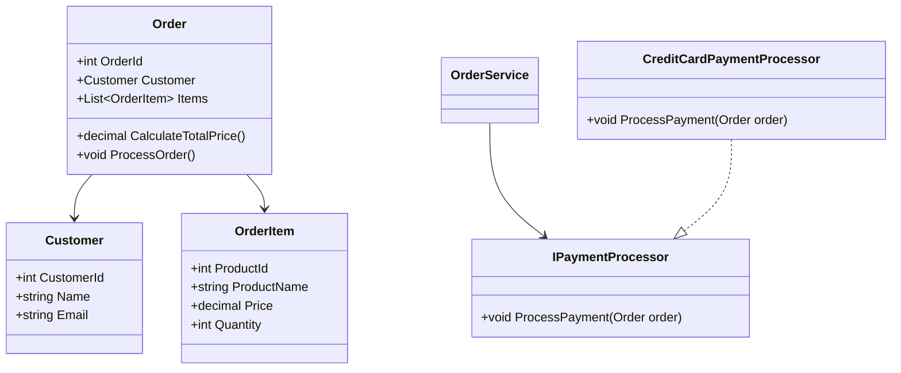

## 18.9 Refactoring Legacy Applications

In the ever-evolving landscape of software development, legacy applications often become a significant challenge for organizations. These applications, built on outdated technologies or methodologies, can hinder innovation, scalability, and maintainability. Refactoring legacy applications using modern design patterns is a strategic approach to breathe new life into these systems. In this section, we will explore the process of modernizing old codebases with design patterns, focusing on applying patterns incrementally, introducing object-oriented programming (OOP) concepts, and managing technical debt effectively.

### Modernizing Old Codebases

Modernizing a legacy application is not a one-time task but a continuous process that requires careful planning and execution. The goal is to improve the codebase's structure, readability, and maintainability while minimizing disruptions to existing functionality.

#### Applying Patterns Incrementally

One of the most effective strategies for refactoring legacy applications is to apply design patterns incrementally. This approach allows developers to make gradual improvements without overwhelming the team or introducing significant risks.

1. **Identify Problem Areas**: Begin by identifying the most problematic areas of the codebase. These are often the parts that are hardest to maintain, have the most bugs, or are critical to the application's functionality.

2. **Select Appropriate Patterns**: Choose design patterns that address the specific issues identified. For example, if the codebase suffers from tight coupling, consider using the Dependency Injection pattern to promote loose coupling and improve testability.

3. **Refactor in Small Steps**: Implement changes in small, manageable increments. This allows for easier testing and validation of each change, reducing the risk of introducing new bugs.

4. **Test Thoroughly**: Ensure that each refactoring step is accompanied by comprehensive testing. Automated tests can be particularly valuable in verifying that the refactored code behaves as expected.

5. **Document Changes**: Maintain clear documentation of the changes made during the refactoring process. This helps future developers understand the rationale behind the modifications and facilitates ongoing maintenance.

#### Introducing OOP Concepts

Legacy applications often lack modern programming paradigms such as object-oriented programming (OOP). Introducing OOP concepts can significantly enhance the codebase's flexibility and scalability.

1. **Encapsulation**: Start by encapsulating related data and behavior into classes. This helps to organize the code and makes it easier to understand and maintain.

2. **Inheritance**: Use inheritance to create a hierarchy of classes that share common functionality. This reduces code duplication and promotes code reuse.

3. **Polymorphism**: Implement polymorphism to allow objects to be treated as instances of their parent class. This enables more flexible and dynamic code.

4. **Interfaces and Abstraction**: Define interfaces to specify the behavior that classes must implement. This promotes loose coupling and enhances the code's extensibility.

### Case Study: Transforming Procedural Code to OOP

To illustrate the process of refactoring legacy applications, let's consider a case study where we transform a procedural codebase into an object-oriented one.

#### Initial Assessment

The legacy application in question is a procedural codebase written in C#. It handles customer orders for an e-commerce platform. The code is monolithic, with functions scattered across multiple files, making it difficult to maintain and extend.

#### Refactoring Strategy

1. **Modularization**: Break down the monolithic code into smaller, more manageable modules. Each module should represent a distinct part of the application's functionality, such as order processing, payment handling, and inventory management.

2. **Class Creation**: For each module, create classes that encapsulate related data and behavior. For example, an `Order` class might include properties for the order ID, customer information, and order items, along with methods for calculating the total price and processing the order.

```csharp
public class Order
{
    public int OrderId { get; set; }
    public Customer Customer { get; set; }
    public List<OrderItem> Items { get; set; }

    public decimal CalculateTotalPrice()
    {
        return Items.Sum(item => item.Price * item.Quantity);
    }

    public void ProcessOrder()
    {
        // Logic to process the order
    }
}
```

3. **Interface Implementation**: Define interfaces for key functionalities, such as payment processing and inventory management. Implement these interfaces in the respective classes to promote loose coupling and flexibility.

```csharp
public interface IPaymentProcessor
{
    void ProcessPayment(Order order);
}

public class CreditCardPaymentProcessor : IPaymentProcessor
{
    public void ProcessPayment(Order order)
    {
        // Logic to process credit card payment
    }
}
```

4. **Dependency Injection**: Use dependency injection to manage dependencies between classes. This enhances testability and allows for easier swapping of implementations.

```csharp
public class OrderService
{
    private readonly IPaymentProcessor _paymentProcessor;

    public OrderService(IPaymentProcessor paymentProcessor)
    {
        _paymentProcessor = paymentProcessor;
    }

    public void CompleteOrder(Order order)
    {
        _paymentProcessor.ProcessPayment(order);
        // Additional order completion logic
    }
}
```

5. **Testing and Validation**: After refactoring, thoroughly test the application to ensure that all functionalities work as expected. Automated tests can help catch any regressions introduced during the refactoring process.

#### Managing Technical Debt

Refactoring legacy applications often involves addressing technical debt, which refers to the accumulated cost of shortcuts and suboptimal solutions in the codebase. Managing technical debt is crucial for maintaining a healthy and sustainable codebase.

1. **Prioritize Debt Reduction**: Identify and prioritize areas of the codebase with the highest technical debt. Focus on refactoring these areas first to maximize the impact of your efforts.

2. **Establish Coding Standards**: Implement coding standards and best practices to prevent the introduction of new technical debt. Regular code reviews can help enforce these standards.

3. **Allocate Time for Refactoring**: Dedicate time in each development cycle for refactoring and addressing technical debt. This ensures that debt reduction becomes an ongoing part of the development process.

4. **Monitor and Measure**: Continuously monitor the codebase for signs of technical debt and measure the impact of refactoring efforts. Tools like static code analyzers can provide valuable insights into code quality.

### Visualizing the Refactoring Process

To better understand the refactoring process, let's visualize the transformation of a legacy codebase into a modern, object-oriented architecture using a class diagram.



This diagram illustrates the relationships between the `Order`, `Customer`, and `OrderItem` classes, as well as the implementation of the `IPaymentProcessor` interface by the `CreditCardPaymentProcessor` class.

### Try It Yourself

To gain hands-on experience with refactoring legacy applications, try the following exercises:

1. **Identify a Legacy Codebase**: Choose a small legacy application or a portion of a larger application that you have access to. Analyze its structure and identify areas for improvement.

2. **Apply Design Patterns**: Select one or more design patterns that address the identified issues. Implement these patterns incrementally, testing each change thoroughly.

3. **Introduce OOP Concepts**: Refactor the code to introduce OOP concepts such as encapsulation, inheritance, and polymorphism. Use interfaces to promote loose coupling.

4. **Measure Impact**: Use tools like static code analyzers to measure the impact of your refactoring efforts on code quality and maintainability.

5. **Document Your Process**: Keep a record of the changes you make and the rationale behind them. This documentation can be valuable for future reference and for sharing your learnings with others.

### Knowledge Check

To reinforce your understanding of refactoring legacy applications, consider the following questions:

- What are the key benefits of applying design patterns to legacy codebases?
- How can dependency injection improve the testability of a refactored application?
- What role do interfaces play in promoting loose coupling in an object-oriented architecture?
- How can automated testing support the refactoring process?
- What strategies can be used to manage technical debt in a legacy application?

### Embrace the Journey

Refactoring legacy applications is a challenging but rewarding endeavor. By applying design patterns and modern programming paradigms, you can transform outdated codebases into robust, maintainable systems. Remember, this is just the beginning. As you progress, you'll gain valuable insights and skills that will empower you to tackle even more complex refactoring projects. Keep experimenting, stay curious, and enjoy the journey!

## Quiz Time!



### What is the primary goal of refactoring legacy applications?

- [x] To improve the codebase's structure, readability, and maintainability
- [ ] To completely rewrite the application from scratch
- [ ] To add new features to the application
- [ ] To increase the application's performance

> **Explanation:** The primary goal of refactoring legacy applications is to improve the codebase's structure, readability, and maintainability without altering its external behavior.

### Which design pattern is commonly used to promote loose coupling in a refactored application?

- [x] Dependency Injection
- [ ] Singleton
- [ ] Factory Method
- [ ] Observer

> **Explanation:** Dependency Injection is commonly used to promote loose coupling by allowing dependencies to be injected into a class, making it easier to swap implementations and test the code.

### What is the benefit of using interfaces in an object-oriented architecture?

- [x] They promote loose coupling and enhance code extensibility
- [ ] They increase code duplication
- [ ] They make the code harder to understand
- [ ] They are only useful for large applications

> **Explanation:** Interfaces promote loose coupling by defining a contract that classes must adhere to, allowing for flexible and extensible code.

### How can automated testing support the refactoring process?

- [x] By verifying that refactored code behaves as expected
- [ ] By increasing the complexity of the codebase
- [ ] By replacing manual testing entirely
- [ ] By slowing down the development process

> **Explanation:** Automated testing supports the refactoring process by providing a safety net that verifies the refactored code behaves as expected, reducing the risk of introducing new bugs.

### What is technical debt?

- [x] The accumulated cost of shortcuts and suboptimal solutions in the codebase
- [ ] The financial cost of developing software
- [ ] The time spent on writing code
- [ ] The number of bugs in the application

> **Explanation:** Technical debt refers to the accumulated cost of shortcuts and suboptimal solutions in the codebase, which can hinder future development and maintenance.

### Which of the following is a strategy for managing technical debt?

- [x] Prioritizing debt reduction and dedicating time for refactoring
- [ ] Ignoring it until it becomes a major issue
- [ ] Adding more features to the application
- [ ] Removing all documentation

> **Explanation:** Managing technical debt involves prioritizing debt reduction, dedicating time for refactoring, and implementing coding standards to prevent new debt.

### What is the role of encapsulation in object-oriented programming?

- [x] To organize code by bundling related data and behavior into classes
- [ ] To increase code duplication
- [ ] To make the code harder to understand
- [ ] To eliminate the need for testing

> **Explanation:** Encapsulation organizes code by bundling related data and behavior into classes, making it easier to understand and maintain.

### How can inheritance reduce code duplication?

- [x] By allowing classes to share common functionality through a hierarchy
- [ ] By requiring each class to implement its own functionality
- [ ] By making the code more complex
- [ ] By eliminating the need for interfaces

> **Explanation:** Inheritance reduces code duplication by allowing classes to share common functionality through a hierarchy, promoting code reuse.

### What is the purpose of polymorphism in object-oriented programming?

- [x] To allow objects to be treated as instances of their parent class
- [ ] To increase code duplication
- [ ] To make the code harder to understand
- [ ] To eliminate the need for testing

> **Explanation:** Polymorphism allows objects to be treated as instances of their parent class, enabling more flexible and dynamic code.

### True or False: Refactoring legacy applications is a one-time task.

- [ ] True
- [x] False

> **Explanation:** Refactoring legacy applications is not a one-time task but a continuous process that requires ongoing effort to maintain and improve the codebase.


