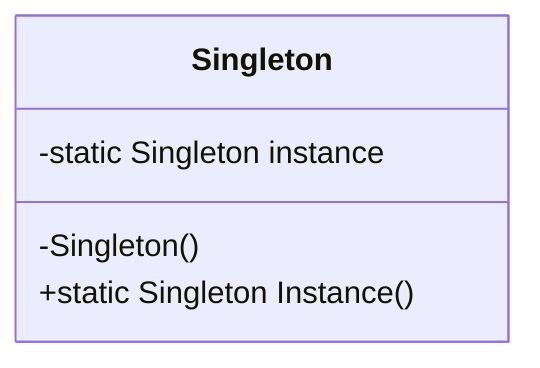
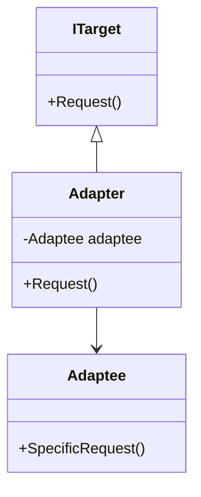
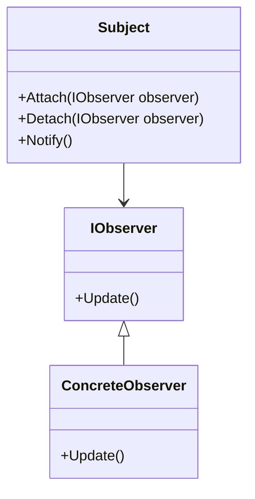

## 19.1 Recap of Key Concepts

As we reach the conclusion of our comprehensive guide on mastering C# design patterns, it's crucial to reflect on the essential takeaways that have been covered throughout this journey. This recap will serve as a consolidation of the knowledge acquired, emphasizing the importance of design patterns, how they solve common problems, and encouraging continuous improvement in your software development practices.

### Summarizing Essential Takeaways

#### The Importance of Design Patterns

Design patterns are fundamental building blocks in software engineering, providing reusable solutions to common problems. They are not just about code reuse but also about leveraging proven strategies to enhance software design, making it more robust, scalable, and maintainable.

- **Standardization and Communication**: Design patterns offer a common language for developers to communicate complex ideas succinctly. This standardization facilitates better collaboration among team members and across different teams within an organization.

- **Efficiency and Productivity**: By using design patterns, developers can avoid reinventing the wheel, saving time and effort. Patterns provide a template for solving problems, allowing developers to focus on more critical aspects of the application.

- **Scalability and Flexibility**: Patterns help in designing systems that can scale efficiently. They provide flexibility in adapting to changing requirements without significant rework.

- **Maintainability and Extensibility**: Well-implemented design patterns lead to code that is easier to maintain and extend. This is particularly important in large-scale enterprise applications where requirements evolve over time.

#### How Patterns Solve Common Problems

Design patterns address recurring design challenges by providing a structured approach to problem-solving. Let's revisit some key patterns and their roles in solving common issues:

- **Creational Patterns**: These patterns deal with object creation mechanisms, optimizing the instantiation process. For instance, the Singleton pattern ensures a class has only one instance, providing a global point of access.

  ```csharp
  public sealed class Singleton
  {
      private static readonly Lazy<Singleton> instance = new Lazy<Singleton>(() => new Singleton());

      private Singleton() { }

      public static Singleton Instance => instance.Value;
  }
  ```

  *Key Takeaway*: Use creational patterns to manage object creation efficiently, ensuring resource optimization and consistent object management.

- **Structural Patterns**: These patterns focus on composing classes and objects to form larger structures. The Adapter pattern, for example, allows incompatible interfaces to work together seamlessly.

  ```csharp
  public interface ITarget
  {
      void Request();
  }

  public class Adaptee
  {
      public void SpecificRequest()
      {
          Console.WriteLine("Called SpecificRequest()");
      }
  }

  public class Adapter : ITarget
  {
      private readonly Adaptee _adaptee;

      public Adapter(Adaptee adaptee)
      {
          _adaptee = adaptee;
      }

      public void Request()
      {
          _adaptee.SpecificRequest();
      }
  }
  ```

  *Key Takeaway*: Structural patterns are essential for creating flexible and efficient object structures, promoting code reusability and system scalability.

- **Behavioral Patterns**: These patterns are concerned with object collaboration and responsibility delegation. The Observer pattern, for example, defines a one-to-many dependency between objects, ensuring that when one object changes state, all its dependents are notified.

  ```csharp
  public class Subject
  {
      private readonly List<IObserver> _observers = new List<IObserver>();

      public void Attach(IObserver observer)
      {
          _observers.Add(observer);
      }

      public void Detach(IObserver observer)
      {
          _observers.Remove(observer);
      }

      public void Notify()
      {
          foreach (var observer in _observers)
          {
              observer.Update();
          }
      }
  }

  public interface IObserver
  {
      void Update();
  }
  ```

  *Key Takeaway*: Behavioral patterns enhance communication between objects, ensuring a well-coordinated system with clearly defined responsibilities.

### Reflecting on Learning Journey

#### Personal Growth and Understanding

Embarking on the journey of mastering C# design patterns is not just about acquiring technical skills but also about personal growth. Understanding design patterns enhances your problem-solving abilities, enabling you to approach complex challenges with confidence and creativity.

- **Critical Thinking**: Design patterns encourage you to think critically about the architecture and design of your applications. They prompt you to consider various design alternatives and choose the most appropriate solution for a given context.

- **Adaptability**: As you become proficient in using design patterns, you develop the ability to adapt to new technologies and methodologies. This adaptability is crucial in the ever-evolving field of software development.

- **Collaboration and Communication**: Mastering design patterns improves your ability to collaborate with others. You can articulate your design choices clearly and understand the perspectives of your peers, leading to more effective teamwork.

#### Encouraging Continuous Improvement

The journey of mastering design patterns is ongoing. As you continue to develop your skills, keep the following points in mind:

- **Stay Updated**: The field of software development is dynamic, with new patterns and practices emerging regularly. Stay informed about the latest trends and advancements to keep your skills relevant.

- **Experiment and Innovate**: Don't be afraid to experiment with different patterns and approaches. Innovation often arises from exploring new ideas and challenging conventional wisdom.

- **Seek Feedback**: Engage with your peers and seek feedback on your design choices. Constructive criticism can provide valuable insights and help you refine your skills.

- **Contribute to the Community**: Share your knowledge and experiences with others. Contributing to open-source projects, writing articles, or participating in forums can enhance your understanding and benefit the broader community.

### Visualizing Design Patterns

To further solidify your understanding, let's visualize some of the key design patterns using diagrams. These visual representations can help you grasp the relationships and interactions between different components.

#### Singleton Pattern Diagram



*Description*: This diagram illustrates the Singleton pattern, highlighting the static instance and the private constructor that ensures only one instance is created.

#### Adapter Pattern Diagram



*Description*: The Adapter pattern diagram shows how the Adapter class implements the ITarget interface and interacts with the Adaptee class to adapt its interface.

#### Observer Pattern Diagram



*Description*: This diagram depicts the Observer pattern, illustrating the relationship between the Subject and its Observers, and how notifications are managed.

### Knowledge Check

To reinforce your understanding, let's pose some questions and challenges:

- **What are the key differences between the Singleton and Multiton patterns?**
- **How does the Adapter pattern differ from the Decorator pattern?**
- **In what scenarios would you prefer the Observer pattern over the Mediator pattern?**

### Try It Yourself

Encourage experimentation by modifying the provided code examples. For instance, try implementing a thread-safe Singleton pattern or extending the Adapter pattern to support multiple adaptees.

### Embrace the Journey

Remember, mastering design patterns is a journey, not a destination. As you continue to explore and apply these patterns, you'll gain deeper insights and develop more sophisticated solutions. Keep experimenting, stay curious, and enjoy the journey!

### References and Links

For further reading and exploration, consider the following resources:

- [Design Patterns: Elements of Reusable Object-Oriented Software](https://en.wikipedia.org/wiki/Design_Patterns) by Erich Gamma, Richard Helm, Ralph Johnson, and John Vlissides.
- [Microsoft's C# Documentation](https://docs.microsoft.com/en-us/dotnet/csharp/)
- [Refactoring.Guru](https://refactoring.guru/design-patterns)

## Quiz Time!



### What is the primary benefit of using design patterns in software development?

- [x] They provide reusable solutions to common problems.
- [ ] They increase the complexity of the code.
- [ ] They eliminate the need for documentation.
- [ ] They make code harder to understand.

> **Explanation:** Design patterns offer reusable solutions to common problems, enhancing code maintainability and scalability.

### Which pattern ensures a class has only one instance?

- [x] Singleton
- [ ] Factory Method
- [ ] Observer
- [ ] Adapter

> **Explanation:** The Singleton pattern ensures a class has only one instance and provides a global point of access to it.

### How do structural patterns help in software design?

- [x] They focus on composing classes and objects to form larger structures.
- [ ] They deal with object creation mechanisms.
- [ ] They define a one-to-many dependency between objects.
- [ ] They manage object collaboration and responsibility delegation.

> **Explanation:** Structural patterns focus on composing classes and objects to form larger structures, promoting code reusability and system scalability.

### What is the role of the Observer pattern?

- [x] It defines a one-to-many dependency between objects.
- [ ] It ensures a class has only one instance.
- [ ] It adapts incompatible interfaces to work together.
- [ ] It manages object creation mechanisms.

> **Explanation:** The Observer pattern defines a one-to-many dependency between objects, ensuring that when one object changes state, all its dependents are notified.

### Which pattern is used to adapt incompatible interfaces?

- [x] Adapter
- [ ] Singleton
- [ ] Observer
- [ ] Factory Method

> **Explanation:** The Adapter pattern allows incompatible interfaces to work together seamlessly.

### What is a key takeaway of creational patterns?

- [x] They manage object creation efficiently.
- [ ] They focus on composing classes and objects.
- [ ] They define a one-to-many dependency between objects.
- [ ] They manage object collaboration and responsibility delegation.

> **Explanation:** Creational patterns manage object creation efficiently, ensuring resource optimization and consistent object management.

### How does the Adapter pattern differ from the Decorator pattern?

- [x] Adapter changes the interface of an existing object, while Decorator adds behavior.
- [ ] Adapter adds behavior to an object, while Decorator changes the interface.
- [ ] Both patterns serve the same purpose.
- [ ] Neither pattern is used in modern software design.

> **Explanation:** The Adapter pattern changes the interface of an existing object, while the Decorator pattern adds behavior to an object.

### What is a benefit of using the Singleton pattern?

- [x] It provides a global point of access to a single instance.
- [ ] It allows multiple instances of a class.
- [ ] It adapts incompatible interfaces.
- [ ] It defines a one-to-many dependency between objects.

> **Explanation:** The Singleton pattern provides a global point of access to a single instance, ensuring only one instance of a class exists.

### What is the focus of behavioral patterns?

- [x] They manage object collaboration and responsibility delegation.
- [ ] They focus on composing classes and objects.
- [ ] They deal with object creation mechanisms.
- [ ] They ensure a class has only one instance.

> **Explanation:** Behavioral patterns manage object collaboration and responsibility delegation, ensuring a well-coordinated system with clearly defined responsibilities.

### True or False: Design patterns eliminate the need for documentation.

- [ ] True
- [x] False

> **Explanation:** Design patterns do not eliminate the need for documentation; they provide a common language for developers to communicate complex ideas succinctly.


