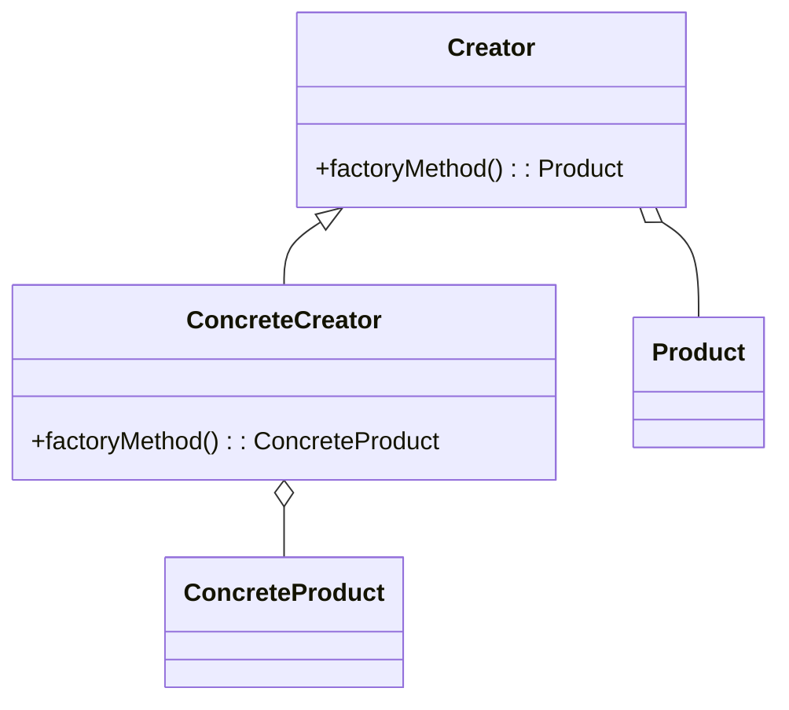
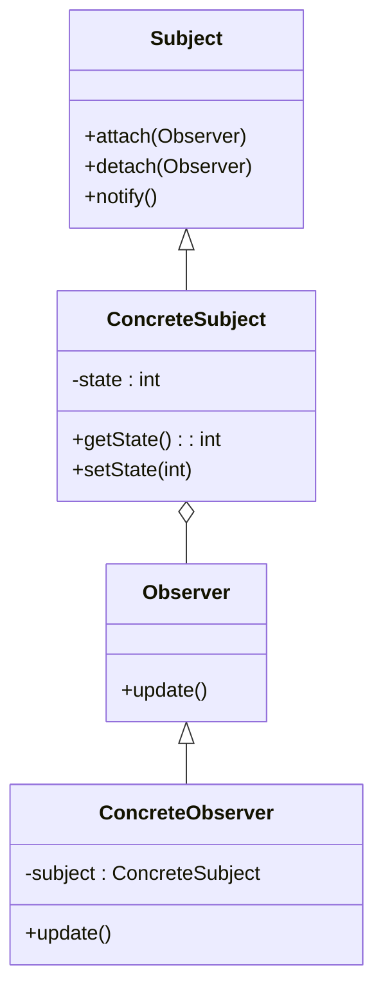

## 19.2 Continuing Education and Resources

As we conclude our comprehensive guide on mastering C# design patterns, it's essential to recognize that learning is a continuous journey. The field of software engineering is ever-evolving, and staying updated with the latest trends, tools, and techniques is crucial for maintaining expertise. In this section, we will explore various resources that can aid in your ongoing education and professional development. From books and articles to online courses and tutorials, these resources will help you deepen your understanding of C# design patterns and advance your skills as a software engineer or enterprise architect.

### Recommended Books and Articles

Books and articles are invaluable resources for gaining in-depth knowledge and insights from industry experts. Here, we provide a curated list of classic and contemporary works that are essential reading for anyone looking to master C# design patterns.

#### Classic Works

1. **"Design Patterns: Elements of Reusable Object-Oriented Software" by Erich Gamma, Richard Helm, Ralph Johnson, and John Vlissides (Gang of Four)**
   - This seminal book introduced the concept of design patterns to the software engineering community. It provides a catalog of 23 classic design patterns, complete with examples and use cases. Although not specific to C#, the principles and patterns discussed are universally applicable.

2. **"Patterns of Enterprise Application Architecture" by Martin Fowler**
   - Martin Fowler's book is a must-read for understanding enterprise-level architecture patterns. It covers a wide range of patterns that are crucial for building scalable and maintainable applications.

3. **"Refactoring: Improving the Design of Existing Code" by Martin Fowler**
   - This book focuses on the practice of refactoring, which is essential for maintaining clean and efficient code. It provides a catalog of refactoring techniques, many of which are applicable when working with design patterns.

#### Contemporary Works

1. **"C# 9.0 in a Nutshell: The Definitive Reference" by Joseph Albahari and Ben Albahari**
   - This comprehensive guide covers the latest features of C# 9.0, including records, pattern matching, and more. It's an excellent resource for staying updated with the latest language features that can enhance your use of design patterns.

2. **"Pro C# 9 with .NET 5: Foundational Principles and Practices in Programming" by Andrew Troelsen and Philip Japikse**
   - This book provides an in-depth look at C# 9 and .NET 5, with a focus on best practices and design patterns. It's ideal for developers looking to build robust and scalable applications.

3. **"Adaptive Code: Agile coding with design patterns and SOLID principles" by Gary McLean Hall**
   - This book emphasizes the importance of writing adaptive code that can easily accommodate changes. It covers design patterns, SOLID principles, and agile practices, making it a valuable resource for modern software development.

#### Articles and Papers

1. **"The Pragmatic Programmer: Your Journey to Mastery" by Andrew Hunt and David Thomas**
   - Although not a traditional article, this book is a collection of practical advice and insights that are highly relevant to mastering design patterns and software development.

2. **"Microservices Patterns: With examples in Java" by Chris Richardson**
   - While focused on Java, this book provides valuable insights into microservices architecture patterns that can be applied in C# environments.

3. **"The Art of Unit Testing: With Examples in C#" by Roy Osherove**
   - This book delves into unit testing practices, which are crucial for implementing and maintaining design patterns effectively.

### Online Courses and Tutorials

Online courses and tutorials offer a flexible and interactive way to enhance your skills. Here, we highlight some of the best platforms and courses for learning C# design patterns and related topics.

#### Platforms Offering Advanced Learning

1. **Pluralsight**
   - Pluralsight offers a wide range of courses on C# and design patterns, taught by industry experts. Courses such as "Design Patterns in C#" and "Advanced C# Programming" are highly recommended.

2. **Udemy**
   - Udemy provides numerous courses on C# and software design patterns. Look for courses with high ratings and reviews, such as "C# Design Patterns: The Complete Guide" and "Mastering C# and .NET Framework."

3. **Coursera**
   - Coursera partners with top universities and organizations to offer courses on software engineering and design patterns. Courses like "Object-Oriented Design" and "Software Design and Architecture" are valuable for deepening your understanding.

4. **edX**
   - edX offers courses from leading institutions, including "Software Construction: Object-Oriented Design" and "Software Architecture & Design."

#### Recommended Courses and Tutorials

1. **"C# Design Patterns: A Step-by-Step Guide" on Udemy**
   - This course provides a comprehensive overview of design patterns in C#, with practical examples and exercises to reinforce learning.

2. **"Advanced C# Programming" on Pluralsight**
   - This course covers advanced C# topics, including design patterns, LINQ, and asynchronous programming, making it ideal for experienced developers.

3. **"Software Design and Architecture" on Coursera**
   - Offered by the University of Alberta, this course explores software design principles and patterns, with a focus on building scalable and maintainable systems.

4. **"Object-Oriented Design" on edX**
   - This course, offered by the University of British Columbia, covers object-oriented design principles and patterns, providing a solid foundation for mastering design patterns in C#.

### Try It Yourself: Experiment with Code

To truly master design patterns, it's essential to practice and experiment with code. Here are some exercises and challenges to help you apply what you've learned:

1. **Implement a Singleton Pattern**
   - Create a simple logging system using the Singleton pattern. Ensure that only one instance of the logger is created and used throughout the application.

2. **Build a Factory Method Pattern**
   - Develop a shape creation system using the Factory Method pattern. Allow users to create different shapes (e.g., circle, square, triangle) without specifying the exact class of the object.

3. **Apply the Observer Pattern**
   - Implement a weather monitoring system using the Observer pattern. Allow multiple observers to receive updates when the weather changes.

4. **Experiment with the Strategy Pattern**
   - Create a payment processing system using the Strategy pattern. Allow users to choose different payment methods (e.g., credit card, PayPal, bank transfer) at runtime.

### Visualizing Design Patterns

To enhance your understanding of design patterns, it's helpful to visualize their structure and interactions. Below are some diagrams created using Mermaid.js to illustrate common design patterns.

#### Singleton Pattern

```mermaid
classDiagram
    class Singleton {
        -instance : Singleton
        +getInstance() : Singleton
    }
    Singleton : -Singleton()
    Singleton : +getInstance() : Singleton
```

*Description:* The Singleton pattern ensures that a class has only one instance and provides a global point of access to it.

#### Factory Method Pattern



*Description:* The Factory Method pattern defines an interface for creating an object but lets subclasses alter the type of objects that will be created.

#### Observer Pattern



*Description:* The Observer pattern defines a one-to-many dependency between objects so that when one object changes state, all its dependents are notified and updated automatically.

### References and Links

To further your learning, consider exploring the following reputable external resources:

- [Microsoft Learn: C# Guide](https://learn.microsoft.com/en-us/dotnet/csharp/)
  - Microsoft's official documentation provides comprehensive guides and tutorials on C# programming.

- [Stack Overflow](https://stackoverflow.com/)
  - A community-driven platform where you can ask questions and find answers related to C# and design patterns.

- [GitHub](https://github.com/)
  - Explore open-source projects and repositories to see design patterns implemented in real-world applications.

- [Medium: Software Engineering](https://medium.com/software-engineering)
  - A platform where industry experts share articles and insights on software engineering and design patterns.

### Knowledge Check

To reinforce your understanding of the material covered in this section, consider the following questions and challenges:

1. **What are the key benefits of using design patterns in software development?**
   - Reflect on how design patterns can improve code maintainability, scalability, and readability.

2. **How can online courses complement your learning from books and articles?**
   - Consider the advantages of interactive learning and hands-on practice.

3. **Why is it important to stay updated with the latest C# language features?**
   - Think about how new features can enhance your use of design patterns and improve your code.

4. **What are some common pitfalls to avoid when implementing design patterns?**
   - Identify potential challenges and how to overcome them.

### Embrace the Journey

Remember, this is just the beginning of your journey in mastering C# design patterns. As you progress, you'll build more complex and scalable applications. Keep experimenting, stay curious, and enjoy the journey! The resources and exercises provided here are just a starting point. Continue to explore, learn, and grow as a software engineer.

## Quiz Time!



### Which book introduced the concept of design patterns to the software engineering community?

- [x] "Design Patterns: Elements of Reusable Object-Oriented Software" by Erich Gamma, Richard Helm, Ralph Johnson, and John Vlissides
- [ ] "Patterns of Enterprise Application Architecture" by Martin Fowler
- [ ] "Refactoring: Improving the Design of Existing Code" by Martin Fowler
- [ ] "C# 9.0 in a Nutshell: The Definitive Reference" by Joseph Albahari and Ben Albahari

> **Explanation:** The book "Design Patterns: Elements of Reusable Object-Oriented Software" by the Gang of Four introduced the concept of design patterns.

### What is the primary focus of the book "Refactoring: Improving the Design of Existing Code"?

- [x] Refactoring techniques
- [ ] Design patterns
- [ ] Agile practices
- [ ] Microservices architecture

> **Explanation:** The book focuses on refactoring techniques to improve the design of existing code.

### Which online platform offers courses such as "Design Patterns in C#" and "Advanced C# Programming"?

- [x] Pluralsight
- [ ] Udemy
- [ ] Coursera
- [ ] edX

> **Explanation:** Pluralsight offers a wide range of courses on C# and design patterns.

### What is the key benefit of using the Singleton pattern?

- [x] Ensures a class has only one instance
- [ ] Allows multiple instances of a class
- [ ] Facilitates communication between objects
- [ ] Provides a way to create objects without specifying their class

> **Explanation:** The Singleton pattern ensures that a class has only one instance and provides a global point of access to it.

### Which pattern defines an interface for creating an object but lets subclasses alter the type of objects that will be created?

- [x] Factory Method Pattern
- [ ] Singleton Pattern
- [ ] Observer Pattern
- [ ] Strategy Pattern

> **Explanation:** The Factory Method pattern defines an interface for creating an object but lets subclasses alter the type of objects that will be created.

### What is the primary purpose of the Observer pattern?

- [x] Defines a one-to-many dependency between objects
- [ ] Ensures a class has only one instance
- [ ] Provides a way to create objects without specifying their class
- [ ] Facilitates communication between objects

> **Explanation:** The Observer pattern defines a one-to-many dependency between objects so that when one object changes state, all its dependents are notified and updated automatically.

### Which book is recommended for understanding enterprise-level architecture patterns?

- [x] "Patterns of Enterprise Application Architecture" by Martin Fowler
- [ ] "Design Patterns: Elements of Reusable Object-Oriented Software" by Erich Gamma, Richard Helm, Ralph Johnson, and John Vlissides
- [ ] "Refactoring: Improving the Design of Existing Code" by Martin Fowler
- [ ] "C# 9.0 in a Nutshell: The Definitive Reference" by Joseph Albahari and Ben Albahari

> **Explanation:** "Patterns of Enterprise Application Architecture" by Martin Fowler is recommended for understanding enterprise-level architecture patterns.

### Which online course platform partners with top universities and organizations to offer courses on software engineering and design patterns?

- [x] Coursera
- [ ] Pluralsight
- [ ] Udemy
- [ ] edX

> **Explanation:** Coursera partners with top universities and organizations to offer courses on software engineering and design patterns.

### What is the focus of the book "Adaptive Code: Agile coding with design patterns and SOLID principles"?

- [x] Writing adaptive code that can easily accommodate changes
- [ ] Refactoring techniques
- [ ] Microservices architecture
- [ ] Asynchronous programming

> **Explanation:** The book emphasizes writing adaptive code that can easily accommodate changes, covering design patterns, SOLID principles, and agile practices.

### True or False: "The Art of Unit Testing: With Examples in C#" is a book that delves into unit testing practices.

- [x] True
- [ ] False

> **Explanation:** True. The book delves into unit testing practices, which are crucial for implementing and maintaining design patterns effectively.


