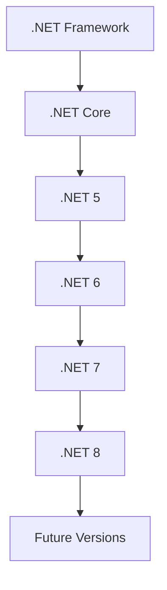
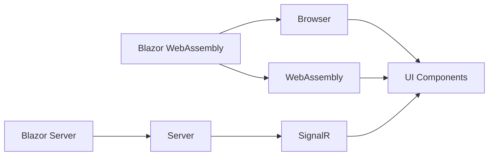

## 19.4 The Future of C# and .NET

As we stand on the brink of a new era in software development, the future of C# and .NET is both exciting and promising. With rapid advancements in technology, the .NET ecosystem continues to evolve, offering developers a robust platform for building scalable, maintainable, and high-performance applications. In this section, we will explore emerging trends and technologies, such as Blazor, .NET MAUI, and cloud computing, and discuss how open-source developments are shaping the future of C#. We will also provide guidance on how to prepare for tomorrow's challenges and opportunities, ensuring you stay ahead in the industry.

### Emerging Trends and Technologies

#### Blazor: Revolutionizing Web Development

Blazor is a cutting-edge framework that allows developers to build interactive web applications using C# instead of JavaScript. This revolutionary approach leverages WebAssembly, enabling C# code to run directly in the browser. Blazor offers two hosting models: Blazor WebAssembly and Blazor Server, each with its unique advantages.

- **Blazor WebAssembly**: This model allows for client-side execution, providing a rich, interactive user experience. It is ideal for applications that require offline capabilities and minimal server interaction.
  
- **Blazor Server**: In this model, the application runs on the server, and UI updates are sent to the client over a SignalR connection. This approach is suitable for applications that require real-time data updates and server-side processing.

Blazor's ability to unify client and server-side development using a single language is a game-changer, reducing the complexity of web development and enhancing productivity.

```csharp
@page "/counter"

<h1>Counter</h1>

<p>Current count: @currentCount</p>

<button class="btn btn-primary" @onclick="IncrementCount">Click me</button>

@code {
    private int currentCount = 0;

    private void IncrementCount()
    {
        currentCount++;
    }
}
```

> **Try It Yourself**: Modify the `IncrementCount` method to increment the count by a random number between 1 and 10 each time the button is clicked.

#### .NET MAUI: The Future of Cross-Platform Development

.NET Multi-platform App UI (.NET MAUI) is the evolution of Xamarin.Forms, providing a single framework for building native applications across multiple platforms, including Android, iOS, macOS, and Windows. With .NET MAUI, developers can write once and deploy everywhere, streamlining the development process and reducing maintenance overhead.

- **Unified Project Structure**: .NET MAUI introduces a single project structure, simplifying the management of resources and dependencies across platforms.
  
- **Native Performance**: By leveraging platform-specific APIs and optimizations, .NET MAUI ensures native performance and a seamless user experience.

- **Hot Reload**: This feature allows developers to make changes to their code and see the results instantly, significantly speeding up the development cycle.

```csharp
using Microsoft.Maui.Controls;

namespace MyMauiApp
{
    public class MainPage : ContentPage
    {
        public MainPage()
        {
            Content = new StackLayout
            {
                Children = {
                    new Label { Text = "Welcome to .NET MAUI!" }
                }
            };
        }
    }
}
```

> **Try It Yourself**: Add a button to the `MainPage` that changes the text of the label when clicked.

#### Cloud Computing: Expanding Horizons

Cloud computing continues to transform the way applications are developed, deployed, and scaled. With the rise of cloud-native technologies, such as containers and serverless computing, .NET developers have access to a plethora of tools and services that enhance application performance and scalability.

- **Azure Functions**: This serverless compute service allows developers to run event-driven code without managing infrastructure. It is ideal for building microservices and handling asynchronous tasks.

- **Azure Kubernetes Service (AKS)**: AKS simplifies the deployment and management of containerized applications, providing a scalable and resilient environment for .NET applications.

- **Azure DevOps**: This comprehensive suite of development tools supports continuous integration and delivery (CI/CD), enabling teams to automate the build, test, and deployment processes.

```csharp
public static class Function
{
    [FunctionName("HttpTriggerCSharp")]
    public static async Task<IActionResult> Run(
        [HttpTrigger(AuthorizationLevel.Function, "get", "post", Route = null)] HttpRequest req,
        ILogger log)
    {
        log.LogInformation("C# HTTP trigger function processed a request.");

        string name = req.Query["name"];

        return name != null
            ? (ActionResult)new OkObjectResult($"Hello, {name}")
            : new BadRequestObjectResult("Please pass a name on the query string or in the request body");
    }
}
```

> **Try It Yourself**: Deploy this Azure Function and test it by sending HTTP requests with different query parameters.

#### Impact of Open-Source Developments

The open-source movement has had a profound impact on the .NET ecosystem. With the transition of .NET to an open-source platform, developers have access to a wealth of community-driven libraries, tools, and frameworks that enhance productivity and innovation.

- **Community Contributions**: The open-source nature of .NET encourages community contributions, leading to rapid advancements and a diverse range of solutions for common development challenges.

- **Cross-Platform Compatibility**: Open-source .NET Core has paved the way for cross-platform development, allowing developers to build and run applications on Windows, macOS, and Linux.

- **Innovative Tools and Libraries**: The open-source community has developed a plethora of tools and libraries, such as Serilog for logging and AutoMapper for object mapping, that simplify complex tasks and improve code quality.

### Preparing for Tomorrow

#### Staying Ahead in the Industry

To remain competitive in the ever-evolving software development landscape, it is crucial to stay informed about the latest trends and technologies. Here are some strategies to help you stay ahead:

- **Continuous Learning**: Engage in continuous learning by attending conferences, participating in online courses, and reading industry publications. Platforms like Pluralsight and Coursera offer a wide range of courses on C# and .NET.

- **Networking**: Join developer communities and forums, such as Stack Overflow and GitHub, to connect with other professionals, share knowledge, and collaborate on projects.

- **Experimentation**: Experiment with new technologies and frameworks in personal projects to gain hands-on experience and deepen your understanding.

#### Anticipating New Challenges and Opportunities

As technology continues to advance, new challenges and opportunities will arise. Here are some areas to focus on:

- **Security**: With the increasing prevalence of cyber threats, security will remain a top priority. Stay informed about the latest security practices and tools to protect your applications and data.

- **Scalability**: As applications grow in complexity and user base, scalability becomes a critical concern. Explore cloud-native architectures and microservices to build scalable solutions.

- **User Experience**: The demand for intuitive and responsive user interfaces will continue to rise. Invest in learning about UX design principles and tools to create engaging user experiences.

- **AI and Machine Learning**: The integration of AI and machine learning into applications is becoming increasingly common. Explore frameworks like ML.NET to incorporate intelligent features into your .NET applications.

### Visualizing the Future of C# and .NET

To better understand the future landscape of C# and .NET, let's visualize some key concepts and trends using Hugo-compatible Mermaid.js diagrams.

#### Visualizing the Evolution of .NET



> **Diagram Description**: This diagram illustrates the evolution of the .NET platform from the traditional .NET Framework to the unified .NET 5 and beyond, highlighting the continuous advancements and improvements.

#### Visualizing Blazor Architecture



> **Diagram Description**: This diagram depicts the architecture of Blazor, showcasing the two hosting models: Blazor WebAssembly and Blazor Server, and their interaction with the browser and server components.

### References and Links

- [Microsoft Learn: Blazor](https://learn.microsoft.com/en-us/aspnet/core/blazor/?view=aspnetcore-6.0)
- [Microsoft Learn: .NET MAUI](https://learn.microsoft.com/en-us/dotnet/maui/what-is-maui)
- [Azure Functions Documentation](https://docs.microsoft.com/en-us/azure/azure-functions/)
- [GitHub: .NET Core](https://github.com/dotnet/core)

### Knowledge Check

- **Question**: What are the two hosting models of Blazor, and how do they differ?
- **Exercise**: Create a simple .NET MAUI application that displays a list of items and allows users to add new items.

### Embrace the Journey

As we conclude this exploration of the future of C# and .NET, remember that this is just the beginning. The world of software development is ever-changing, and staying curious and adaptable is key to success. Keep experimenting, stay informed, and enjoy the journey as you continue to build innovative and impactful applications.

## Quiz Time!



### What is Blazor primarily used for?

- [x] Building interactive web applications using C#
- [ ] Creating desktop applications
- [ ] Developing mobile apps
- [ ] Designing databases

> **Explanation:** Blazor is a framework for building interactive web applications using C# instead of JavaScript.

### Which of the following is a feature of .NET MAUI?

- [x] Unified project structure
- [ ] Server-side rendering
- [ ] Client-side scripting
- [ ] Database management

> **Explanation:** .NET MAUI introduces a unified project structure for managing resources and dependencies across platforms.

### What is the primary advantage of using Azure Functions?

- [x] Running event-driven code without managing infrastructure
- [ ] Creating complex user interfaces
- [ ] Developing machine learning models
- [ ] Building desktop applications

> **Explanation:** Azure Functions is a serverless compute service that allows developers to run event-driven code without managing infrastructure.

### How does Blazor WebAssembly differ from Blazor Server?

- [x] Blazor WebAssembly runs client-side, while Blazor Server runs on the server
- [ ] Blazor WebAssembly requires a server connection, while Blazor Server does not
- [ ] Blazor WebAssembly is used for desktop apps, while Blazor Server is for web apps
- [ ] Blazor WebAssembly supports real-time data updates, while Blazor Server does not

> **Explanation:** Blazor WebAssembly runs client-side, providing a rich user experience, while Blazor Server runs on the server and communicates with the client over SignalR.

### What is the impact of open-source developments on the .NET ecosystem?

- [x] Encourages community contributions and innovation
- [ ] Limits cross-platform compatibility
- [ ] Reduces the number of available libraries
- [ ] Increases the complexity of development

> **Explanation:** The open-source nature of .NET encourages community contributions, leading to innovation and a diverse range of solutions.

### What is a key benefit of using .NET MAUI for cross-platform development?

- [x] Write once, deploy everywhere
- [ ] Requires separate codebases for each platform
- [ ] Limited to Windows applications
- [ ] Only supports mobile devices

> **Explanation:** .NET MAUI allows developers to write code once and deploy it across multiple platforms, streamlining the development process.

### Which cloud service is ideal for building microservices and handling asynchronous tasks?

- [x] Azure Functions
- [ ] Azure DevOps
- [ ] Azure Kubernetes Service
- [ ] Azure Blob Storage

> **Explanation:** Azure Functions is a serverless compute service ideal for building microservices and handling asynchronous tasks.

### What is the significance of the open-source transition of .NET?

- [x] Enables cross-platform development and community-driven innovation
- [ ] Limits the use of third-party libraries
- [ ] Increases the cost of development
- [ ] Reduces the availability of development tools

> **Explanation:** The open-source transition of .NET enables cross-platform development and encourages community-driven innovation.

### What is a primary focus for future .NET applications?

- [x] Security and scalability
- [ ] Reducing user experience
- [ ] Limiting cloud integration
- [ ] Decreasing application performance

> **Explanation:** Security and scalability are critical concerns for future .NET applications as they grow in complexity and user base.

### True or False: .NET MAUI is the evolution of Xamarin.Forms.

- [x] True
- [ ] False

> **Explanation:** .NET MAUI is indeed the evolution of Xamarin.Forms, providing a single framework for building native applications across multiple platforms.


