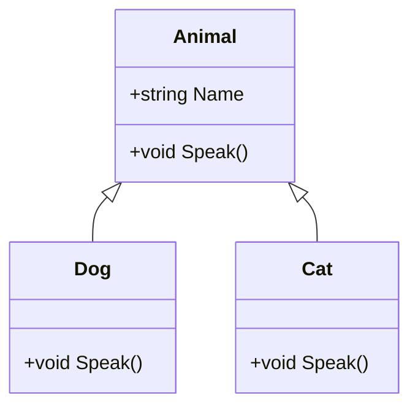

## 2.1 Object-Oriented Programming (OOP) Fundamentals

Object-Oriented Programming (OOP) is a programming paradigm that uses "objects" to design applications and computer programs. It utilizes several core principles: encapsulation, inheritance, polymorphism, and abstraction. These principles help in creating modular, reusable, and scalable code. In this section, we will delve into these fundamental concepts and demonstrate how they are implemented in C#.

### Encapsulation

Encapsulation is the bundling of data and methods that operate on that data within a single unit, known as a class. It restricts direct access to some of an object's components, which can prevent the accidental modification of data. Encapsulation is a means of restricting access to certain components and is a fundamental aspect of OOP.

#### Key Concepts of Encapsulation

- **Access Modifiers**: C# provides several access modifiers, such as `public`, `private`, `protected`, and `internal`, to control the visibility of class members.
- **Properties**: Properties in C# are a way to encapsulate fields and provide controlled access to them.

#### Example of Encapsulation in C#

```csharp
public class BankAccount
{
    private decimal balance; // Private field

    // Public property with a private setter
    public decimal Balance
    {
        get { return balance; }
        private set { balance = value; }
    }

    public BankAccount(decimal initialBalance)
    {
        Balance = initialBalance;
    }

    public void Deposit(decimal amount)
    {
        if (amount > 0)
        {
            Balance += amount;
        }
    }

    public bool Withdraw(decimal amount)
    {
        if (amount > 0 && amount <= Balance)
        {
            Balance -= amount;
            return true;
        }
        return false;
    }
}
```

In this example, the `BankAccount` class encapsulates the `balance` field, providing controlled access through the `Balance` property and methods like `Deposit` and `Withdraw`.

#### Try It Yourself

Experiment with the `BankAccount` class by adding methods to transfer funds between accounts or to calculate interest. Observe how encapsulation helps maintain the integrity of the balance data.

### Inheritance

Inheritance is a mechanism where a new class inherits properties and behavior (methods) from an existing class. This promotes code reusability and establishes a natural hierarchy between classes.

#### Key Concepts of Inheritance

- **Base Class**: The class whose properties and methods are inherited.
- **Derived Class**: The class that inherits from the base class.
- **`virtual` and `override` Keywords**: Used to modify methods in the base class and override them in the derived class.

#### Example of Inheritance in C#

```csharp
public class Animal
{
    public string Name { get; set; }

    public virtual void Speak()
    {
        Console.WriteLine("The animal makes a sound.");
    }
}

public class Dog : Animal
{
    public override void Speak()
    {
        Console.WriteLine("The dog barks.");
    }
}

public class Cat : Animal
{
    public override void Speak()
    {
        Console.WriteLine("The cat meows.");
    }
}
```

In this example, `Dog` and `Cat` classes inherit from the `Animal` class and override the `Speak` method to provide specific behavior.

#### Try It Yourself

Create additional animal classes, such as `Bird` or `Fish`, and override the `Speak` method to reflect their unique sounds. Notice how inheritance simplifies the addition of new animal types.

### Polymorphism

Polymorphism allows objects to be treated as instances of their parent class. The most common use of polymorphism in OOP is when a parent class reference is used to refer to a child class object.

#### Key Concepts of Polymorphism

- **Method Overriding**: Allows a derived class to provide a specific implementation of a method that is already defined in its base class.
- **Interfaces**: Define a contract that implementing classes must adhere to, enabling polymorphic behavior.

#### Example of Polymorphism in C#

```csharp
public interface IShape
{
    double Area();
}

public class Circle : IShape
{
    public double Radius { get; set; }

    public double Area()
    {
        return Math.PI * Radius * Radius;
    }
}

public class Rectangle : IShape
{
    public double Width { get; set; }
    public double Height { get; set; }

    public double Area()
    {
        return Width * Height;
    }
}

public class ShapePrinter
{
    public void PrintArea(IShape shape)
    {
        Console.WriteLine($"The area is {shape.Area()}");
    }
}
```

In this example, `Circle` and `Rectangle` implement the `IShape` interface, allowing `ShapePrinter` to interact with any shape polymorphically.

#### Try It Yourself

Implement additional shapes, such as `Triangle` or `Square`, and use the `ShapePrinter` class to print their areas. Observe how polymorphism allows for flexible and reusable code.

### Abstraction

Abstraction is the concept of hiding the complex reality while exposing only the necessary parts. It helps in reducing programming complexity and effort.

#### Key Concepts of Abstraction

- **Abstract Classes**: Cannot be instantiated and are used to define a template for derived classes.
- **Abstract Methods**: Must be implemented by non-abstract derived classes.

#### Example of Abstraction in C#

```csharp
public abstract class Vehicle
{
    public abstract void Start();

    public void Stop()
    {
        Console.WriteLine("The vehicle stops.");
    }
}

public class Car : Vehicle
{
    public override void Start()
    {
        Console.WriteLine("The car starts with a key.");
    }
}

public class Motorcycle : Vehicle
{
    public override void Start()
    {
        Console.WriteLine("The motorcycle starts with a button.");
    }
}
```

In this example, `Vehicle` is an abstract class with an abstract method `Start`, which must be implemented by derived classes like `Car` and `Motorcycle`.

#### Try It Yourself

Create additional vehicle types, such as `Truck` or `Bicycle`, and implement the `Start` method. Notice how abstraction allows you to define a common interface for different vehicle types.

### Visualizing OOP Concepts

To better understand the relationships between classes and objects in OOP, let's visualize these concepts using a class diagram.



This diagram illustrates the inheritance relationship between the `Animal` class and its derived classes `Dog` and `Cat`.

### Knowledge Check

- **Encapsulation**: How does encapsulation help in maintaining data integrity?
- **Inheritance**: What are the benefits of using inheritance in OOP?
- **Polymorphism**: How does polymorphism enhance code flexibility?
- **Abstraction**: Why is abstraction important in reducing complexity?

### Summary

In this section, we explored the fundamental principles of Object-Oriented Programming in C#: encapsulation, inheritance, polymorphism, and abstraction. These principles are the building blocks of OOP and are essential for creating robust, maintainable, and scalable software. As you continue to develop your skills in C#, remember to apply these principles to design efficient and effective applications.

### Embrace the Journey

Remember, mastering OOP is a journey. As you progress, you'll encounter more complex scenarios and design patterns. Keep experimenting, stay curious, and enjoy the process of becoming a proficient C# developer.

## Quiz Time!



### What is encapsulation in OOP?

- [x] Bundling data and methods within a class
- [ ] Inheriting properties from a base class
- [ ] Allowing objects to be treated as instances of their parent class
- [ ] Hiding complex reality while exposing only necessary parts

> **Explanation:** Encapsulation is the bundling of data and methods that operate on that data within a single unit, known as a class.

### Which access modifier in C# allows a member to be accessed only within its own class?

- [x] private
- [ ] public
- [ ] protected
- [ ] internal

> **Explanation:** The `private` access modifier restricts access to the member within its own class.

### What is the primary benefit of inheritance in OOP?

- [x] Code reusability
- [ ] Data hiding
- [ ] Method overriding
- [ ] Interface implementation

> **Explanation:** Inheritance promotes code reusability by allowing new classes to inherit properties and methods from existing classes.

### How does polymorphism benefit software design?

- [x] It allows objects to be treated as instances of their parent class
- [ ] It hides the implementation details
- [ ] It provides a way to bundle data and methods
- [ ] It defines a template for derived classes

> **Explanation:** Polymorphism allows objects to be treated as instances of their parent class, enabling flexible and reusable code.

### What is an abstract class in C#?

- [x] A class that cannot be instantiated and is used to define a template for derived classes
- [ ] A class that can be instantiated and used directly
- [ ] A class that implements all its methods
- [ ] A class that hides its implementation details

> **Explanation:** An abstract class cannot be instantiated and is used to define a template for derived classes.

### Which keyword is used to override a method in a derived class?

- [x] override
- [ ] virtual
- [ ] abstract
- [ ] new

> **Explanation:** The `override` keyword is used to provide a specific implementation of a method in a derived class.

### What is the purpose of an interface in C#?

- [x] To define a contract that implementing classes must adhere to
- [ ] To provide a default implementation of methods
- [ ] To hide the implementation details
- [ ] To allow multiple inheritance

> **Explanation:** An interface defines a contract that implementing classes must adhere to, enabling polymorphic behavior.

### What is the role of the `virtual` keyword in C#?

- [x] It allows a method to be overridden in a derived class
- [ ] It hides the implementation details
- [ ] It bundles data and methods
- [ ] It defines a template for derived classes

> **Explanation:** The `virtual` keyword allows a method to be overridden in a derived class.

### Which principle of OOP helps in reducing programming complexity?

- [x] Abstraction
- [ ] Encapsulation
- [ ] Inheritance
- [ ] Polymorphism

> **Explanation:** Abstraction helps in reducing programming complexity by hiding complex reality while exposing only necessary parts.

### True or False: An abstract method must be implemented by non-abstract derived classes.

- [x] True
- [ ] False

> **Explanation:** An abstract method must be implemented by non-abstract derived classes, as it provides no implementation in the abstract class.




