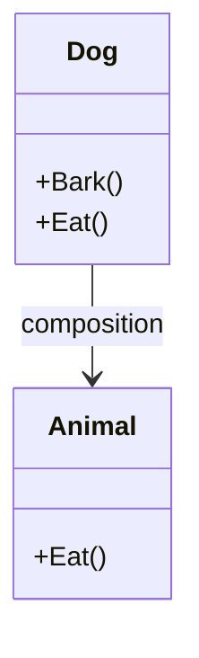

## 2.2 Composition Over Inheritance

In the realm of software engineering, particularly in object-oriented programming (OOP), the debate between composition and inheritance is a longstanding one. Both are fundamental concepts used to build complex systems, but they serve different purposes and come with their own sets of advantages and challenges. In this section, we will delve into the principle of "Composition Over Inheritance," a design guideline that suggests favoring composition over inheritance when designing systems in C#. We will explore why this principle is often preferred, how it can be implemented using interfaces and delegates, and provide practical examples to illustrate its application.

### Understanding Composition and Inheritance

Before we dive into the advantages of composition over inheritance, let's clarify what these terms mean in the context of object-oriented design.

**Inheritance** is a mechanism where a new class, known as a subclass, is derived from an existing class, called a superclass. The subclass inherits attributes and behaviors (methods) from the superclass, allowing for code reuse and the creation of a hierarchical class structure.

**Composition**, on the other hand, involves building complex types by combining objects. Instead of inheriting from a base class, a class can contain instances of other classes, thereby delegating responsibilities to these contained objects.

#### Example of Inheritance

Consider a simple example where we have a base class `Animal` and a derived class `Dog`:

```csharp
public class Animal
{
    public void Eat()
    {
        Console.WriteLine("Eating...");
    }
}

public class Dog : Animal
{
    public void Bark()
    {
        Console.WriteLine("Barking...");
    }
}
```

In this example, `Dog` inherits the `Eat` method from `Animal`, allowing it to reuse the behavior defined in the superclass.

#### Example of Composition

Now, let's look at how we might use composition instead:

```csharp
public class Animal
{
    public void Eat()
    {
        Console.WriteLine("Eating...");
    }
}

public class Dog
{
    private Animal _animal = new Animal();

    public void Eat()
    {
        _animal.Eat();
    }

    public void Bark()
    {
        Console.WriteLine("Barking...");
    }
}
```

Here, `Dog` contains an instance of `Animal` and delegates the `Eat` behavior to it. This is a simple example of composition.

### Advantages of Composition Over Inheritance

While inheritance is a powerful tool, it can lead to issues such as tight coupling, inflexibility, and the infamous "fragile base class" problem. Composition offers several advantages that can help mitigate these issues:

1. **Flexibility and Reusability**: Composition allows for more flexible designs. By composing objects, you can easily swap out components or change behaviors at runtime, which is not possible with inheritance.

2. **Encapsulation**: Composition promotes better encapsulation. The internal details of composed objects are hidden from the outside world, reducing the risk of unintended interactions.

3. **Avoiding the Fragile Base Class Problem**: Inheritance can lead to the fragile base class problem, where changes to a base class can inadvertently affect all derived classes. Composition avoids this by not relying on a fixed class hierarchy.

4. **Favoring Interfaces Over Implementation**: Composition encourages the use of interfaces, which define contracts rather than specific implementations. This leads to more modular and testable code.

5. **Simpler and More Maintainable Code**: By breaking down complex behaviors into smaller, composable parts, your code becomes easier to understand and maintain.

### Implementing Composition Using Interfaces

Interfaces play a crucial role in implementing composition. They allow you to define contracts that classes can implement, enabling polymorphic behavior without the need for inheritance.

#### Example: Implementing Composition with Interfaces

Let's consider a scenario where we have different types of notifications: email and SMS. We want to create a `NotificationService` that can send notifications without being tightly coupled to specific notification types.

```csharp
public interface INotification
{
    void Send(string message);
}

public class EmailNotification : INotification
{
    public void Send(string message)
    {
        Console.WriteLine($"Sending Email: {message}");
    }
}

public class SmsNotification : INotification
{
    public void Send(string message)
    {
        Console.WriteLine($"Sending SMS: {message}");
    }
}

public class NotificationService
{
    private readonly INotification _notification;

    public NotificationService(INotification notification)
    {
        _notification = notification;
    }

    public void Notify(string message)
    {
        _notification.Send(message);
    }
}
```

In this example, `NotificationService` is composed with an `INotification` interface, allowing it to work with any notification type that implements this interface. This design is flexible and easily extendable to new notification types.

### Implementing Composition Using Delegates

Delegates in C# provide another way to implement composition. They allow you to pass methods as parameters, enabling dynamic behavior composition.

#### Example: Implementing Composition with Delegates

Let's revisit the notification example, but this time using delegates:

```csharp
public class NotificationService
{
    private readonly Action<string> _sendNotification;

    public NotificationService(Action<string> sendNotification)
    {
        _sendNotification = sendNotification;
    }

    public void Notify(string message)
    {
        _sendNotification(message);
    }
}

// Usage
var emailNotification = new NotificationService(message => Console.WriteLine($"Sending Email: {message}"));
var smsNotification = new NotificationService(message => Console.WriteLine($"Sending SMS: {message}"));

emailNotification.Notify("Hello via Email!");
smsNotification.Notify("Hello via SMS!");
```

Here, `NotificationService` uses a delegate `Action<string>` to send notifications. This approach provides even more flexibility, as you can easily change the notification behavior at runtime.

### Visualizing Composition Over Inheritance

To better understand the relationship between composition and inheritance, let's visualize these concepts using a class diagram.



In this diagram, `Dog` is composed with `Animal`, indicating that `Dog` contains an instance of `Animal` and delegates the `Eat` behavior to it.

### Key Considerations When Using Composition

While composition offers many advantages, it's important to consider the following when using it in your designs:

- **Complexity**: Overusing composition can lead to overly complex designs. It's important to strike a balance between composition and simplicity.

- **Performance**: Composition can introduce additional layers of indirection, which may impact performance. However, this is often negligible compared to the benefits of flexibility and maintainability.

- **Design Patterns**: Many design patterns, such as the Strategy and Decorator patterns, leverage composition. Understanding these patterns can help you apply composition effectively.

### Differences and Similarities Between Composition and Inheritance

While both composition and inheritance are used to achieve code reuse, they have distinct differences:

- **Inheritance** defines a "is-a" relationship, while **composition** defines a "has-a" relationship.
- **Inheritance** is static and defined at compile-time, whereas **composition** is dynamic and can be changed at runtime.
- **Inheritance** can lead to tight coupling and fragile base classes, while **composition** promotes loose coupling and better encapsulation.

### Try It Yourself

To solidify your understanding of composition over inheritance, try modifying the examples provided. For instance, add a new notification type, such as push notifications, and integrate it into the `NotificationService` using both interfaces and delegates.

### Knowledge Check

- Explain the differences between composition and inheritance.
- Provide an example where composition is more advantageous than inheritance.
- Discuss the role of interfaces in implementing composition.
- How can delegates be used to achieve composition in C#?

### Conclusion

Composition over inheritance is a powerful principle that can lead to more flexible, maintainable, and testable code. By favoring composition, you can avoid many of the pitfalls associated with inheritance, such as tight coupling and fragile base classes. As you continue your journey in mastering C# design patterns, remember to consider composition as a valuable tool in your design arsenal.

## Quiz Time!



### What is the primary advantage of using composition over inheritance?

- [x] Flexibility and reusability
- [ ] Simplicity and speed
- [ ] Direct access to superclass methods
- [ ] Reduced memory usage

> **Explanation:** Composition allows for more flexible designs by enabling the combination of different objects, which can be easily swapped or changed at runtime.

### How does composition promote better encapsulation?

- [x] By hiding the internal details of composed objects
- [ ] By exposing all methods of the base class
- [ ] By using public fields
- [ ] By inheriting from multiple classes

> **Explanation:** Composition hides the internal details of composed objects, reducing the risk of unintended interactions and promoting better encapsulation.

### Which of the following is a common problem associated with inheritance?

- [x] Fragile base class problem
- [ ] Lack of code reuse
- [ ] Inability to create complex hierarchies
- [ ] Difficulty in implementing polymorphism

> **Explanation:** The fragile base class problem occurs when changes to a base class inadvertently affect all derived classes, which is a common issue with inheritance.

### How can interfaces be used to implement composition?

- [x] By defining contracts that classes can implement
- [ ] By providing default implementations
- [ ] By allowing multiple inheritance
- [ ] By enforcing a strict class hierarchy

> **Explanation:** Interfaces define contracts that classes can implement, enabling polymorphic behavior without the need for inheritance.

### What is the role of delegates in achieving composition?

- [x] They allow methods to be passed as parameters
- [ ] They define class hierarchies
- [ ] They provide default method implementations
- [ ] They enforce encapsulation

> **Explanation:** Delegates allow methods to be passed as parameters, enabling dynamic behavior composition and providing flexibility in design.

### In the context of composition, what does "has-a" relationship mean?

- [x] A class contains an instance of another class
- [ ] A class inherits from another class
- [ ] A class implements an interface
- [ ] A class is abstract

> **Explanation:** A "has-a" relationship means that a class contains an instance of another class, which is a key characteristic of composition.

### Which design pattern commonly uses composition?

- [x] Strategy pattern
- [ ] Singleton pattern
- [ ] Factory pattern
- [ ] Observer pattern

> **Explanation:** The Strategy pattern commonly uses composition to define a family of algorithms, encapsulate each one, and make them interchangeable.

### What is a potential downside of overusing composition?

- [x] Increased complexity
- [ ] Reduced flexibility
- [ ] Tight coupling
- [ ] Fragile base class problem

> **Explanation:** Overusing composition can lead to overly complex designs, which can be difficult to understand and maintain.

### Can composition be changed at runtime?

- [x] True
- [ ] False

> **Explanation:** Composition is dynamic and can be changed at runtime, unlike inheritance, which is static and defined at compile-time.

### Which of the following best describes the relationship defined by inheritance?

- [x] "is-a" relationship
- [ ] "has-a" relationship
- [ ] "uses-a" relationship
- [ ] "creates-a" relationship

> **Explanation:** Inheritance defines an "is-a" relationship, where a subclass is a type of its superclass.



Remember, this is just the beginning. As you progress, you'll build more complex and interactive applications. Keep experimenting, stay curious, and enjoy the journey!
