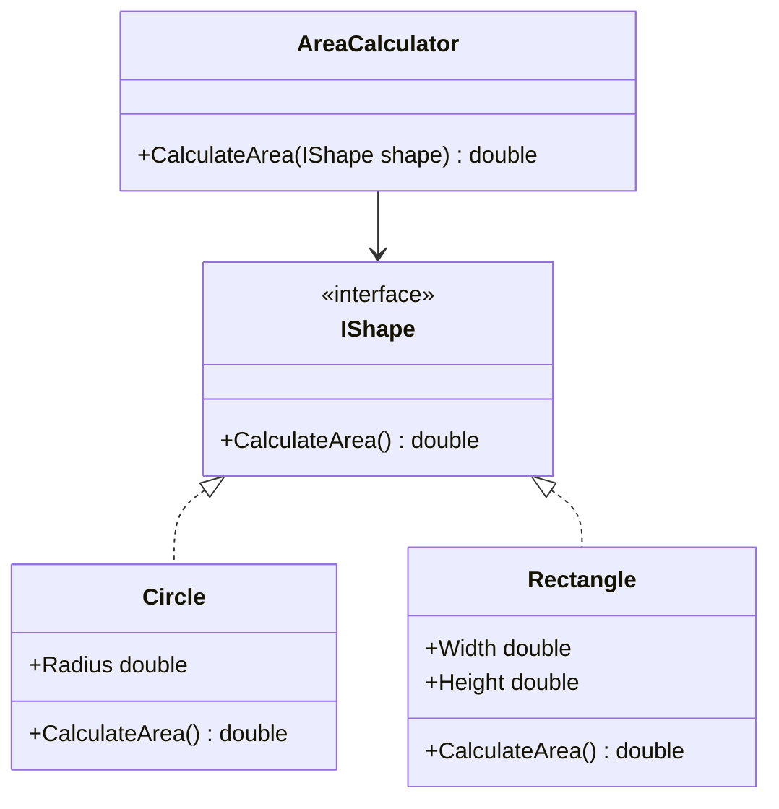

## 2.3 The SOLID Principles

In the realm of software engineering, especially within object-oriented programming (OOP), the SOLID principles stand as a beacon for creating robust, scalable, and maintainable software. These principles, introduced by Robert C. Martin (also known as Uncle Bob), are a set of five design principles intended to make software designs more understandable, flexible, and maintainable. In this section, we will delve into each of the SOLID principles, exploring their significance, application, and how they can be implemented in C#.

### Introduction to SOLID Principles

The SOLID principles are:

1. **Single Responsibility Principle (SRP)**
2. **Open/Closed Principle (OCP)**
3. **Liskov Substitution Principle (LSP)**
4. **Interface Segregation Principle (ISP)**
5. **Dependency Inversion Principle (DIP)**

These principles are not just theoretical concepts but practical guidelines that can significantly improve the quality of your code. Let's explore each principle in detail.

### Single Responsibility Principle (SRP)

**Definition:** A class should have only one reason to change, meaning it should have only one job or responsibility.

The Single Responsibility Principle is about ensuring that a class is only responsible for one part of the functionality provided by the software. This principle helps in reducing the complexity of the code and makes it easier to understand and maintain.

#### Example in C#

Consider a class that handles both user authentication and logging. This violates the SRP because it has more than one responsibility.

```csharp
public class UserService
{
    public void AuthenticateUser(string username, string password)
    {
        // Authentication logic
    }

    public void LogError(string error)
    {
        // Logging logic
    }
}
```

**Refactoring to adhere to SRP:**

```csharp
public class AuthenticationService
{
    public void AuthenticateUser(string username, string password)
    {
        // Authentication logic
    }
}

public class Logger
{
    public void LogError(string error)
    {
        // Logging logic
    }
}
```

By separating the responsibilities into different classes, we adhere to the SRP, making each class easier to manage and test.

### Open/Closed Principle (OCP)

**Definition:** Software entities (classes, modules, functions, etc.) should be open for extension but closed for modification.

The Open/Closed Principle encourages the design of software that can be extended without modifying existing code. This is achieved through abstraction and polymorphism.

#### Example in C#

Suppose we have a class that calculates the area of different shapes:

```csharp
public class AreaCalculator
{
    public double CalculateArea(object shape)
    {
        if (shape is Circle)
        {
            Circle circle = (Circle)shape;
            return Math.PI * circle.Radius * circle.Radius;
        }
        else if (shape is Rectangle)
        {
            Rectangle rectangle = (Rectangle)shape;
            return rectangle.Width * rectangle.Height;
        }
        return 0;
    }
}
```

**Refactoring to adhere to OCP:**

```csharp
public interface IShape
{
    double CalculateArea();
}

public class Circle : IShape
{
    public double Radius { get; set; }
    public double CalculateArea() => Math.PI * Radius * Radius;
}

public class Rectangle : IShape
{
    public double Width { get; set; }
    public double Height { get; set; }
    public double CalculateArea() => Width * Height;
}

public class AreaCalculator
{
    public double CalculateArea(IShape shape)
    {
        return shape.CalculateArea();
    }
}
```

By using an interface, we can add new shapes without modifying the `AreaCalculator` class, thus adhering to the OCP.

### Liskov Substitution Principle (LSP)

**Definition:** Objects of a superclass should be replaceable with objects of a subclass without affecting the correctness of the program.

The Liskov Substitution Principle ensures that a derived class can stand in for its base class without causing errors or unexpected behavior.

#### Example in C#

Consider a base class `Bird` and a derived class `Penguin`:

```csharp
public class Bird
{
    public virtual void Fly()
    {
        Console.WriteLine("Flying");
    }
}

public class Penguin : Bird
{
    public override void Fly()
    {
        throw new NotImplementedException("Penguins can't fly");
    }
}
```

This violates the LSP because substituting a `Penguin` for a `Bird` would cause an exception.

**Refactoring to adhere to LSP:**

```csharp
public abstract class Bird
{
    public abstract void Move();
}

public class FlyingBird : Bird
{
    public override void Move()
    {
        Console.WriteLine("Flying");
    }
}

public class Penguin : Bird
{
    public override void Move()
    {
        Console.WriteLine("Swimming");
    }
}
```

By abstracting the movement behavior, we ensure that all subclasses adhere to the expected behavior, thus complying with the LSP.

### Interface Segregation Principle (ISP)

**Definition:** Clients should not be forced to depend on interfaces they do not use.

The Interface Segregation Principle advocates for creating smaller, more specific interfaces rather than a large, general-purpose interface.

#### Example in C#

Consider an interface with multiple responsibilities:

```csharp
public interface IWorker
{
    void Work();
    void Eat();
}
```

A `Robot` class implementing this interface would violate the ISP because it doesn't need the `Eat` method.

**Refactoring to adhere to ISP:**

```csharp
public interface IWorkable
{
    void Work();
}

public interface IFeedable
{
    void Eat();
}

public class Human : IWorkable, IFeedable
{
    public void Work() { /* Working logic */ }
    public void Eat() { /* Eating logic */ }
}

public class Robot : IWorkable
{
    public void Work() { /* Working logic */ }
}
```

By splitting the interface into smaller, more specific interfaces, we adhere to the ISP.

### Dependency Inversion Principle (DIP)

**Definition:** High-level modules should not depend on low-level modules. Both should depend on abstractions. Abstractions should not depend on details. Details should depend on abstractions.

The Dependency Inversion Principle promotes decoupling by ensuring that high-level modules are not dependent on the low-level module implementations.

#### Example in C#

Consider a high-level module that directly depends on a low-level module:

```csharp
public class LightBulb
{
    public void TurnOn() { /* Turn on logic */ }
}

public class Switch
{
    private LightBulb _lightBulb;

    public Switch()
    {
        _lightBulb = new LightBulb();
    }

    public void Operate()
    {
        _lightBulb.TurnOn();
    }
}
```

**Refactoring to adhere to DIP:**

```csharp
public interface ISwitchable
{
    void TurnOn();
}

public class LightBulb : ISwitchable
{
    public void TurnOn() { /* Turn on logic */ }
}

public class Switch
{
    private ISwitchable _device;

    public Switch(ISwitchable device)
    {
        _device = device;
    }

    public void Operate()
    {
        _device.TurnOn();
    }
}
```

By introducing an interface, we decouple the `Switch` class from the `LightBulb` class, adhering to the DIP.

### Visualizing the SOLID Principles

To better understand the relationships and dependencies in the SOLID principles, let's visualize them using a class diagram:



**Diagram Description:** This class diagram illustrates the Open/Closed Principle by showing how the `AreaCalculator` class depends on the `IShape` interface, allowing for extension through new shape classes without modifying the calculator itself.

### Key Takeaways

- **SRP**: Keep classes focused on a single responsibility to enhance maintainability.
- **OCP**: Design systems that can be extended without altering existing code.
- **LSP**: Ensure derived classes can substitute base classes without altering program behavior.
- **ISP**: Create specific interfaces to avoid forcing clients to implement unused methods.
- **DIP**: Depend on abstractions, not concrete implementations, to achieve decoupling.

### Try It Yourself

Experiment with the provided code examples by:

- Adding new shapes to the `AreaCalculator` example to see how OCP is maintained.
- Creating a new `Bird` subclass to test LSP compliance.
- Implementing a new `ISwitchable` device to understand DIP.

### Further Reading

- [SOLID Principles by Robert C. Martin](https://www.oreilly.com/library/view/clean-architecture/9780134494272/)
- [Design Patterns: Elements of Reusable Object-Oriented Software](https://www.amazon.com/Design-Patterns-Elements-Reusable-Object-Oriented/dp/0201633612)

## Quiz Time!



### Which principle states that a class should have only one reason to change?

- [x] Single Responsibility Principle
- [ ] Open/Closed Principle
- [ ] Liskov Substitution Principle
- [ ] Interface Segregation Principle

> **Explanation:** The Single Responsibility Principle (SRP) states that a class should have only one reason to change, meaning it should have only one job or responsibility.


### What does the Open/Closed Principle advocate for?

- [x] Open for extension, closed for modification
- [ ] Open for modification, closed for extension
- [ ] Open for both extension and modification
- [ ] Closed for both extension and modification

> **Explanation:** The Open/Closed Principle (OCP) advocates that software entities should be open for extension but closed for modification.


### Which principle ensures that derived classes can replace base classes without affecting program correctness?

- [ ] Single Responsibility Principle
- [ ] Open/Closed Principle
- [x] Liskov Substitution Principle
- [ ] Interface Segregation Principle

> **Explanation:** The Liskov Substitution Principle (LSP) ensures that objects of a superclass should be replaceable with objects of a subclass without affecting the correctness of the program.


### What does the Interface Segregation Principle suggest?

- [ ] Use large, general-purpose interfaces
- [x] Use smaller, more specific interfaces
- [ ] Avoid using interfaces altogether
- [ ] Use interfaces only when necessary

> **Explanation:** The Interface Segregation Principle (ISP) suggests creating smaller, more specific interfaces rather than a large, general-purpose interface.


### Which principle promotes decoupling by ensuring high-level modules do not depend on low-level module implementations?

- [ ] Single Responsibility Principle
- [ ] Open/Closed Principle
- [ ] Liskov Substitution Principle
- [x] Dependency Inversion Principle

> **Explanation:** The Dependency Inversion Principle (DIP) promotes decoupling by ensuring that high-level modules are not dependent on the low-level module implementations.


### What is a key benefit of adhering to the Single Responsibility Principle?

- [x] Enhanced maintainability
- [ ] Increased complexity
- [ ] Reduced flexibility
- [ ] Decreased readability

> **Explanation:** Adhering to the Single Responsibility Principle (SRP) enhances maintainability by ensuring that each class has only one responsibility.


### How does the Open/Closed Principle benefit software design?

- [x] Allows for extension without modifying existing code
- [ ] Requires frequent modification of existing code
- [ ] Limits the ability to extend software
- [ ] Encourages tightly coupled code

> **Explanation:** The Open/Closed Principle (OCP) benefits software design by allowing for extension without modifying existing code, thus promoting flexibility and scalability.


### What is a consequence of violating the Liskov Substitution Principle?

- [ ] Improved program correctness
- [x] Unexpected behavior or errors
- [ ] Increased code readability
- [ ] Enhanced code flexibility

> **Explanation:** Violating the Liskov Substitution Principle (LSP) can lead to unexpected behavior or errors when derived classes do not adhere to the expected behavior of the base class.


### Why is the Interface Segregation Principle important?

- [x] It prevents clients from depending on interfaces they do not use
- [ ] It encourages the use of large interfaces
- [ ] It simplifies the design by reducing the number of interfaces
- [ ] It mandates the use of interfaces in all classes

> **Explanation:** The Interface Segregation Principle (ISP) is important because it prevents clients from depending on interfaces they do not use, thus promoting a more modular and maintainable design.


### True or False: The Dependency Inversion Principle states that details should depend on abstractions.

- [x] True
- [ ] False

> **Explanation:** True. The Dependency Inversion Principle (DIP) states that details should depend on abstractions, not the other way around, to achieve decoupling.



Remember, mastering the SOLID principles is a journey. As you continue to apply these principles in your projects, you'll find your code becoming more robust, flexible, and easier to maintain. Keep experimenting, stay curious, and enjoy the process of becoming a better software engineer!
