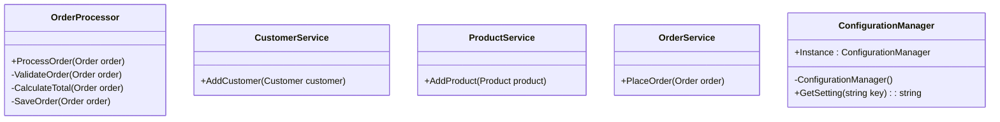

## 2.4 DRY (Don't Repeat Yourself)

In the realm of software engineering, the DRY principle, which stands for "Don't Repeat Yourself," is a fundamental tenet that promotes the reduction of code duplication. This principle is pivotal in crafting efficient, maintainable, and scalable software systems. In this section, we will delve into the DRY principle within the context of C#, exploring its significance, implementation strategies, and the benefits it brings to software development.

### Understanding the DRY Principle

The DRY principle was first introduced by Andy Hunt and Dave Thomas in their seminal book, "The Pragmatic Programmer." It emphasizes that every piece of knowledge or logic should have a single, unambiguous representation within a system. By adhering to this principle, developers can minimize redundancy, reduce the risk of inconsistencies, and simplify maintenance.

#### Why DRY Matters

1. **Maintainability**: Redundant code increases the maintenance burden. When a change is required, it must be applied consistently across all duplicated instances, increasing the likelihood of errors.

2. **Readability**: DRY code is often more concise and easier to read. By eliminating repetition, the codebase becomes cleaner and more understandable.

3. **Scalability**: As applications grow, managing duplicated code becomes increasingly challenging. DRY principles help ensure that the codebase remains manageable and scalable.

4. **Consistency**: By centralizing logic, DRY ensures that the same logic is applied consistently throughout the application, reducing the risk of discrepancies.

### Implementing DRY in C#

Implementing the DRY principle in C# involves leveraging abstraction, modularization, and design patterns. Let's explore these strategies in detail.

#### Abstraction

Abstraction is a core concept in object-oriented programming that allows developers to define complex systems in simplified terms. By abstracting common functionality into methods, classes, or interfaces, we can eliminate redundancy and promote code reuse.

**Example: Using Methods for Abstraction**

```csharp
public class OrderProcessor
{
    public void ProcessOrder(Order order)
    {
        ValidateOrder(order);
        CalculateTotal(order);
        SaveOrder(order);
    }

    private void ValidateOrder(Order order)
    {
        // Validation logic
    }

    private void CalculateTotal(Order order)
    {
        // Calculation logic
    }

    private void SaveOrder(Order order)
    {
        // Persistence logic
    }
}
```

In this example, the `OrderProcessor` class abstracts the order processing logic into separate methods, ensuring that each piece of logic is defined once and reused as needed.

#### Modularization

Modularization involves breaking down a system into smaller, self-contained modules. Each module encapsulates a specific piece of functionality, promoting reuse and reducing duplication.

**Example: Modularizing with Classes**

```csharp
public class CustomerService
{
    public void AddCustomer(Customer customer)
    {
        // Add customer logic
    }
}

public class ProductService
{
    public void AddProduct(Product product)
    {
        // Add product logic
    }
}

public class OrderService
{
    public void PlaceOrder(Order order)
    {
        // Place order logic
    }
}
```

Here, the application is divided into distinct services, each responsible for a specific domain. This modular approach ensures that logic is not repeated across different parts of the application.

#### Design Patterns

Design patterns provide proven solutions to common software design problems. Many patterns inherently promote the DRY principle by encouraging code reuse and abstraction.

**Example: Using the Singleton Pattern**

The Singleton pattern ensures that a class has only one instance and provides a global point of access to it. This pattern is useful for managing shared resources without duplicating code.

```csharp
public class ConfigurationManager
{
    private static ConfigurationManager _instance;
    private static readonly object _lock = new object();

    private ConfigurationManager()
    {
        // Load configuration settings
    }

    public static ConfigurationManager Instance
    {
        get
        {
            lock (_lock)
            {
                if (_instance == null)
                {
                    _instance = new ConfigurationManager();
                }
                return _instance;
            }
        }
    }

    public string GetSetting(string key)
    {
        // Retrieve setting logic
    }
}
```

In this example, the Singleton pattern ensures that the configuration management logic is centralized and not duplicated across the application.

### Visualizing DRY with Diagrams

To better understand how DRY principles can be applied in C#, let's visualize the concept using a class diagram.



**Diagram Description**: This class diagram illustrates how different classes in a system can be organized to adhere to the DRY principle. Each class encapsulates specific functionality, promoting reuse and reducing redundancy.

### Key Participants in DRY Implementation

1. **Developers**: Responsible for identifying and eliminating redundancy in the codebase.
2. **Architects**: Design the system architecture to facilitate DRY principles.
3. **Code Reviewers**: Ensure that new code adheres to DRY principles during code reviews.

### Applicability of DRY

The DRY principle is applicable in virtually all software development scenarios. It is particularly beneficial in large-scale applications where code duplication can lead to significant maintenance challenges.

### Design Considerations

- **Balance DRY with Readability**: While DRY is important, it should not come at the expense of code readability. Over-abstraction can make code difficult to understand.
- **Avoid Premature Optimization**: Focus on eliminating redundancy in areas that are prone to change or are critical to the application's functionality.
- **Leverage C# Features**: Utilize C# features such as generics, interfaces, and inheritance to promote DRY principles.

### Differences and Similarities with Other Principles

- **DRY vs. WET (Write Everything Twice)**: WET is the antithesis of DRY, promoting code duplication. DRY aims to eliminate redundancy, while WET may be used in scenarios where duplication is intentional for clarity.
- **DRY vs. KISS (Keep It Simple, Stupid)**: Both principles aim to simplify code, but DRY focuses on reducing redundancy, while KISS emphasizes simplicity in design.

### Try It Yourself

To solidify your understanding of the DRY principle, try modifying the code examples provided. Consider how you might refactor a codebase to eliminate redundancy and improve maintainability.

### Knowledge Check

- **Question**: How does the DRY principle improve code maintainability?
- **Exercise**: Refactor a piece of code that contains duplicated logic into a more DRY-compliant structure.

### Embrace the Journey

Remember, mastering the DRY principle is a journey. As you continue to develop your skills, you'll find new ways to apply DRY principles to create more efficient and maintainable code. Keep experimenting, stay curious, and enjoy the process!

### References and Links

- [The Pragmatic Programmer](https://www.amazon.com/Pragmatic-Programmer-journey-mastery-Anniversary/dp/0135957052) by Andrew Hunt and David Thomas
- [Microsoft C# Documentation](https://docs.microsoft.com/en-us/dotnet/csharp/)
- [Design Patterns: Elements of Reusable Object-Oriented Software](https://www.amazon.com/Design-Patterns-Elements-Reusable-Object-Oriented/dp/0201633612) by Erich Gamma, Richard Helm, Ralph Johnson, John Vlissides

## Quiz Time!



### What is the primary goal of the DRY principle?

- [x] To eliminate code duplication
- [ ] To increase code complexity
- [ ] To reduce code readability
- [ ] To promote code duplication

> **Explanation:** The DRY principle aims to eliminate code duplication to improve maintainability and consistency.

### Which of the following is a benefit of applying the DRY principle?

- [x] Improved maintainability
- [ ] Increased redundancy
- [ ] Decreased readability
- [ ] Reduced scalability

> **Explanation:** DRY improves maintainability by reducing redundancy and ensuring consistency.

### How can abstraction help in implementing the DRY principle?

- [x] By encapsulating common logic into methods or classes
- [ ] By duplicating code across different modules
- [ ] By increasing code complexity
- [ ] By reducing code readability

> **Explanation:** Abstraction helps implement DRY by encapsulating common logic, reducing redundancy.

### What is a potential downside of over-applying the DRY principle?

- [x] Reduced code readability
- [ ] Increased code duplication
- [ ] Improved maintainability
- [ ] Enhanced scalability

> **Explanation:** Over-applying DRY can lead to reduced readability due to excessive abstraction.

### Which design pattern inherently promotes the DRY principle?

- [x] Singleton Pattern
- [ ] Observer Pattern
- [ ] Strategy Pattern
- [ ] Decorator Pattern

> **Explanation:** The Singleton Pattern promotes DRY by centralizing shared resources.

### What is the relationship between DRY and modularization?

- [x] Modularization supports DRY by encapsulating functionality
- [ ] Modularization increases code duplication
- [ ] Modularization decreases code readability
- [ ] Modularization reduces code maintainability

> **Explanation:** Modularization supports DRY by encapsulating functionality, reducing redundancy.

### How does the DRY principle relate to the KISS principle?

- [x] Both aim to simplify code, but DRY focuses on reducing redundancy
- [ ] Both promote code duplication
- [ ] Both increase code complexity
- [ ] Both reduce code readability

> **Explanation:** DRY and KISS both simplify code, but DRY focuses on reducing redundancy.

### Which C# feature can be leveraged to implement the DRY principle?

- [x] Generics
- [ ] Code duplication
- [ ] Increased complexity
- [ ] Reduced readability

> **Explanation:** Generics can be used to implement DRY by promoting code reuse.

### What should be avoided when applying the DRY principle?

- [x] Premature optimization
- [ ] Code duplication
- [ ] Code readability
- [ ] Code maintainability

> **Explanation:** Premature optimization should be avoided when applying DRY to prevent unnecessary complexity.

### True or False: The DRY principle is only applicable in large-scale applications.

- [ ] True
- [x] False

> **Explanation:** The DRY principle is applicable in all software development scenarios, regardless of scale.




