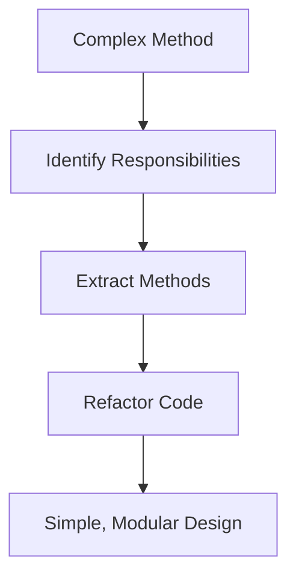

## 2.5 KISS (Keep It Simple, Stupid)

In the realm of software engineering, the KISS principle—Keep It Simple, Stupid—serves as a guiding light for developers striving to create maintainable, scalable, and efficient code. This principle emphasizes simplicity in design and implementation, advocating for straightforward solutions over complex ones. As expert software engineers and enterprise architects, understanding and applying the KISS principle in C# design patterns is crucial for building robust applications that stand the test of time.

### Understanding the KISS Principle

The KISS principle is rooted in the idea that simplicity should be a key goal in design. This doesn't mean oversimplifying or neglecting necessary complexity, but rather avoiding unnecessary complications that can lead to maintenance challenges and increased risk of errors. In C#, this translates to writing clean, readable, and efficient code that is easy to understand and modify.

#### Why Simplicity Matters

1. **Maintainability**: Simple code is easier to read and understand, making it more maintainable. This is particularly important in large projects where multiple developers are involved.
2. **Scalability**: Simple solutions are often more scalable, as they can be extended or modified with minimal effort.
3. **Performance**: Simplicity often leads to more efficient code, as unnecessary complexity can introduce performance bottlenecks.
4. **Error Reduction**: Simple code is less prone to errors, as there are fewer moving parts to manage.

### Techniques to Simplify Complex Code Structures

To effectively apply the KISS principle in C#, developers can employ several techniques to simplify complex code structures. These techniques not only enhance code readability but also improve overall software quality.

#### 1. **Modular Design**

Breaking down a complex system into smaller, manageable modules is a fundamental technique for simplifying code. Each module should have a single responsibility, adhering to the Single Responsibility Principle (SRP) of SOLID design principles. This modular approach allows developers to focus on one aspect of the system at a time, making it easier to understand and modify.

**Example:**

```csharp
// Before: Complex method handling multiple responsibilities
public void ProcessOrder(Order order)
{
    ValidateOrder(order);
    CalculateDiscount(order);
    ProcessPayment(order);
    SendConfirmationEmail(order);
}

// After: Modular design with single responsibility methods
public void ProcessOrder(Order order)
{
    OrderValidator.Validate(order);
    DiscountCalculator.ApplyDiscount(order);
    PaymentProcessor.Process(order);
    EmailService.SendConfirmation(order);
}
```

#### 2. **Use of Design Patterns**

Design patterns provide proven solutions to common problems, promoting simplicity and consistency in code. By leveraging design patterns, developers can avoid reinventing the wheel and focus on implementing solutions that are both efficient and easy to understand.

**Example: Singleton Pattern**

The Singleton pattern ensures a class has only one instance and provides a global point of access to it. This pattern is useful for managing shared resources or configurations.

```csharp
public sealed class ConfigurationManager
{
    private static readonly Lazy<ConfigurationManager> instance = new Lazy<ConfigurationManager>(() => new ConfigurationManager());

    private ConfigurationManager() { }

    public static ConfigurationManager Instance => instance.Value;

    public string GetConfigValue(string key)
    {
        // Retrieve configuration value
    }
}
```

#### 3. **Avoiding Over-Engineering**

Over-engineering occurs when developers introduce unnecessary complexity into a system, often in anticipation of future requirements that may never materialize. To adhere to the KISS principle, it's important to focus on current requirements and avoid adding features or abstractions that are not immediately needed.

**Example:**

```csharp
// Over-engineered: Using a complex factory pattern for a simple task
public interface IShapeFactory
{
    IShape CreateShape();
}

public class CircleFactory : IShapeFactory
{
    public IShape CreateShape() => new Circle();
}

// Simplified: Direct instantiation for straightforward use cases
public class ShapeService
{
    public IShape CreateCircle() => new Circle();
}
```

#### 4. **Clear and Concise Naming**

Naming conventions play a significant role in code readability. Using clear and descriptive names for variables, methods, and classes helps convey the purpose and functionality of the code, reducing the cognitive load on developers.

**Example:**

```csharp
// Poor naming
int x = 10;
void DoSomething() { }

// Improved naming
int maxRetryAttempts = 10;
void ProcessOrder() { }
```

#### 5. **Refactoring**

Refactoring involves restructuring existing code without changing its external behavior. This process helps improve code readability, reduce complexity, and eliminate redundancy, aligning with the KISS principle.

**Example:**

```csharp
// Before refactoring: Repetitive code
public void PrintOrderDetails(Order order)
{
    Console.WriteLine("Order ID: " + order.Id);
    Console.WriteLine("Order Date: " + order.Date);
    Console.WriteLine("Order Total: " + order.Total);
}

// After refactoring: Extracted method
public void PrintOrderDetails(Order order)
{
    PrintDetail("Order ID", order.Id);
    PrintDetail("Order Date", order.Date);
    PrintDetail("Order Total", order.Total);
}

private void PrintDetail(string label, object value)
{
    Console.WriteLine($"{label}: {value}");
}
```

#### 6. **Leveraging C# Features**

C# offers a range of features that can simplify code, such as LINQ for data manipulation, async/await for asynchronous programming, and pattern matching for cleaner conditional logic. Utilizing these features can lead to more concise and expressive code.

**Example: LINQ**

```csharp
// Without LINQ
List<int> evenNumbers = new List<int>();
foreach (int number in numbers)
{
    if (number % 2 == 0)
    {
        evenNumbers.Add(number);
    }
}

// With LINQ
var evenNumbers = numbers.Where(n => n % 2 == 0).ToList();
```

### Visualizing Simplicity in Code

To further illustrate the impact of simplicity in code, let's visualize the process of refactoring a complex method into a simpler, more modular design using a flowchart.



**Caption:** This flowchart demonstrates the process of simplifying a complex method by identifying responsibilities, extracting methods, and refactoring the code into a simple, modular design.

### Try It Yourself

To reinforce your understanding of the KISS principle, try modifying the code examples provided. Experiment with different refactoring techniques, apply design patterns, and utilize C# features to simplify the code further. Consider how these changes impact code readability, maintainability, and performance.

### Knowledge Check

1. **What is the primary goal of the KISS principle in software design?**
   - To simplify code for better maintainability and scalability.

2. **How does modular design contribute to simplicity in code?**
   - By breaking down complex systems into smaller, manageable modules with single responsibilities.

3. **Why is it important to avoid over-engineering in software development?**
   - To prevent unnecessary complexity and focus on current requirements.

4. **How can clear and concise naming improve code readability?**
   - By conveying the purpose and functionality of code elements, reducing cognitive load.

5. **What role does refactoring play in adhering to the KISS principle?**
   - It helps improve code readability, reduce complexity, and eliminate redundancy.

### Embrace the Journey

Remember, mastering the KISS principle is a continuous journey. As you progress in your software development career, strive to keep your code simple, maintainable, and scalable. Embrace the power of simplicity, stay curious, and enjoy the process of refining your skills.

### References and Links

- [Microsoft Docs: C# Programming Guide](https://docs.microsoft.com/en-us/dotnet/csharp/)
- [Refactoring Guru: Design Patterns](https://refactoring.guru/design-patterns)
- [SOLID Principles in C#](https://www.c-sharpcorner.com/article/solid-principles-in-C-Sharp/)

## Quiz Time!



### What is the primary goal of the KISS principle in software design?

- [x] To simplify code for better maintainability and scalability.
- [ ] To add complexity for future-proofing.
- [ ] To focus on performance over readability.
- [ ] To ensure code is as concise as possible.

> **Explanation:** The KISS principle aims to simplify code, making it more maintainable and scalable.

### How does modular design contribute to simplicity in code?

- [x] By breaking down complex systems into smaller, manageable modules.
- [ ] By combining multiple responsibilities into a single module.
- [ ] By focusing on future requirements.
- [ ] By using complex design patterns.

> **Explanation:** Modular design simplifies code by dividing complex systems into smaller, manageable parts with single responsibilities.

### Why is it important to avoid over-engineering in software development?

- [x] To prevent unnecessary complexity and focus on current requirements.
- [ ] To ensure all future requirements are met.
- [ ] To use as many design patterns as possible.
- [ ] To make code as abstract as possible.

> **Explanation:** Avoiding over-engineering helps maintain simplicity by focusing on current needs and avoiding unnecessary complexity.

### How can clear and concise naming improve code readability?

- [x] By conveying the purpose and functionality of code elements.
- [ ] By making code shorter.
- [ ] By using technical jargon.
- [ ] By focusing on variable length.

> **Explanation:** Clear naming helps developers understand the purpose and functionality of code elements, improving readability.

### What role does refactoring play in adhering to the KISS principle?

- [x] It helps improve code readability, reduce complexity, and eliminate redundancy.
- [ ] It adds complexity to the code.
- [ ] It focuses on performance optimization.
- [ ] It ensures code is as concise as possible.

> **Explanation:** Refactoring aligns with the KISS principle by simplifying code, improving readability, and reducing complexity.

### Which of the following is a benefit of using design patterns?

- [x] Promoting simplicity and consistency in code.
- [ ] Adding unnecessary complexity.
- [ ] Focusing solely on performance.
- [ ] Ensuring code is as abstract as possible.

> **Explanation:** Design patterns provide proven solutions that promote simplicity and consistency in code.

### What is a common pitfall when applying the KISS principle?

- [x] Oversimplifying to the point of neglecting necessary complexity.
- [ ] Adding too many features.
- [ ] Using too many design patterns.
- [ ] Focusing solely on performance.

> **Explanation:** While simplicity is key, it's important not to oversimplify and neglect necessary complexity.

### How can LINQ simplify data manipulation in C#?

- [x] By providing a concise and expressive syntax for querying data.
- [ ] By adding complexity to data queries.
- [ ] By focusing on performance optimization.
- [ ] By using complex algorithms.

> **Explanation:** LINQ simplifies data manipulation with a concise and expressive syntax for querying data.

### What is the benefit of using async/await in C#?

- [x] Simplifying asynchronous programming and improving code readability.
- [ ] Adding complexity to asynchronous code.
- [ ] Focusing solely on performance.
- [ ] Ensuring code is as concise as possible.

> **Explanation:** Async/await simplifies asynchronous programming, making code more readable and maintainable.

### True or False: The KISS principle encourages adding features for future-proofing.

- [ ] True
- [x] False

> **Explanation:** The KISS principle discourages adding unnecessary features, focusing instead on simplicity and current requirements.




