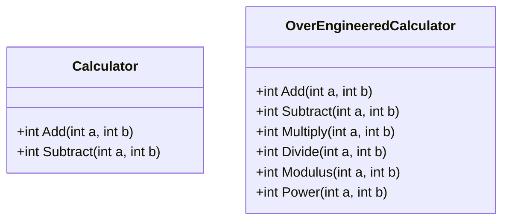

## 2.6 YAGNI (You Aren't Gonna Need It)

In the realm of software development, the YAGNI principle, which stands for "You Aren't Gonna Need It," serves as a guiding philosophy to prevent over-engineering and premature optimization. This principle is particularly relevant in C# development, where the temptation to build complex features and systems can lead to unnecessary complexity and maintenance challenges. In this section, we will delve into the YAGNI principle, exploring its significance, application, and impact on software design and architecture.

### Understanding the YAGNI Principle

The YAGNI principle is a core tenet of agile software development, emphasizing the importance of implementing only the features that are necessary for the current requirements. It encourages developers to resist the urge to anticipate future needs and build features that may never be used. By adhering to YAGNI, developers can focus on delivering value incrementally, reducing waste, and maintaining simplicity in their codebases.

#### Key Concepts of YAGNI

1. **Avoid Over-Engineering**: Over-engineering occurs when developers build systems that are more complex than necessary. YAGNI helps prevent this by encouraging a focus on current requirements rather than speculative future needs.

2. **Prevent Premature Optimization**: Premature optimization involves making performance improvements before they are needed. YAGNI advises against this, as it can lead to unnecessary complexity and hinder maintainability.

3. **Embrace Simplicity**: By implementing only what is needed, developers can keep their codebases simple, making them easier to understand, maintain, and extend.

4. **Iterative Development**: YAGNI aligns with iterative development practices, where features are added incrementally based on actual requirements and feedback.

### The Importance of YAGNI in C# Development

In C# development, the YAGNI principle is crucial for several reasons:

- **Maintainability**: By avoiding unnecessary features, codebases remain cleaner and more maintainable, reducing the risk of bugs and technical debt.

- **Efficiency**: Developers can focus their efforts on delivering value, rather than spending time on features that may never be used.

- **Flexibility**: A YAGNI-driven approach allows for greater flexibility, as changes can be made based on actual needs rather than assumptions.

- **Cost-Effectiveness**: By reducing waste and focusing on essential features, development costs can be minimized.

### Applying YAGNI in C# Projects

To effectively apply the YAGNI principle in C# projects, developers should adopt certain practices and mindsets:

#### 1. Focus on Current Requirements

When starting a new project or feature, focus on the current requirements and avoid building features based on assumptions about future needs. This can be achieved by:

- **Engaging with Stakeholders**: Regularly communicate with stakeholders to understand their current needs and priorities.

- **Prioritizing Features**: Use techniques like MoSCoW (Must have, Should have, Could have, Won't have) to prioritize features based on their importance.

#### 2. Implement Incrementally

Adopt an incremental development approach, where features are added in small, manageable increments. This allows for:

- **Continuous Feedback**: Regularly gather feedback from users and stakeholders to ensure that the implemented features meet their needs.

- **Adaptability**: Easily adapt to changing requirements without the burden of unnecessary features.

#### 3. Avoid Speculative Generality

Speculative generality involves building systems that are overly generic in anticipation of future changes. To avoid this:

- **Design for the Present**: Focus on designing solutions that meet current needs, rather than building overly flexible systems.

- **Refactor as Needed**: Embrace refactoring as a natural part of the development process, allowing for changes to be made when new requirements arise.

#### 4. Resist Premature Optimization

Premature optimization can lead to complex and difficult-to-maintain code. To resist this temptation:

- **Profile Before Optimizing**: Use profiling tools to identify performance bottlenecks before making optimizations.

- **Optimize When Necessary**: Only optimize code when there is a clear need, and the benefits outweigh the costs.

### Code Example: Applying YAGNI in C#

Let's explore a simple C# example to illustrate the application of the YAGNI principle. Consider a scenario where we need to implement a basic calculator with addition and subtraction functionality.

```csharp
using System;

public class Calculator
{
    // Implement only the required operations
    public int Add(int a, int b)
    {
        return a + b;
    }

    public int Subtract(int a, int b)
    {
        return a - b;
    }
}

class Program
{
    static void Main()
    {
        Calculator calculator = new Calculator();
        
        // Demonstrate the use of the calculator
        Console.WriteLine("Addition: " + calculator.Add(5, 3)); // Output: 8
        Console.WriteLine("Subtraction: " + calculator.Subtract(5, 3)); // Output: 2
    }
}
```

In this example, we have implemented only the necessary operations (addition and subtraction) based on the current requirements. We avoided adding unnecessary features like multiplication or division, which may not be needed at this stage.

#### Try It Yourself

To experiment with the YAGNI principle, try modifying the code to add additional operations like multiplication or division. Then, consider whether these features are truly necessary for the current requirements.

### Visualizing YAGNI: Avoiding Over-Engineering

To further illustrate the concept of YAGNI, let's visualize the difference between a YAGNI-compliant design and an over-engineered design using a class diagram.



In this diagram, the `Calculator` class represents a YAGNI-compliant design, implementing only the necessary features. The `OverEngineeredCalculator` class, on the other hand, includes additional operations that may not be required, illustrating the pitfalls of over-engineering.

### Benefits of YAGNI in Software Development

Adhering to the YAGNI principle offers several benefits in software development:

- **Reduced Complexity**: By implementing only necessary features, the complexity of the codebase is minimized, making it easier to understand and maintain.

- **Improved Focus**: Developers can focus on delivering value by addressing current requirements rather than speculative future needs.

- **Enhanced Agility**: A YAGNI-driven approach allows for greater agility, as changes can be made quickly and efficiently based on actual needs.

- **Lower Costs**: By reducing waste and focusing on essential features, development costs can be minimized, leading to more cost-effective projects.

### Challenges and Considerations

While the YAGNI principle offers numerous benefits, it also presents certain challenges and considerations:

#### Balancing YAGNI with Future-Proofing

One of the challenges of applying YAGNI is balancing it with the need to future-proof systems. While it's important to avoid over-engineering, it's also crucial to design systems that can accommodate future changes. To achieve this balance:

- **Use Design Patterns**: Leverage design patterns that promote flexibility and extensibility, such as the Strategy or Factory patterns.

- **Modular Design**: Design systems in a modular fashion, allowing for components to be easily replaced or extended.

#### Communicating with Stakeholders

Effective communication with stakeholders is essential to ensure that the implemented features align with their needs. This involves:

- **Regular Meetings**: Hold regular meetings with stakeholders to gather feedback and discuss priorities.

- **Clear Documentation**: Maintain clear and concise documentation to communicate the rationale behind design decisions.

#### Embracing Change

The YAGNI principle requires a willingness to embrace change and adapt to new requirements. This involves:

- **Continuous Learning**: Stay informed about new technologies and practices that can enhance the development process.

- **Open-Mindedness**: Be open to feedback and willing to make changes based on new information.

### YAGNI in Practice: Real-World Examples

To further illustrate the application of the YAGNI principle, let's explore some real-world examples:

#### Example 1: Web Application Development

In web application development, it's common to encounter requests for features that may not be immediately necessary. By applying YAGNI, developers can focus on delivering the core functionality first, such as user authentication and basic CRUD operations, before considering additional features like social media integration or advanced analytics.

#### Example 2: API Design

When designing APIs, it's important to focus on the essential endpoints and data structures needed for the current use cases. By avoiding the temptation to build overly complex APIs with numerous endpoints and parameters, developers can create more maintainable and efficient systems.

#### Example 3: Microservices Architecture

In a microservices architecture, the YAGNI principle can be applied by focusing on building small, independent services that address specific business needs. This approach allows for greater flexibility and scalability, as services can be added or modified based on actual requirements.

### Knowledge Check

To reinforce your understanding of the YAGNI principle, consider the following questions:

1. What are the key benefits of applying the YAGNI principle in software development?
2. How can developers balance the YAGNI principle with the need to future-proof systems?
3. What are some common challenges associated with applying the YAGNI principle?

### Conclusion

The YAGNI principle is a powerful tool for preventing over-engineering and premature optimization in software development. By focusing on implementing only the necessary features, developers can create more maintainable, efficient, and cost-effective systems. As you continue your journey in C# development, remember to embrace the YAGNI principle and prioritize simplicity and value delivery.

## Quiz Time!



### What does the YAGNI principle stand for?

- [x] You Aren't Gonna Need It
- [ ] You Always Gonna Need It
- [ ] You Aren't Gonna Neglect It
- [ ] You Always Gonna Neglect It

> **Explanation:** YAGNI stands for "You Aren't Gonna Need It," emphasizing the importance of implementing only necessary features.

### Which of the following is a key benefit of applying the YAGNI principle?

- [x] Reduced complexity
- [ ] Increased complexity
- [ ] More speculative features
- [ ] Higher development costs

> **Explanation:** By implementing only necessary features, the complexity of the codebase is minimized, making it easier to understand and maintain.

### How can developers balance YAGNI with future-proofing?

- [x] Use design patterns and modular design
- [ ] Avoid all future-proofing
- [ ] Implement all possible features
- [ ] Ignore stakeholder feedback

> **Explanation:** Developers can balance YAGNI with future-proofing by using design patterns and modular design to promote flexibility and extensibility.

### What is a common challenge associated with YAGNI?

- [x] Balancing YAGNI with future-proofing
- [ ] Implementing all features at once
- [ ] Ignoring current requirements
- [ ] Avoiding stakeholder communication

> **Explanation:** Balancing YAGNI with future-proofing is a common challenge, as it's important to design systems that can accommodate future changes.

### In which development approach does YAGNI align well?

- [x] Iterative development
- [ ] Waterfall development
- [ ] Big Bang development
- [ ] Speculative development

> **Explanation:** YAGNI aligns with iterative development practices, where features are added incrementally based on actual requirements and feedback.

### What should developers do before optimizing code?

- [x] Profile the code
- [ ] Optimize immediately
- [ ] Ignore performance
- [ ] Add speculative features

> **Explanation:** Developers should use profiling tools to identify performance bottlenecks before making optimizations.

### Which design pattern can help achieve flexibility in a YAGNI-driven approach?

- [x] Strategy pattern
- [ ] Singleton pattern
- [ ] Monolithic pattern
- [ ] Big Ball of Mud pattern

> **Explanation:** The Strategy pattern promotes flexibility and extensibility, aligning well with a YAGNI-driven approach.

### What is speculative generality?

- [x] Building overly generic systems in anticipation of future changes
- [ ] Focusing only on current requirements
- [ ] Avoiding all generality
- [ ] Implementing all features immediately

> **Explanation:** Speculative generality involves building systems that are overly generic in anticipation of future changes, which YAGNI advises against.

### How can developers ensure their implemented features align with stakeholder needs?

- [x] Regular meetings and clear documentation
- [ ] Avoid stakeholder communication
- [ ] Implement all requested features
- [ ] Ignore feedback

> **Explanation:** Regular meetings and clear documentation help ensure that the implemented features align with stakeholder needs.

### True or False: YAGNI encourages premature optimization.

- [ ] True
- [x] False

> **Explanation:** YAGNI advises against premature optimization, as it can lead to unnecessary complexity and hinder maintainability.


