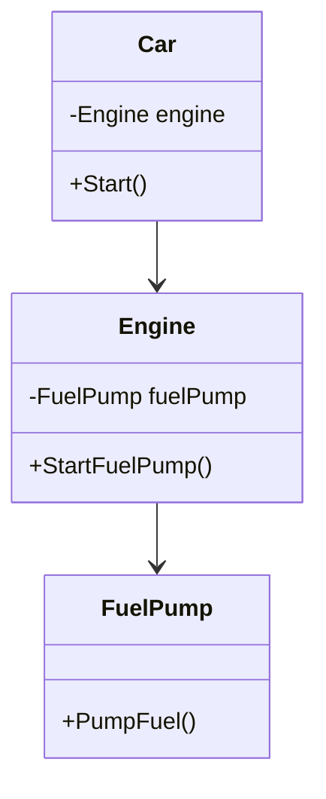

## 2.7 Law of Demeter

In the realm of object-oriented programming, the Law of Demeter (LoD) is a principle aimed at promoting loose coupling between classes. By minimizing the knowledge that one class has about another, we can create more modular, maintainable, and testable code. This section will delve into the intricacies of the Law of Demeter, its application in C#, and how it can be leveraged to enhance software design.

### Understanding the Law of Demeter

The Law of Demeter, sometimes referred to as the "Principle of Least Knowledge," was introduced in 1987 at Northeastern University. The core idea is that a given object should have limited knowledge about other objects. Specifically, it should only communicate with its immediate friends and not with strangers. This principle can be summarized by the following rule: "Only talk to your immediate friends."

#### Key Concepts

1. **Immediate Friends**: These are objects that are directly accessible to a given object. This includes:
   - The object itself.
   - Objects passed as arguments to a method.
   - Objects created within the method.
   - Objects held in instance variables.

2. **Strangers**: These are objects that are not directly accessible and require navigating through other objects to reach.

3. **Method Chain**: A sequence of method calls that traverse multiple objects. The Law of Demeter discourages long method chains as they indicate a violation of the principle.

### Benefits of the Law of Demeter

- **Reduced Coupling**: By limiting the interactions between objects, the code becomes less dependent on the internal structure of other classes.
- **Increased Modularity**: Classes are more self-contained, making them easier to understand and modify.
- **Enhanced Testability**: With fewer dependencies, unit tests can be written more easily, and mocking becomes simpler.
- **Improved Maintainability**: Changes in one class are less likely to affect others, reducing the risk of introducing bugs.

### Applying the Law of Demeter in C#

To apply the Law of Demeter in C#, we need to be mindful of how objects interact within our code. Let's explore some strategies and examples.

#### Example Scenario

Consider a scenario where we have a `Car` class that interacts with a `Engine` class, which in turn interacts with a `FuelPump` class. Here's a simple implementation that violates the Law of Demeter:

```csharp
public class FuelPump
{
    public void PumpFuel() => Console.WriteLine("Pumping fuel...");
}

public class Engine
{
    private FuelPump _fuelPump = new FuelPump();

    public FuelPump GetFuelPump() => _fuelPump;
}

public class Car
{
    private Engine _engine = new Engine();

    public void Start()
    {
        _engine.GetFuelPump().PumpFuel(); // Violates Law of Demeter
        Console.WriteLine("Car started.");
    }
}
```

In this example, the `Car` class directly accesses the `FuelPump` through the `Engine`, which is a violation of the Law of Demeter. The `Car` class should not need to know about the `FuelPump`.

#### Refactoring to Comply with the Law of Demeter

To comply with the Law of Demeter, we can refactor the code to encapsulate the interaction within the `Engine` class:

```csharp
public class FuelPump
{
    public void PumpFuel() => Console.WriteLine("Pumping fuel...");
}

public class Engine
{
    private FuelPump _fuelPump = new FuelPump();

    public void StartFuelPump() => _fuelPump.PumpFuel();
}

public class Car
{
    private Engine _engine = new Engine();

    public void Start()
    {
        _engine.StartFuelPump(); // Complies with Law of Demeter
        Console.WriteLine("Car started.");
    }
}
```

In this refactored version, the `Car` class only interacts with the `Engine`, which in turn handles the interaction with the `FuelPump`. This reduces the coupling between `Car` and `FuelPump`.

### Visualizing the Law of Demeter

To better understand the Law of Demeter, let's visualize the relationships between objects using a class diagram.



**Diagram Description**: This class diagram illustrates the relationships between the `Car`, `Engine`, and `FuelPump` classes. The `Car` interacts directly with the `Engine`, which in turn interacts with the `FuelPump`, adhering to the Law of Demeter.

### Common Violations and How to Avoid Them

1. **Method Chaining**: Avoid accessing methods or properties of objects returned by other methods. Instead, delegate the responsibility to the object that owns the relationship.

2. **Exposing Internal Structures**: Do not expose internal objects through public methods. Instead, provide methods that perform the necessary operations internally.

3. **Overuse of Getters**: Excessive use of getters can lead to violations. Consider providing methods that perform actions rather than exposing internal objects.

### Code Example: Avoiding Method Chaining

Let's consider a more complex example involving a `Library` system with `Book` and `Author` classes.

```csharp
public class Author
{
    public string Name { get; set; }
}

public class Book
{
    public Author Author { get; set; }
}

public class Library
{
    private List<Book> _books = new List<Book>();

    public void AddBook(Book book) => _books.Add(book);

    public void PrintAuthorNames()
    {
        foreach (var book in _books)
        {
            Console.WriteLine(book.Author.Name); // Violates Law of Demeter
        }
    }
}
```

In this example, the `Library` class accesses the `Author` object through the `Book` object, violating the Law of Demeter. We can refactor this to comply with the principle:

```csharp
public class Author
{
    public string Name { get; set; }
}

public class Book
{
    private Author _author;

    public Book(Author author) => _author = author;

    public string GetAuthorName() => _author.Name;
}

public class Library
{
    private List<Book> _books = new List<Book>();

    public void AddBook(Book book) => _books.Add(book);

    public void PrintAuthorNames()
    {
        foreach (var book in _books)
        {
            Console.WriteLine(book.GetAuthorName()); // Complies with Law of Demeter
        }
    }
}
```

In this refactored version, the `Library` class calls `GetAuthorName()` on the `Book` object, which encapsulates the access to the `Author` object.

### Design Considerations

- **Balance**: While the Law of Demeter promotes loose coupling, it's essential to balance it with practical considerations. Over-encapsulation can lead to an excessive number of methods, making the code harder to read and maintain.

- **Performance**: In some cases, adhering strictly to the Law of Demeter might introduce additional method calls, potentially impacting performance. Evaluate the trade-offs based on the specific context.

- **Readability**: Ensure that the code remains readable and understandable. Avoid creating overly complex interfaces in the name of adhering to the principle.

### Differences and Similarities with Other Principles

- **Single Responsibility Principle (SRP)**: Both the Law of Demeter and SRP aim to reduce complexity and improve maintainability. While SRP focuses on ensuring a class has only one reason to change, the Law of Demeter focuses on minimizing dependencies.

- **Encapsulation**: The Law of Demeter complements encapsulation by promoting the hiding of internal structures and interactions.

- **Dependency Inversion Principle (DIP)**: While DIP emphasizes the decoupling of high-level modules from low-level modules, the Law of Demeter focuses on minimizing direct interactions between objects.

### Try It Yourself

To deepen your understanding of the Law of Demeter, try modifying the code examples provided. Experiment with different ways to encapsulate interactions and observe how it affects the design and readability of the code.

- **Challenge**: Refactor a piece of code in your current project to comply with the Law of Demeter. Identify areas where method chaining occurs and encapsulate those interactions.

- **Experiment**: Create a small application with multiple interacting classes. Apply the Law of Demeter and observe how it influences the design and testability of the code.

### Knowledge Check

- **Question**: What is the primary goal of the Law of Demeter?
- **Question**: How does the Law of Demeter improve testability?
- **Question**: What are some common violations of the Law of Demeter?

### Embrace the Journey

Remember, mastering the Law of Demeter is a journey. As you continue to apply this principle, you'll discover new ways to create more modular and maintainable code. Keep experimenting, stay curious, and enjoy the process of refining your software design skills.

## Quiz Time!



### What is the primary goal of the Law of Demeter?

- [x] To minimize coupling between classes
- [ ] To maximize performance
- [ ] To increase the number of methods in a class
- [ ] To ensure all classes have public getters and setters

> **Explanation:** The Law of Demeter aims to minimize coupling between classes by limiting the knowledge one class has about another.

### How does the Law of Demeter improve testability?

- [x] By reducing dependencies between classes
- [ ] By increasing the number of test cases
- [ ] By making all methods public
- [ ] By using more complex data structures

> **Explanation:** By reducing dependencies between classes, the Law of Demeter makes it easier to write unit tests and mock dependencies.

### Which of the following is a common violation of the Law of Demeter?

- [x] Method chaining
- [ ] Using private fields
- [ ] Implementing interfaces
- [ ] Using abstract classes

> **Explanation:** Method chaining is a common violation of the Law of Demeter as it involves accessing methods or properties of objects returned by other methods.

### What is an immediate friend in the context of the Law of Demeter?

- [x] An object directly accessible to another object
- [ ] An object that is part of a method chain
- [ ] An object that is a subclass
- [ ] An object that is a superclass

> **Explanation:** An immediate friend is an object that is directly accessible to another object, such as those passed as arguments or held in instance variables.

### How can overuse of getters lead to violations of the Law of Demeter?

- [x] By exposing internal objects
- [ ] By hiding internal objects
- [ ] By increasing encapsulation
- [ ] By reducing method calls

> **Explanation:** Overuse of getters can lead to violations by exposing internal objects, which can result in increased coupling.

### What is a potential downside of strictly adhering to the Law of Demeter?

- [x] Increased number of methods
- [ ] Decreased code readability
- [ ] Improved performance
- [ ] Reduced modularity

> **Explanation:** Strict adherence to the Law of Demeter can lead to an increased number of methods, potentially affecting code readability.

### How does the Law of Demeter relate to encapsulation?

- [x] It complements encapsulation by hiding internal structures
- [ ] It opposes encapsulation by exposing more methods
- [ ] It replaces encapsulation as a design principle
- [ ] It has no relation to encapsulation

> **Explanation:** The Law of Demeter complements encapsulation by promoting the hiding of internal structures and interactions.

### What is the relationship between the Law of Demeter and the Single Responsibility Principle?

- [x] Both aim to reduce complexity and improve maintainability
- [ ] They are unrelated principles
- [ ] They contradict each other
- [ ] One replaces the other

> **Explanation:** Both the Law of Demeter and the Single Responsibility Principle aim to reduce complexity and improve maintainability, though they focus on different aspects.

### What is a method chain in the context of the Law of Demeter?

- [x] A sequence of method calls that traverse multiple objects
- [ ] A single method call
- [ ] A method that calls itself recursively
- [ ] A method that returns a void

> **Explanation:** A method chain is a sequence of method calls that traverse multiple objects, which is discouraged by the Law of Demeter.

### True or False: The Law of Demeter encourages exposing internal objects through public methods.

- [ ] True
- [x] False

> **Explanation:** False. The Law of Demeter discourages exposing internal objects through public methods to reduce coupling.



By understanding and applying the Law of Demeter, you can create more robust and maintainable software designs. Keep exploring and refining your skills, and you'll continue to grow as a software engineer.
