## 2.8 GRASP Principles (General Responsibility Assignment Software Patterns)

The GRASP principles, or General Responsibility Assignment Software Patterns, are a set of guidelines that help software engineers and architects assign responsibilities to classes and objects in object-oriented design. These principles are crucial for creating systems that are robust, maintainable, and scalable. In this section, we will delve into each of the GRASP principles, providing clear explanations, code examples, and visual aids to enhance your understanding.

### Introduction to GRASP Principles

GRASP principles were introduced by Craig Larman in his book "Applying UML and Patterns." They provide a systematic approach to assigning responsibilities in object-oriented systems. By adhering to these principles, developers can create designs that are easier to understand, modify, and extend. Let's explore each principle in detail.

### Information Expert

**Intent:** Assign responsibilities to the class that has the necessary information to fulfill them.

The Information Expert principle suggests that a responsibility should be assigned to the class that has the information necessary to perform it. This principle helps in distributing responsibilities across classes in a way that minimizes the need for additional data transfer between objects.

#### Example

Consider a scenario where we need to calculate the total price of items in a shopping cart. The `ShoppingCart` class is the information expert because it contains the list of items.

```csharp
public class Item
{
    public string Name { get; set; }
    public decimal Price { get; set; }
}

public class ShoppingCart
{
    private List<Item> items = new List<Item>();

    public void AddItem(Item item)
    {
        items.Add(item);
    }

    public decimal CalculateTotalPrice()
    {
        return items.Sum(item => item.Price);
    }
}
```

In this example, the `ShoppingCart` class is responsible for calculating the total price because it has the necessary information (the list of items).

### Creator

**Intent:** Assign the responsibility of creating an instance of a class to the class that aggregates, contains, or closely uses the created instances.

The Creator principle guides us in determining which class should be responsible for creating instances of another class. This principle helps in maintaining a clear and logical structure for object creation.

#### Example

In a system where an `Order` contains multiple `OrderLine` items, the `Order` class is a good candidate for creating `OrderLine` instances.

```csharp
public class OrderLine
{
    public string Product { get; set; }
    public int Quantity { get; set; }

    public OrderLine(string product, int quantity)
    {
        Product = product;
        Quantity = quantity;
    }
}

public class Order
{
    private List<OrderLine> orderLines = new List<OrderLine>();

    public void AddOrderLine(string product, int quantity)
    {
        OrderLine orderLine = new OrderLine(product, quantity);
        orderLines.Add(orderLine);
    }
}
```

Here, the `Order` class creates `OrderLine` instances because it aggregates them.

### Controller

**Intent:** Define an object that handles system events and delegates work to other objects.

The Controller principle suggests that a class should be responsible for handling system events and delegating tasks to other classes. This principle helps in organizing the flow of control within a system.

#### Example

In a web application, a controller class can handle user input and delegate tasks to other classes.

```csharp
public class OrderController
{
    private OrderService orderService;

    public OrderController(OrderService service)
    {
        orderService = service;
    }

    public void ProcessOrder(string product, int quantity)
    {
        orderService.CreateOrder(product, quantity);
    }
}

public class OrderService
{
    public void CreateOrder(string product, int quantity)
    {
        // Logic to create an order
    }
}
```

The `OrderController` class handles user input and delegates the task of creating an order to the `OrderService` class.

### Low Coupling

**Intent:** Reduce dependencies between classes to increase module reuse and flexibility.

Low Coupling is a principle that aims to minimize the dependencies between classes. By reducing coupling, we can create systems that are more flexible and easier to maintain.

#### Example

Consider a payment processing system where different payment methods are implemented as separate classes.

```csharp
public interface IPaymentMethod
{
    void ProcessPayment(decimal amount);
}

public class CreditCardPayment : IPaymentMethod
{
    public void ProcessPayment(decimal amount)
    {
        // Process credit card payment
    }
}

public class PayPalPayment : IPaymentMethod
{
    public void ProcessPayment(decimal amount)
    {
        // Process PayPal payment
    }
}

public class PaymentProcessor
{
    private IPaymentMethod paymentMethod;

    public PaymentProcessor(IPaymentMethod method)
    {
        paymentMethod = method;
    }

    public void Process(decimal amount)
    {
        paymentMethod.ProcessPayment(amount);
    }
}
```

In this example, the `PaymentProcessor` class is loosely coupled with the payment method classes through the `IPaymentMethod` interface.

### High Cohesion

**Intent:** Ensure that classes have focused responsibilities for clarity and maintenance.

High Cohesion refers to the degree to which the elements of a class belong together. A class with high cohesion has a clear and focused responsibility, making it easier to understand and maintain.

#### Example

A class that handles user authentication should focus solely on authentication-related tasks.

```csharp
public class AuthenticationService
{
    public bool AuthenticateUser(string username, string password)
    {
        // Logic to authenticate user
        return true;
    }

    public void LogoutUser()
    {
        // Logic to log out user
    }
}
```

The `AuthenticationService` class has a single responsibility: handling user authentication.

### Polymorphism

**Intent:** Use polymorphic methods to handle variations in behavior.

Polymorphism allows us to define methods in a base class and override them in derived classes. This principle enables us to handle variations in behavior through a common interface.

#### Example

Consider a system where different types of notifications are sent.

```csharp
public abstract class Notification
{
    public abstract void Send(string message);
}

public class EmailNotification : Notification
{
    public override void Send(string message)
    {
        // Send email
    }
}

public class SmsNotification : Notification
{
    public override void Send(string message)
    {
        // Send SMS
    }
}

public class NotificationService
{
    public void SendNotification(Notification notification, string message)
    {
        notification.Send(message);
    }
}
```

In this example, the `NotificationService` class uses polymorphism to send different types of notifications.

### Pure Fabrication

**Intent:** Create classes that don't represent a concept in the problem domain to achieve low coupling and high cohesion.

Pure Fabrication is a principle that suggests creating classes that are not part of the problem domain but are necessary for achieving low coupling and high cohesion.

#### Example

A `Logger` class is a pure fabrication because it doesn't represent a concept in the problem domain but is necessary for logging purposes.

```csharp
public class Logger
{
    public void Log(string message)
    {
        // Logic to log message
    }
}
```

The `Logger` class is a utility class that provides logging functionality.

### Indirection

**Intent:** Introduce intermediary objects to reduce direct coupling.

Indirection involves introducing intermediary objects to mediate between other objects, reducing direct coupling and increasing flexibility.

#### Example

In a system where a client needs to access a service, an intermediary can be introduced to handle the interaction.

```csharp
public class Service
{
    public void Execute()
    {
        // Service logic
    }
}

public class ServiceProxy
{
    private Service service;

    public ServiceProxy(Service srv)
    {
        service = srv;
    }

    public void Execute()
    {
        // Additional logic before executing service
        service.Execute();
    }
}
```

The `ServiceProxy` class acts as an intermediary between the client and the `Service` class.

### Protected Variations

**Intent:** Shield elements from the impact of variations in other elements.

Protected Variations is a principle that involves designing systems to protect elements from changes in other elements. This can be achieved through interfaces, abstract classes, or other mechanisms.

#### Example

Consider a system where different types of data storage are used.

```csharp
public interface IDataStorage
{
    void SaveData(string data);
}

public class DatabaseStorage : IDataStorage
{
    public void SaveData(string data)
    {
        // Save data to database
    }
}

public class FileStorage : IDataStorage
{
    public void SaveData(string data)
    {
        // Save data to file
    }
}

public class DataManager
{
    private IDataStorage dataStorage;

    public DataManager(IDataStorage storage)
    {
        dataStorage = storage;
    }

    public void Save(string data)
    {
        dataStorage.SaveData(data);
    }
}
```

In this example, the `DataManager` class is protected from changes in the data storage mechanism by using the `IDataStorage` interface.

### Visualizing GRASP Principles

To better understand the relationships and interactions between these principles, let's visualize them using a class diagram.

```mermaid
classDiagram
    class ShoppingCart {
        +AddItem(Item item)
        +CalculateTotalPrice() decimal
    }
    class Item {
        +Name string
        +Price decimal
    }
    class Order {
        +AddOrderLine(string product, int quantity)
    }
    class OrderLine {
        +Product string
        +Quantity int
    }
    class OrderController {
        +ProcessOrder(string product, int quantity)
    }
    class OrderService {
        +CreateOrder(string product, int quantity)
    }
    class PaymentProcessor {
        +Process(decimal amount)
    }
    class IPaymentMethod {
        <<interface>>
        +ProcessPayment(decimal amount)
    }
    class CreditCardPayment {
        +ProcessPayment(decimal amount)
    }
    class PayPalPayment {
        +ProcessPayment(decimal amount)
    }
    class AuthenticationService {
        +AuthenticateUser(string username, string password) bool
        +LogoutUser()
    }
    class Notification {
        <<abstract>>
        +Send(string message)
    }
    class EmailNotification {
        +Send(string message)
    }
    class SmsNotification {
        +Send(string message)
    }
    class NotificationService {
        +SendNotification(Notification notification, string message)
    }
    class Logger {
        +Log(string message)
    }
    class Service {
        +Execute()
    }
    class ServiceProxy {
        +Execute()
    }
    class IDataStorage {
        <<interface>>
        +SaveData(string data)
    }
    class DatabaseStorage {
        +SaveData(string data)
    }
    class FileStorage {
        +SaveData(string data)
    }
    class DataManager {
        +Save(string data)
    }

    ShoppingCart --> Item
    Order --> OrderLine
    OrderController --> OrderService
    PaymentProcessor --> IPaymentMethod
    CreditCardPayment --|> IPaymentMethod
    PayPalPayment --|> IPaymentMethod
    NotificationService --> Notification
    EmailNotification --|> Notification
    SmsNotification --|> Notification
    ServiceProxy --> Service
    DataManager --> IDataStorage
    DatabaseStorage --|> IDataStorage
    FileStorage --|> IDataStorage
```



### Design Considerations

When applying GRASP principles, consider the following:

- **Balance:** Strive for a balance between low coupling and high cohesion. Overemphasizing one can lead to issues in the other.
- **Flexibility:** Use polymorphism and indirection to increase flexibility and adaptability.
- **Maintainability:** Ensure that your design is easy to understand and maintain by following the principles of information expert and high cohesion.
- **Scalability:** Design your system to handle future changes and growth by using protected variations and low coupling.

### Differences and Similarities

GRASP principles are often compared to SOLID principles. While both sets of principles aim to improve software design, GRASP focuses more on responsibility assignment, whereas SOLID emphasizes design principles for creating maintainable and extendable systems.

### Try It Yourself

Experiment with the code examples provided by:

- Modifying the `ShoppingCart` class to include discounts or taxes.
- Implementing additional payment methods in the `PaymentProcessor` example.
- Creating a new notification type and integrating it with the `NotificationService`.

### Knowledge Check

- Explain how the Information Expert principle helps in assigning responsibilities.
- Describe a scenario where the Creator principle would be beneficial.
- Discuss the importance of low coupling in software design.
- Provide an example of a class with high cohesion.
- Explain how polymorphism can be used to handle variations in behavior.

### Embrace the Journey

Remember, mastering GRASP principles is a journey. As you apply these principles in your projects, you'll gain a deeper understanding of object-oriented design and improve your ability to create robust and maintainable systems. Keep experimenting, stay curious, and enjoy the journey!

## Quiz Time!



### Which GRASP principle suggests assigning responsibilities to the class with the necessary information?

- [x] Information Expert
- [ ] Creator
- [ ] Controller
- [ ] Low Coupling

> **Explanation:** The Information Expert principle assigns responsibilities to the class that has the necessary information to fulfill them.

### What is the main goal of the Creator principle?

- [x] To guide object creation responsibilities based on existing relationships
- [ ] To handle system events and delegate work
- [ ] To reduce dependencies between classes
- [ ] To ensure classes have focused responsibilities

> **Explanation:** The Creator principle guides which class should be responsible for creating instances of another class based on existing relationships.

### How does the Controller principle help in software design?

- [x] By defining objects that handle system events and delegate work
- [ ] By reducing dependencies between classes
- [ ] By ensuring classes have focused responsibilities
- [ ] By using polymorphic methods to handle variations in behavior

> **Explanation:** The Controller principle defines objects that handle system events and delegate work to other objects.

### What is the benefit of low coupling in software design?

- [x] Increased module reuse and flexibility
- [ ] Focused responsibilities for clarity and maintenance
- [ ] Handling variations in behavior through polymorphic methods
- [ ] Creating classes that don't represent a concept in the problem domain

> **Explanation:** Low coupling reduces dependencies between classes, increasing module reuse and flexibility.

### Which principle ensures that classes have focused responsibilities?

- [x] High Cohesion
- [ ] Low Coupling
- [ ] Indirection
- [ ] Protected Variations

> **Explanation:** High Cohesion ensures that classes have focused responsibilities for clarity and maintenance.

### How does polymorphism benefit software design?

- [x] By using polymorphic methods to handle variations in behavior
- [ ] By reducing dependencies between classes
- [ ] By creating classes that don't represent a concept in the problem domain
- [ ] By introducing intermediary objects to reduce direct coupling

> **Explanation:** Polymorphism allows us to define methods in a base class and override them in derived classes, handling variations in behavior.

### What is the purpose of Pure Fabrication?

- [x] To create classes that don't represent a concept in the problem domain to achieve low coupling and high cohesion
- [ ] To shield elements from the impact of variations in other elements
- [ ] To introduce intermediary objects to reduce direct coupling
- [ ] To ensure classes have focused responsibilities

> **Explanation:** Pure Fabrication involves creating classes that are not part of the problem domain but are necessary for achieving low coupling and high cohesion.

### How does Indirection help in software design?

- [x] By introducing intermediary objects to reduce direct coupling
- [ ] By ensuring classes have focused responsibilities
- [ ] By using polymorphic methods to handle variations in behavior
- [ ] By shielding elements from the impact of variations in other elements

> **Explanation:** Indirection introduces intermediary objects to mediate between other objects, reducing direct coupling and increasing flexibility.

### What is the goal of Protected Variations?

- [x] To shield elements from the impact of variations in other elements
- [ ] To ensure classes have focused responsibilities
- [ ] To reduce dependencies between classes
- [ ] To handle variations in behavior through polymorphic methods

> **Explanation:** Protected Variations involves designing systems to protect elements from changes in other elements.

### True or False: GRASP principles focus solely on responsibility assignment in software design.

- [x] True
- [ ] False

> **Explanation:** GRASP principles primarily focus on responsibility assignment in object-oriented design.


