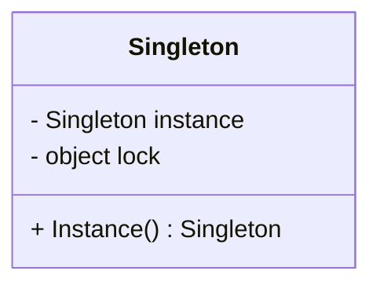
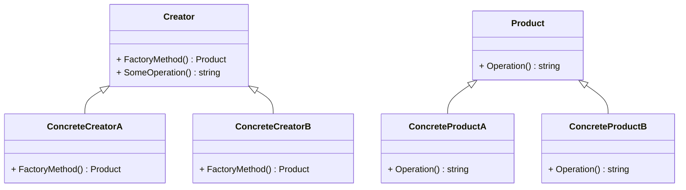
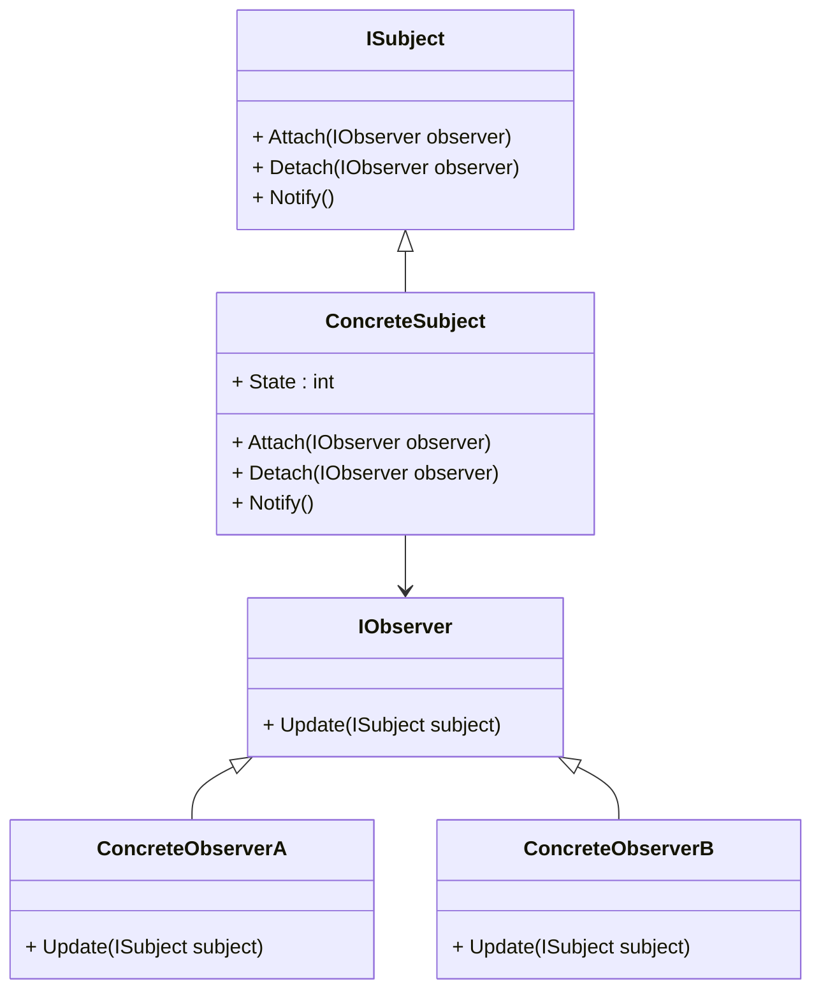

## 20.4 Common Interview Questions on Design Patterns

In the world of software development, understanding design patterns is crucial for building robust, scalable, and maintainable applications. As expert software engineers and enterprise architects, you are expected to have a deep understanding of these patterns, especially when working with C#. This section aims to prepare you for job interviews by providing a comprehensive guide to common interview questions on design patterns. We'll explore sample questions, detailed answers, and practical examples to enhance your understanding and confidence.

### Introduction to Design Patterns in Interviews

Design patterns are a fundamental part of software engineering interviews. They demonstrate your ability to solve common problems in software design using proven solutions. Interviewers often ask about design patterns to assess your problem-solving skills, understanding of object-oriented principles, and ability to apply these concepts in real-world scenarios.

### Sample Interview Questions and Answers

Below are some common interview questions on design patterns, along with detailed answers and code examples in C#. These questions cover a range of patterns, including creational, structural, and behavioral patterns.

#### 1. What is a Singleton Pattern, and how is it implemented in C#?

**Answer:**

The Singleton Pattern ensures that a class has only one instance and provides a global point of access to it. This pattern is useful when exactly one object is needed to coordinate actions across the system.

**Implementation in C#:**

```csharp
public sealed class Singleton
{
    private static Singleton _instance = null;
    private static readonly object _lock = new object();

    // Private constructor to prevent instantiation
    private Singleton() { }

    public static Singleton Instance
    {
        get
        {
            lock (_lock)
            {
                if (_instance == null)
                {
                    _instance = new Singleton();
                }
                return _instance;
            }
        }
    }
}
```

**Key Points:**

- The constructor is private to prevent direct instantiation.
- A static method provides a way to access the instance.
- Thread safety is ensured using a lock.

**Try It Yourself:**

Modify the Singleton class to include a method that returns a unique identifier for the instance. This will help you understand how the Singleton maintains a single instance.

#### 2. Explain the Factory Method Pattern and provide an example in C#.

**Answer:**

The Factory Method Pattern defines an interface for creating an object but lets subclasses alter the type of objects that will be created. It promotes loose coupling by eliminating the need to bind application-specific classes into the code.

**Implementation in C#:**

```csharp
public abstract class Product
{
    public abstract string Operation();
}

public class ConcreteProductA : Product
{
    public override string Operation() => "Result of ConcreteProductA";
}

public class ConcreteProductB : Product
{
    public override string Operation() => "Result of ConcreteProductB";
}

public abstract class Creator
{
    public abstract Product FactoryMethod();

    public string SomeOperation()
    {
        var product = FactoryMethod();
        return $"Creator: The same creator's code has just worked with {product.Operation()}";
    }
}

public class ConcreteCreatorA : Creator
{
    public override Product FactoryMethod() => new ConcreteProductA();
}

public class ConcreteCreatorB : Creator
{
    public override Product FactoryMethod() => new ConcreteProductB();
}
```

**Key Points:**

- The `Creator` class declares the factory method that returns new product objects.
- Subclasses override the factory method to change the resulting product's type.

**Try It Yourself:**

Create additional product classes and corresponding creators to see how the Factory Method Pattern can be extended.

#### 3. What is the Observer Pattern, and how can it be used in C#?

**Answer:**

The Observer Pattern defines a one-to-many dependency between objects so that when one object changes state, all its dependents are notified and updated automatically. This pattern is useful for implementing distributed event-handling systems.

**Implementation in C#:**

```csharp
public interface IObserver
{
    void Update(ISubject subject);
}

public interface ISubject
{
    void Attach(IObserver observer);
    void Detach(IObserver observer);
    void Notify();
}

public class ConcreteSubject : ISubject
{
    public int State { get; set; } = -0;
    private List<IObserver> _observers = new List<IObserver>();

    public void Attach(IObserver observer)
    {
        Console.WriteLine("Subject: Attached an observer.");
        _observers.Add(observer);
    }

    public void Detach(IObserver observer)
    {
        _observers.Remove(observer);
        Console.WriteLine("Subject: Detached an observer.");
    }

    public void Notify()
    {
        Console.WriteLine("Subject: Notifying observers...");

        foreach (var observer in _observers)
        {
            observer.Update(this);
        }
    }
}

public class ConcreteObserverA : IObserver
{
    public void Update(ISubject subject)
    {
        if ((subject as ConcreteSubject).State < 3)
        {
            Console.WriteLine("ConcreteObserverA: Reacted to the event.");
        }
    }
}

public class ConcreteObserverB : IObserver
{
    public void Update(ISubject subject)
    {
        if ((subject as ConcreteSubject).State == 0 || (subject as ConcreteSubject).State >= 2)
        {
            Console.WriteLine("ConcreteObserverB: Reacted to the event.");
        }
    }
}
```

**Key Points:**

- The `ISubject` interface declares methods for attaching and detaching observer objects.
- The `IObserver` interface declares the `Update` method, used by subjects to notify observers.
- Concrete subjects maintain a list of observers and notify them when a change occurs.

**Try It Yourself:**

Implement additional observers and modify the subject's state to see how different observers react to changes.

#### 4. Describe the Decorator Pattern and its use case in C#.

**Answer:**

The Decorator Pattern allows behavior to be added to individual objects, either statically or dynamically, without affecting the behavior of other objects from the same class. It is useful for adhering to the Open/Closed Principle.

**Implementation in C#:**

```csharp
public abstract class Component
{
    public abstract string Operation();
}

public class ConcreteComponent : Component
{
    public override string Operation() => "ConcreteComponent";
}

public abstract class Decorator : Component
{
    protected Component _component;

    public Decorator(Component component)
    {
        _component = component;
    }

    public void SetComponent(Component component)
    {
        _component = component;
    }

    public override string Operation()
    {
        if (_component != null)
        {
            return _component.Operation();
        }
        else
        {
            return string.Empty;
        }
    }
}

public class ConcreteDecoratorA : Decorator
{
    public ConcreteDecoratorA(Component comp) : base(comp) { }

    public override string Operation() => $"ConcreteDecoratorA({base.Operation()})";
}

public class ConcreteDecoratorB : Decorator
{
    public ConcreteDecoratorB(Component comp) : base(comp) { }

    public override string Operation() => $"ConcreteDecoratorB({base.Operation()})";
}
```

**Key Points:**

- The `Component` class defines the interface for objects that can have responsibilities added to them dynamically.
- The `Decorator` class maintains a reference to a `Component` object and defines an interface that conforms to `Component`'s interface.

**Try It Yourself:**

Add more decorators and see how they can be combined to extend the functionality of the `ConcreteComponent`.

#### 5. What is the Strategy Pattern, and how can it be implemented in C#?

**Answer:**

The Strategy Pattern defines a family of algorithms, encapsulates each one, and makes them interchangeable. It lets the algorithm vary independently from clients that use it.

**Implementation in C#:**

```csharp
public interface IStrategy
{
    object DoAlgorithm(object data);
}

public class ConcreteStrategyA : IStrategy
{
    public object DoAlgorithm(object data)
    {
        var list = data as List<string>;
        list.Sort();
        return list;
    }
}

public class ConcreteStrategyB : IStrategy
{
    public object DoAlgorithm(object data)
    {
        var list = data as List<string>;
        list.Sort();
        list.Reverse();
        return list;
    }
}

public class Context
{
    private IStrategy _strategy;

    public Context() { }

    public Context(IStrategy strategy)
    {
        _strategy = strategy;
    }

    public void SetStrategy(IStrategy strategy)
    {
        _strategy = strategy;
    }

    public void DoSomeBusinessLogic()
    {
        Console.WriteLine("Context: Sorting data using the strategy (not sure how it'll do it)");
        var result = _strategy.DoAlgorithm(new List<string> { "a", "b", "c", "d", "e" });

        string resultStr = string.Empty;
        foreach (var element in result as List<string>)
        {
            resultStr += element + ",";
        }

        Console.WriteLine(resultStr);
    }
}
```

**Key Points:**

- The `IStrategy` interface declares operations common to all supported versions of some algorithm.
- Concrete strategies implement the algorithm while following the base strategy interface.
- The `Context` class maintains a reference to one of the strategy objects.

**Try It Yourself:**

Create additional strategies and switch between them in the `Context` to see how the behavior changes.

### Visualizing Design Patterns

To enhance your understanding of these patterns, let's visualize them using Mermaid.js diagrams.

#### Singleton Pattern Diagram



**Description:** This diagram illustrates the Singleton class with a private instance and lock, ensuring only one instance is created.

#### Factory Method Pattern Diagram



**Description:** This diagram shows the relationship between the Creator and Product classes, highlighting the Factory Method Pattern's structure.

#### Observer Pattern Diagram



**Description:** This diagram represents the Observer Pattern, showing how subjects and observers interact.

### Knowledge Check

To reinforce your understanding, consider the following questions:

1. How does the Singleton Pattern ensure only one instance of a class is created?
2. What are the benefits of using the Factory Method Pattern?
3. How does the Observer Pattern facilitate communication between objects?
4. In what scenarios would you use the Decorator Pattern?
5. How does the Strategy Pattern promote flexibility in algorithm selection?

### Conclusion

Understanding design patterns is essential for expert software engineers and enterprise architects. By mastering these patterns, you can build scalable, maintainable, and efficient applications in C#. Remember, this is just the beginning. As you progress, continue to explore and experiment with different patterns to enhance your skills.

## Quiz Time!



### What is the primary purpose of the Singleton Pattern?

- [x] To ensure a class has only one instance.
- [ ] To create a family of related objects.
- [ ] To define a one-to-many dependency between objects.
- [ ] To add behavior to objects dynamically.

> **Explanation:** The Singleton Pattern ensures that a class has only one instance and provides a global point of access to it.

### Which pattern is used to encapsulate a family of algorithms?

- [ ] Observer Pattern
- [x] Strategy Pattern
- [ ] Factory Method Pattern
- [ ] Singleton Pattern

> **Explanation:** The Strategy Pattern defines a family of algorithms, encapsulates each one, and makes them interchangeable.

### How does the Decorator Pattern adhere to the Open/Closed Principle?

- [x] By allowing behavior to be added to individual objects without modifying their code.
- [ ] By ensuring a class has only one instance.
- [ ] By defining a one-to-many dependency between objects.
- [ ] By creating a family of related objects.

> **Explanation:** The Decorator Pattern allows behavior to be added to individual objects without modifying their code, adhering to the Open/Closed Principle.

### What is the role of the `ISubject` interface in the Observer Pattern?

- [x] To declare methods for attaching and detaching observer objects.
- [ ] To encapsulate a family of algorithms.
- [ ] To ensure a class has only one instance.
- [ ] To add behavior to objects dynamically.

> **Explanation:** The `ISubject` interface declares methods for attaching and detaching observer objects in the Observer Pattern.

### In the Factory Method Pattern, what is the purpose of the `Creator` class?

- [x] To declare the factory method that returns new product objects.
- [ ] To ensure a class has only one instance.
- [ ] To define a one-to-many dependency between objects.
- [ ] To add behavior to objects dynamically.

> **Explanation:** The `Creator` class declares the factory method that returns new product objects in the Factory Method Pattern.

### Which pattern is best suited for implementing distributed event-handling systems?

- [ ] Singleton Pattern
- [ ] Factory Method Pattern
- [x] Observer Pattern
- [ ] Decorator Pattern

> **Explanation:** The Observer Pattern is best suited for implementing distributed event-handling systems.

### How does the Strategy Pattern promote flexibility?

- [x] By allowing the algorithm to vary independently from clients that use it.
- [ ] By ensuring a class has only one instance.
- [ ] By defining a one-to-many dependency between objects.
- [ ] By adding behavior to objects dynamically.

> **Explanation:** The Strategy Pattern promotes flexibility by allowing the algorithm to vary independently from clients that use it.

### What is the main advantage of using the Decorator Pattern?

- [x] It allows behavior to be added to individual objects without affecting others.
- [ ] It ensures a class has only one instance.
- [ ] It defines a one-to-many dependency between objects.
- [ ] It creates a family of related objects.

> **Explanation:** The main advantage of the Decorator Pattern is that it allows behavior to be added to individual objects without affecting others.

### Which pattern is used to define a one-to-many dependency between objects?

- [ ] Singleton Pattern
- [ ] Factory Method Pattern
- [x] Observer Pattern
- [ ] Decorator Pattern

> **Explanation:** The Observer Pattern defines a one-to-many dependency between objects.

### True or False: The Factory Method Pattern promotes loose coupling by eliminating the need to bind application-specific classes into the code.

- [x] True
- [ ] False

> **Explanation:** True. The Factory Method Pattern promotes loose coupling by eliminating the need to bind application-specific classes into the code.


