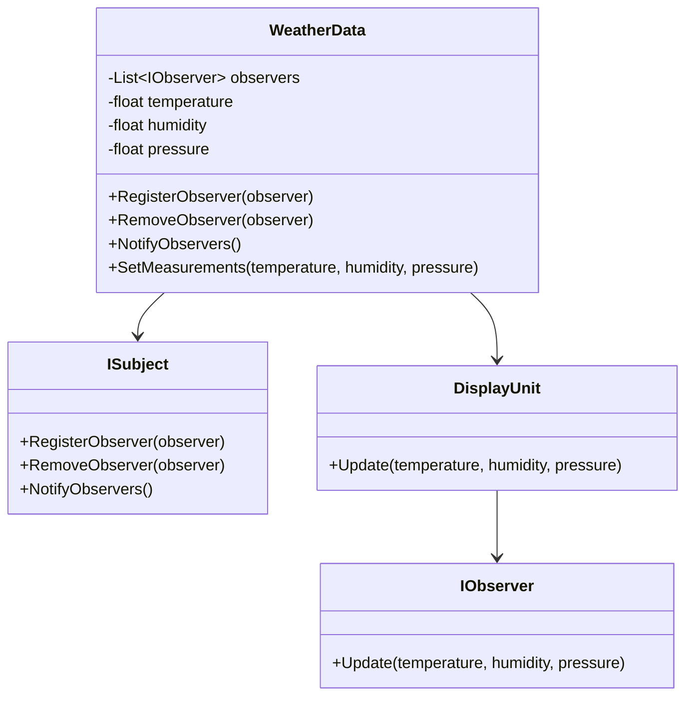

## 20.7 Sample Projects and Code Examples

In this section, we delve into practical applications of C# design patterns through sample projects and code examples. These projects are designed to provide you with a hands-on understanding of how design patterns can be implemented in real-world scenarios. By exploring these examples, you will gain insights into the nuances of each pattern, learn best practices, and understand how to adapt these patterns to your own projects.

### Introduction to Sample Projects

Design patterns are a crucial aspect of software development, providing solutions to common problems and promoting code reusability and maintainability. In this section, we will explore several sample projects that demonstrate the application of various design patterns in C#. Each project is accompanied by detailed explanations and code examples to help you understand the implementation and benefits of using design patterns.

### Project 1: E-Commerce Platform

#### Overview

In this project, we will build a simplified e-commerce platform using a combination of creational, structural, and behavioral design patterns. The platform will include features such as product catalog management, shopping cart functionality, and order processing.

#### Key Design Patterns Used

- **Singleton Pattern**: Used for managing the configuration settings of the application.
- **Factory Method Pattern**: Employed to create different types of products.
- **Observer Pattern**: Utilized for notifying users about order status updates.
- **Strategy Pattern**: Implemented for handling various payment methods.

#### Code Example: Singleton Pattern for Configuration Management

```csharp
public class ConfigurationManager
{
    private static ConfigurationManager _instance;
    private static readonly object _lock = new object();
    private Dictionary<string, string> _settings;

    private ConfigurationManager()
    {
        // Load configuration settings
        _settings = new Dictionary<string, string>
        {
            { "Currency", "USD" },
            { "TaxRate", "0.08" }
        };
    }

    public static ConfigurationManager Instance
    {
        get
        {
            lock (_lock)
            {
                if (_instance == null)
                {
                    _instance = new ConfigurationManager();
                }
                return _instance;
            }
        }
    }

    public string GetSetting(string key)
    {
        return _settings.ContainsKey(key) ? _settings[key] : null;
    }
}
```

#### Try It Yourself

Experiment with adding new configuration settings and retrieving them using the `ConfigurationManager` class. Consider how this pattern ensures that only one instance of the configuration manager exists throughout the application.

### Project 2: Real-Time Chat Application

#### Overview

This project focuses on building a real-time chat application using design patterns that facilitate communication and data flow. The application will support multiple chat rooms and user notifications.

#### Key Design Patterns Used

- **Mediator Pattern**: Centralizes communication between chat participants.
- **Command Pattern**: Encapsulates chat commands for execution.
- **Observer Pattern**: Notifies users of new messages in chat rooms.

#### Code Example: Mediator Pattern for Chat Room Management

```csharp
public interface IChatRoomMediator
{
    void ShowMessage(User user, string message);
}

public class ChatRoom : IChatRoomMediator
{
    public void ShowMessage(User user, string message)
    {
        Console.WriteLine($"{DateTime.Now.ToString("HH:mm")} [{user.Name}]: {message}");
    }
}

public class User
{
    private string _name;
    private IChatRoomMediator _chatRoom;

    public User(string name, IChatRoomMediator chatRoom)
    {
        _name = name;
        _chatRoom = chatRoom;
    }

    public string Name => _name;

    public void SendMessage(string message)
    {
        _chatRoom.ShowMessage(this, message);
    }
}
```

#### Try It Yourself

Create multiple `User` instances and simulate a chat session by sending messages. Observe how the `ChatRoom` mediator manages the communication between users.

### Project 3: Inventory Management System

#### Overview

In this project, we will develop an inventory management system that tracks products, suppliers, and orders. The system will utilize design patterns to ensure efficient data handling and user interactions.

#### Key Design Patterns Used

- **Repository Pattern**: Manages data access and storage.
- **Decorator Pattern**: Adds additional functionality to product objects.
- **Facade Pattern**: Simplifies complex operations for the user interface.

#### Code Example: Repository Pattern for Data Access

```csharp
public interface IProductRepository
{
    void AddProduct(Product product);
    Product GetProductById(int id);
    IEnumerable<Product> GetAllProducts();
}

public class ProductRepository : IProductRepository
{
    private List<Product> _products = new List<Product>();

    public void AddProduct(Product product)
    {
        _products.Add(product);
    }

    public Product GetProductById(int id)
    {
        return _products.FirstOrDefault(p => p.Id == id);
    }

    public IEnumerable<Product> GetAllProducts()
    {
        return _products;
    }
}
```

#### Try It Yourself

Implement additional methods in the `ProductRepository` class, such as updating and deleting products. Consider how the repository pattern abstracts data access logic from the rest of the application.

### Project 4: Weather Monitoring System

#### Overview

This project involves creating a weather monitoring system that collects and displays weather data from various sensors. The system will use design patterns to handle data collection, processing, and presentation.

#### Key Design Patterns Used

- **Observer Pattern**: Notifies display units of weather data changes.
- **Adapter Pattern**: Integrates different sensor data formats.
- **Template Method Pattern**: Defines the steps for data processing.

#### Code Example: Observer Pattern for Weather Data Updates

```csharp
public interface IObserver
{
    void Update(float temperature, float humidity, float pressure);
}

public interface ISubject
{
    void RegisterObserver(IObserver observer);
    void RemoveObserver(IObserver observer);
    void NotifyObservers();
}

public class WeatherData : ISubject
{
    private List<IObserver> _observers;
    private float _temperature;
    private float _humidity;
    private float _pressure;

    public WeatherData()
    {
        _observers = new List<IObserver>();
    }

    public void RegisterObserver(IObserver observer)
    {
        _observers.Add(observer);
    }

    public void RemoveObserver(IObserver observer)
    {
        _observers.Remove(observer);
    }

    public void NotifyObservers()
    {
        foreach (var observer in _observers)
        {
            observer.Update(_temperature, _humidity, _pressure);
        }
    }

    public void SetMeasurements(float temperature, float humidity, float pressure)
    {
        _temperature = temperature;
        _humidity = humidity;
        _pressure = pressure;
        NotifyObservers();
    }
}
```

#### Try It Yourself

Create different display units that implement the `IObserver` interface and register them with the `WeatherData` subject. Simulate weather data changes and observe how the display units are updated.

### Project 5: Online Learning Platform

#### Overview

This project aims to build an online learning platform that offers courses, tracks student progress, and provides assessments. The platform will leverage design patterns to manage course content and user interactions.

#### Key Design Patterns Used

- **Composite Pattern**: Organizes course content into modules and lessons.
- **State Pattern**: Manages student progress through courses.
- **Chain of Responsibility Pattern**: Handles user requests and actions.

#### Code Example: Composite Pattern for Course Content

```csharp
public abstract class CourseComponent
{
    public abstract void Display();
}

public class Lesson : CourseComponent
{
    private string _title;

    public Lesson(string title)
    {
        _title = title;
    }

    public override void Display()
    {
        Console.WriteLine($"Lesson: {_title}");
    }
}

public class Module : CourseComponent
{
    private List<CourseComponent> _components = new List<CourseComponent>();
    private string _name;

    public Module(string name)
    {
        _name = name;
    }

    public void Add(CourseComponent component)
    {
        _components.Add(component);
    }

    public override void Display()
    {
        Console.WriteLine($"Module: {_name}");
        foreach (var component in _components)
        {
            component.Display();
        }
    }
}
```

#### Try It Yourself

Create a course structure using `Module` and `Lesson` objects. Experiment with adding, removing, and displaying course components to understand the flexibility of the composite pattern.

### Visualizing Design Patterns

To enhance your understanding of design patterns, let's visualize some of the key concepts using Mermaid.js diagrams. These diagrams will help you see the relationships and interactions between different components in a pattern.

#### Visualizing the Observer Pattern



**Diagram Description**: This class diagram illustrates the Observer pattern used in the Weather Monitoring System project. The `WeatherData` class implements the `ISubject` interface, while `DisplayUnit` implements the `IObserver` interface. The `WeatherData` class maintains a list of observers and notifies them of any changes in weather data.

### References and Links

For further reading and exploration of design patterns in C#, consider the following resources:

- [Design Patterns: Elements of Reusable Object-Oriented Software](https://www.amazon.com/Design-Patterns-Elements-Reusable-Object-Oriented/dp/0201633612) by Erich Gamma, Richard Helm, Ralph Johnson, and John Vlissides.
- [C# Design Patterns: A Tutorial](https://www.amazon.com/C-Design-Patterns-Tutorial-James/dp/032171895X) by James W. Cooper.
- [Microsoft Docs: Design Patterns](https://docs.microsoft.com/en-us/dotnet/standard/design-patterns/)
- [Refactoring Guru: Design Patterns](https://refactoring.guru/design-patterns)

### Knowledge Check

To reinforce your understanding of the design patterns covered in these projects, consider the following questions:

- How does the Singleton pattern ensure only one instance of a class is created?
- What are the benefits of using the Mediator pattern in a chat application?
- How does the Repository pattern abstract data access logic?
- Why is the Observer pattern suitable for a weather monitoring system?
- How does the Composite pattern facilitate the organization of course content?

### Embrace the Journey

Remember, mastering design patterns is a journey that requires practice and experimentation. As you explore these sample projects, don't hesitate to modify the code, try new patterns, and apply these concepts to your own projects. Keep experimenting, stay curious, and enjoy the journey of becoming a proficient software engineer and enterprise architect!

## Quiz Time!



### What is the primary benefit of using the Singleton pattern?

- [x] Ensures a class has only one instance
- [ ] Allows multiple instances of a class
- [ ] Facilitates communication between objects
- [ ] Simplifies complex operations

> **Explanation:** The Singleton pattern ensures that a class has only one instance and provides a global point of access to it.

### Which pattern is used to centralize communication between chat participants?

- [ ] Observer Pattern
- [x] Mediator Pattern
- [ ] Strategy Pattern
- [ ] Command Pattern

> **Explanation:** The Mediator pattern centralizes communication between chat participants, reducing dependencies between objects.

### What does the Repository pattern abstract?

- [ ] User interface logic
- [x] Data access logic
- [ ] Business logic
- [ ] Configuration settings

> **Explanation:** The Repository pattern abstracts data access logic, providing a clean separation between the data layer and the rest of the application.

### In the Observer pattern, what role does the subject play?

- [x] Notifies observers of changes
- [ ] Updates the state of observers
- [ ] Manages user interactions
- [ ] Encapsulates chat commands

> **Explanation:** In the Observer pattern, the subject notifies observers of changes in its state, allowing them to update accordingly.

### How does the Composite pattern benefit course content organization?

- [x] Facilitates hierarchical organization
- [ ] Simplifies data access
- [ ] Centralizes communication
- [ ] Manages user requests

> **Explanation:** The Composite pattern facilitates hierarchical organization of course content, allowing complex structures to be treated uniformly.

### Which pattern is suitable for handling various payment methods in an e-commerce platform?

- [x] Strategy Pattern
- [ ] Observer Pattern
- [ ] Singleton Pattern
- [ ] Command Pattern

> **Explanation:** The Strategy pattern is suitable for handling various payment methods, allowing different algorithms to be selected at runtime.

### What is the role of the Adapter pattern in a weather monitoring system?

- [x] Integrates different sensor data formats
- [ ] Notifies display units of data changes
- [ ] Manages user interactions
- [ ] Encapsulates chat commands

> **Explanation:** The Adapter pattern integrates different sensor data formats, allowing the system to work with various data sources.

### Which pattern is used to encapsulate chat commands for execution?

- [ ] Observer Pattern
- [ ] Strategy Pattern
- [x] Command Pattern
- [ ] Mediator Pattern

> **Explanation:** The Command pattern encapsulates chat commands for execution, allowing them to be parameterized and queued.

### What is the primary function of the Facade pattern?

- [x] Simplifies complex operations
- [ ] Ensures a class has only one instance
- [ ] Centralizes communication
- [ ] Manages user requests

> **Explanation:** The Facade pattern simplifies complex operations by providing a unified interface to a set of interfaces in a subsystem.

### True or False: The Observer pattern is suitable for real-time data updates.

- [x] True
- [ ] False

> **Explanation:** True. The Observer pattern is suitable for real-time data updates as it allows observers to be notified of changes in the subject's state.


