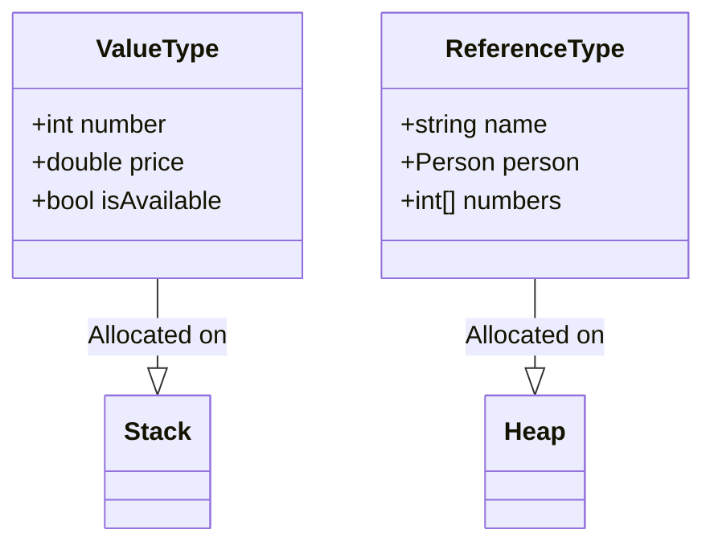

## 3.1 Value Types and Reference Types

In the realm of C# programming, understanding the distinction between value types and reference types is crucial for expert software engineers and enterprise architects. This knowledge not only influences how you design your applications but also affects performance, memory management, and the overall architecture of your software solutions. In this section, we will delve into the intricacies of value types and reference types, explore their characteristics, and provide best practices for their use in C#.

### Introduction to Value Types and Reference Types

C# is a statically typed language, meaning that every variable and object has a specific type known at compile time. These types are broadly categorized into two groups: value types and reference types. Understanding these categories is essential for effective memory management and efficient application design.

#### Value Types

Value types are data types that hold their value directly in memory. When you assign a value type to a variable, the actual data is stored in that variable. Common examples of value types include:

- **Primitive Data Types**: `int`, `double`, `bool`, `char`, etc.
- **Structs**: User-defined value types that can contain multiple fields and methods.

#### Reference Types

Reference types, on the other hand, store a reference to the actual data. When you assign a reference type to a variable, the variable holds a reference (or pointer) to the memory location where the data is stored. Common examples of reference types include:

- **Classes**: User-defined types that can contain fields, properties, methods, and events.
- **Arrays**: Collections of elements of the same type.
- **Strings**: Immutable sequences of characters.
- **Delegates**: Types that represent references to methods.

### Memory Allocation and Management

Understanding how value types and reference types are allocated in memory is key to mastering their use in C#. Let's explore how these types are managed in memory.

#### Stack and Heap

C# uses two primary areas of memory for allocation: the stack and the heap.

- **Stack**: The stack is a region of memory that stores value types and method call information. It operates in a last-in, first-out (LIFO) manner, making it efficient for storing temporary data. Value types are typically allocated on the stack, which allows for fast access and deallocation.

- **Heap**: The heap is a larger region of memory used for dynamic memory allocation. Reference types are allocated on the heap, and the garbage collector manages their lifecycle. The heap allows for more flexible memory management but can be slower due to the overhead of garbage collection.

#### Value Types on the Stack

When a value type is declared, its memory is allocated on the stack. Consider the following example:

```csharp
int number = 42;
```

In this case, the integer `number` is stored directly on the stack, and its value `42` is held in the memory location associated with `number`.

#### Reference Types on the Heap

Reference types are allocated on the heap, and the variable holds a reference to the memory location. Consider the following example:

```csharp
class Person
{
    public string Name { get; set; }
}

Person person = new Person();
person.Name = "Alice";
```

Here, the `Person` object is allocated on the heap, and the variable `person` holds a reference to the memory location of the `Person` object. The `Name` property is also a reference type, stored on the heap.

### Differences Between Value Types and Reference Types

Understanding the differences between value types and reference types is crucial for making informed decisions in your software design. Let's explore these differences in detail.

#### Assignment Behavior

- **Value Types**: When you assign a value type to another variable, a copy of the value is made. Changes to one variable do not affect the other.

  ```csharp
  int a = 10;
  int b = a;
  b = 20;
  // a is still 10
  ```

- **Reference Types**: When you assign a reference type to another variable, both variables refer to the same object in memory. Changes to one variable affect the other.

  ```csharp
  Person person1 = new Person();
  Person person2 = person1;
  person2.Name = "Bob";
  // person1.Name is also "Bob"
  ```

#### Nullability

- **Value Types**: By default, value types cannot be null. However, C# provides nullable value types using the `Nullable<T>` structure or the `?` syntax.

  ```csharp
  int? nullableInt = null;
  ```

- **Reference Types**: Reference types can be null, indicating that they do not reference any object.

  ```csharp
  Person person = null;
  ```

#### Performance Considerations

- **Value Types**: Value types are generally more efficient in terms of memory usage and performance because they are allocated on the stack. However, they can lead to increased memory usage if used in large collections.

- **Reference Types**: Reference types can be more flexible and powerful, but they incur the overhead of heap allocation and garbage collection. They are better suited for complex data structures and objects that require dynamic memory management.

### Structs: The Value Type Powerhouse

Structs are user-defined value types that can contain multiple fields and methods. They are ideal for representing small, lightweight objects that do not require the overhead of heap allocation. Let's explore the characteristics and use cases of structs in C#.

#### Defining a Struct

A struct is defined using the `struct` keyword. Consider the following example:

```csharp
public struct Point
{
    public int X { get; set; }
    public int Y { get; set; }

    public Point(int x, int y)
    {
        X = x;
        Y = y;
    }

    public double DistanceTo(Point other)
    {
        int dx = X - other.X;
        int dy = Y - other.Y;
        return Math.Sqrt(dx * dx + dy * dy);
    }
}
```

In this example, we define a `Point` struct with two properties, `X` and `Y`, and a method `DistanceTo` that calculates the distance to another point.

#### Characteristics of Structs

- **Value Type**: Structs are value types, meaning they are allocated on the stack and copied by value.
- **No Inheritance**: Structs do not support inheritance, but they can implement interfaces.
- **Immutability**: Structs are often used to represent immutable data structures, where the state does not change after creation.

#### Use Cases for Structs

Structs are ideal for scenarios where you need lightweight, immutable objects that do not require the overhead of heap allocation. Common use cases include:

- **Mathematical and Geometric Data**: Points, vectors, and matrices.
- **Small Data Structures**: RGB colors, dates, and times.
- **Performance-Critical Applications**: Games and real-time simulations.

### Classes: The Reference Type Workhorse

Classes are user-defined reference types that provide a powerful and flexible way to define complex data structures and objects. Let's explore the characteristics and use cases of classes in C#.

#### Defining a Class

A class is defined using the `class` keyword. Consider the following example:

```csharp
public class Car
{
    public string Make { get; set; }
    public string Model { get; set; }
    public int Year { get; set; }

    public void Start()
    {
        Console.WriteLine("Car started.");
    }

    public void Stop()
    {
        Console.WriteLine("Car stopped.");
    }
}
```

In this example, we define a `Car` class with three properties, `Make`, `Model`, and `Year`, and two methods, `Start` and `Stop`.

#### Characteristics of Classes

- **Reference Type**: Classes are reference types, meaning they are allocated on the heap and accessed through references.
- **Inheritance**: Classes support inheritance, allowing you to create hierarchies of related types.
- **Encapsulation**: Classes provide encapsulation, allowing you to hide implementation details and expose only the necessary interface.

#### Use Cases for Classes

Classes are ideal for scenarios where you need complex, mutable objects that require dynamic memory management. Common use cases include:

- **Business Logic and Domain Models**: Customer, order, and product entities.
- **User Interface Components**: Windows, buttons, and controls.
- **Data Access and Services**: Repositories, services, and data transfer objects.

### Best Practices for Using Value Types and Reference Types

Choosing between value types and reference types is a critical decision that can impact the performance, maintainability, and scalability of your applications. Here are some best practices to consider:

#### Use Value Types for Small, Immutable Data

- **Small Size**: Use value types for small data structures that do not require the overhead of heap allocation.
- **Immutability**: Favor immutable value types to ensure thread safety and reduce the risk of unintended side effects.

#### Use Reference Types for Complex, Mutable Data

- **Complexity**: Use reference types for complex data structures that require dynamic memory management and encapsulation.
- **Mutability**: Favor reference types for objects that need to change state over time.

#### Consider Performance and Memory Usage

- **Performance**: Consider the performance implications of using value types and reference types, especially in performance-critical applications.
- **Memory Usage**: Be mindful of memory usage, especially when using large collections of value types.

### Visualizing Value Types and Reference Types

To enhance your understanding of value types and reference types, let's visualize their memory allocation and behavior using a class diagram.



In this diagram, we see that value types are allocated on the stack, while reference types are allocated on the heap. This visualization helps illustrate the fundamental differences in memory allocation and management.

### Try It Yourself

To solidify your understanding of value types and reference types, try modifying the following code examples:

1. **Experiment with Structs**: Create a struct to represent a 3D point with `X`, `Y`, and `Z` coordinates. Add a method to calculate the distance to another 3D point.

2. **Explore Classes**: Create a class to represent a bank account with properties for the account number, balance, and owner. Add methods to deposit and withdraw funds.

3. **Compare Behavior**: Create a value type and a reference type with similar properties. Assign them to new variables and observe how changes to one variable affect the other.

### Knowledge Check

Before we conclude, let's pose some questions to reinforce your understanding of value types and reference types:

- What are the key differences between value types and reference types in terms of memory allocation?
- How does the assignment behavior differ between value types and reference types?
- When should you use structs instead of classes, and vice versa?

### Conclusion

Understanding the differences between value types and reference types is fundamental to mastering C# programming. By leveraging the strengths of each type, you can design efficient, scalable, and maintainable applications. Remember, this is just the beginning. As you progress, you'll build more complex and interactive applications. Keep experimenting, stay curious, and enjoy the journey!

## Quiz Time!



### What is the primary difference between value types and reference types in C#?

- [x] Value types store data directly, while reference types store references to data.
- [ ] Value types are always immutable, while reference types are mutable.
- [ ] Value types are stored on the heap, while reference types are stored on the stack.
- [ ] Value types can be null, while reference types cannot.

> **Explanation:** Value types store data directly in memory, whereas reference types store references to the actual data in memory.

### Where are value types typically allocated in memory?

- [x] On the stack
- [ ] On the heap
- [ ] In the global memory space
- [ ] In the CPU cache

> **Explanation:** Value types are typically allocated on the stack, which allows for fast access and deallocation.

### Which of the following is a characteristic of structs in C#?

- [x] Structs are value types.
- [ ] Structs support inheritance.
- [ ] Structs are always mutable.
- [ ] Structs are reference types.

> **Explanation:** Structs are value types, meaning they are allocated on the stack and copied by value.

### What happens when you assign a reference type to another variable?

- [x] Both variables refer to the same object in memory.
- [ ] A copy of the object is made.
- [ ] The original object is deleted.
- [ ] The reference is converted to a value type.

> **Explanation:** When you assign a reference type to another variable, both variables refer to the same object in memory.

### Which of the following is a common use case for classes in C#?

- [x] Business logic and domain models
- [ ] Small, immutable data structures
- [ ] Mathematical and geometric data
- [ ] Performance-critical applications

> **Explanation:** Classes are ideal for scenarios where you need complex, mutable objects that require dynamic memory management, such as business logic and domain models.

### How can you make a value type nullable in C#?

- [x] Use the `Nullable<T>` structure or the `?` syntax.
- [ ] Use the `null` keyword directly.
- [ ] Use the `new` keyword.
- [ ] Use the `void` keyword.

> **Explanation:** C# provides nullable value types using the `Nullable<T>` structure or the `?` syntax.

### What is a key advantage of using value types in performance-critical applications?

- [x] They are allocated on the stack, allowing for fast access and deallocation.
- [ ] They support inheritance, allowing for code reuse.
- [ ] They are always immutable, ensuring thread safety.
- [ ] They are stored on the heap, allowing for dynamic memory management.

> **Explanation:** Value types are allocated on the stack, which allows for fast access and deallocation, making them suitable for performance-critical applications.

### Which of the following is a best practice for using reference types?

- [x] Use reference types for complex, mutable data structures.
- [ ] Use reference types for small, immutable data structures.
- [ ] Avoid using reference types in business logic.
- [ ] Use reference types only for mathematical data.

> **Explanation:** Reference types are ideal for complex, mutable data structures that require dynamic memory management.

### What is the role of the garbage collector in managing reference types?

- [x] It automatically manages the lifecycle of objects on the heap.
- [ ] It allocates memory for value types.
- [ ] It converts reference types to value types.
- [ ] It ensures that value types are always immutable.

> **Explanation:** The garbage collector automatically manages the lifecycle of objects on the heap, freeing memory when objects are no longer in use.

### True or False: Value types can be null by default in C#.

- [ ] True
- [x] False

> **Explanation:** By default, value types cannot be null in C#. However, C# provides nullable value types using the `Nullable<T>` structure or the `?` syntax.


