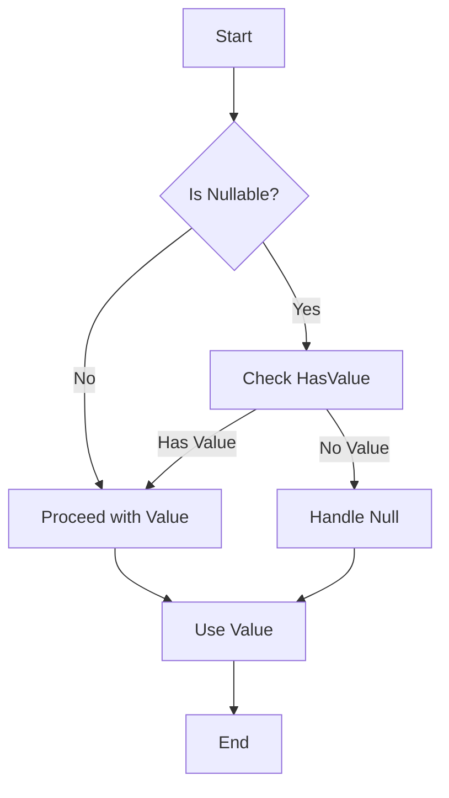

## 3.10 Nullable Types and Null Safety

In the realm of C# programming, dealing with null values is a common challenge that can lead to runtime errors if not handled properly. This section delves into the concepts of nullable types and null safety, providing expert software engineers and enterprise architects with the knowledge to effectively manage null values and prevent null reference exceptions. We will explore the introduction of nullable reference types in C# 8.0 and how they enhance the language's ability to handle nulls safely.

### Understanding Null in C#

Null is a special value in C# that represents the absence of a value. It is often used to indicate that a variable has not been initialized or that an object reference does not point to any object. However, improper handling of null values can lead to null reference exceptions, which are a common source of bugs in C# applications.

#### Null Reference Exceptions

A null reference exception occurs when you attempt to access a member of an object that is null. This can happen in various scenarios, such as calling a method on a null object, accessing a property, or using an indexer. To prevent these exceptions, it is crucial to implement null safety practices.

### Nullable Value Types

C# provides nullable value types to allow value types to represent null values. This is particularly useful for database operations and scenarios where a value may be optional.

#### Defining Nullable Value Types

To define a nullable value type, you append a question mark `?` to the type. For example, `int?` is a nullable integer, which can hold any integer value or null.

```csharp
int? nullableInt = null;
if (nullableInt.HasValue)
{
    Console.WriteLine($"Value: {nullableInt.Value}");
}
else
{
    Console.WriteLine("No value assigned.");
}
```

In this example, `nullableInt` is a nullable integer that can be checked for a value using the `HasValue` property.

#### Working with Nullable Value Types

Nullable value types provide several properties and methods to work with nulls:

- **HasValue**: Indicates whether the nullable type has a value.
- **Value**: Retrieves the value if `HasValue` is true; otherwise, it throws an exception.
- **GetValueOrDefault()**: Returns the value if `HasValue` is true; otherwise, it returns the default value of the underlying type.

```csharp
int? nullableInt = 5;
Console.WriteLine(nullableInt.GetValueOrDefault()); // Outputs: 5

nullableInt = null;
Console.WriteLine(nullableInt.GetValueOrDefault()); // Outputs: 0
```

### Nullable Reference Types in C# 8.0

With the introduction of C# 8.0, nullable reference types were introduced to enhance null safety. This feature allows developers to explicitly define whether a reference type can be null, helping to prevent null reference exceptions at compile time.

#### Enabling Nullable Reference Types

Nullable reference types are an opt-in feature. To enable them, you need to add the following directive to your project file or at the top of your C# file:

```csharp
#nullable enable
```

Once enabled, you can use the `?` syntax to indicate that a reference type can be null.

```csharp
string? nullableString = null;
```

#### Non-Nullable Reference Types

By default, reference types are considered non-nullable when nullable reference types are enabled. This means that you cannot assign null to them without a warning.

```csharp
string nonNullableString = "Hello";
// nonNullableString = null; // This will produce a warning
```

#### Nullability Annotations

C# 8.0 introduces nullability annotations to indicate the nullability of reference types. These annotations help the compiler understand the intent of the code and provide warnings when nullability rules are violated.

- **Nullable Reference Type (`T?`)**: Indicates that a reference type can be null.
- **Non-Nullable Reference Type (`T`)**: Indicates that a reference type cannot be null.

#### Nullability Contexts

Nullability contexts determine how nullability annotations are interpreted. There are three contexts:

- **Enabled**: Nullable reference types are enabled, and nullability annotations are enforced.
- **Disabled**: Nullable reference types are disabled, and nullability annotations are ignored.
- **Warnings**: Nullable reference types are enabled, but only warnings are generated for nullability violations.

### Null Safety Practices

To ensure null safety in your C# applications, consider adopting the following practices:

#### Use Null-Conditional Operators

The null-conditional operator `?.` allows you to safely access members of an object that may be null. If the object is null, the operation returns null instead of throwing an exception.

```csharp
string? name = null;
int? length = name?.Length;
Console.WriteLine(length); // Outputs: null
```

#### Use Null-Coalescing Operators

The null-coalescing operator `??` provides a default value when a nullable type is null.

```csharp
string? name = null;
string displayName = name ?? "Unknown";
Console.WriteLine(displayName); // Outputs: Unknown
```

#### Use Null-Coalescing Assignment

Introduced in C# 8.0, the null-coalescing assignment operator `??=` assigns a value to a variable if it is null.

```csharp
string? name = null;
name ??= "Default Name";
Console.WriteLine(name); // Outputs: Default Name
```

#### Implement Defensive Programming

Defensive programming involves checking for null values before accessing members of an object. This can be done using `if` statements or the `null` keyword.

```csharp
void PrintName(string? name)
{
    if (name == null)
    {
        Console.WriteLine("Name is null.");
    }
    else
    {
        Console.WriteLine($"Name: {name}");
    }
}
```

### Visualizing Null Safety

To better understand how null safety works in C#, let's visualize the flow of nullability checks using a flowchart.



This flowchart illustrates the decision-making process when dealing with nullable types, ensuring that null values are handled appropriately.

### Try It Yourself

Experiment with the following code snippets to reinforce your understanding of nullable types and null safety. Try modifying the code to see how different scenarios affect the output.

```csharp
int? nullableInt = null;
Console.WriteLine(nullableInt.GetValueOrDefault()); // Outputs: 0

nullableInt = 10;
Console.WriteLine(nullableInt.GetValueOrDefault()); // Outputs: 10

string? nullableString = null;
string displayName = nullableString ?? "Default Name";
Console.WriteLine(displayName); // Outputs: Default Name

nullableString = "John Doe";
displayName = nullableString ?? "Default Name";
Console.WriteLine(displayName); // Outputs: John Doe
```

### Knowledge Check

Let's reinforce your understanding with a few questions:

- What is a null reference exception, and how can it be prevented?
- How do nullable value types differ from nullable reference types?
- What are the benefits of enabling nullable reference types in C# 8.0?
- How does the null-conditional operator enhance null safety?
- What is the purpose of the null-coalescing operator?

### Embrace the Journey

Remember, mastering nullable types and null safety is a crucial step in becoming an expert C# developer. As you continue to explore these concepts, you'll build more robust and error-free applications. Keep experimenting, stay curious, and enjoy the journey!

### References and Links

For further reading and exploration, consider the following resources:

- [Microsoft Docs: Nullable Value Types](https://docs.microsoft.com/en-us/dotnet/csharp/language-reference/builtin-types/nullable-value-types)
- [Microsoft Docs: Nullable Reference Types](https://docs.microsoft.com/en-us/dotnet/csharp/nullable-references)
- [C# 8.0 Nullable Reference Types](https://docs.microsoft.com/en-us/dotnet/csharp/whats-new/csharp-8#nullable-reference-types)

## Quiz Time!



### What is a null reference exception?

- [x] An error that occurs when attempting to access a member of a null object.
- [ ] An error that occurs when a variable is not initialized.
- [ ] An error that occurs when a method is called with incorrect parameters.
- [ ] An error that occurs when a file is not found.

> **Explanation:** A null reference exception occurs when you try to access a member of an object that is null.

### How do you define a nullable value type in C#?

- [x] By appending a question mark `?` to the type.
- [ ] By using the `Nullable` keyword.
- [ ] By using the `null` keyword.
- [ ] By using the `optional` keyword.

> **Explanation:** A nullable value type is defined by appending a question mark `?` to the type, such as `int?`.

### What is the purpose of the null-coalescing operator `??`?

- [x] To provide a default value when a nullable type is null.
- [ ] To check if a variable is null.
- [ ] To convert a value type to a reference type.
- [ ] To concatenate two strings.

> **Explanation:** The null-coalescing operator `??` is used to provide a default value when a nullable type is null.

### How do you enable nullable reference types in C# 8.0?

- [x] By adding `#nullable enable` to the code.
- [ ] By using the `Nullable` keyword.
- [ ] By setting a compiler flag.
- [ ] By using the `null` keyword.

> **Explanation:** Nullable reference types are enabled by adding `#nullable enable` to the code.

### What does the null-conditional operator `?.` do?

- [x] Safely accesses members of an object that may be null.
- [ ] Converts a value type to a reference type.
- [ ] Checks if a variable is null.
- [ ] Concatenates two strings.

> **Explanation:** The null-conditional operator `?.` safely accesses members of an object that may be null, returning null if the object is null.

### What is the default value returned by `GetValueOrDefault()` for a nullable integer with no value?

- [x] 0
- [ ] null
- [ ] -1
- [ ] 1

> **Explanation:** `GetValueOrDefault()` returns the default value of the underlying type, which is 0 for an integer.

### What is the benefit of using nullable reference types?

- [x] They help prevent null reference exceptions at compile time.
- [ ] They allow value types to represent null values.
- [ ] They improve performance by reducing memory usage.
- [ ] They simplify the syntax of the code.

> **Explanation:** Nullable reference types help prevent null reference exceptions at compile time by providing warnings for nullability violations.

### What is the purpose of the null-coalescing assignment operator `??=`?

- [x] To assign a value to a variable if it is null.
- [ ] To check if a variable is null.
- [ ] To convert a value type to a reference type.
- [ ] To concatenate two strings.

> **Explanation:** The null-coalescing assignment operator `??=` assigns a value to a variable if it is null.

### How can you check if a nullable value type has a value?

- [x] By using the `HasValue` property.
- [ ] By using the `null` keyword.
- [ ] By using the `Nullable` keyword.
- [ ] By using the `optional` keyword.

> **Explanation:** The `HasValue` property indicates whether a nullable value type has a value.

### True or False: By default, reference types are considered nullable when nullable reference types are enabled.

- [ ] True
- [x] False

> **Explanation:** By default, reference types are considered non-nullable when nullable reference types are enabled.


