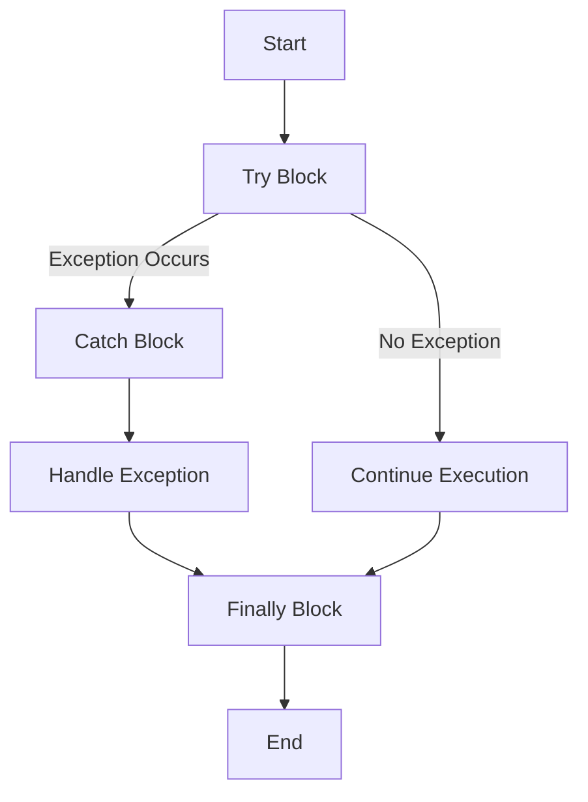

## 3.11 Exception Handling Best Practices

In the realm of software development, handling exceptions effectively is crucial for building robust and maintainable applications. C#, with its rich set of features, provides a powerful mechanism for exception handling. In this section, we will delve into best practices for managing exceptions in C#, focusing on the use of `try`, `catch`, `finally`, and custom exceptions. By mastering these techniques, you can enhance the reliability and user experience of your applications.

### Understanding Exceptions in C#

Before we dive into best practices, let's establish a solid understanding of what exceptions are and why they matter. Exceptions are runtime anomalies or unexpected conditions that disrupt the normal flow of a program. They can arise from various sources, such as invalid user input, unavailable resources, or logical errors in the code.

#### Key Concepts

- **Exception Hierarchy**: In C#, exceptions are objects derived from the `System.Exception` class. This hierarchy allows for a structured approach to handling different types of exceptions.
- **Common Exceptions**: Some common exceptions include `NullReferenceException`, `ArgumentException`, `InvalidOperationException`, and `IOException`.
- **Unchecked vs. Checked Exceptions**: Unlike some languages, C# does not have checked exceptions. All exceptions are unchecked, meaning they do not need to be declared or caught explicitly.

### Implementing `try`, `catch`, `finally`

The `try`, `catch`, and `finally` blocks form the cornerstone of exception handling in C#. Let's explore how to use them effectively.

#### The `try` Block

The `try` block contains the code that may potentially throw an exception. It acts as a safeguard, allowing you to isolate risky operations.

```csharp
try
{
    // Code that may throw an exception
    int result = Divide(10, 0);
}
```

#### The `catch` Block

The `catch` block is used to handle exceptions that occur within the `try` block. You can have multiple `catch` blocks to handle different types of exceptions.

```csharp
catch (DivideByZeroException ex)
{
    Console.WriteLine("Cannot divide by zero.");
}
catch (Exception ex)
{
    Console.WriteLine("An error occurred: " + ex.Message);
}
```

#### The `finally` Block

The `finally` block is optional and is used to execute code regardless of whether an exception is thrown. It's typically used for cleanup operations, such as closing files or releasing resources.

```csharp
finally
{
    Console.WriteLine("Execution completed.");
}
```

### Best Practices for Exception Handling

Now that we understand the basics, let's explore best practices for handling exceptions in C#.

#### 1. Use Specific Exceptions

Always catch specific exceptions rather than the generic `Exception` class. This approach allows for more precise error handling and better debugging.

```csharp
catch (FileNotFoundException ex)
{
    Console.WriteLine("File not found: " + ex.FileName);
}
```

#### 2. Avoid Swallowing Exceptions

Swallowing exceptions by catching them without taking any action can lead to silent failures and make debugging difficult. Always log or handle exceptions appropriately.

```csharp
catch (Exception ex)
{
    // Log the exception
    Console.WriteLine("An error occurred: " + ex.Message);
}
```

#### 3. Use `finally` for Cleanup

Ensure that resources are released properly by using the `finally` block. This is especially important for unmanaged resources like file handles or database connections.

```csharp
FileStream fileStream = null;
try
{
    fileStream = new FileStream("file.txt", FileMode.Open);
    // Perform file operations
}
catch (IOException ex)
{
    Console.WriteLine("File operation failed: " + ex.Message);
}
finally
{
    fileStream?.Close();
}
```

#### 4. Create Custom Exceptions

For domain-specific errors, create custom exception classes. This practice enhances code readability and provides more context about the error.

```csharp
public class InvalidUserInputException : Exception
{
    public InvalidUserInputException(string message) : base(message) { }
}
```

#### 5. Preserve the Stack Trace

When rethrowing exceptions, use the `throw` keyword without specifying the exception variable to preserve the original stack trace.

```csharp
catch (Exception ex)
{
    // Perform some logging
    throw; // Preserves the stack trace
}
```

#### 6. Avoid Using Exceptions for Control Flow

Exceptions should not be used for controlling the flow of a program. They are meant for exceptional conditions, not regular logic.

```csharp
// Avoid this pattern
try
{
    // Check if a condition is met
}
catch (SomeExpectedException)
{
    // Handle expected condition
}
```

#### 7. Document Exception Behavior

Clearly document the exceptions that a method can throw. This practice aids in understanding the method's behavior and helps other developers handle exceptions appropriately.

```csharp
/// <summary>
/// Divides two numbers.
/// </summary>
/// <param name="numerator">The numerator.</param>
/// <param name="denominator">The denominator.</param>
/// <returns>The result of the division.</returns>
/// <exception cref="DivideByZeroException">Thrown when the denominator is zero.</exception>
public int Divide(int numerator, int denominator)
{
    if (denominator == 0)
        throw new DivideByZeroException();
    return numerator / denominator;
}
```

### Advanced Exception Handling Techniques

As you become more proficient in exception handling, consider these advanced techniques to further enhance your applications.

#### 1. Global Exception Handling

Implement global exception handling to catch unhandled exceptions at the application level. This is particularly useful for logging and displaying user-friendly error messages.

```csharp
AppDomain.CurrentDomain.UnhandledException += (sender, args) =>
{
    Exception ex = (Exception)args.ExceptionObject;
    Console.WriteLine("Unhandled exception: " + ex.Message);
};
```

#### 2. Exception Filters

C# 6.0 introduced exception filters, allowing you to specify conditions for catching exceptions. This feature enables more granular control over exception handling.

```csharp
catch (Exception ex) when (ex is IOException && ex.Message.Contains("disk full"))
{
    Console.WriteLine("Disk is full. Please free up space.");
}
```

#### 3. Asynchronous Exception Handling

When working with asynchronous code, handle exceptions using `try`/`catch` within `async` methods. Remember that exceptions in asynchronous methods are propagated to the `Task` object.

```csharp
public async Task ReadFileAsync(string filePath)
{
    try
    {
        using (StreamReader reader = new StreamReader(filePath))
        {
            string content = await reader.ReadToEndAsync();
            Console.WriteLine(content);
        }
    }
    catch (IOException ex)
    {
        Console.WriteLine("Error reading file: " + ex.Message);
    }
}
```

### Visualizing Exception Handling Flow

To better understand the flow of exception handling, let's visualize it using a flowchart. This diagram illustrates the sequence of operations when an exception occurs.



**Figure 1**: Exception Handling Flowchart

### Try It Yourself

To solidify your understanding, try modifying the following code example. Experiment with different types of exceptions and observe how the program behaves.

```csharp
public static void Main()
{
    try
    {
        Console.WriteLine("Enter a number:");
        int number = int.Parse(Console.ReadLine());
        Console.WriteLine("Result: " + Divide(100, number));
    }
    catch (FormatException ex)
    {
        Console.WriteLine("Invalid input. Please enter a valid number.");
    }
    catch (DivideByZeroException ex)
    {
        Console.WriteLine("Cannot divide by zero.");
    }
    finally
    {
        Console.WriteLine("Program execution completed.");
    }
}

public static int Divide(int numerator, int denominator)
{
    return numerator / denominator;
}
```

### Knowledge Check

To reinforce your learning, consider these questions:

- What is the purpose of the `finally` block in exception handling?
- Why is it important to catch specific exceptions rather than the generic `Exception` class?
- How can you preserve the stack trace when rethrowing an exception?

### Embrace the Journey

Remember, mastering exception handling is a journey. As you continue to develop your skills, you'll build more resilient and user-friendly applications. Keep experimenting, stay curious, and enjoy the process!

### Summary

In this section, we've explored best practices for exception handling in C#. By using specific exceptions, avoiding exception swallowing, and employing `finally` for cleanup, you can enhance the robustness of your applications. Additionally, advanced techniques like global exception handling and exception filters provide further control over error management. As you apply these practices, you'll create software that is both reliable and maintainable.

## Quiz Time!



### What is the primary purpose of the `finally` block in exception handling?

- [x] To execute code regardless of whether an exception is thrown
- [ ] To catch specific exceptions
- [ ] To log exceptions
- [ ] To rethrow exceptions

> **Explanation:** The `finally` block is used to execute code regardless of whether an exception is thrown, typically for cleanup operations.

### Why should you avoid catching the generic `Exception` class?

- [x] It can lead to silent failures and make debugging difficult
- [ ] It is not supported in C#
- [ ] It is more efficient to catch specific exceptions
- [ ] It is a syntax error

> **Explanation:** Catching the generic `Exception` class can lead to silent failures and make debugging difficult. It's better to catch specific exceptions for precise error handling.

### How can you preserve the stack trace when rethrowing an exception?

- [x] Use the `throw` keyword without specifying the exception variable
- [ ] Use `throw ex;`
- [ ] Use `rethrow;`
- [ ] Use `throw new Exception();`

> **Explanation:** Using the `throw` keyword without specifying the exception variable preserves the original stack trace.

### What is a common use case for custom exceptions?

- [x] To provide more context about domain-specific errors
- [ ] To replace built-in exceptions
- [ ] To handle all exceptions in a single catch block
- [ ] To improve performance

> **Explanation:** Custom exceptions provide more context about domain-specific errors, enhancing code readability and understanding.

### Which of the following is NOT a best practice for exception handling?

- [ ] Use specific exceptions
- [ ] Avoid swallowing exceptions
- [ ] Use exceptions for control flow
- [x] Document exception behavior

> **Explanation:** Using exceptions for control flow is not a best practice. Exceptions should be used for exceptional conditions, not regular logic.

### What is the benefit of using exception filters in C#?

- [x] They allow for more granular control over exception handling
- [ ] They improve performance
- [ ] They are required for asynchronous code
- [ ] They replace the need for `catch` blocks

> **Explanation:** Exception filters allow for more granular control over exception handling by specifying conditions for catching exceptions.

### How do you handle exceptions in asynchronous methods?

- [x] Use `try`/`catch` within `async` methods
- [ ] Use `await` to catch exceptions
- [ ] Use `Task.Catch()`
- [ ] Use `async` keyword in `catch` block

> **Explanation:** In asynchronous methods, exceptions are handled using `try`/`catch` within the `async` methods.

### What is a common mistake when using exceptions?

- [x] Using exceptions for control flow
- [ ] Logging exceptions
- [ ] Creating custom exceptions
- [ ] Using `finally` for cleanup

> **Explanation:** Using exceptions for control flow is a common mistake. Exceptions should be reserved for exceptional conditions.

### What is the role of global exception handling?

- [x] To catch unhandled exceptions at the application level
- [ ] To replace `try`/`catch` blocks
- [ ] To improve performance
- [ ] To handle exceptions in specific methods

> **Explanation:** Global exception handling is used to catch unhandled exceptions at the application level, useful for logging and displaying user-friendly error messages.

### True or False: C# has checked exceptions that must be declared or caught explicitly.

- [ ] True
- [x] False

> **Explanation:** False. C# does not have checked exceptions. All exceptions are unchecked, meaning they do not need to be declared or caught explicitly.


