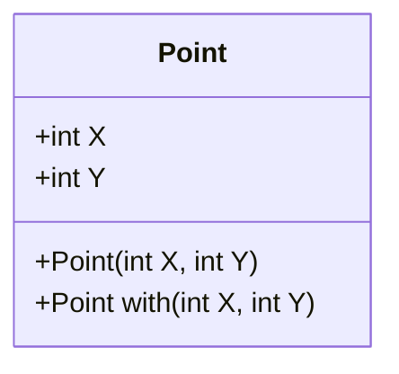

## 3.12 Records and Immutability in C# 9.0+

In the ever-evolving landscape of C#, the introduction of records in C# 9.0 marks a significant milestone. Records provide a concise way to define immutable data structures, which are pivotal in modern software development, especially in multi-threaded and concurrent applications. In this section, we will delve into the concept of records, their syntax, and their benefits, particularly focusing on immutability and its advantages in multi-threaded environments.

### Understanding Records in C# 9.0

Records are a new reference type in C# 9.0 designed to simplify the creation of immutable objects. Unlike traditional classes, records are intended to represent data rather than behavior. They are particularly useful for scenarios where you need to encapsulate data with minimal boilerplate code.

#### Syntax and Declaration

To declare a record in C#, you use the `record` keyword. Here is a basic example:

```csharp
public record Person(string FirstName, string LastName);
```

This single line of code creates a record with two properties: `FirstName` and `LastName`. The compiler automatically generates several methods for you, including:

- A constructor that initializes the properties.
- `Equals` and `GetHashCode` methods for value-based equality.
- A `ToString` method that returns a string representation of the record.
- A `Clone` method for creating copies of the record with modifications.

#### Positional Records

The example above demonstrates a positional record, where the properties are defined in the parameter list of the record declaration. This approach is concise and ideal for simple data structures.

#### Traditional Record Syntax

Alternatively, you can define records using a more traditional syntax, similar to classes:

```csharp
public record Person
{
    public string FirstName { get; init; }
    public string LastName { get; init; }
}
```

In this syntax, the `init` accessor is used to indicate that the properties can only be set during object initialization, reinforcing immutability.

### Immutability in C#

Immutability refers to the state of an object being unchangeable after its creation. Immutable objects are a cornerstone of functional programming and offer several advantages in software development.

#### Benefits of Immutability

1. **Thread Safety**: Immutable objects are inherently thread-safe, as their state cannot be modified after creation. This eliminates the need for synchronization mechanisms, reducing complexity and potential for errors in multi-threaded applications.

2. **Predictability**: Since immutable objects do not change state, they are easier to reason about. This predictability simplifies debugging and testing.

3. **Cache Efficiency**: Immutable objects can be safely cached and reused without concern for unintended modifications, improving performance.

4. **Functional Programming**: Immutability aligns with functional programming paradigms, promoting pure functions and reducing side effects.

### Using Records for Immutability

Records in C# 9.0 are designed with immutability in mind. By default, the properties of a record are immutable, meaning they can only be set during initialization. This immutability is enforced by the `init` accessor.

#### Example: Immutable Data Structure

Consider a scenario where you need to represent a point in a 2D space. Using records, you can define an immutable data structure as follows:

```csharp
public record Point(int X, int Y);
```

This record defines a `Point` with two immutable properties, `X` and `Y`. Once a `Point` object is created, its properties cannot be changed.

#### Modifying Records

While records are immutable by default, you can create modified copies using the `with` expression. This expression allows you to create a new record instance with some properties changed:

```csharp
var point1 = new Point(1, 2);
var point2 = point1 with { X = 3 };
```

In this example, `point2` is a new `Point` instance with the `X` property changed to 3, while `point1` remains unchanged.

### Visualizing Records and Immutability

To better understand the concept of records and immutability, let's visualize the process of creating and modifying records using a class diagram.



In this diagram, the `Point` class represents a record with two properties, `X` and `Y`. The `with` method is used to create a new instance with modified properties.

### Practical Applications of Records

Records are particularly useful in scenarios where data integrity and consistency are critical. Let's explore some practical applications:

#### Data Transfer Objects (DTOs)

Records are ideal for defining DTOs, which are used to transfer data between layers or services in an application. Their immutability ensures that the data remains consistent throughout its lifecycle.

#### Configuration Settings

Immutable records can be used to represent configuration settings, ensuring that the configuration remains unchanged once loaded.

#### Event Sourcing

In event-driven architectures, records can be used to represent events. Their immutability guarantees that past events cannot be altered, preserving the integrity of the event log.

### Try It Yourself

To solidify your understanding of records and immutability, try modifying the following code example:

```csharp
public record Book(string Title, string Author);

var book1 = new Book("1984", "George Orwell");
var book2 = book1 with { Title = "Animal Farm" };

// Print both books
Console.WriteLine(book1);
Console.WriteLine(book2);
```

Experiment by adding additional properties to the `Book` record or creating new records with different data.

### References and Further Reading

For more information on records and immutability in C#, consider exploring the following resources:

- [Microsoft Docs: Records in C#](https://docs.microsoft.com/en-us/dotnet/csharp/whats-new/csharp-9#records)
- [C# 9.0 Features Overview](https://docs.microsoft.com/en-us/dotnet/csharp/whats-new/csharp-9)
- [Immutability in C#](https://docs.microsoft.com/en-us/dotnet/standard/immutability)

### Knowledge Check

To reinforce your understanding of records and immutability, consider the following questions:

1. What are the benefits of using records in C# 9.0?
2. How does immutability contribute to thread safety?
3. What is the purpose of the `with` expression in records?
4. How can records be used in event-driven architectures?

### Embrace the Journey

As you continue to explore the capabilities of C# 9.0, remember that mastering records and immutability is just one step in your journey. Keep experimenting, stay curious, and enjoy the process of building robust and maintainable applications.

## Quiz Time!



### What is the primary purpose of records in C# 9.0?

- [x] To simplify the creation of immutable data structures
- [ ] To replace classes entirely
- [ ] To enhance performance of mutable objects
- [ ] To provide a new type of collection

> **Explanation:** Records are designed to simplify the creation of immutable data structures, making it easier to work with data-centric applications.

### How do records in C# 9.0 enforce immutability?

- [x] By using the `init` accessor for properties
- [ ] By using the `readonly` keyword
- [ ] By preventing the use of constructors
- [ ] By disallowing method definitions

> **Explanation:** The `init` accessor allows properties to be set only during object initialization, enforcing immutability.

### What is the `with` expression used for in records?

- [x] To create a new record instance with modified properties
- [ ] To delete properties from a record
- [ ] To convert a record to a class
- [ ] To merge two records into one

> **Explanation:** The `with` expression is used to create a new instance of a record with some properties changed, while keeping the original record unchanged.

### Why are immutable objects considered thread-safe?

- [x] Because their state cannot be changed after creation
- [ ] Because they use locks internally
- [ ] Because they are stored in a special memory area
- [ ] Because they are automatically synchronized

> **Explanation:** Immutable objects are thread-safe because their state cannot be modified, eliminating the need for synchronization.

### In which scenarios are records particularly useful?

- [x] Data Transfer Objects (DTOs)
- [x] Configuration Settings
- [x] Event Sourcing
- [ ] Real-time data processing

> **Explanation:** Records are useful in scenarios where data integrity and consistency are critical, such as DTOs, configuration settings, and event sourcing.

### What is a key advantage of using immutable objects in functional programming?

- [x] They promote pure functions and reduce side effects
- [ ] They allow for dynamic typing
- [ ] They increase runtime performance
- [ ] They simplify inheritance hierarchies

> **Explanation:** Immutable objects align with functional programming paradigms by promoting pure functions and reducing side effects.

### How does immutability improve cache efficiency?

- [x] Immutable objects can be safely cached and reused
- [ ] Immutable objects are stored in a faster memory area
- [ ] Immutable objects require less memory
- [ ] Immutable objects are automatically compressed

> **Explanation:** Immutable objects can be safely cached and reused without concern for unintended modifications, improving cache efficiency.

### What method is automatically generated by the compiler for records?

- [x] Equals and GetHashCode
- [ ] Dispose
- [ ] Clone
- [ ] Serialize

> **Explanation:** The compiler automatically generates `Equals` and `GetHashCode` methods for records to support value-based equality.

### True or False: Records can only be used for simple data structures.

- [ ] True
- [x] False

> **Explanation:** While records are ideal for simple data structures, they can also be used in more complex scenarios where immutability and data integrity are important.

### Which C# version introduced records?

- [ ] C# 8.0
- [x] C# 9.0
- [ ] C# 10.0
- [ ] C# 7.0

> **Explanation:** Records were introduced in C# 9.0 as a new feature to simplify the creation of immutable data structures.


