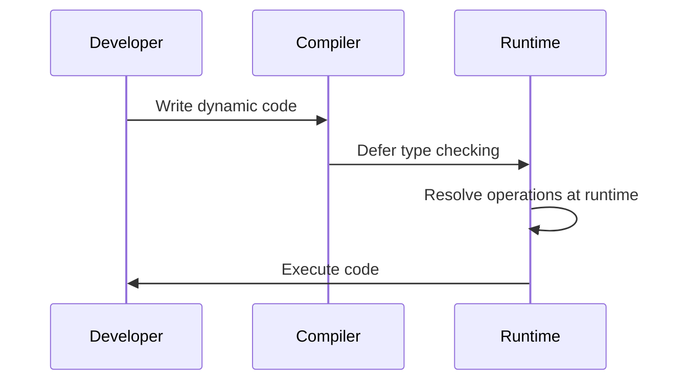

## 3.13 Dynamic Language Features

In the world of C# programming, the introduction of dynamic language features has added a new dimension to how developers can write and manage code. This section delves into the dynamic type in C#, exploring its capabilities, use cases, and how it contrasts with static typing. We will provide comprehensive insights, practical examples, and best practices to help you master dynamic programming in C#.

### Introduction to Dynamic Language Features

Dynamic language features in C# allow developers to write code that is more flexible and adaptable. The `dynamic` keyword, introduced in C# 4.0, enables operations to be resolved at runtime rather than compile time. This flexibility can be particularly useful when dealing with scenarios where types are not known until runtime, such as interacting with COM objects, dynamic languages, or JSON data.

#### What is the `dynamic` Type?

The `dynamic` type in C# is a special type that bypasses compile-time type checking. When you declare a variable as `dynamic`, the compiler defers type checking until runtime. This means that you can perform operations on dynamic objects without the compiler verifying their validity at compile time.

```csharp
dynamic dyn = "Hello, World!";
Console.WriteLine(dyn.Length); // No compile-time error, resolved at runtime
```

In the example above, the `Length` property is accessed on a `dynamic` object. The compiler does not check if `dyn` has a `Length` property; instead, it resolves this at runtime.

#### Key Characteristics of the `dynamic` Type

- **Runtime Resolution**: Operations on dynamic objects are resolved at runtime, allowing for greater flexibility.
- **Interoperability**: Facilitates interaction with COM objects, dynamic languages, and data formats like JSON or XML.
- **No IntelliSense**: Since type checking is deferred, you won't get IntelliSense support in IDEs for dynamic objects.
- **Potential for Runtime Errors**: As type checking is not performed at compile time, there's a higher risk of runtime errors.

### When to Use `dynamic` vs. Static Typing

Choosing between `dynamic` and static typing depends on the specific requirements of your application. Here are some scenarios where using `dynamic` is advantageous:

#### Interoperability with COM Objects

COM objects often have interfaces that are not known at compile time. Using `dynamic` allows you to interact with these objects without needing to define interfaces or use reflection.

```csharp
dynamic excelApp = Activator.CreateInstance(Type.GetTypeFromProgID("Excel.Application"));
excelApp.Visible = true;
```

#### Working with Dynamic Languages

When integrating with dynamic languages like Python or JavaScript, the `dynamic` type can simplify the interaction by allowing you to call methods and access properties without explicit type definitions.

#### Handling Dynamic Data Formats

Dynamic data formats such as JSON or XML often have structures that are not known until runtime. The `dynamic` type can be used to parse and manipulate such data without predefined classes.

```csharp
dynamic jsonData = JsonConvert.DeserializeObject<dynamic>(jsonString);
Console.WriteLine(jsonData.name);
```

#### Prototyping and Rapid Development

During the prototyping phase, using `dynamic` can speed up development by allowing you to focus on functionality rather than type definitions. However, this should be refactored to static types for production code to ensure type safety and maintainability.

### Best Practices for Using `dynamic`

While the `dynamic` type offers flexibility, it should be used judiciously to avoid potential pitfalls. Here are some best practices to consider:

#### Limit the Scope of `dynamic`

Use `dynamic` only where necessary and limit its scope to specific parts of your application. This minimizes the risk of runtime errors and maintains the benefits of static typing elsewhere in your code.

#### Validate Dynamic Operations

Since dynamic operations are resolved at runtime, ensure that you validate the results to handle potential errors gracefully.

```csharp
dynamic result = GetDynamicData();
if (result != null && result.SomeProperty != null)
{
    Console.WriteLine(result.SomeProperty);
}
```

#### Use Static Typing for Public APIs

For public APIs and interfaces, prefer static typing to provide clear contracts and ensure type safety for consumers of your API.

#### Combine with Reflection for Advanced Scenarios

In scenarios where you need to inspect types or invoke members dynamically, consider combining `dynamic` with reflection to achieve more complex operations.

```csharp
Type type = typeof(SomeClass);
dynamic instance = Activator.CreateInstance(type);
instance.SomeMethod();
```

### Code Examples and Use Cases

Let's explore some practical code examples to illustrate the use of the `dynamic` type in C#.

#### Example 1: Interacting with COM Objects

```csharp
dynamic wordApp = Activator.CreateInstance(Type.GetTypeFromProgID("Word.Application"));
wordApp.Visible = true;
wordApp.Documents.Add();
```

In this example, we create an instance of a Word application using COM interop. The `dynamic` type allows us to access properties and methods without explicit type definitions.

#### Example 2: Parsing JSON Data

```csharp
string jsonString = "{\"name\":\"John\", \"age\":30}";
dynamic jsonData = JsonConvert.DeserializeObject<dynamic>(jsonString);
Console.WriteLine($"Name: {jsonData.name}, Age: {jsonData.age}");
```

Here, we deserialize a JSON string into a dynamic object and access its properties directly, demonstrating the ease of working with dynamic data formats.

#### Example 3: Dynamic Language Interoperability

```csharp
dynamic py = Py.Import("math");
double result = py.sqrt(16);
Console.WriteLine(result);
```

This example shows how to use the `dynamic` type to call a Python function from C#, illustrating interoperability with dynamic languages.

### Visualizing Dynamic Language Features

To better understand how dynamic language features work, let's visualize the process of runtime resolution using a sequence diagram.



**Diagram Description**: This sequence diagram illustrates the flow of dynamic language features in C#. The developer writes code using the `dynamic` type, the compiler defers type checking, and the runtime resolves operations during execution.

### Design Considerations

When incorporating dynamic language features into your C# applications, consider the following:

- **Performance**: Dynamic operations can be slower than static operations due to runtime resolution. Use dynamic features judiciously to avoid performance bottlenecks.
- **Error Handling**: Implement robust error handling to manage potential runtime errors that may arise from dynamic operations.
- **Maintainability**: While dynamic features offer flexibility, they can complicate code maintenance. Ensure that dynamic code is well-documented and tested.

### Differences and Similarities with Other Patterns

Dynamic language features can sometimes be confused with reflection or late binding. Here are some distinctions:

- **Reflection**: Reflection involves inspecting and interacting with types at runtime. While similar, reflection is more explicit and provides more control over type inspection.
- **Late Binding**: Late binding refers to resolving method calls at runtime, often used in COM interop. The `dynamic` type simplifies late binding by abstracting the complexity of reflection.

### Try It Yourself

Experiment with the following code snippets to deepen your understanding of dynamic language features in C#:

1. Modify the JSON parsing example to handle nested JSON objects.
2. Create a dynamic proxy class that logs method calls and arguments.
3. Use the `dynamic` type to interact with a third-party library that lacks strong typing.

### Knowledge Check

To reinforce your understanding, consider the following questions:

- What are the key benefits of using the `dynamic` type in C#?
- How does the `dynamic` type differ from reflection?
- In what scenarios should you avoid using the `dynamic` type?

### Conclusion

Dynamic language features in C# provide powerful tools for flexible programming, enabling developers to interact with dynamic data and systems seamlessly. By understanding when and how to use the `dynamic` type, you can enhance your C# applications' adaptability and interoperability. Remember to balance the flexibility of dynamic features with the safety and performance benefits of static typing.

## Quiz Time!



### What is the primary advantage of using the `dynamic` type in C#?

- [x] Flexibility in handling unknown types at runtime
- [ ] Improved compile-time error checking
- [ ] Enhanced performance
- [ ] Better memory management

> **Explanation:** The `dynamic` type allows for flexibility by resolving types at runtime, which is useful when dealing with unknown types.

### In which scenario is using the `dynamic` type most appropriate?

- [x] Interacting with COM objects
- [ ] Implementing a strongly-typed API
- [ ] Writing performance-critical code
- [ ] Ensuring compile-time type safety

> **Explanation:** The `dynamic` type is particularly useful for interacting with COM objects where types are not known at compile time.

### What is a potential downside of using the `dynamic` type?

- [x] Increased risk of runtime errors
- [ ] Lack of support for COM interop
- [ ] Reduced flexibility in code
- [ ] Improved compile-time error checking

> **Explanation:** Since type checking is deferred to runtime, there is an increased risk of runtime errors with the `dynamic` type.

### How does the `dynamic` type differ from reflection?

- [x] `dynamic` abstracts runtime type resolution, while reflection provides explicit control
- [ ] `dynamic` is faster than reflection
- [ ] Reflection is used only for COM interop
- [ ] `dynamic` provides compile-time type checking

> **Explanation:** The `dynamic` type abstracts runtime type resolution, whereas reflection allows for explicit control over type inspection and interaction.

### Which of the following is NOT a recommended practice when using `dynamic`?

- [x] Using `dynamic` for public APIs
- [ ] Limiting the scope of `dynamic`
- [ ] Validating dynamic operations
- [ ] Combining with reflection for advanced scenarios

> **Explanation:** It is not recommended to use `dynamic` for public APIs as it lacks compile-time type safety.

### What is the effect of using `dynamic` on IntelliSense support in IDEs?

- [x] IntelliSense support is not available
- [ ] IntelliSense provides enhanced suggestions
- [ ] IntelliSense checks for runtime errors
- [ ] IntelliSense offers compile-time type checking

> **Explanation:** Since type checking is deferred to runtime, IntelliSense support is not available for `dynamic` objects.

### Which feature of C# allows for operations to be resolved at runtime?

- [x] `dynamic` type
- [ ] Generics
- [ ] LINQ
- [ ] Extension methods

> **Explanation:** The `dynamic` type in C# allows for operations to be resolved at runtime, providing flexibility in handling unknown types.

### What should you do to handle potential errors with dynamic operations?

- [x] Implement robust error handling
- [ ] Avoid using `dynamic` altogether
- [ ] Rely on compile-time checks
- [ ] Use only in performance-critical code

> **Explanation:** Implementing robust error handling is essential to manage potential runtime errors with dynamic operations.

### Which of the following is a key characteristic of the `dynamic` type?

- [x] Runtime resolution of operations
- [ ] Compile-time type checking
- [ ] Enhanced performance
- [ ] Strong typing

> **Explanation:** The `dynamic` type is characterized by runtime resolution of operations, allowing for flexibility in handling unknown types.

### True or False: The `dynamic` type in C# provides compile-time type safety.

- [ ] True
- [x] False

> **Explanation:** The `dynamic` type does not provide compile-time type safety as it defers type checking to runtime.



Remember, mastering dynamic language features in C# is just one step in your journey to becoming an expert software engineer. Keep exploring, experimenting, and pushing the boundaries of what's possible with C#. Happy coding!
