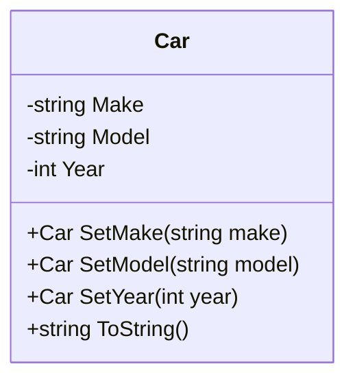

## 3.14 Fluent Interfaces and Step Builder Pattern

In the realm of software design, creating APIs that are both intuitive and easy to use is a crucial aspect of developing maintainable and scalable applications. Fluent Interfaces and the Step Builder Pattern are two powerful techniques in C# that facilitate the creation of such APIs. This section will delve into these concepts, providing you with the knowledge and tools to implement them effectively in your projects.

### Introduction to Fluent Interfaces

**Fluent Interfaces** are a design pattern used to create more readable and intuitive APIs by using method chaining. This approach allows developers to write code that reads like natural language, making it easier to understand and maintain.

#### Intent

The primary intent of Fluent Interfaces is to improve the readability of the code by allowing method chaining, which results in a more expressive and self-descriptive API. This pattern is particularly useful in scenarios where a series of operations need to be performed in a specific order.

#### Key Characteristics

- **Method Chaining**: Fluent Interfaces rely heavily on method chaining, where each method returns an instance of the object, allowing multiple method calls to be linked together in a single statement.
- **Readability**: The code written using Fluent Interfaces is often more readable and resembles natural language, making it easier for developers to understand the flow of operations.
- **Immutability**: Fluent Interfaces often encourage immutability, where each method call returns a new instance of the object with the updated state.

#### Example: Building a Fluent Interface

Let's consider a simple example of a Fluent Interface in C# for building a `Car` object.

```csharp
public class Car
{
    public string Make { get; private set; }
    public string Model { get; private set; }
    public int Year { get; private set; }

    public Car SetMake(string make)
    {
        Make = make;
        return this;
    }

    public Car SetModel(string model)
    {
        Model = model;
        return this;
    }

    public Car SetYear(int year)
    {
        Year = year;
        return this;
    }

    public override string ToString()
    {
        return $"{Year} {Make} {Model}";
    }
}

// Usage
var car = new Car()
    .SetMake("Toyota")
    .SetModel("Camry")
    .SetYear(2020);

Console.WriteLine(car); // Output: 2020 Toyota Camry
```

In this example, the `Car` class uses method chaining to allow the user to set the properties of the car in a fluent manner. Each method returns the current instance (`this`), enabling the chaining of method calls.

### Implementing Fluent Interfaces

To implement Fluent Interfaces effectively, follow these guidelines:

1. **Return the Current Instance**: Ensure that each method in the chain returns the current instance of the object (`this`).
2. **Use Descriptive Method Names**: Choose method names that clearly describe the operation being performed, enhancing the readability of the code.
3. **Maintain Immutability**: Consider returning new instances of the object with updated state to maintain immutability, especially in multi-threaded environments.

### Advantages of Fluent Interfaces

- **Enhanced Readability**: Code written using Fluent Interfaces is often more readable and self-explanatory.
- **Reduced Boilerplate Code**: Method chaining reduces the need for repetitive code, making the implementation more concise.
- **Improved Maintainability**: The expressive nature of Fluent Interfaces makes the code easier to maintain and modify.

### Challenges and Considerations

While Fluent Interfaces offer numerous benefits, there are some challenges and considerations to keep in mind:

- **Complexity**: Implementing Fluent Interfaces can introduce complexity, especially in large-scale applications.
- **Debugging**: Debugging method chains can be challenging, as errors may not be immediately apparent.
- **Performance**: Method chaining can impact performance, particularly if the chain is long and involves complex operations.

### Introduction to the Step Builder Pattern

The **Step Builder Pattern** is a variation of the Builder Pattern that provides a step-wise approach to constructing complex objects. This pattern is particularly useful when the construction process involves multiple steps that must be performed in a specific order.

#### Intent

The intent of the Step Builder Pattern is to guide the user through the construction process by enforcing a specific sequence of method calls. This ensures that the object is constructed correctly and consistently.

#### Key Characteristics

- **Step-Wise Construction**: The Step Builder Pattern breaks down the construction process into discrete steps, each represented by a method.
- **Type Safety**: By enforcing a specific sequence of method calls, the Step Builder Pattern provides type safety, preventing the user from calling methods out of order.
- **Readability**: The step-wise approach enhances the readability of the code by clearly delineating each step in the construction process.

#### Example: Implementing the Step Builder Pattern

Let's consider an example of the Step Builder Pattern in C# for constructing a `House` object.

```csharp
public class House
{
    public int Bedrooms { get; private set; }
    public int Bathrooms { get; private set; }
    public bool HasGarage { get; private set; }

    private House() { }

    public interface IBuilder
    {
        IBedroomsStep AddBedrooms(int count);
    }

    public interface IBedroomsStep
    {
        IBathroomsStep AddBathrooms(int count);
    }

    public interface IBathroomsStep
    {
        IOptionalStep AddGarage();
        House Build();
    }

    public interface IOptionalStep
    {
        House Build();
    }

    public class Builder : IBuilder, IBedroomsStep, IBathroomsStep, IOptionalStep
    {
        private readonly House _house = new House();

        public IBedroomsStep AddBedrooms(int count)
        {
            _house.Bedrooms = count;
            return this;
        }

        public IBathroomsStep AddBathrooms(int count)
        {
            _house.Bathrooms = count;
            return this;
        }

        public IOptionalStep AddGarage()
        {
            _house.HasGarage = true;
            return this;
        }

        public House Build()
        {
            return _house;
        }
    }

    public static IBuilder CreateBuilder()
    {
        return new Builder();
    }
}

// Usage
var house = House.CreateBuilder()
    .AddBedrooms(3)
    .AddBathrooms(2)
    .AddGarage()
    .Build();

Console.WriteLine($"House with {house.Bedrooms} bedrooms, {house.Bathrooms} bathrooms, Garage: {house.HasGarage}");
```

In this example, the `House` class uses the Step Builder Pattern to enforce a specific sequence of method calls during the construction process. The user must first add bedrooms, then bathrooms, and optionally a garage before building the house.

### Implementing the Step Builder Pattern

To implement the Step Builder Pattern effectively, follow these guidelines:

1. **Define Interfaces for Each Step**: Create separate interfaces for each step in the construction process, ensuring that each method returns the appropriate interface for the next step.
2. **Enforce Method Order**: Use the interfaces to enforce a specific order of method calls, preventing the user from calling methods out of sequence.
3. **Provide a Build Method**: Include a `Build` method in the final step to construct and return the completed object.

### Advantages of the Step Builder Pattern

- **Type Safety**: The Step Builder Pattern provides type safety by enforcing a specific sequence of method calls.
- **Readability**: The step-wise approach enhances the readability of the code by clearly delineating each step in the construction process.
- **Consistency**: By guiding the user through the construction process, the Step Builder Pattern ensures that the object is constructed consistently.

### Challenges and Considerations

While the Step Builder Pattern offers numerous benefits, there are some challenges and considerations to keep in mind:

- **Complexity**: Implementing the Step Builder Pattern can introduce complexity, especially in large-scale applications.
- **Boilerplate Code**: The pattern may require additional boilerplate code to define the interfaces and implement the builder class.
- **Flexibility**: The step-wise approach may limit flexibility, as the user must follow the predefined sequence of method calls.

### Differences and Similarities

Fluent Interfaces and the Step Builder Pattern share some similarities, but they also have distinct differences:

- **Method Chaining vs. Step-Wise Construction**: Fluent Interfaces rely on method chaining to create a readable API, while the Step Builder Pattern uses a step-wise approach to guide the user through the construction process.
- **Readability**: Both patterns enhance the readability of the code, but Fluent Interfaces focus on creating a more natural language-like API, while the Step Builder Pattern emphasizes a clear sequence of steps.
- **Type Safety**: The Step Builder Pattern provides type safety by enforcing a specific order of method calls, while Fluent Interfaces do not inherently provide this level of safety.

### Design Considerations

When deciding whether to use Fluent Interfaces or the Step Builder Pattern, consider the following factors:

- **Complexity of the Construction Process**: If the construction process involves multiple steps that must be performed in a specific order, the Step Builder Pattern may be more appropriate.
- **Readability Requirements**: If readability and expressiveness are the primary concerns, Fluent Interfaces may be a better choice.
- **Type Safety**: If type safety and enforcing a specific sequence of method calls are important, consider using the Step Builder Pattern.

### Try It Yourself

To gain a deeper understanding of Fluent Interfaces and the Step Builder Pattern, try modifying the examples provided in this section. Experiment with adding additional methods, changing the order of method calls, or implementing these patterns in your own projects.

### Visualizing Fluent Interfaces and Step Builder Pattern

Let's visualize the structure of Fluent Interfaces and the Step Builder Pattern using Mermaid.js diagrams.

#### Fluent Interfaces Diagram



This diagram illustrates the `Car` class with its properties and methods, highlighting the method chaining used in Fluent Interfaces.

#### Step Builder Pattern Diagram

```mermaid
classDiagram
    class House {
        -int Bedrooms
        -int Bathrooms
        -bool HasGarage
        +static IBuilder CreateBuilder()
    }

    interface IBuilder {
        +IBedroomsStep AddBedrooms(int count)
    }

    interface IBedroomsStep {
        +IBathroomsStep AddBathrooms(int count)
    }

    interface IBathroomsStep {
        +IOptionalStep AddGarage()
        +House Build()
    }

    interface IOptionalStep {
        +House Build()
    }

    class Builder {
        +IBedroomsStep AddBedrooms(int count)
        +IBathroomsStep AddBathrooms(int count)
        +IOptionalStep AddGarage()
        +House Build()
    }

    House --> IBuilder
    IBuilder --> IBedroomsStep
    IBedroomsStep --> IBathroomsStep
    IBathroomsStep --> IOptionalStep
    IOptionalStep --> House
```

This diagram illustrates the `House` class and its associated interfaces, highlighting the step-wise construction process used in the Step Builder Pattern.

### Conclusion

Fluent Interfaces and the Step Builder Pattern are powerful techniques for creating readable and intuitive APIs in C#. By leveraging method chaining and step-wise construction, these patterns enhance the readability, maintainability, and consistency of your code. As you continue to explore these patterns, remember to consider the specific requirements of your project and choose the approach that best aligns with your goals.

## Quiz Time!



### What is the primary intent of Fluent Interfaces?

- [x] To improve the readability of the code by allowing method chaining.
- [ ] To enforce a specific sequence of method calls.
- [ ] To provide type safety.
- [ ] To reduce the number of classes in a project.

> **Explanation:** Fluent Interfaces aim to improve code readability through method chaining, allowing for a more expressive and self-descriptive API.

### What is a key characteristic of the Step Builder Pattern?

- [ ] Method chaining.
- [x] Step-wise construction.
- [ ] Immutability.
- [ ] Dynamic typing.

> **Explanation:** The Step Builder Pattern uses step-wise construction to guide the user through the object creation process, ensuring a specific sequence of method calls.

### Which pattern is more suitable for enforcing a specific order of method calls?

- [ ] Fluent Interfaces.
- [x] Step Builder Pattern.
- [ ] Singleton Pattern.
- [ ] Factory Method Pattern.

> **Explanation:** The Step Builder Pattern is designed to enforce a specific sequence of method calls, providing type safety and consistency.

### What is a common advantage of both Fluent Interfaces and the Step Builder Pattern?

- [x] Enhanced readability.
- [ ] Reduced memory usage.
- [ ] Increased execution speed.
- [ ] Simplified error handling.

> **Explanation:** Both patterns enhance the readability of the code by providing a more intuitive and expressive API.

### How does the Step Builder Pattern provide type safety?

- [ ] By using dynamic typing.
- [x] By enforcing a specific sequence of method calls through interfaces.
- [ ] By using reflection.
- [ ] By minimizing the number of classes.

> **Explanation:** The Step Builder Pattern uses interfaces to enforce a specific order of method calls, ensuring type safety.

### What is a potential challenge of using Fluent Interfaces?

- [x] Debugging method chains can be challenging.
- [ ] Increased memory usage.
- [ ] Reduced readability.
- [ ] Lack of flexibility.

> **Explanation:** Debugging method chains in Fluent Interfaces can be challenging, as errors may not be immediately apparent.

### Which pattern is more focused on creating a natural language-like API?

- [x] Fluent Interfaces.
- [ ] Step Builder Pattern.
- [ ] Factory Method Pattern.
- [ ] Observer Pattern.

> **Explanation:** Fluent Interfaces focus on creating a natural language-like API through method chaining, enhancing readability.

### What is a common disadvantage of both Fluent Interfaces and the Step Builder Pattern?

- [ ] Reduced readability.
- [ ] Increased memory usage.
- [x] Complexity in implementation.
- [ ] Lack of type safety.

> **Explanation:** Both patterns can introduce complexity in implementation, especially in large-scale applications.

### Which pattern is more suitable for constructing complex objects with multiple steps?

- [ ] Fluent Interfaces.
- [x] Step Builder Pattern.
- [ ] Singleton Pattern.
- [ ] Adapter Pattern.

> **Explanation:** The Step Builder Pattern is suitable for constructing complex objects with multiple steps, ensuring a specific sequence of method calls.

### True or False: Fluent Interfaces inherently provide type safety.

- [ ] True
- [x] False

> **Explanation:** Fluent Interfaces do not inherently provide type safety, as they focus on method chaining for readability rather than enforcing a specific sequence of method calls.


