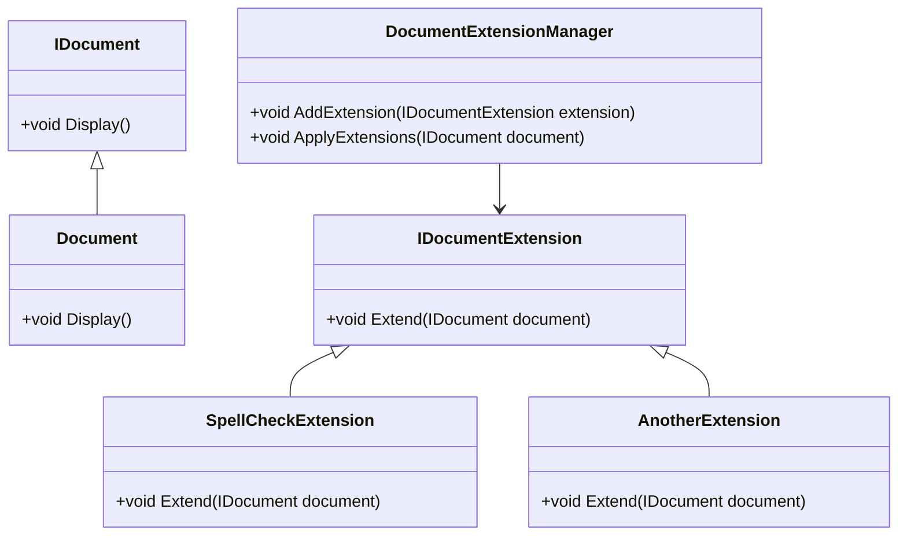

## 3.15 Extension Object Pattern

The Extension Object Pattern is a powerful design pattern that allows developers to dynamically add new functionality to objects without altering their structure. This pattern is particularly useful in scenarios where the system needs to be flexible and adaptable, such as in plugin systems and feature toggles. In this section, we will explore the intricacies of the Extension Object Pattern, its implementation in C#, and its practical applications.

### Intent

The primary intent of the Extension Object Pattern is to provide a mechanism for extending the capabilities of an object dynamically. This is achieved by attaching new extension objects to the original object, thereby enhancing its functionality without modifying its core structure. This pattern is ideal for systems that require a high degree of flexibility and modularity.

### Key Participants

1. **Component Interface**: Defines the interface for the objects that can have extensions.
2. **Concrete Component**: The class that implements the component interface and can have extensions attached.
3. **Extension Interface**: Defines the interface for the extension objects.
4. **Concrete Extension**: Implements the extension interface and provides additional functionality.
5. **Extension Manager**: Manages the extensions and facilitates their interaction with the component.

### Applicability

The Extension Object Pattern is applicable in the following scenarios:

- **Plugin Systems**: When you need to add new features or capabilities to an application without altering its core codebase.
- **Feature Toggles**: When you want to enable or disable features dynamically based on certain conditions or configurations.
- **Modular Applications**: When building applications that require a high degree of modularity and flexibility.

### Sample Code Snippet

Let's delve into a practical example to illustrate the Extension Object Pattern in C#. We'll create a simple application that allows adding extensions to a `Document` object.

```csharp
// Component Interface
public interface IDocument
{
    void Display();
}

// Concrete Component
public class Document : IDocument
{
    public void Display()
    {
        Console.WriteLine("Displaying the document.");
    }
}

// Extension Interface
public interface IDocumentExtension
{
    void Extend(IDocument document);
}

// Concrete Extension
public class SpellCheckExtension : IDocumentExtension
{
    public void Extend(IDocument document)
    {
        Console.WriteLine("Spell checking the document.");
    }
}

// Extension Manager
public class DocumentExtensionManager
{
    private readonly List<IDocumentExtension> _extensions = new List<IDocumentExtension>();

    public void AddExtension(IDocumentExtension extension)
    {
        _extensions.Add(extension);
    }

    public void ApplyExtensions(IDocument document)
    {
        foreach (var extension in _extensions)
        {
            extension.Extend(document);
        }
    }
}

// Usage
public class Program
{
    public static void Main()
    {
        IDocument document = new Document();
        DocumentExtensionManager extensionManager = new DocumentExtensionManager();

        // Add extensions
        extensionManager.AddExtension(new SpellCheckExtension());

        // Display document
        document.Display();

        // Apply extensions
        extensionManager.ApplyExtensions(document);
    }
}
```

In this example, we have a `Document` class that implements the `IDocument` interface. We can extend its functionality by adding extensions like `SpellCheckExtension` using the `DocumentExtensionManager`.

### Design Considerations

When implementing the Extension Object Pattern, consider the following:

- **Decoupling**: Ensure that the extensions are decoupled from the core component to maintain modularity.
- **Performance**: Be mindful of the performance implications of adding multiple extensions, as each extension may introduce additional processing overhead.
- **Scalability**: Design the extension manager to handle a large number of extensions efficiently.

### Differences and Similarities

The Extension Object Pattern is often compared to the Decorator Pattern. While both patterns allow adding functionality to objects, the key difference lies in their approach. The Decorator Pattern wraps the original object, whereas the Extension Object Pattern attaches new objects to the original object.

### Visualizing the Extension Object Pattern

To better understand the Extension Object Pattern, let's visualize its structure using a class diagram.



This diagram illustrates the relationships between the component, extensions, and the extension manager.

### Try It Yourself

To deepen your understanding of the Extension Object Pattern, try modifying the code example to add a new extension, such as a `GrammarCheckExtension`. Experiment with different combinations of extensions and observe how they interact with the `Document` object.

### Use Cases in Plugin Systems and Feature Toggles

#### Plugin Systems

In a plugin system, the Extension Object Pattern allows developers to add new plugins without altering the core application. Each plugin can be implemented as an extension object, providing additional functionality to the application.

#### Feature Toggles

Feature toggles enable or disable features dynamically based on configurations. By implementing features as extension objects, you can easily toggle them on or off without modifying the core application logic.

### Knowledge Check

- **Question**: What is the primary intent of the Extension Object Pattern?
- **Question**: How does the Extension Object Pattern differ from the Decorator Pattern?
- **Question**: What are some practical applications of the Extension Object Pattern?

### Embrace the Journey

Remember, mastering design patterns is a journey. The Extension Object Pattern is just one of many tools in your arsenal as a software engineer. As you continue to explore and experiment with different patterns, you'll gain a deeper understanding of how to build flexible and maintainable applications. Keep experimenting, stay curious, and enjoy the journey!

### References and Links

- [Design Patterns: Elements of Reusable Object-Oriented Software](https://www.amazon.com/Design-Patterns-Elements-Reusable-Object-Oriented/dp/0201633612)
- [C# Programming Guide](https://docs.microsoft.com/en-us/dotnet/csharp/programming-guide/)
- [Plugin Architecture](https://martinfowler.com/articles/plugin.html)

## Quiz Time!



### What is the primary intent of the Extension Object Pattern?

- [x] To dynamically add functionality to objects without altering their structure.
- [ ] To wrap objects with additional functionality.
- [ ] To create a hierarchy of objects.
- [ ] To enforce a single responsibility principle.

> **Explanation:** The Extension Object Pattern is designed to add functionality to objects dynamically, without changing their core structure.

### How does the Extension Object Pattern differ from the Decorator Pattern?

- [x] The Extension Object Pattern attaches new objects, while the Decorator Pattern wraps objects.
- [ ] The Extension Object Pattern is used for static extensions, while the Decorator Pattern is for dynamic extensions.
- [ ] The Extension Object Pattern is only applicable to interfaces, while the Decorator Pattern is for classes.
- [ ] The Extension Object Pattern is a structural pattern, while the Decorator Pattern is a behavioral pattern.

> **Explanation:** The key difference is that the Extension Object Pattern attaches new objects to the original, whereas the Decorator Pattern wraps the original object.

### What are some practical applications of the Extension Object Pattern?

- [x] Plugin systems and feature toggles.
- [ ] Data validation and error handling.
- [ ] Logging and monitoring.
- [ ] User authentication and authorization.

> **Explanation:** The Extension Object Pattern is particularly useful in plugin systems and feature toggles, where dynamic functionality is required.

### Which component manages the extensions in the Extension Object Pattern?

- [x] Extension Manager
- [ ] Component Interface
- [ ] Concrete Component
- [ ] Extension Interface

> **Explanation:** The Extension Manager is responsible for managing and applying extensions to the component.

### What is a key consideration when implementing the Extension Object Pattern?

- [x] Decoupling extensions from the core component.
- [ ] Ensuring extensions are tightly coupled with the component.
- [ ] Limiting the number of extensions to one.
- [ ] Using inheritance to implement extensions.

> **Explanation:** Decoupling extensions from the core component is crucial to maintain modularity and flexibility.

### In the provided code example, what does the `SpellCheckExtension` class do?

- [x] It extends the `Document` object with spell-checking functionality.
- [ ] It wraps the `Document` object to add logging.
- [ ] It modifies the `Document` class to include grammar checking.
- [ ] It replaces the `Document` class with a new implementation.

> **Explanation:** The `SpellCheckExtension` class adds spell-checking functionality to the `Document` object.

### What is the role of the `IDocumentExtension` interface in the pattern?

- [x] It defines the interface for extension objects.
- [ ] It implements the core functionality of the document.
- [ ] It manages the lifecycle of the document.
- [ ] It provides a default implementation for extensions.

> **Explanation:** The `IDocumentExtension` interface defines the contract that all extension objects must adhere to.

### Why is performance a consideration in the Extension Object Pattern?

- [x] Because each extension may introduce additional processing overhead.
- [ ] Because extensions are always executed in parallel.
- [ ] Because extensions must be loaded at application startup.
- [ ] Because extensions require complex algorithms.

> **Explanation:** Adding multiple extensions can lead to increased processing overhead, so performance must be considered.

### What is a common use case for feature toggles?

- [x] Enabling or disabling features dynamically based on configurations.
- [ ] Wrapping features with additional logging.
- [ ] Creating a hierarchy of feature classes.
- [ ] Enforcing strict type checking.

> **Explanation:** Feature toggles allow features to be enabled or disabled dynamically, often based on configuration settings.

### True or False: The Extension Object Pattern is only applicable to classes, not interfaces.

- [ ] True
- [x] False

> **Explanation:** The Extension Object Pattern can be applied to both classes and interfaces, allowing for flexible extension of functionality.


