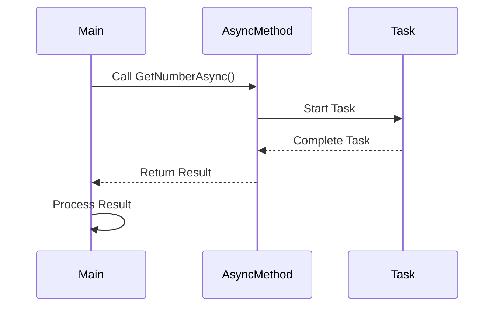

## 3.16 Lambda Expressions and Promises

In this section, we delve into the world of lambda expressions and promises in C#. These concepts are pivotal in modern software development, particularly in facilitating asynchronous programming and embracing functional paradigms. By mastering these tools, you can write more concise, readable, and efficient code. Let's explore how lambda expressions and promises can transform your C# programming experience.

### Introduction to Lambda Expressions

Lambda expressions are a powerful feature in C# that allow you to write anonymous functions. They are concise and can be used to create delegates or expression tree types. Lambda expressions are particularly useful in scenarios where you need to pass a simple function as a parameter to another method.

#### What is a Lambda Expression?

A lambda expression is essentially a shorthand for writing an anonymous method. It consists of a list of parameters, the lambda operator `=>`, and an expression or statement block. Here's a simple example:

```csharp
// A lambda expression that takes an integer and returns its square
Func<int, int> square = x => x * x;

// Using the lambda expression
Console.WriteLine(square(5)); // Output: 25
```

In this example, `x => x * x` is a lambda expression that takes an integer `x` and returns its square. The `Func<int, int>` delegate represents a function that takes an integer and returns an integer.

#### Syntax of Lambda Expressions

Lambda expressions have a straightforward syntax:

- **Parameters**: Enclosed in parentheses `()`. If there is only one parameter, you can omit the parentheses.
- **Lambda Operator**: The `=>` symbol separates the parameters from the body.
- **Body**: Can be a single expression or a block of statements enclosed in `{}`.

Here's a more complex example with multiple parameters and a statement block:

```csharp
// A lambda expression with multiple parameters and a statement block
Func<int, int, int> add = (x, y) =>
{
    int result = x + y;
    return result;
};

// Using the lambda expression
Console.WriteLine(add(3, 4)); // Output: 7
```

#### Using Lambda Expressions with LINQ

Lambda expressions are extensively used with LINQ (Language Integrated Query) to perform operations on collections. They provide a concise way to express queries.

```csharp
// Using a lambda expression with LINQ to filter a list
List<int> numbers = new List<int> { 1, 2, 3, 4, 5, 6 };
var evenNumbers = numbers.Where(n => n % 2 == 0).ToList();

Console.WriteLine(string.Join(", ", evenNumbers)); // Output: 2, 4, 6
```

In this example, the lambda expression `n => n % 2 == 0` is used to filter even numbers from the list.

### Advanced Lambda Expressions

Lambda expressions can also be used to create expression trees, which are data structures representing code. Expression trees are useful for building dynamic queries and are a key component of LINQ providers.

#### Expression Trees

An expression tree is a representation of code as a tree-like data structure. Each node in the tree represents an expression, such as a method call or a binary operation.

```csharp
// Creating an expression tree
Expression<Func<int, int>> expr = x => x * x;

// Compiling and invoking the expression tree
Func<int, int> compiledExpr = expr.Compile();
Console.WriteLine(compiledExpr(5)); // Output: 25
```

In this example, `Expression<Func<int, int>>` creates an expression tree for the lambda expression `x => x * x`. The `Compile` method converts the expression tree into executable code.

#### Capturing Variables

Lambda expressions can capture variables from their enclosing scope. This feature is known as "closures."

```csharp
// Capturing a variable from the enclosing scope
int multiplier = 3;
Func<int, int> multiply = x => x * multiplier;

Console.WriteLine(multiply(5)); // Output: 15
```

In this example, the lambda expression captures the `multiplier` variable from its enclosing scope.

### Introduction to Promises in C#

Promises are a design pattern used to handle asynchronous operations. They represent a value that may be available now, or in the future, or never. While C# does not have built-in promises like JavaScript, similar functionality can be achieved using `Task` and `async/await`.

#### Understanding Promises

A promise is an object that represents the eventual completion (or failure) of an asynchronous operation and its resulting value. Promises provide a cleaner way to work with asynchronous code compared to traditional callback-based approaches.

#### Implementing Promises with Task

In C#, the `Task` class is used to represent asynchronous operations. You can use `Task` in conjunction with `async` and `await` to implement promise-like behavior.

```csharp
// An asynchronous method that returns a Task
public async Task<int> GetNumberAsync()
{
    await Task.Delay(1000); // Simulate an asynchronous operation
    return 42;
}

// Using the asynchronous method
public async Task UseAsyncMethod()
{
    int result = await GetNumberAsync();
    Console.WriteLine(result); // Output: 42
}
```

In this example, `GetNumberAsync` is an asynchronous method that returns a `Task<int>`. The `await` keyword is used to asynchronously wait for the task to complete.

#### Handling Errors with Promises

Promises provide a way to handle errors in asynchronous code. In C#, you can use `try-catch` blocks with `async` methods to handle exceptions.

```csharp
// An asynchronous method that throws an exception
public async Task<int> GetNumberWithErrorAsync()
{
    await Task.Delay(1000);
    throw new InvalidOperationException("An error occurred");
}

// Using the asynchronous method with error handling
public async Task UseAsyncMethodWithErrorHandling()
{
    try
    {
        int result = await GetNumberWithErrorAsync();
        Console.WriteLine(result);
    }
    catch (Exception ex)
    {
        Console.WriteLine($"Error: {ex.Message}");
    }
}
```

In this example, the `GetNumberWithErrorAsync` method throws an exception, which is caught and handled in the `UseAsyncMethodWithErrorHandling` method.

### Combining Lambda Expressions and Promises

Lambda expressions and promises can be combined to create powerful asynchronous workflows. By using lambda expressions with asynchronous methods, you can write concise and readable code.

#### Asynchronous Lambda Expressions

You can create asynchronous lambda expressions by using the `async` keyword. This is useful when you need to pass an asynchronous function as a parameter.

```csharp
// An asynchronous lambda expression
Func<Task> asyncLambda = async () =>
{
    await Task.Delay(1000);
    Console.WriteLine("Async operation completed");
};

// Using the asynchronous lambda expression
await asyncLambda();
```

In this example, `asyncLambda` is an asynchronous lambda expression that performs an asynchronous operation.

#### Using Lambda Expressions with Task Continuations

Lambda expressions can be used with task continuations to define actions that should be performed after a task completes.

```csharp
// A task with a continuation using a lambda expression
Task<int> task = Task.Run(() => 42);
task.ContinueWith(t => Console.WriteLine($"Result: {t.Result}"));
```

In this example, a lambda expression is used to define a continuation that prints the result of the task.

### Visualizing Asynchronous Workflows

To better understand how lambda expressions and promises work together in asynchronous workflows, let's visualize the process using a sequence diagram.



This diagram illustrates the flow of an asynchronous method call using a task. The `Main` participant calls the `AsyncMethod`, which starts a `Task`. Once the task completes, the result is returned to the `Main` participant.

### Best Practices for Using Lambda Expressions and Promises

To effectively use lambda expressions and promises in C#, consider the following best practices:

- **Keep Lambda Expressions Simple**: Avoid complex logic in lambda expressions. If a lambda expression becomes too complex, consider refactoring it into a named method.
- **Use Expression-Bodied Members**: For simple methods, use expression-bodied members to improve readability.
- **Handle Exceptions Gracefully**: Always handle exceptions in asynchronous code to prevent unhandled exceptions from crashing your application.
- **Avoid Blocking Calls**: In asynchronous methods, avoid blocking calls such as `Task.Wait()` or `Task.Result`, as they can lead to deadlocks.
- **Use ConfigureAwait(false)**: When writing library code, use `ConfigureAwait(false)` to avoid capturing the synchronization context, which can improve performance.

### Try It Yourself

To solidify your understanding of lambda expressions and promises, try modifying the code examples provided. Experiment with different lambda expressions and asynchronous workflows. Consider creating a small project that uses these concepts to perform a series of asynchronous operations.

### Knowledge Check

Before we conclude, let's summarize the key takeaways:

- Lambda expressions provide a concise way to write anonymous functions and are extensively used in LINQ.
- Promises in C# are implemented using `Task` and `async/await`, allowing for cleaner asynchronous code.
- Combining lambda expressions with promises can create powerful asynchronous workflows.
- Visualizing asynchronous workflows can help in understanding the flow of asynchronous operations.

### Conclusion

Lambda expressions and promises are essential tools in modern C# programming. By mastering these concepts, you can write more efficient and readable code, especially when dealing with asynchronous operations. Remember, this is just the beginning. As you progress, you'll build more complex and interactive applications. Keep experimenting, stay curious, and enjoy the journey!

## Quiz Time!



### What is a lambda expression in C#?

- [x] A shorthand for writing anonymous functions
- [ ] A type of class in C#
- [ ] A method that returns a Task
- [ ] A way to handle exceptions

> **Explanation:** A lambda expression is a concise way to write anonymous functions in C#.

### How do you create an asynchronous lambda expression?

- [x] By using the `async` keyword
- [ ] By using the `await` keyword
- [ ] By using the `Task` class
- [ ] By using the `Func` delegate

> **Explanation:** An asynchronous lambda expression is created by using the `async` keyword.

### What is the purpose of the `=>` operator in a lambda expression?

- [x] It separates the parameters from the body
- [ ] It indicates the return type
- [ ] It starts an asynchronous operation
- [ ] It handles exceptions

> **Explanation:** The `=>` operator separates the parameters from the body in a lambda expression.

### Which class is used to represent asynchronous operations in C#?

- [x] Task
- [ ] Func
- [ ] Action
- [ ] Delegate

> **Explanation:** The `Task` class is used to represent asynchronous operations in C#.

### What is an expression tree?

- [x] A data structure representing code as a tree
- [ ] A type of lambda expression
- [ ] A method that returns a Task
- [ ] A way to handle exceptions

> **Explanation:** An expression tree is a data structure that represents code as a tree-like structure.

### How can you handle exceptions in asynchronous methods?

- [x] By using try-catch blocks
- [ ] By using the `await` keyword
- [ ] By using the `Task` class
- [ ] By using the `Func` delegate

> **Explanation:** Exceptions in asynchronous methods can be handled using try-catch blocks.

### What is the benefit of using `ConfigureAwait(false)`?

- [x] It avoids capturing the synchronization context
- [ ] It makes the code run faster
- [ ] It handles exceptions
- [ ] It creates a new Task

> **Explanation:** Using `ConfigureAwait(false)` avoids capturing the synchronization context, which can improve performance.

### What is a closure in the context of lambda expressions?

- [x] A lambda expression that captures variables from its enclosing scope
- [ ] A type of delegate
- [ ] A method that returns a Task
- [ ] A way to handle exceptions

> **Explanation:** A closure is a lambda expression that captures variables from its enclosing scope.

### What is the main advantage of using promises over callbacks?

- [x] Promises provide a cleaner way to handle asynchronous code
- [ ] Promises are faster than callbacks
- [ ] Promises are easier to debug
- [ ] Promises are more secure

> **Explanation:** Promises provide a cleaner and more readable way to handle asynchronous code compared to callbacks.

### True or False: Lambda expressions can only be used with LINQ.

- [ ] True
- [x] False

> **Explanation:** Lambda expressions can be used in various scenarios, not just with LINQ.


