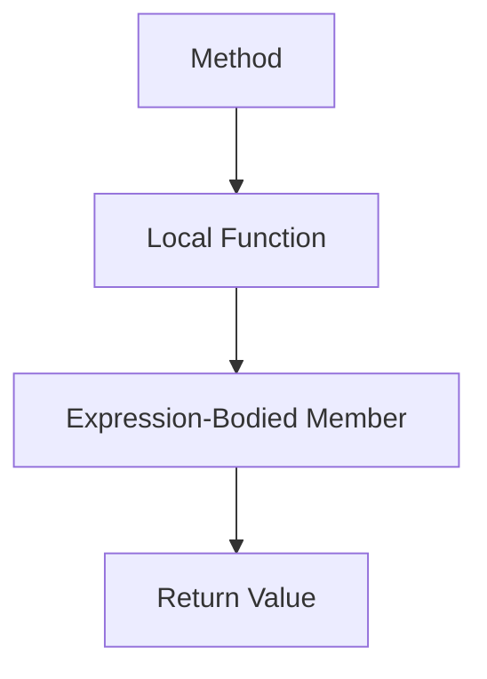

## 3.17 Expression-Bodied Members and Local Functions

In the ever-evolving landscape of software development, writing concise and readable code is paramount. C# provides powerful features like expression-bodied members and local functions that allow developers to achieve this goal. In this section, we will delve into these features, exploring their syntax, use cases, and benefits. By the end of this guide, you will have a comprehensive understanding of how to leverage expression-bodied members and local functions to write cleaner, more maintainable C# code.

### Understanding Expression-Bodied Members

Expression-bodied members were introduced in C# 6 and have since become a staple for writing concise code. They allow you to define methods, properties, and other members using a single expression, reducing boilerplate and enhancing readability.

#### Syntax and Usage

The syntax for expression-bodied members is straightforward. Instead of using a block of code with curly braces, you use the `=>` operator followed by an expression. This can be applied to methods, properties, indexers, and even constructors and destructors.

**Example: Expression-Bodied Method**

```csharp
public class Circle
{
    private double _radius;

    public Circle(double radius) => _radius = radius;

    // Traditional method
    public double GetArea()
    {
        return Math.PI * _radius * _radius;
    }

    // Expression-bodied method
    public double Area => Math.PI * _radius * _radius;
}
```

In the example above, the `Area` property is defined using an expression-bodied member, making the code more concise and readable.

#### Expression-Bodied Properties

Expression-bodied properties are particularly useful for read-only properties where the value can be computed with a single expression.

**Example: Expression-Bodied Property**

```csharp
public class Rectangle
{
    public double Width { get; }
    public double Height { get; }

    public Rectangle(double width, double height)
    {
        Width = width;
        Height = height;
    }

    // Expression-bodied property
    public double Perimeter => 2 * (Width + Height);
}
```

#### Expression-Bodied Constructors and Destructors

Expression-bodied syntax can also be applied to constructors and destructors, although their use is less common.

**Example: Expression-Bodied Constructor**

```csharp
public class Logger
{
    private string _logFile;

    // Expression-bodied constructor
    public Logger(string logFile) => _logFile = logFile;

    // Expression-bodied destructor
    ~Logger() => Console.WriteLine($"Logger for {_logFile} is being finalized.");
}
```

### Benefits of Expression-Bodied Members

1. **Conciseness**: Reduces the amount of code, making it easier to read and maintain.
2. **Readability**: Simplifies the logic by focusing on the expression rather than the syntax.
3. **Consistency**: Provides a uniform way to define simple members across your codebase.

### Local Functions in C#

Local functions, introduced in C# 7, allow you to define functions within other functions. This feature is particularly useful for encapsulating logic that is only relevant within the context of a specific method, enhancing readability and maintainability.

#### Syntax and Usage

Local functions are defined within the body of another method. They can access variables from the enclosing method, making them a powerful tool for organizing code.

**Example: Local Function**

```csharp
public class Calculator
{
    public int Add(int a, int b)
    {
        // Local function
        int Sum(int x, int y) => x + y;

        return Sum(a, b);
    }
}
```

In this example, the `Sum` function is defined within the `Add` method, encapsulating the addition logic.

#### Benefits of Local Functions

1. **Encapsulation**: Keeps related logic together, reducing the need for separate private methods.
2. **Readability**: Makes the code easier to follow by keeping the logic within the context where it is used.
3. **Scope**: Limits the visibility of the function to the enclosing method, reducing potential side effects.

### Combining Expression-Bodied Members and Local Functions

Expression-bodied members and local functions can be combined to write highly concise and readable code. By using both features, you can encapsulate logic within a method while keeping the implementation succinct.

**Example: Combining Features**

```csharp
public class MathOperations
{
    public double CalculateCircleArea(double radius)
    {
        // Local function with expression-bodied member
        double Area(double r) => Math.PI * r * r;

        return Area(radius);
    }
}
```

### Practical Applications

Expression-bodied members and local functions are not just syntactic sugar; they offer practical benefits in real-world applications. Here are some scenarios where these features shine:

1. **Data Transformation**: Use expression-bodied members to define transformation logic concisely.
2. **Event Handling**: Local functions can encapsulate event handling logic within the method that registers the event.
3. **Algorithm Implementation**: Break down complex algorithms into smaller, manageable local functions.

### Visualizing Expression-Bodied Members and Local Functions

To better understand how expression-bodied members and local functions work, let's visualize their structure and flow.



**Diagram Description**: This diagram illustrates the flow from a method to a local function, which uses an expression-bodied member to compute and return a value.

### Try It Yourself

To truly grasp the power of expression-bodied members and local functions, try modifying the examples provided:

- **Experiment with Expression-Bodied Members**: Convert traditional methods in your existing codebase to expression-bodied members where applicable.
- **Create Local Functions**: Identify logic within your methods that can be encapsulated as local functions and refactor your code accordingly.

### Knowledge Check

Before we conclude, let's reinforce what we've learned with a few questions:

1. What are the benefits of using expression-bodied members in C#?
2. How do local functions enhance code readability and maintainability?
3. Can expression-bodied members be used for constructors and destructors? Provide an example.
4. How can local functions access variables from the enclosing method?
5. What are some practical applications of combining expression-bodied members and local functions?

### Conclusion

Expression-bodied members and local functions are powerful features in C# that enable developers to write concise, readable, and maintainable code. By understanding and applying these features, you can enhance your software design skills and build more efficient applications. Remember, this is just the beginning. As you continue to explore and experiment with these features, you'll discover new ways to optimize your code and improve your development workflow.

## Quiz Time!



### What is the primary benefit of using expression-bodied members in C#?

- [x] Conciseness and readability
- [ ] Increased performance
- [ ] Enhanced security
- [ ] Better error handling

> **Explanation:** Expression-bodied members reduce boilerplate code, making it more concise and readable.

### Can expression-bodied members be used for constructors in C#?

- [x] Yes
- [ ] No

> **Explanation:** Expression-bodied members can be used for constructors to initialize fields concisely.

### What is a local function in C#?

- [x] A function defined within another function
- [ ] A function that can only be called locally
- [ ] A function that is only available in local scope
- [ ] A function that is defined globally

> **Explanation:** Local functions are defined within the body of another function and can access its variables.

### How do local functions improve code readability?

- [x] By encapsulating logic within the context where it is used
- [ ] By reducing the number of lines of code
- [ ] By increasing the performance of the code
- [ ] By making the code more secure

> **Explanation:** Local functions keep related logic together, making the code easier to follow.

### Can local functions access variables from the enclosing method?

- [x] Yes
- [ ] No

> **Explanation:** Local functions can access variables from the enclosing method, allowing them to use the method's context.

### What is the syntax for an expression-bodied member?

- [x] `=>` followed by an expression
- [ ] `{}` followed by an expression
- [ ] `()` followed by an expression
- [ ] `[]` followed by an expression

> **Explanation:** Expression-bodied members use the `=>` operator followed by an expression.

### Which of the following is a practical application of local functions?

- [x] Encapsulating event handling logic
- [ ] Improving application security
- [ ] Enhancing database performance
- [ ] Reducing memory usage

> **Explanation:** Local functions can encapsulate event handling logic within the method that registers the event.

### How can expression-bodied members and local functions be combined?

- [x] By using local functions with expression-bodied syntax
- [ ] By defining them globally
- [ ] By using them in separate classes
- [ ] By combining them with other languages

> **Explanation:** Local functions can be defined using expression-bodied syntax for concise implementation.

### What is the purpose of using the `=>` operator in C#?

- [x] To define expression-bodied members
- [ ] To declare a variable
- [ ] To create a new object
- [ ] To handle exceptions

> **Explanation:** The `=>` operator is used to define expression-bodied members in C#.

### True or False: Expression-bodied members can only be used for methods.

- [ ] True
- [x] False

> **Explanation:** Expression-bodied members can be used for methods, properties, constructors, and destructors.



Remember, mastering these features will not only improve your code but also enhance your overall development skills. Keep experimenting, stay curious, and enjoy the journey!
