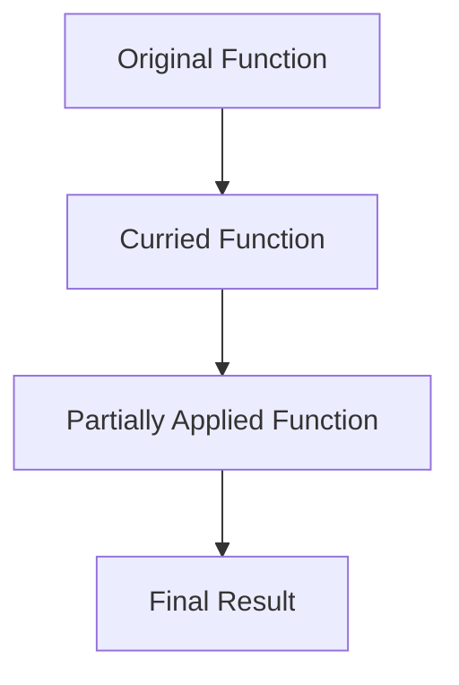

## 3.18 Currying and Partial Application

In the realm of functional programming, currying and partial application are powerful techniques that allow developers to create flexible and reusable function pipelines. These concepts are not only applicable in functional languages but can also be effectively utilized in C#. In this section, we will delve into the intricacies of currying and partial application, exploring how they can be implemented in C# to enhance code modularity and reusability.

### Introduction to Currying and Partial Application

Before we dive into the implementation details, let's first understand what currying and partial application are.

**Currying** is the process of transforming a function that takes multiple arguments into a sequence of functions, each taking a single argument. This transformation allows for more flexible function composition and reuse.

**Partial Application** refers to the technique of fixing a few arguments of a function, producing another function of smaller arity. This is particularly useful for creating specialized functions from more general ones.

Both techniques leverage closures, a feature in C# that allows functions to capture and remember the environment in which they were created.

### Currying in C#

Currying can be a bit abstract, so let's break it down with a practical example in C#. Consider a simple function that adds two integers:

```csharp
int Add(int x, int y) {
    return x + y;
}
```

In its current form, `Add` is a function that takes two arguments. To curry this function, we transform it into a series of functions, each taking a single argument:

```csharp
Func<int, Func<int, int>> CurriedAdd = x => y => x + y;
```

Here, `CurriedAdd` is a function that takes an integer `x` and returns another function that takes an integer `y` and returns the sum of `x` and `y`.

#### Benefits of Currying

1. **Function Composition**: Currying facilitates the composition of functions, allowing developers to build complex operations from simpler ones.
2. **Reusability**: Curried functions can be reused with different arguments, enhancing code modularity.
3. **Lazy Evaluation**: Currying enables lazy evaluation, where computations are deferred until all arguments are provided.

#### Implementing Currying in C#

Let's explore a more complex example to see how currying can be applied in real-world scenarios. Suppose we have a function that calculates the volume of a rectangular prism:

```csharp
double CalculateVolume(double length, double width, double height) {
    return length * width * height;
}
```

To curry this function, we transform it into a series of functions:

```csharp
Func<double, Func<double, Func<double, double>>> CurriedVolume = 
    length => width => height => length * width * height;
```

Now, we can use `CurriedVolume` to create specialized functions:

```csharp
var calculateBaseArea = CurriedVolume(10); // Fix length to 10
var calculateVolumeWithFixedBase = calculateBaseArea(5); // Fix width to 5
double volume = calculateVolumeWithFixedBase(2); // Calculate volume with height 2
```

### Partial Application in C#

Partial application is closely related to currying but focuses on fixing a few arguments of a function. Let's revisit the `Add` function:

```csharp
int Add(int x, int y) {
    return x + y;
}
```

We can create a partially applied version of `Add` by fixing one of its arguments:

```csharp
Func<int, int> AddFive = y => Add(5, y);
```

Here, `AddFive` is a new function that adds 5 to its argument. This technique is particularly useful for creating specialized functions from more general ones.

#### Benefits of Partial Application

1. **Specialization**: Partial application allows developers to create specialized functions tailored to specific use cases.
2. **Code Clarity**: By reducing the number of arguments, partially applied functions can make code more readable and maintainable.
3. **Reusability**: Like currying, partial application enhances function reusability.

#### Implementing Partial Application in C#

Let's consider a function that formats a string with a prefix and suffix:

```csharp
string FormatString(string prefix, string content, string suffix) {
    return $"{prefix}{content}{suffix}";
}
```

We can create a partially applied version of this function by fixing the prefix:

```csharp
Func<string, string, string> AddPrefix = (content, suffix) => FormatString("Hello, ", content, suffix);
```

Now, `AddPrefix` is a function that adds a fixed prefix to any content and suffix:

```csharp
string result = AddPrefix("World", "!");
// Output: "Hello, World!"
```

### Using Closures for Partial Application

Closures play a crucial role in implementing partial application. In C#, closures allow functions to capture and remember the environment in which they were created. This feature is essential for creating partially applied functions.

Consider the following example:

```csharp
Func<int, int> MultiplyBy(int x) {
    return y => x * y;
}

var multiplyByThree = MultiplyBy(3);
int result = multiplyByThree(4); // Output: 12
```

In this example, `MultiplyBy` returns a function that multiplies its argument by `x`. The returned function captures the value of `x` from the environment, demonstrating the power of closures in partial application.

### Visualizing Currying and Partial Application

To better understand the flow of currying and partial application, let's visualize these concepts using a flowchart:



**Figure 1**: The flow of transforming an original function into a curried function, then into a partially applied function, and finally obtaining the result.

### Practical Applications and Use Cases

Currying and partial application are not just theoretical concepts; they have practical applications in software development. Here are some scenarios where these techniques can be beneficial:

1. **Event Handling**: In GUI applications, currying can be used to create event handlers that are partially applied with specific context data.
2. **Configuration**: Partial application can be used to create configuration functions that are pre-filled with default values.
3. **Middleware**: In web applications, currying can be used to create middleware functions that are composed of smaller, reusable units.

### Try It Yourself

To solidify your understanding of currying and partial application, try modifying the code examples provided. Experiment with different functions and see how currying and partial application can be applied to create flexible and reusable code.

### References and Further Reading

- [Functional Programming in C#](https://docs.microsoft.com/en-us/dotnet/csharp/functional-programming)
- [Closures in C#](https://docs.microsoft.com/en-us/dotnet/csharp/programming-guide/classes-and-structs/anonymous-methods)
- [Currying and Partial Application](https://en.wikipedia.org/wiki/Currying)

### Knowledge Check

1. What is the main difference between currying and partial application?
2. How can closures be used to implement partial application in C#?
3. Provide an example of a real-world scenario where currying could be beneficial.

### Embrace the Journey

Remember, mastering currying and partial application is just the beginning. As you continue to explore functional programming in C#, you'll discover new ways to create flexible and reusable code. Keep experimenting, stay curious, and enjoy the journey!

## Quiz Time!



### What is currying in functional programming?

- [x] Transforming a function that takes multiple arguments into a sequence of functions, each taking a single argument.
- [ ] Combining multiple functions into a single function.
- [ ] Fixing a few arguments of a function to produce another function of smaller arity.
- [ ] Creating a function that takes no arguments.

> **Explanation:** Currying is the process of transforming a function that takes multiple arguments into a sequence of functions, each taking a single argument.

### What is partial application?

- [x] Fixing a few arguments of a function to produce another function of smaller arity.
- [ ] Transforming a function that takes multiple arguments into a sequence of functions, each taking a single argument.
- [ ] Combining multiple functions into a single function.
- [ ] Creating a function that takes no arguments.

> **Explanation:** Partial application involves fixing a few arguments of a function, producing another function of smaller arity.

### How do closures facilitate partial application in C#?

- [x] By allowing functions to capture and remember the environment in which they were created.
- [ ] By enabling functions to take multiple arguments.
- [ ] By transforming functions into sequences of single-argument functions.
- [ ] By allowing functions to be composed into larger functions.

> **Explanation:** Closures allow functions to capture and remember the environment in which they were created, which is essential for partial application.

### Which of the following is a benefit of currying?

- [x] Function composition
- [ ] Increased function arity
- [ ] Reduced code readability
- [ ] Decreased code reusability

> **Explanation:** Currying facilitates function composition, allowing developers to build complex operations from simpler ones.

### In the context of currying, what does "arity" refer to?

- [x] The number of arguments a function takes.
- [ ] The number of functions combined into a single function.
- [ ] The number of closures a function uses.
- [ ] The number of lines of code in a function.

> **Explanation:** Arity refers to the number of arguments a function takes.

### What is a practical application of partial application?

- [x] Creating specialized functions from more general ones.
- [ ] Transforming functions into sequences of single-argument functions.
- [ ] Increasing the number of arguments a function takes.
- [ ] Reducing the number of closures a function uses.

> **Explanation:** Partial application is useful for creating specialized functions from more general ones.

### How can currying enhance code modularity?

- [x] By allowing functions to be composed from smaller, reusable units.
- [ ] By increasing the number of arguments a function takes.
- [ ] By reducing the number of closures a function uses.
- [ ] By transforming functions into sequences of single-argument functions.

> **Explanation:** Currying enhances code modularity by allowing functions to be composed from smaller, reusable units.

### What is the role of closures in currying?

- [x] They allow functions to capture and remember the environment in which they were created.
- [ ] They enable functions to take multiple arguments.
- [ ] They transform functions into sequences of single-argument functions.
- [ ] They allow functions to be composed into larger functions.

> **Explanation:** Closures allow functions to capture and remember the environment in which they were created, which is crucial for currying.

### Which of the following is a scenario where currying can be beneficial?

- [x] Event handling in GUI applications
- [ ] Increasing the number of arguments a function takes
- [ ] Reducing the number of closures a function uses
- [ ] Transforming functions into sequences of single-argument functions

> **Explanation:** Currying can be beneficial in event handling in GUI applications, where event handlers can be created with specific context data.

### True or False: Currying and partial application are only applicable in functional programming languages.

- [x] False
- [ ] True

> **Explanation:** Currying and partial application are not limited to functional programming languages; they can be effectively utilized in C# and other languages.


