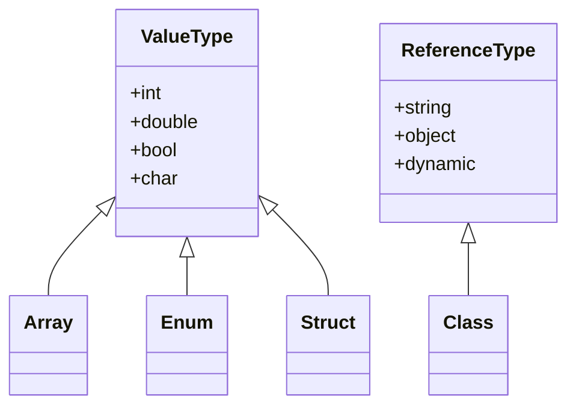

## 3.2 Data Types and Type System

In the realm of C# programming, understanding the data types and type system is crucial for crafting robust, efficient, and maintainable applications. This section delves into the intricacies of C#'s static typing and type inference, providing expert developers with the knowledge to leverage these features for safer code. We will explore the use of `var`, its implications for code clarity, and how to effectively utilize C#'s type system to enhance your software design.

### Introduction to C# Data Types

C# is a statically typed language, meaning that the type of a variable is known at compile time. This feature provides several advantages, including early error detection, improved performance, and better tooling support. Let's begin by exploring the fundamental data types in C#.

#### Value Types vs. Reference Types

C# distinguishes between value types and reference types, each with its own characteristics and use cases.

- **Value Types**: These types store data directly and are allocated on the stack. Common examples include `int`, `double`, `bool`, and `structs`. Value types are typically used for small, simple data structures.

- **Reference Types**: These types store a reference to the actual data, which is allocated on the heap. Examples include `class`, `interface`, `delegate`, and `string`. Reference types are used for more complex data structures that require dynamic memory allocation.

```csharp
// Example of a value type
int number = 42;

// Example of a reference type
string message = "Hello, World!";
```

### The C# Type System

The C# type system is designed to be both powerful and flexible, allowing developers to define custom types and leverage built-in types effectively. Let's explore some key aspects of the C# type system.

#### Static Typing

Static typing in C# means that the type of a variable is determined at compile time. This provides several benefits, including:

- **Type Safety**: Errors related to type mismatches are caught early, reducing runtime errors.
- **Performance**: The compiler can optimize code based on known types, leading to better performance.
- **Tooling Support**: IDEs can provide better code completion, refactoring, and error checking.

```csharp
// Static typing example
int age = 30;
// age = "thirty"; // Compile-time error: Cannot implicitly convert type 'string' to 'int'
```

#### Type Inference with `var`

C# supports type inference through the use of the `var` keyword. When you declare a variable with `var`, the compiler infers the type based on the assigned value. This can lead to more concise code, but it's important to use it judiciously to maintain code clarity.

```csharp
// Type inference with var
var count = 10; // Inferred as int
var name = "Alice"; // Inferred as string
```

**Implications for Code Clarity**: While `var` can make code more concise, overuse can lead to ambiguity. It's best used when the type is obvious from the context or when working with anonymous types.

### Primitive Data Types

C# provides a set of built-in primitive data types that cover most basic needs. These include:

- **Integral Types**: `byte`, `sbyte`, `short`, `ushort`, `int`, `uint`, `long`, `ulong`
- **Floating-Point Types**: `float`, `double`
- **Decimal Type**: `decimal` for high-precision financial calculations
- **Boolean Type**: `bool` for true/false values
- **Character Type**: `char` for single Unicode characters

```csharp
// Examples of primitive data types
byte age = 25;
double pi = 3.14159;
bool isActive = true;
char initial = 'A';
```

### Complex Data Types

In addition to primitive types, C# supports complex data types such as arrays, enums, structs, and classes.

#### Arrays

Arrays are collections of elements of the same type. They are reference types and provide a way to store multiple values in a single variable.

```csharp
// Array example
int[] numbers = { 1, 2, 3, 4, 5 };
```

#### Enums

Enums are a special data type that allows you to define a set of named constants. They improve code readability and maintainability.

```csharp
// Enum example
enum Days { Sunday, Monday, Tuesday, Wednesday, Thursday, Friday, Saturday }
Days today = Days.Wednesday;
```

#### Structs

Structs are value types that can contain data and methods. They are useful for small data structures that do not require inheritance.

```csharp
// Struct example
struct Point
{
    public int X;
    public int Y;
}
Point p = new Point { X = 10, Y = 20 };
```

#### Classes

Classes are reference types that can contain data and methods. They support inheritance and polymorphism, making them suitable for complex data structures.

```csharp
// Class example
class Person
{
    public string Name { get; set; }
    public int Age { get; set; }
}
Person person = new Person { Name = "Alice", Age = 30 };
```

### Nullable Types

C# provides nullable types to represent value types that can be assigned `null`. This is useful when dealing with databases or other scenarios where a value might be missing.

```csharp
// Nullable type example
int? nullableInt = null;
nullableInt = 5;
```

### Type Conversion

C# supports both implicit and explicit type conversions. Implicit conversions occur automatically when there is no risk of data loss, while explicit conversions require a cast.

```csharp
// Implicit conversion
int num = 10;
double doubleNum = num; // No data loss

// Explicit conversion
double pi = 3.14;
int intPi = (int)pi; // Cast required, potential data loss
```

### Type Safety and Casting

C# enforces type safety, ensuring that operations are performed on compatible types. When necessary, casting can be used to convert between types.

```csharp
// Safe casting with 'as' keyword
object obj = "Hello";
string str = obj as string;
if (str != null)
{
    Console.WriteLine(str);
}
```

### Generics

Generics allow you to define type-safe data structures and methods without committing to a specific data type. This enhances code reusability and type safety.

```csharp
// Generic list example
List<int> numbers = new List<int> { 1, 2, 3 };
```

### Type Inference with LINQ

LINQ (Language Integrated Query) leverages type inference to provide powerful querying capabilities over collections.

```csharp
// LINQ example with type inference
var evenNumbers = from num in numbers
                  where num % 2 == 0
                  select num;
```

### Advanced Type System Features

C# offers advanced type system features such as dynamic types, anonymous types, and tuples.

#### Dynamic Types

Dynamic types allow you to bypass compile-time type checking, providing flexibility at the cost of type safety.

```csharp
// Dynamic type example
dynamic dyn = "Hello";
Console.WriteLine(dyn.Length);
```

#### Anonymous Types

Anonymous types provide a convenient way to encapsulate a set of read-only properties into a single object without defining a formal class.

```csharp
// Anonymous type example
var person = new { Name = "Alice", Age = 30 };
Console.WriteLine(person.Name);
```

#### Tuples

Tuples allow you to group multiple values into a single object, providing a lightweight alternative to classes and structs.

```csharp
// Tuple example
var tuple = (Name: "Alice", Age: 30);
Console.WriteLine(tuple.Name);
```

### Visualizing C# Type System

To better understand the relationships between different data types in C#, let's visualize the type system using a class diagram.



### Best Practices for Using C# Data Types

- **Choose the Right Type**: Select the most appropriate data type for your needs to optimize performance and memory usage.
- **Use `var` Wisely**: While `var` can make code more concise, ensure that the inferred type is clear from the context.
- **Leverage Generics**: Use generics to create reusable, type-safe data structures and methods.
- **Embrace Nullable Types**: Use nullable types to handle scenarios where a value might be missing.
- **Avoid Overusing Dynamic Types**: While dynamic types offer flexibility, they sacrifice type safety and should be used sparingly.

### Try It Yourself

Experiment with the following code snippets to deepen your understanding of C# data types and type system. Try modifying the examples to see how changes affect the behavior.

```csharp
// Experiment with value and reference types
int valueType = 10;
string referenceType = "Hello";

// Modify the values and observe the behavior
valueType += 5;
referenceType += " World";

// Experiment with type inference
var inferredInt = 42;
var inferredString = "C#";

// Change the assigned values and see the results
inferredInt = 100;
inferredString = "Programming";
```

### Knowledge Check

- What are the differences between value types and reference types in C#?
- How does static typing enhance code safety and performance?
- When should you use `var` for type inference?
- What are the benefits of using generics in C#?
- How do nullable types improve code reliability?

### Embrace the Journey

Remember, mastering C# data types and type system is a journey. As you progress, you'll build more complex and efficient applications. Keep experimenting, stay curious, and enjoy the journey!

## Quiz Time!



### What is a key advantage of C#'s static typing?

- [x] Early error detection
- [ ] Dynamic type flexibility
- [ ] Reduced code verbosity
- [ ] Automatic memory management

> **Explanation:** Static typing allows errors to be caught at compile time, reducing runtime errors.

### Which keyword is used for type inference in C#?

- [ ] dynamic
- [x] var
- [ ] object
- [ ] auto

> **Explanation:** The `var` keyword allows the compiler to infer the type of a variable based on the assigned value.

### What is the main difference between value types and reference types?

- [x] Value types store data directly, while reference types store references to data.
- [ ] Value types are always larger in size than reference types.
- [ ] Reference types are stored on the stack, while value types are stored on the heap.
- [ ] Value types can only be used for primitive data.

> **Explanation:** Value types store data directly on the stack, whereas reference types store references to data on the heap.

### When should you use nullable types in C#?

- [ ] When you want to avoid using `null` values.
- [x] When a value type might need to represent a missing value.
- [ ] When working with reference types.
- [ ] When you need to improve performance.

> **Explanation:** Nullable types allow value types to represent missing values, which is useful in scenarios like database operations.

### Which of the following is a reference type in C#?

- [ ] int
- [ ] bool
- [x] string
- [ ] char

> **Explanation:** `string` is a reference type in C#, while `int`, `bool`, and `char` are value types.

### What is the purpose of generics in C#?

- [ ] To allow dynamic typing
- [ ] To simplify code syntax
- [x] To create reusable, type-safe data structures
- [ ] To improve runtime performance

> **Explanation:** Generics enable the creation of reusable, type-safe data structures and methods.

### How can you safely cast an object to a specific type in C#?

- [ ] Using `dynamic`
- [x] Using the `as` keyword
- [ ] Using `var`
- [ ] Using `implicit`

> **Explanation:** The `as` keyword allows safe casting by returning `null` if the cast fails.

### What is a tuple in C#?

- [ ] A collection of key-value pairs
- [ ] A dynamic type
- [x] A lightweight data structure for grouping multiple values
- [ ] An anonymous type

> **Explanation:** Tuples are lightweight data structures that group multiple values into a single object.

### Which of the following is an example of an implicit conversion?

- [x] Converting an `int` to a `double`
- [ ] Converting a `double` to an `int`
- [ ] Converting a `string` to an `int`
- [ ] Converting a `bool` to an `int`

> **Explanation:** Converting an `int` to a `double` is an implicit conversion because there is no risk of data loss.

### True or False: Overusing `var` can lead to code ambiguity.

- [x] True
- [ ] False

> **Explanation:** Overusing `var` can make code less clear, as the type of a variable may not be immediately obvious.


