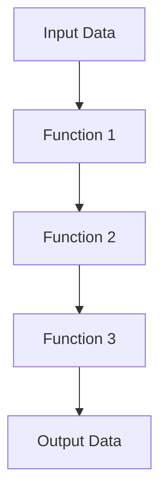

## 3.20 Function Composition Pattern

In the realm of software engineering, the ability to create modular and maintainable code is paramount. The Function Composition Pattern in C# is a powerful technique that allows developers to combine multiple functions into a single, cohesive operation. This pattern leverages the strengths of C# delegates and LINQ expressions to create pipelines that enhance code readability and reusability. In this section, we will delve deep into the Function Composition Pattern, exploring its concepts, applications, and best practices.

### Introduction to Function Composition

Function composition is a fundamental concept in functional programming that involves combining two or more functions to produce a new function. This new function represents the application of the original functions in sequence. In C#, function composition can be achieved using delegates, lambda expressions, and LINQ, allowing developers to build complex operations from simple, reusable components.

#### Key Concepts

- **Modularity**: Breaking down complex operations into smaller, reusable functions.
- **Reusability**: Using composed functions across different parts of an application.
- **Readability**: Enhancing code clarity by expressing operations as a sequence of transformations.

### Understanding Delegates and Lambda Expressions

Delegates in C# are type-safe function pointers that allow methods to be passed as parameters. They are the cornerstone of function composition, enabling the chaining of functions. Lambda expressions provide a concise syntax for defining anonymous methods, making them ideal for composing functions.

#### Example: Basic Delegate Usage

```csharp
// Define a delegate that takes an integer and returns an integer
delegate int Transformer(int x);

class Program
{
    static int Square(int x) => x * x;
    static int Increment(int x) => x + 1;

    static void Main()
    {
        Transformer transform = Square;
        transform += Increment;

        int result = transform(3); // Applies Square and then Increment
        Console.WriteLine(result); // Output: 10
    }
}
```

In this example, the `Transformer` delegate is used to compose the `Square` and `Increment` functions. The composed function first squares the input and then increments the result.

### Function Composition with LINQ

LINQ (Language Integrated Query) is a powerful feature in C# that provides a declarative syntax for querying collections. It also supports function composition through method chaining, allowing developers to create expressive and concise pipelines.

#### Example: Composing Functions with LINQ

```csharp
using System;
using System.Linq;

class Program
{
    static void Main()
    {
        Func<int, int> square = x => x * x;
        Func<int, int> increment = x => x + 1;

        var numbers = new[] { 1, 2, 3, 4, 5 };
        var transformedNumbers = numbers.Select(square).Select(increment);

        Console.WriteLine(string.Join(", ", transformedNumbers)); // Output: 2, 5, 10, 17, 26
    }
}
```

In this example, the `Select` method is used to apply the `square` and `increment` functions to each element in the `numbers` array, demonstrating function composition in a LINQ pipeline.

### Creating Pipelines with Function Composition

Function composition is particularly useful for creating pipelines, where data flows through a series of transformations. This approach is common in data processing and streamlining complex operations.

#### Example: Building a Data Processing Pipeline

```csharp
using System;
using System.Collections.Generic;
using System.Linq;

class Program
{
    static void Main()
    {
        Func<IEnumerable<int>, IEnumerable<int>> filterEven = nums => nums.Where(n => n % 2 == 0);
        Func<IEnumerable<int>, IEnumerable<int>> doubleValues = nums => nums.Select(n => n * 2);
        Func<IEnumerable<int>, int> sumValues = nums => nums.Sum();

        var numbers = new[] { 1, 2, 3, 4, 5, 6 };
        var result = sumValues(doubleValues(filterEven(numbers)));

        Console.WriteLine(result); // Output: 20
    }
}
```

This example demonstrates a data processing pipeline where even numbers are filtered, doubled, and then summed. Each transformation is represented as a function, showcasing the power of function composition.

### Design Considerations

When using the Function Composition Pattern, consider the following:

- **Performance**: Composing functions can introduce overhead, especially with large data sets. Optimize by minimizing unnecessary transformations.
- **Error Handling**: Ensure that composed functions handle exceptions gracefully to prevent cascading failures.
- **Testing**: Test individual functions and composed pipelines to ensure correctness and reliability.

### Differences and Similarities with Other Patterns

Function composition shares similarities with the Chain of Responsibility pattern, where a series of handlers process a request. However, function composition focuses on transforming data, while the Chain of Responsibility deals with handling requests.

### Visualizing Function Composition

To better understand function composition, let's visualize the process using a flowchart.



This diagram illustrates how input data flows through a series of functions, each transforming the data before passing it to the next function.

### Try It Yourself

Experiment with the following modifications to the code examples:

- Add additional transformations to the pipeline, such as filtering odd numbers or multiplying by a constant.
- Implement error handling within the composed functions to manage exceptions.
- Create a pipeline that processes a different data type, such as strings or custom objects.

### References and Links

For further reading on function composition and related topics, consider the following resources:

- [Microsoft Docs: Delegates and Lambda Expressions](https://docs.microsoft.com/en-us/dotnet/csharp/programming-guide/delegates/)
- [LINQ (Language Integrated Query) Overview](https://docs.microsoft.com/en-us/dotnet/csharp/programming-guide/concepts/linq/)
- [Functional Programming in C#](https://docs.microsoft.com/en-us/dotnet/csharp/functional-programming/)

### Knowledge Check

To reinforce your understanding of the Function Composition Pattern, consider the following questions:

- How does function composition enhance code modularity and reusability?
- What are the benefits of using LINQ for function composition?
- How can error handling be integrated into composed functions?

### Embrace the Journey

As you explore the Function Composition Pattern, remember that this is just one of many tools in your software engineering toolkit. Continue to experiment, learn, and apply these concepts to build robust and maintainable applications. Keep pushing the boundaries of what's possible with C#, and enjoy the journey of mastering design patterns.

## Quiz Time!



### What is the primary benefit of using function composition in C#?

- [x] Enhances code modularity and reusability
- [ ] Increases code complexity
- [ ] Reduces code readability
- [ ] Limits function usage

> **Explanation:** Function composition allows developers to create modular and reusable code by combining simple functions into complex operations.

### Which C# feature is essential for function composition?

- [x] Delegates
- [ ] Interfaces
- [ ] Abstract Classes
- [ ] Structs

> **Explanation:** Delegates are type-safe function pointers that enable the chaining of functions, making them essential for function composition.

### How does LINQ facilitate function composition?

- [x] By providing method chaining for function transformations
- [ ] By enforcing strict type checking
- [ ] By limiting data manipulation
- [ ] By increasing code verbosity

> **Explanation:** LINQ supports function composition through method chaining, allowing developers to create expressive and concise pipelines.

### In the context of function composition, what is a pipeline?

- [x] A series of function transformations applied to data
- [ ] A single function that processes data
- [ ] A method for error handling
- [ ] A data storage mechanism

> **Explanation:** A pipeline is a sequence of function transformations that process data, often used in data processing and streamlining operations.

### What should be considered when using the Function Composition Pattern?

- [x] Performance and error handling
- [ ] Code obfuscation
- [ ] Data encryption
- [ ] User interface design

> **Explanation:** When using the Function Composition Pattern, consider performance and error handling to ensure efficient and reliable operations.

### How can function composition improve code readability?

- [x] By expressing operations as a sequence of transformations
- [ ] By increasing the number of lines of code
- [ ] By using complex syntax
- [ ] By hiding function implementations

> **Explanation:** Function composition improves readability by expressing operations as a clear sequence of transformations, making the code easier to understand.

### What is a key difference between function composition and the Chain of Responsibility pattern?

- [x] Function composition focuses on data transformation, while Chain of Responsibility handles requests
- [ ] Function composition is used for error handling, while Chain of Responsibility is not
- [ ] Function composition is only applicable to C#, while Chain of Responsibility is not
- [ ] Function composition requires inheritance, while Chain of Responsibility does not

> **Explanation:** Function composition is primarily concerned with transforming data, whereas the Chain of Responsibility pattern deals with handling requests.

### What is the role of lambda expressions in function composition?

- [x] They provide a concise syntax for defining anonymous methods
- [ ] They enforce strict type checking
- [ ] They increase code verbosity
- [ ] They limit function usage

> **Explanation:** Lambda expressions offer a concise syntax for defining anonymous methods, making them ideal for composing functions.

### How can you test composed functions effectively?

- [x] By testing individual functions and composed pipelines
- [ ] By only testing the final output
- [ ] By ignoring error handling
- [ ] By using complex testing frameworks

> **Explanation:** To ensure correctness and reliability, test both individual functions and the composed pipelines they form.

### True or False: Function composition can introduce performance overhead.

- [x] True
- [ ] False

> **Explanation:** Composing functions can introduce performance overhead, especially with large data sets, so optimization is important.


