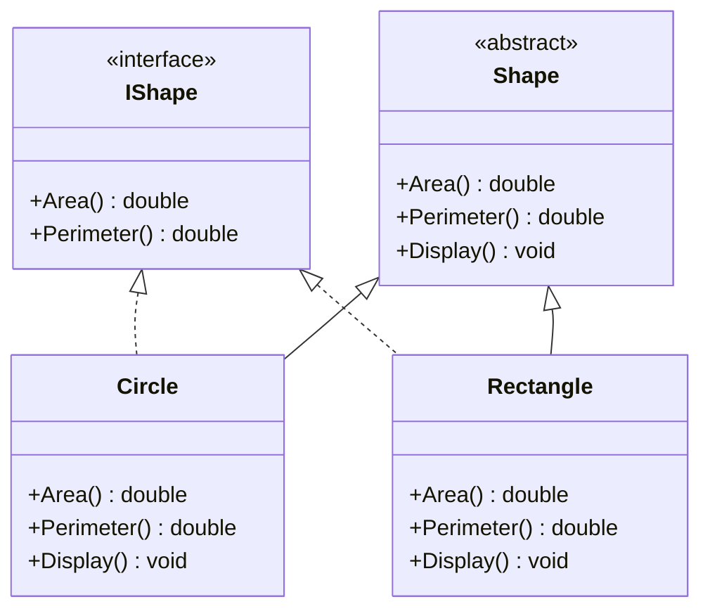

## 3.3 Interfaces and Abstract Classes

In the realm of C# programming, interfaces and abstract classes are fundamental constructs that enable developers to define contracts and shared behavior, facilitating better abstraction and design flexibility. Understanding when and how to use these constructs is crucial for expert software engineers and enterprise architects aiming to build scalable and maintainable applications. In this section, we will delve into the intricacies of interfaces and abstract classes, explore their differences, and provide guidance on when to use each.

### Introduction to Interfaces and Abstract Classes

Before we dive into the specifics, let's establish a foundational understanding of what interfaces and abstract classes are in C#.

#### Interfaces

An interface in C# is a contract that defines a set of methods and properties that a class must implement. Interfaces do not contain any implementation themselves; they merely specify what methods and properties a class should have. This allows for a high degree of flexibility and decoupling in software design.

```csharp
public interface IShape
{
    double Area();
    double Perimeter();
}
```

In the example above, `IShape` is an interface that defines two methods: `Area()` and `Perimeter()`. Any class that implements this interface must provide concrete implementations for these methods.

#### Abstract Classes

An abstract class, on the other hand, can contain both abstract methods (which have no implementation) and concrete methods (which have an implementation). Abstract classes are used when you want to provide some shared functionality among related classes while still enforcing certain methods to be implemented by derived classes.

```csharp
public abstract class Shape
{
    public abstract double Area();
    public abstract double Perimeter();

    public void Display()
    {
        Console.WriteLine($"Area: {Area()}, Perimeter: {Perimeter()}");
    }
}
```

In this example, `Shape` is an abstract class with two abstract methods, `Area()` and `Perimeter()`, and one concrete method, `Display()`, which can be used by any derived class.

### Key Differences Between Interfaces and Abstract Classes

Understanding the differences between interfaces and abstract classes is essential for making informed design decisions. Here are some key distinctions:

1. **Implementation**: Interfaces cannot contain any implementation, whereas abstract classes can contain both abstract and concrete methods.

2. **Multiple Inheritance**: C# allows a class to implement multiple interfaces, but it can only inherit from a single abstract class. This is a crucial consideration when designing class hierarchies.

3. **Default Implementations**: Starting with C# 8.0, interfaces can have default implementations for methods. However, this feature is primarily intended for backward compatibility and should be used judiciously.

4. **State**: Abstract classes can have fields and maintain state, while interfaces cannot. This makes abstract classes suitable for scenarios where shared state or behavior is needed.

5. **Versioning**: Interfaces are more challenging to version because adding new members can break existing implementations. Abstract classes offer more flexibility in this regard, as new methods can be added without affecting derived classes.

### When to Use Interfaces vs. Abstract Classes

Deciding whether to use an interface or an abstract class depends on the specific requirements of your application. Here are some guidelines to help you make the right choice:

- **Use Interfaces When**:
  - You need to define a contract that multiple classes can implement.
  - You want to achieve polymorphism without enforcing a specific class hierarchy.
  - You need to support multiple inheritance of behavior.

- **Use Abstract Classes When**:
  - You have shared code that you want to reuse across multiple classes.
  - You need to maintain state or provide default behavior.
  - You want to enforce a common base class for related classes.

### Practical Examples and Code Snippets

Let's explore some practical examples to illustrate the use of interfaces and abstract classes in C#.

#### Example 1: Using Interfaces for Polymorphism

Consider a scenario where you have different types of payment methods, such as credit card and PayPal. You can define an interface to represent the common behavior:

```csharp
public interface IPaymentMethod
{
    void ProcessPayment(decimal amount);
}

public class CreditCardPayment : IPaymentMethod
{
    public void ProcessPayment(decimal amount)
    {
        Console.WriteLine($"Processing credit card payment of {amount:C}");
    }
}

public class PayPalPayment : IPaymentMethod
{
    public void ProcessPayment(decimal amount)
    {
        Console.WriteLine($"Processing PayPal payment of {amount:C}");
    }
}
```

In this example, both `CreditCardPayment` and `PayPalPayment` implement the `IPaymentMethod` interface, allowing them to be used interchangeably in the application.

#### Example 2: Using Abstract Classes for Shared Behavior

Now, let's consider a scenario where you have different types of vehicles, and you want to provide some shared functionality:

```csharp
public abstract class Vehicle
{
    public abstract void Start();
    public abstract void Stop();

    public void DisplayInfo()
    {
        Console.WriteLine("Vehicle information displayed.");
    }
}

public class Car : Vehicle
{
    public override void Start()
    {
        Console.WriteLine("Car started.");
    }

    public override void Stop()
    {
        Console.WriteLine("Car stopped.");
    }
}

public class Motorcycle : Vehicle
{
    public override void Start()
    {
        Console.WriteLine("Motorcycle started.");
    }

    public override void Stop()
    {
        Console.WriteLine("Motorcycle stopped.");
    }
}
```

In this example, `Vehicle` is an abstract class that provides a `DisplayInfo` method, which can be used by both `Car` and `Motorcycle` classes.

### Visualizing Interfaces and Abstract Classes

To better understand the relationship between interfaces, abstract classes, and concrete classes, let's visualize these concepts using a class diagram.



**Diagram Description**: This class diagram illustrates the relationship between the `IShape` interface, the `Shape` abstract class, and the `Circle` and `Rectangle` concrete classes. Both `Circle` and `Rectangle` implement the `IShape` interface and inherit from the `Shape` abstract class, demonstrating how interfaces and abstract classes can be used together to define contracts and shared behavior.

### Design Considerations

When designing software systems, it's important to consider the following aspects when using interfaces and abstract classes:

- **Flexibility vs. Complexity**: Interfaces provide flexibility by allowing multiple implementations, but they can also increase complexity if overused. Abstract classes offer a balance between flexibility and shared behavior.

- **Performance**: Abstract classes can be more performant than interfaces because they allow for shared code and state. However, the performance difference is often negligible in most applications.

- **Maintainability**: Interfaces can be challenging to maintain if they evolve over time. Abstract classes offer more flexibility in terms of versioning and adding new functionality.

- **C# Specific Features**: Take advantage of C# features such as default interface methods (introduced in C# 8.0) and abstract class constructors to enhance your design.

### Differences and Similarities

It's common for developers to confuse interfaces and abstract classes due to their overlapping use cases. Here's a summary of their differences and similarities:

- **Differences**:
  - Interfaces define a contract with no implementation, while abstract classes can have both abstract and concrete methods.
  - Interfaces support multiple inheritance, whereas abstract classes do not.
  - Abstract classes can maintain state, while interfaces cannot.

- **Similarities**:
  - Both interfaces and abstract classes are used to define contracts and shared behavior.
  - Both can be used to achieve polymorphism and decoupling in software design.

### Try It Yourself

To solidify your understanding of interfaces and abstract classes, try modifying the code examples provided. For instance, add a new payment method class that implements the `IPaymentMethod` interface, or create a new vehicle type that inherits from the `Vehicle` abstract class. Experiment with adding new methods and properties to see how they affect the design.

### Knowledge Check

Before we wrap up, let's pose some questions to test your understanding of interfaces and abstract classes:

1. What is the primary purpose of an interface in C#?
2. How do abstract classes differ from interfaces in terms of implementation?
3. When would you choose to use an abstract class over an interface?
4. Can a class implement multiple interfaces in C#? Why might this be useful?
5. How do default interface methods introduced in C# 8.0 affect the design of interfaces?

### Summary

In this section, we've explored the concepts of interfaces and abstract classes in C#, highlighting their differences, similarities, and use cases. By understanding when and how to use these constructs, you can design more flexible, maintainable, and scalable applications. Remember, the choice between interfaces and abstract classes depends on the specific requirements of your application, and both have their place in modern software design.

### Embrace the Journey

As you continue your journey in mastering C# design patterns, remember that interfaces and abstract classes are powerful tools in your toolkit. Keep experimenting, stay curious, and enjoy the process of building robust and elegant software solutions.

## Quiz Time!



### What is the primary purpose of an interface in C#?

- [x] To define a contract that classes must implement
- [ ] To provide a base class for inheritance
- [ ] To maintain state across multiple classes
- [ ] To encapsulate data

> **Explanation:** An interface defines a contract that classes must implement, specifying methods and properties without providing any implementation.

### How do abstract classes differ from interfaces in terms of implementation?

- [x] Abstract classes can have both abstract and concrete methods
- [ ] Interfaces can have fields and maintain state
- [ ] Abstract classes cannot have any implementation
- [ ] Interfaces can only have abstract methods

> **Explanation:** Abstract classes can have both abstract and concrete methods, allowing them to provide shared behavior and state.

### When would you choose to use an abstract class over an interface?

- [x] When you need to provide shared behavior and maintain state
- [ ] When you want to support multiple inheritance
- [ ] When you need to define a contract without implementation
- [ ] When you want to avoid polymorphism

> **Explanation:** Abstract classes are used when you need to provide shared behavior and maintain state, offering a common base for related classes.

### Can a class implement multiple interfaces in C#? Why might this be useful?

- [x] Yes, it allows for polymorphism and decoupling
- [ ] No, a class can only implement one interface
- [ ] Yes, but it increases complexity and should be avoided
- [ ] No, interfaces are not used for polymorphism

> **Explanation:** A class can implement multiple interfaces, allowing for polymorphism and decoupling, which enhances flexibility in design.

### How do default interface methods introduced in C# 8.0 affect the design of interfaces?

- [x] They allow interfaces to have default implementations for methods
- [ ] They prevent interfaces from being used in polymorphism
- [ ] They make interfaces obsolete
- [ ] They require all methods to be implemented by classes

> **Explanation:** Default interface methods allow interfaces to have default implementations, providing more flexibility in design and backward compatibility.

### What is a key benefit of using interfaces in software design?

- [x] They promote decoupling and flexibility
- [ ] They enforce a strict class hierarchy
- [ ] They allow for shared state across classes
- [ ] They simplify versioning

> **Explanation:** Interfaces promote decoupling and flexibility by defining contracts that multiple classes can implement without enforcing a specific class hierarchy.

### Why might you choose an abstract class over an interface for shared behavior?

- [x] Abstract classes can provide shared code and maintain state
- [ ] Interfaces can have fields and maintain state
- [ ] Abstract classes cannot have any implementation
- [ ] Interfaces are more performant

> **Explanation:** Abstract classes can provide shared code and maintain state, making them suitable for scenarios where shared behavior is needed.

### What is a limitation of interfaces compared to abstract classes?

- [x] Interfaces cannot maintain state
- [ ] Interfaces cannot be used for polymorphism
- [ ] Interfaces cannot define contracts
- [ ] Interfaces are less flexible

> **Explanation:** Interfaces cannot maintain state, which is a limitation compared to abstract classes that can have fields and shared behavior.

### Can abstract classes have constructors in C#?

- [x] True
- [ ] False

> **Explanation:** Abstract classes can have constructors, which can be used to initialize fields and provide shared functionality for derived classes.

### What is a common use case for interfaces in C#?

- [x] To define a contract for multiple classes to implement
- [ ] To provide a base class for inheritance
- [ ] To maintain state across multiple classes
- [ ] To encapsulate data

> **Explanation:** Interfaces are commonly used to define a contract for multiple classes to implement, promoting polymorphism and flexibility.


