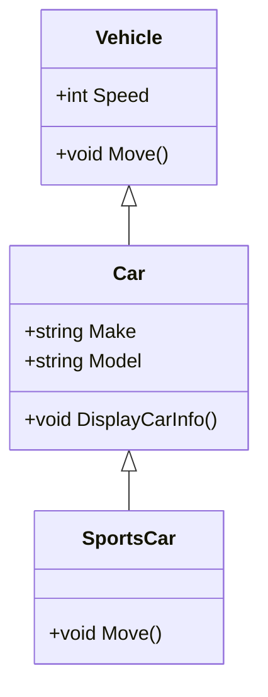

## 3.4 Classes, Inheritance, and Access Modifiers

In this section, we delve into the core concepts of object-oriented programming (OOP) in C#: classes, inheritance, and access modifiers. These foundational elements are crucial for building robust, scalable, and maintainable applications. By mastering these concepts, you will enhance your ability to design complex systems with clarity and precision.

### Understanding Classes in C#

Classes are the blueprint for creating objects in C#. They encapsulate data for the object and define behaviors through methods. A class is a fundamental building block in OOP, allowing you to model real-world entities and their interactions.

#### Defining a Class

To define a class in C#, use the `class` keyword followed by the class name. It's a good practice to use PascalCase for class names.

```csharp
public class Car
{
    // Fields
    private string make;
    private string model;
    private int year;

    // Constructor
    public Car(string make, string model, int year)
    {
        this.make = make;
        this.model = model;
        this.year = year;
    }

    // Method
    public void DisplayInfo()
    {
        Console.WriteLine($"Car: {year} {make} {model}");
    }
}
```

In this example, the `Car` class has three fields (`make`, `model`, and `year`), a constructor to initialize these fields, and a method `DisplayInfo` to print the car's details.

#### Creating Objects

Objects are instances of classes. You create an object using the `new` keyword.

```csharp
Car myCar = new Car("Toyota", "Corolla", 2020);
myCar.DisplayInfo(); // Output: Car: 2020 Toyota Corolla
```

### Inheritance in C#

Inheritance is a mechanism that allows one class to inherit fields and methods from another class. It promotes code reuse and establishes a natural hierarchy between classes.

#### Base and Derived Classes

The class that is inherited from is called the base class, and the class that inherits is called the derived class. Use the `:` symbol to denote inheritance.

```csharp
public class Vehicle
{
    public int Speed { get; set; }

    public void Move()
    {
        Console.WriteLine("Vehicle is moving");
    }
}

public class Car : Vehicle
{
    public string Make { get; set; }
    public string Model { get; set; }

    public void DisplayCarInfo()
    {
        Console.WriteLine($"Car: {Make} {Model}, Speed: {Speed}");
    }
}
```

In this example, `Car` inherits from `Vehicle`, gaining access to the `Speed` property and `Move` method.

#### Overriding Methods

Derived classes can override methods of the base class to provide specific implementations. Use the `override` keyword.

```csharp
public class SportsCar : Car
{
    public override void Move()
    {
        Console.WriteLine("SportsCar is moving fast!");
    }
}
```

#### Sealed Classes and Methods

Use the `sealed` keyword to prevent a class from being inherited or a method from being overridden.

```csharp
public sealed class LuxuryCar : Car
{
    // This class cannot be inherited
}

public class Truck : Vehicle
{
    public sealed override void Move()
    {
        Console.WriteLine("Truck is moving slowly");
    }
}
```

### Access Modifiers in C#

Access modifiers control the visibility of classes and their members. They are crucial for encapsulation, a core principle of OOP.

#### Public

The `public` modifier makes a class or member accessible from any other code.

```csharp
public class Engine
{
    public int Horsepower { get; set; }
}
```

#### Private

The `private` modifier restricts access to the containing class only.

```csharp
public class Engine
{
    private int horsepower;

    public void SetHorsepower(int hp)
    {
        horsepower = hp;
    }
}
```

#### Protected

The `protected` modifier allows access within the containing class and derived classes.

```csharp
public class Vehicle
{
    protected int speed;

    protected void Accelerate()
    {
        speed += 10;
    }
}
```

#### Internal

The `internal` modifier restricts access to the current assembly.

```csharp
internal class Transmission
{
    public string Type { get; set; }
}
```

#### Protected Internal

The `protected internal` modifier allows access within the current assembly or from derived classes.

```csharp
public class Vehicle
{
    protected internal int speed;
}
```

#### Private Protected

The `private protected` modifier allows access within the containing class or derived classes in the same assembly.

```csharp
public class Vehicle
{
    private protected int speed;
}
```

### Visualizing Class Relationships

To better understand class relationships, let's visualize them using a class diagram.



This diagram shows the inheritance hierarchy: `Vehicle` is the base class, `Car` is a derived class, and `SportsCar` further derives from `Car`.

### Best Practices for Using Classes and Inheritance

- **Favor Composition Over Inheritance**: Use inheritance when there is a clear "is-a" relationship. Otherwise, consider composition to avoid tight coupling.
- **Use Access Modifiers Wisely**: Protect your class internals by using the most restrictive access level that makes sense.
- **Avoid Deep Inheritance Hierarchies**: They can become difficult to manage and understand.
- **Leverage Polymorphism**: Use base class references to work with derived class objects, enabling flexible and reusable code.

### Try It Yourself

Experiment with the following tasks to deepen your understanding:

1. **Modify the `Car` Class**: Add a new method to calculate fuel efficiency and test it.
2. **Create a New Derived Class**: Implement a `Truck` class that inherits from `Vehicle` and adds specific properties.
3. **Experiment with Access Modifiers**: Change the access levels of various members and observe the effects.

### Knowledge Check

- **What is the purpose of access modifiers in C#?**
- **How does inheritance promote code reuse?**
- **What is the difference between `protected` and `private protected`?**

### Summary

In this section, we've explored the essential concepts of classes, inheritance, and access modifiers in C#. These tools are fundamental to building well-structured and maintainable applications. By understanding and applying these principles, you can create flexible and efficient software solutions.

Remember, this is just the beginning. As you progress, you'll build more complex and interactive systems. Keep experimenting, stay curious, and enjoy the journey!

## Quiz Time!



### What is the primary purpose of a class in C#?

- [x] To serve as a blueprint for creating objects
- [ ] To execute code in a procedural manner
- [ ] To handle exceptions
- [ ] To manage memory allocation

> **Explanation:** A class in C# serves as a blueprint for creating objects, encapsulating data and behaviors.

### Which access modifier allows access only within the same assembly?

- [ ] public
- [ ] private
- [x] internal
- [ ] protected

> **Explanation:** The `internal` access modifier restricts access to the current assembly.

### How does inheritance promote code reuse?

- [x] By allowing derived classes to use methods and properties of base classes
- [ ] By enabling multiple inheritance
- [ ] By enforcing encapsulation
- [ ] By providing polymorphism

> **Explanation:** Inheritance allows derived classes to use and extend the functionality of base classes, promoting code reuse.

### What keyword is used to prevent a class from being inherited?

- [ ] abstract
- [x] sealed
- [ ] static
- [ ] virtual

> **Explanation:** The `sealed` keyword is used to prevent a class from being inherited.

### What is the difference between `protected` and `private protected`?

- [x] `protected` allows access in derived classes, `private protected` restricts to the same assembly
- [ ] `protected` is more restrictive than `private protected`
- [ ] `private protected` allows access in derived classes, `protected` restricts to the same assembly
- [ ] They are interchangeable

> **Explanation:** `protected` allows access in derived classes, while `private protected` restricts access to derived classes within the same assembly.

### Which keyword is used to override a method in a derived class?

- [ ] new
- [ ] base
- [x] override
- [ ] virtual

> **Explanation:** The `override` keyword is used to provide a new implementation of a method in a derived class.

### What is the benefit of using `sealed` methods?

- [x] To prevent further overriding in derived classes
- [ ] To allow multiple inheritance
- [ ] To enhance encapsulation
- [ ] To improve performance

> **Explanation:** Sealed methods prevent further overriding, ensuring the method's implementation remains unchanged in derived classes.

### What does the `:` symbol denote in a class definition?

- [x] Inheritance
- [ ] Composition
- [ ] Aggregation
- [ ] Encapsulation

> **Explanation:** The `:` symbol is used in a class definition to denote inheritance.

### Which of the following is a best practice for using inheritance?

- [x] Favor composition over inheritance when possible
- [ ] Use deep inheritance hierarchies
- [ ] Avoid using polymorphism
- [ ] Always use public access modifiers

> **Explanation:** Favoring composition over inheritance helps avoid tight coupling and complex hierarchies.

### True or False: A class can inherit from multiple base classes in C#.

- [ ] True
- [x] False

> **Explanation:** C# does not support multiple inheritance for classes; a class can inherit from only one base class.


