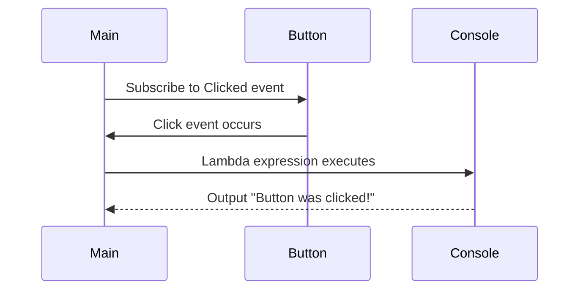

## 3.6 Delegates, Events, and Lambda Expressions

In this section, we delve into the powerful features of C# that enable developers to handle function references and implement event-driven programming: delegates, events, and lambda expressions. These constructs are fundamental to creating flexible and maintainable applications, allowing for dynamic behavior and efficient handling of asynchronous operations. Let's explore these concepts in detail, starting with delegates.

### Understanding Delegates

Delegates in C# are type-safe function pointers, allowing methods to be passed as parameters. They are crucial for implementing callback methods and defining custom event handlers.

#### Defining and Using Delegates

To define a delegate, use the `delegate` keyword followed by a method signature. Here's a simple example:

```csharp
// Define a delegate
public delegate void Notify(string message);

// Implement a method that matches the delegate signature
public class Notifier
{
    public void SendNotification(string message)
    {
        Console.WriteLine($"Notification: {message}");
    }
}

// Use the delegate
public class Program
{
    public static void Main()
    {
        Notifier notifier = new Notifier();
        Notify notifyDelegate = new Notify(notifier.SendNotification);
        notifyDelegate("Hello, World!");
    }
}
```

In this example, `Notify` is a delegate that can point to any method with a `void` return type and a single `string` parameter. The `SendNotification` method matches this signature, allowing it to be assigned to the `notifyDelegate`.

#### Multicast Delegates

Delegates can also be multicast, meaning they can point to multiple methods. This is useful for invoking several methods in response to a single event.

```csharp
public class Program
{
    public static void Main()
    {
        Notify notifyDelegate = null;

        notifyDelegate += Message1;
        notifyDelegate += Message2;

        notifyDelegate("Multicast Delegate Example");
    }

    public static void Message1(string message)
    {
        Console.WriteLine($"Message1: {message}");
    }

    public static void Message2(string message)
    {
        Console.WriteLine($"Message2: {message}");
    }
}
```

In this example, `notifyDelegate` is a multicast delegate that calls both `Message1` and `Message2` methods.

#### Delegates and Callbacks

Delegates are often used for implementing callbacks, allowing a method to specify another method to be called when a certain operation completes.

```csharp
public class Calculator
{
    public delegate void CalculationComplete(int result);

    public void Add(int a, int b, CalculationComplete callback)
    {
        int result = a + b;
        callback(result);
    }
}

public class Program
{
    public static void Main()
    {
        Calculator calculator = new Calculator();
        calculator.Add(5, 3, DisplayResult);
    }

    public static void DisplayResult(int result)
    {
        Console.WriteLine($"Calculation Result: {result}");
    }
}
```

Here, the `Add` method takes a delegate as a parameter, which is used to notify when the calculation is complete.

### Events in C#

Events are a specialized form of delegates, designed specifically for event-driven programming. They provide a way to notify multiple subscribers about changes or actions.

#### Declaring and Raising Events

To declare an event, use the `event` keyword followed by a delegate type. Here's an example:

```csharp
public class Alarm
{
    public delegate void AlarmEventHandler(string location);
    public event AlarmEventHandler AlarmRaised;

    public void RaiseAlarm(string location)
    {
        if (AlarmRaised != null)
        {
            AlarmRaised(location);
        }
    }
}

public class Program
{
    public static void Main()
    {
        Alarm alarm = new Alarm();
        alarm.AlarmRaised += AlarmHandler;
        alarm.RaiseAlarm("Main Entrance");
    }

    public static void AlarmHandler(string location)
    {
        Console.WriteLine($"Alarm raised at: {location}");
    }
}
```

In this example, `AlarmRaised` is an event that can be subscribed to by any method matching the `AlarmEventHandler` delegate signature.

#### Event Accessors

C# provides `add` and `remove` accessors for events, allowing custom logic for subscribing and unsubscribing event handlers.

```csharp
private event AlarmEventHandler _alarmRaised;

public event AlarmEventHandler AlarmRaised
{
    add
    {
        _alarmRaised += value;
        Console.WriteLine("Handler added.");
    }
    remove
    {
        _alarmRaised -= value;
        Console.WriteLine("Handler removed.");
    }
}
```

This allows for additional actions when handlers are added or removed.

### Lambda Expressions

Lambda expressions provide a concise way to represent anonymous methods using a syntax that is similar to mathematical expressions. They are particularly useful in LINQ queries and event handling.

#### Syntax and Usage

A lambda expression uses the `=>` operator, known as the lambda operator, to separate the input parameters from the expression or statement block.

```csharp
Func<int, int, int> add = (x, y) => x + y;
Console.WriteLine(add(3, 4)); // Output: 7
```

In this example, `add` is a lambda expression that takes two integers and returns their sum.

#### Lambda Expressions in LINQ

Lambda expressions are extensively used in LINQ for querying collections.

```csharp
List<int> numbers = new List<int> { 1, 2, 3, 4, 5 };
var evenNumbers = numbers.Where(n => n % 2 == 0).ToList();

foreach (var num in evenNumbers)
{
    Console.WriteLine(num);
}
```

Here, the lambda expression `n => n % 2 == 0` is used to filter even numbers from the list.

### Combining Delegates, Events, and Lambda Expressions

Delegates, events, and lambda expressions can be combined to create powerful and flexible code structures. Consider the following example:

```csharp
public class Button
{
    public event Action Clicked;

    public void Click()
    {
        Clicked?.Invoke();
    }
}

public class Program
{
    public static void Main()
    {
        Button button = new Button();
        button.Clicked += () => Console.WriteLine("Button was clicked!");
        button.Click();
    }
}
```

In this example, a lambda expression is used to handle the `Clicked` event of a `Button` class, demonstrating the synergy between these constructs.

### Visualizing Delegates, Events, and Lambda Expressions

To better understand the relationships and flow of delegates, events, and lambda expressions, let's visualize them using a sequence diagram.



This diagram illustrates the flow of control when a button is clicked, triggering the lambda expression subscribed to the event.

### Best Practices and Considerations

- **Use Delegates for Callbacks**: Delegates are ideal for implementing callbacks, allowing methods to be passed as parameters and invoked dynamically.
- **Leverage Events for Decoupling**: Events provide a way to decouple the publisher and subscriber, promoting a more modular architecture.
- **Embrace Lambda Expressions for Conciseness**: Lambda expressions offer a concise syntax for defining anonymous methods, making code more readable and maintainable.
- **Avoid Overusing Multicast Delegates**: While multicast delegates are powerful, they can lead to unexpected behavior if not managed carefully.
- **Ensure Thread Safety**: When working with events in a multithreaded environment, ensure that event handlers are invoked in a thread-safe manner.

### Try It Yourself

Experiment with the provided code examples by modifying them to suit different scenarios. For instance, try creating a custom event handler using a lambda expression or implement a multicast delegate with additional methods.

### Knowledge Check

- **What is a delegate, and how is it used in C#?**
- **How do events differ from delegates?**
- **What are lambda expressions, and where are they commonly used?**
- **How can you ensure thread safety when working with events?**

### Conclusion

Delegates, events, and lambda expressions are integral to C# programming, enabling dynamic behavior and efficient event handling. By mastering these constructs, you can create more flexible and maintainable applications, harnessing the full power of C#.

## Quiz Time!



### What is a delegate in C#?

- [x] A type-safe function pointer
- [ ] A class that handles events
- [ ] A method that returns a value
- [ ] A variable that stores data

> **Explanation:** A delegate is a type-safe function pointer that allows methods to be passed as parameters.

### How do events differ from delegates?

- [x] Events are a specialized form of delegates for event-driven programming
- [ ] Events are used for asynchronous programming
- [ ] Events can only be used with lambda expressions
- [ ] Events are not type-safe

> **Explanation:** Events are a specialized form of delegates, designed specifically for event-driven programming.

### What is the purpose of lambda expressions?

- [x] To represent anonymous methods concisely
- [ ] To define classes
- [ ] To handle exceptions
- [ ] To store data

> **Explanation:** Lambda expressions provide a concise way to represent anonymous methods.

### Which operator is used in lambda expressions?

- [x] =>
- [ ] ->
- [ ] ::
- [ ] ==

> **Explanation:** The `=>` operator, known as the lambda operator, is used in lambda expressions.

### Can delegates be multicast?

- [x] Yes
- [ ] No

> **Explanation:** Delegates can be multicast, meaning they can point to multiple methods.

### What is a common use case for delegates?

- [x] Implementing callbacks
- [ ] Defining classes
- [ ] Handling exceptions
- [ ] Storing data

> **Explanation:** Delegates are commonly used for implementing callbacks.

### How can you ensure thread safety with events?

- [x] Use locking mechanisms
- [ ] Use lambda expressions
- [ ] Use multicast delegates
- [ ] Use anonymous methods

> **Explanation:** Thread safety with events can be ensured using locking mechanisms.

### What is a multicast delegate?

- [x] A delegate that points to multiple methods
- [ ] A delegate that returns multiple values
- [ ] A delegate that handles multiple events
- [ ] A delegate that stores multiple data types

> **Explanation:** A multicast delegate is a delegate that points to multiple methods.

### What is the benefit of using lambda expressions in LINQ?

- [x] They provide a concise syntax for queries
- [ ] They handle exceptions
- [ ] They store data
- [ ] They define classes

> **Explanation:** Lambda expressions provide a concise syntax for defining queries in LINQ.

### True or False: Lambda expressions can only be used with LINQ.

- [ ] True
- [x] False

> **Explanation:** Lambda expressions can be used in various contexts, not just with LINQ.



Remember, mastering delegates, events, and lambda expressions is just the beginning. As you progress, you'll build more complex and interactive applications. Keep experimenting, stay curious, and enjoy the journey!
