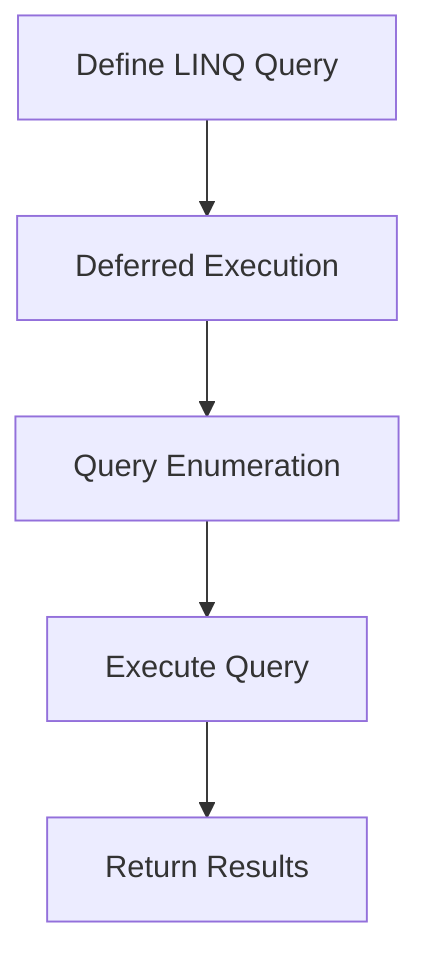

## 3.7 LINQ (Language Integrated Query)

Language Integrated Query (LINQ) is a powerful feature in C# that allows developers to query data collections using a syntax integrated into the language itself. This section will guide you through the intricacies of LINQ, demonstrating how it can be used for data manipulation and transformation, and how it enhances your ability to build scalable and maintainable applications.

### Introduction to LINQ

LINQ is a set of features in C# that provides query capabilities directly within the language. It allows you to work with data in a more declarative way, similar to how you would use SQL to query a database. LINQ can be used with various data sources, including arrays, collections, XML, and databases.

#### Key Concepts of LINQ

- **Declarative Syntax**: LINQ allows you to express complex data queries in a readable and concise manner.
- **Strongly Typed Queries**: LINQ queries are checked at compile time, reducing runtime errors.
- **Integration with C#**: LINQ is seamlessly integrated into C#, allowing you to use it with any data source that implements the `IEnumerable<T>` or `IQueryable<T>` interfaces.

### LINQ Syntax and Structure

LINQ queries can be written using two main syntaxes: query syntax and method syntax. Both syntaxes are powerful and can be used interchangeably.

#### Query Syntax

Query syntax is similar to SQL and is often more readable for those familiar with SQL.

```csharp
// Example of LINQ query syntax
var numbers = new int[] { 1, 2, 3, 4, 5 };
var evenNumbers = from num in numbers
                  where num % 2 == 0
                  select num;

foreach (var number in evenNumbers)
{
    Console.WriteLine(number); // Output: 2, 4
}
```

#### Method Syntax

Method syntax uses method calls and lambda expressions. It is more flexible and can be more concise.

```csharp
// Example of LINQ method syntax
var numbers = new int[] { 1, 2, 3, 4, 5 };
var evenNumbers = numbers.Where(num => num % 2 == 0);

foreach (var number in evenNumbers)
{
    Console.WriteLine(number); // Output: 2, 4
}
```

### LINQ Operators

LINQ provides a wide range of operators that can be used to perform various operations on data collections. These operators can be categorized into several groups:

#### Filtering Operators

Filtering operators are used to select elements from a collection based on a condition.

- **Where**: Filters a sequence of values based on a predicate.

```csharp
var numbers = new int[] { 1, 2, 3, 4, 5 };
var evenNumbers = numbers.Where(n => n % 2 == 0);
```

#### Projection Operators

Projection operators are used to transform elements in a collection.

- **Select**: Projects each element of a sequence into a new form.

```csharp
var numbers = new int[] { 1, 2, 3, 4, 5 };
var squaredNumbers = numbers.Select(n => n * n);
```

#### Sorting Operators

Sorting operators are used to order elements in a collection.

- **OrderBy**: Sorts the elements of a sequence in ascending order.
- **OrderByDescending**: Sorts the elements of a sequence in descending order.

```csharp
var numbers = new int[] { 5, 3, 1, 4, 2 };
var sortedNumbers = numbers.OrderBy(n => n);
```

#### Grouping Operators

Grouping operators are used to group elements in a collection.

- **GroupBy**: Groups elements that share a common attribute.

```csharp
var words = new string[] { "apple", "banana", "apricot", "cherry" };
var groupedWords = words.GroupBy(w => w[0]);

foreach (var group in groupedWords)
{
    Console.WriteLine($"Words starting with {group.Key}: {string.Join(", ", group)}");
}
```

#### Joining Operators

Joining operators are used to join two sequences based on a key.

- **Join**: Joins two sequences based on matching keys.

```csharp
var numbers = new int[] { 1, 2, 3 };
var words = new string[] { "one", "two", "three" };

var numberWords = numbers.Join(words,
                               n => n,
                               w => Array.IndexOf(words, w) + 1,
                               (n, w) => new { Number = n, Word = w });

foreach (var nw in numberWords)
{
    Console.WriteLine($"{nw.Number} - {nw.Word}");
}
```

### LINQ to Objects

LINQ to Objects allows you to use LINQ queries on in-memory collections such as arrays, lists, and dictionaries. This is the most common use of LINQ and is supported by any collection that implements `IEnumerable<T>`.

#### Example: LINQ to Objects

```csharp
var students = new List<Student>
{
    new Student { Name = "Alice", Age = 20 },
    new Student { Name = "Bob", Age = 22 },
    new Student { Name = "Charlie", Age = 21 }
};

var adultStudents = from student in students
                    where student.Age >= 21
                    select student.Name;

foreach (var name in adultStudents)
{
    Console.WriteLine(name); // Output: Bob, Charlie
}
```

### LINQ to XML

LINQ to XML provides a convenient way to query and manipulate XML data. It is part of the `System.Xml.Linq` namespace and allows you to work with XML documents using LINQ queries.

#### Example: LINQ to XML

```csharp
XDocument doc = XDocument.Load("students.xml");

var studentNames = from student in doc.Descendants("student")
                   where (int)student.Element("age") >= 21
                   select student.Element("name").Value;

foreach (var name in studentNames)
{
    Console.WriteLine(name);
}
```

### LINQ to SQL

LINQ to SQL is a component of the .NET Framework that provides a runtime infrastructure for managing relational data as objects. It allows you to query SQL Server databases using LINQ.

#### Example: LINQ to SQL

```csharp
DataContext db = new DataContext(connectionString);

var query = from customer in db.GetTable<Customer>()
            where customer.City == "Seattle"
            select customer;

foreach (var customer in query)
{
    Console.WriteLine(customer.Name);
}
```

### LINQ to Entities

LINQ to Entities is part of the Entity Framework and allows you to query databases using LINQ. It provides a more abstract way to work with data compared to LINQ to SQL.

#### Example: LINQ to Entities

```csharp
using (var context = new SchoolContext())
{
    var students = from s in context.Students
                   where s.Age >= 21
                   select s;

    foreach (var student in students)
    {
        Console.WriteLine(student.Name);
    }
}
```

### Advanced LINQ Features

#### Deferred Execution

LINQ queries use deferred execution, meaning the query is not executed until the results are enumerated. This allows for more efficient querying and data manipulation.

```csharp
var numbers = new int[] { 1, 2, 3, 4, 5 };
var query = numbers.Where(n => n > 2); // Query is not executed here

foreach (var number in query) // Query is executed here
{
    Console.WriteLine(number);
}
```

#### Expression Trees

Expression trees represent code in a tree-like data structure, where each node is an expression. They are used by LINQ providers to translate LINQ queries into a form that can be executed on a data source.

```csharp
Expression<Func<int, bool>> expr = num => num > 2;
Console.WriteLine(expr.Body); // Output: (num > 2)
```

### LINQ Best Practices

- **Use Method Syntax for Complex Queries**: Method syntax can be more concise and flexible for complex queries.
- **Avoid Multiple Enumerations**: Repeatedly enumerating a collection can lead to performance issues.
- **Use `ToList()` or `ToArray()` to Force Execution**: If you need to execute a query immediately, use `ToList()` or `ToArray()` to force execution.
- **Optimize Query Performance**: Be mindful of the performance implications of your queries, especially when working with large data sets.

### Try It Yourself

Experiment with the following code examples to deepen your understanding of LINQ. Try modifying the queries to see how the results change.

```csharp
// Modify the filtering condition
var numbers = new int[] { 1, 2, 3, 4, 5 };
var filteredNumbers = numbers.Where(n => n > 3);
```

```csharp
// Change the projection
var words = new string[] { "apple", "banana", "cherry" };
var upperWords = words.Select(w => w.ToUpper());
```

### Visualizing LINQ Execution

To better understand how LINQ queries are executed, consider the following flowchart that illustrates the process of deferred execution in LINQ.



This diagram shows that LINQ queries are defined first, but not executed until they are enumerated, at which point the query is executed and results are returned.

### References and Further Reading

- [Microsoft Docs: LINQ (Language-Integrated Query)](https://docs.microsoft.com/en-us/dotnet/csharp/programming-guide/concepts/linq/)
- [LINQ Tutorial for Beginners](https://www.tutorialsteacher.com/linq)
- [LINQPad: The Ultimate LINQ Tool](https://www.linqpad.net/)

### Knowledge Check

- What is the difference between query syntax and method syntax in LINQ?
- How does deferred execution benefit LINQ queries?
- What are some common LINQ operators and their uses?

### Embrace the Journey

Remember, mastering LINQ is a journey. As you continue to explore its capabilities, you'll find new ways to simplify and enhance your data querying tasks. Keep experimenting, stay curious, and enjoy the process of becoming a LINQ expert!

## Quiz Time!



### What is LINQ primarily used for in C#?

- [x] Querying data collections
- [ ] Compiling code
- [ ] Managing memory
- [ ] Debugging applications

> **Explanation:** LINQ is primarily used for querying data collections in C#.

### Which LINQ syntax is similar to SQL?

- [x] Query syntax
- [ ] Method syntax
- [ ] Lambda syntax
- [ ] Expression syntax

> **Explanation:** Query syntax in LINQ is similar to SQL, making it more readable for those familiar with SQL.

### What does the `Where` operator do in LINQ?

- [x] Filters a sequence of values based on a predicate
- [ ] Projects each element of a sequence into a new form
- [ ] Sorts the elements of a sequence
- [ ] Groups elements that share a common attribute

> **Explanation:** The `Where` operator filters a sequence of values based on a predicate.

### What is deferred execution in LINQ?

- [x] Query execution is delayed until the results are enumerated
- [ ] Queries are executed immediately
- [ ] Queries are compiled at runtime
- [ ] Queries are cached for later use

> **Explanation:** Deferred execution means that LINQ queries are not executed until the results are enumerated.

### How can you force immediate execution of a LINQ query?

- [x] Use `ToList()` or `ToArray()`
- [ ] Use `First()`
- [ ] Use `Last()`
- [ ] Use `Count()`

> **Explanation:** Using `ToList()` or `ToArray()` forces immediate execution of a LINQ query.

### What is the purpose of expression trees in LINQ?

- [x] Represent code in a tree-like data structure
- [ ] Compile LINQ queries
- [ ] Optimize query performance
- [ ] Cache query results

> **Explanation:** Expression trees represent code in a tree-like data structure, allowing LINQ providers to translate queries into executable form.

### Which LINQ operator is used to join two sequences based on matching keys?

- [x] Join
- [ ] GroupBy
- [ ] Select
- [ ] OrderBy

> **Explanation:** The `Join` operator is used to join two sequences based on matching keys.

### What does the `Select` operator do in LINQ?

- [x] Projects each element of a sequence into a new form
- [ ] Filters a sequence of values
- [ ] Sorts the elements of a sequence
- [ ] Groups elements that share a common attribute

> **Explanation:** The `Select` operator projects each element of a sequence into a new form.

### What is LINQ to SQL used for?

- [x] Querying SQL Server databases using LINQ
- [ ] Querying XML data using LINQ
- [ ] Querying in-memory collections using LINQ
- [ ] Querying web services using LINQ

> **Explanation:** LINQ to SQL is used for querying SQL Server databases using LINQ.

### True or False: LINQ can only be used with SQL databases.

- [ ] True
- [x] False

> **Explanation:** False. LINQ can be used with various data sources, including arrays, collections, XML, and databases.


