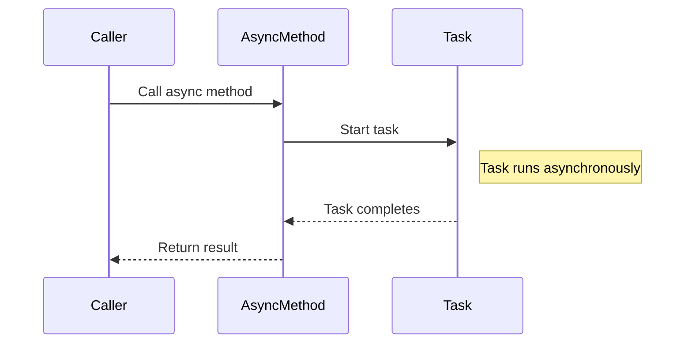

## 3.8 Asynchronous Programming with Async/Await

Asynchronous programming is a crucial aspect of modern software development, enabling applications to perform tasks concurrently, thus improving responsiveness and efficiency. In C#, the `async` and `await` keywords provide a powerful and intuitive way to write asynchronous code. This section delves into the intricacies of asynchronous programming in C#, focusing on the `Task` and `Task<TResult>` classes, and how to effectively manage asynchronous operations.

### Understanding Asynchronous Programming

Asynchronous programming allows a program to initiate a potentially long-running operation and then continue executing other tasks without waiting for the operation to complete. This is particularly useful in scenarios where applications need to remain responsive, such as in UI applications or when performing I/O-bound operations like reading from a file or making network requests.

#### The Need for Asynchronous Programming

1. **Responsiveness**: In UI applications, blocking the main thread can lead to unresponsive interfaces. Asynchronous programming ensures that the UI remains responsive by offloading long-running tasks to background threads.

2. **Scalability**: In server applications, handling multiple requests concurrently without blocking threads can significantly improve scalability and throughput.

3. **Resource Utilization**: Asynchronous programming can lead to better resource utilization by allowing the CPU to perform other tasks while waiting for I/O operations to complete.

### The Task-Based Asynchronous Pattern (TAP)

The Task-Based Asynchronous Pattern (TAP) is the recommended model for asynchronous programming in .NET. It uses the `Task` and `Task<TResult>` classes to represent asynchronous operations.

#### Task and Task<TResult>

- **`Task`**: Represents an asynchronous operation that does not return a value. It is analogous to `void` in synchronous methods.

- **`Task<TResult>`**: Represents an asynchronous operation that returns a value of type `TResult`. It is analogous to methods that return a value in synchronous programming.

### Using Async and Await

The `async` and `await` keywords are used to write asynchronous code in a way that resembles synchronous code, making it easier to read and maintain.

#### Declaring an Async Method

To declare an asynchronous method, use the `async` modifier in the method signature. This modifier indicates that the method contains asynchronous operations.

```csharp
public async Task ExampleMethodAsync()
{
    // Asynchronous operations go here
}
```

#### Awaiting a Task

The `await` keyword is used to suspend the execution of an async method until the awaited task completes. It allows other operations to run during the wait time.

```csharp
public async Task<int> GetDataAsync()
{
    // Simulate an asynchronous operation
    await Task.Delay(1000);
    return 42;
}
```

### Example: Fetching Data Asynchronously

Let's consider an example where we fetch data from a web service asynchronously.

```csharp
using System;
using System.Net.Http;
using System.Threading.Tasks;

public class DataFetcher
{
    private static readonly HttpClient client = new HttpClient();

    public async Task<string> FetchDataAsync(string url)
    {
        HttpResponseMessage response = await client.GetAsync(url);
        response.EnsureSuccessStatusCode();
        string responseData = await response.Content.ReadAsStringAsync();
        return responseData;
    }
}
```

In this example, `FetchDataAsync` is an asynchronous method that fetches data from a given URL. The `await` keyword is used to asynchronously wait for the completion of the `GetAsync` and `ReadAsStringAsync` methods.

### Handling Exceptions in Async Methods

Exception handling in asynchronous methods works similarly to synchronous methods. You can use `try-catch` blocks to handle exceptions.

```csharp
public async Task<string> FetchDataWithExceptionHandlingAsync(string url)
{
    try
    {
        HttpResponseMessage response = await client.GetAsync(url);
        response.EnsureSuccessStatusCode();
        return await response.Content.ReadAsStringAsync();
    }
    catch (HttpRequestException e)
    {
        Console.WriteLine($"Request error: {e.Message}");
        return null;
    }
}
```

### Best Practices for Async/Await

1. **Avoid Blocking Calls**: Do not use blocking calls like `Task.Wait()` or `Task.Result` in asynchronous methods, as they can lead to deadlocks.

2. **Use ConfigureAwait(false)**: In library code, use `ConfigureAwait(false)` to avoid capturing the current synchronization context, which can improve performance.

3. **Return Task Instead of void**: Avoid returning `void` from asynchronous methods, except for event handlers. Returning `Task` allows the caller to await the method and handle exceptions.

4. **Use Async All the Way**: Ensure that asynchronous methods are awaited all the way up the call stack to avoid blocking.

### Visualizing Async/Await Workflow

To better understand the flow of asynchronous operations, let's visualize the process using a sequence diagram.



### Advanced Concepts

#### Task Combinators

Task combinators allow you to work with multiple tasks concurrently. Common combinators include `Task.WhenAll` and `Task.WhenAny`.

- **`Task.WhenAll`**: Waits for all provided tasks to complete.

```csharp
public async Task ProcessMultipleTasksAsync()
{
    Task task1 = Task.Delay(1000);
    Task task2 = Task.Delay(2000);
    await Task.WhenAll(task1, task2);
    Console.WriteLine("Both tasks completed.");
}
```

- **`Task.WhenAny`**: Waits for any one of the provided tasks to complete.

```csharp
public async Task ProcessAnyTaskAsync()
{
    Task task1 = Task.Delay(1000);
    Task task2 = Task.Delay(2000);
    Task completedTask = await Task.WhenAny(task1, task2);
    Console.WriteLine("One task completed.");
}
```

#### Cancellation of Tasks

Tasks can be canceled using a `CancellationToken`. This is useful for stopping long-running operations.

```csharp
public async Task PerformCancellableOperationAsync(CancellationToken cancellationToken)
{
    try
    {
        await Task.Delay(5000, cancellationToken);
    }
    catch (OperationCanceledException)
    {
        Console.WriteLine("Operation was canceled.");
    }
}
```

### Try It Yourself

Experiment with the code examples provided. Try modifying the delay times, adding more tasks, or implementing cancellation tokens to see how they affect the behavior of asynchronous operations.

### Knowledge Check

- What is the purpose of the `async` keyword in C#?
- How does the `await` keyword affect the execution of an asynchronous method?
- What are the differences between `Task` and `Task<TResult>`?
- Why should you avoid using `Task.Wait()` in asynchronous methods?

### Summary

Asynchronous programming with `async` and `await` in C# provides a powerful way to write non-blocking code that is easy to read and maintain. By understanding the Task-Based Asynchronous Pattern and following best practices, you can effectively manage asynchronous operations in your applications.

### Further Reading

- [Microsoft Docs: Asynchronous Programming with Async and Await](https://docs.microsoft.com/en-us/dotnet/csharp/programming-guide/concepts/async/)
- [Task-Based Asynchronous Pattern (TAP)](https://docs.microsoft.com/en-us/dotnet/standard/asynchronous-programming-patterns/task-based-asynchronous-pattern-tap)

## Quiz Time!



### What is the purpose of the `async` keyword in C#?

- [x] To indicate that a method contains asynchronous operations
- [ ] To make a method run faster
- [ ] To handle exceptions in a method
- [ ] To pause a method execution

> **Explanation:** The `async` keyword is used to declare a method as asynchronous, indicating that it contains asynchronous operations.

### How does the `await` keyword affect the execution of an asynchronous method?

- [x] It suspends the execution of the method until the awaited task completes
- [ ] It makes the method execute faster
- [ ] It handles exceptions in the method
- [ ] It pauses the method indefinitely

> **Explanation:** The `await` keyword is used to suspend the execution of an async method until the awaited task completes, allowing other operations to run during the wait time.

### What are the differences between `Task` and `Task<TResult>`?

- [x] `Task` represents an asynchronous operation that does not return a value, while `Task<TResult>` returns a value
- [ ] `Task` is faster than `Task<TResult>`
- [ ] `Task<TResult>` is used for synchronous operations
- [ ] `Task` is used for UI operations

> **Explanation:** `Task` represents an asynchronous operation that does not return a value, whereas `Task<TResult>` represents an asynchronous operation that returns a value of type `TResult`.

### Why should you avoid using `Task.Wait()` in asynchronous methods?

- [x] It can lead to deadlocks
- [ ] It makes the method execute faster
- [ ] It handles exceptions in the method
- [ ] It pauses the method indefinitely

> **Explanation:** Using `Task.Wait()` in asynchronous methods can lead to deadlocks, especially in UI applications, as it blocks the calling thread.

### Which of the following is a task combinator?

- [x] Task.WhenAll
- [ ] Task.Delay
- [ ] Task.Run
- [ ] Task.Wait

> **Explanation:** `Task.WhenAll` is a task combinator that waits for all provided tasks to complete.

### What is the purpose of a `CancellationToken`?

- [x] To cancel a long-running task
- [ ] To make a task run faster
- [ ] To handle exceptions in a task
- [ ] To pause a task indefinitely

> **Explanation:** A `CancellationToken` is used to cancel a long-running task, allowing you to stop the task before it completes.

### What does `ConfigureAwait(false)` do?

- [x] It avoids capturing the current synchronization context
- [ ] It makes a task run faster
- [ ] It handles exceptions in a task
- [ ] It pauses a task indefinitely

> **Explanation:** `ConfigureAwait(false)` is used to avoid capturing the current synchronization context, which can improve performance in library code.

### What is the recommended return type for asynchronous methods?

- [x] Task or Task<TResult>
- [ ] void
- [ ] int
- [ ] string

> **Explanation:** The recommended return type for asynchronous methods is `Task` or `Task<TResult>`, allowing the caller to await the method and handle exceptions.

### What is the benefit of using async/await in UI applications?

- [x] It keeps the UI responsive
- [ ] It makes the UI run faster
- [ ] It handles exceptions in the UI
- [ ] It pauses the UI indefinitely

> **Explanation:** Using async/await in UI applications keeps the UI responsive by offloading long-running tasks to background threads.

### True or False: Asynchronous programming can improve scalability in server applications.

- [x] True
- [ ] False

> **Explanation:** Asynchronous programming can improve scalability in server applications by handling multiple requests concurrently without blocking threads.



Remember, mastering asynchronous programming with async/await in C# is a journey. Keep experimenting, stay curious, and enjoy the process of building more efficient and responsive applications!
