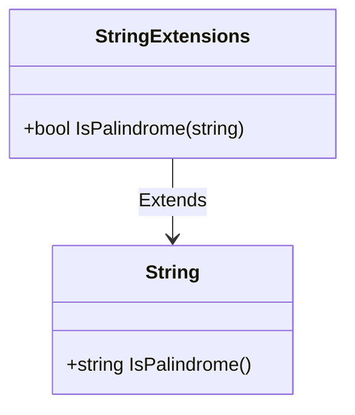
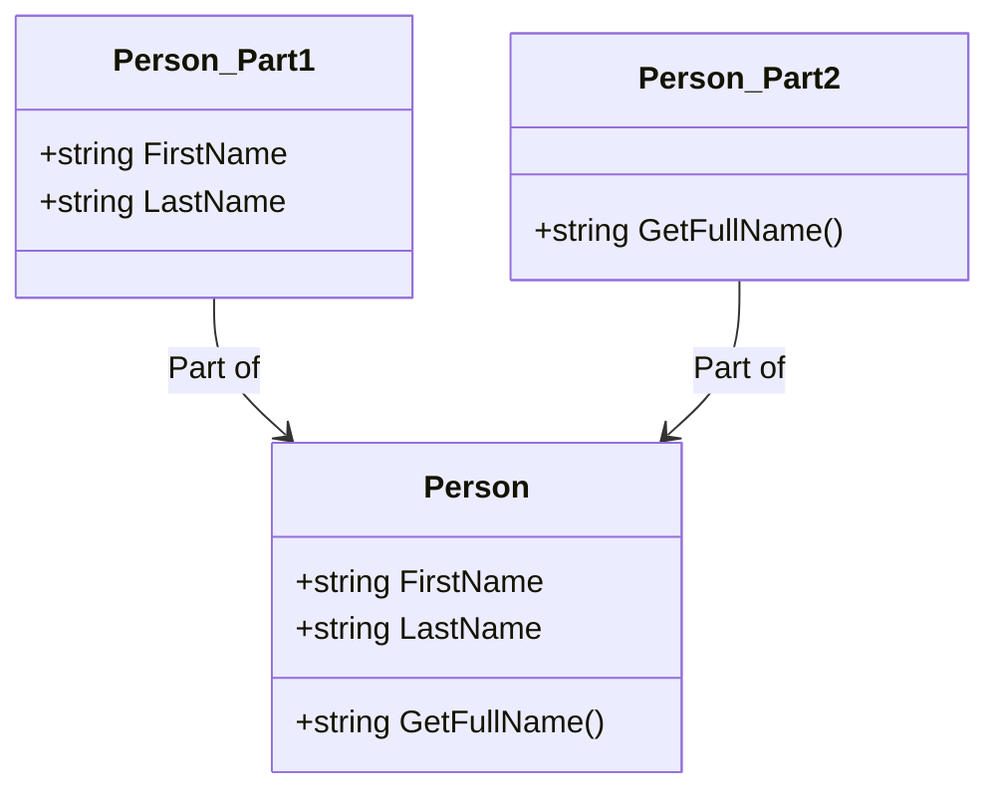

## 3.9 Extension Methods and Partial Classes

In the realm of C# programming, extension methods and partial classes are powerful tools that allow developers to write more modular, maintainable, and flexible code. These features enable you to extend existing classes and split class definitions, respectively, without altering the original source code. This section will delve into the intricacies of these features, providing you with the knowledge to leverage them effectively in your software projects.

### Introduction to Extension Methods

Extension methods in C# allow you to add new methods to existing types without modifying their source code. This is particularly useful when you want to enhance the functionality of a class or interface that you do not have control over, such as those in third-party libraries or the .NET framework itself.

#### How Extension Methods Work

An extension method is a static method defined in a static class. The first parameter of the method specifies the type it extends, prefixed with the `this` keyword. This syntax allows the method to be called as if it were an instance method of the extended type.

**Example: Basic Extension Method**

```csharp
public static class StringExtensions
{
    public static bool IsPalindrome(this string str)
    {
        if (string.IsNullOrEmpty(str))
            return false;

        int length = str.Length;
        for (int i = 0; i < length / 2; i++)
        {
            if (str[i] != str[length - i - 1])
                return false;
        }
        return true;
    }
}

// Usage
string word = "level";
bool isPalindrome = word.IsPalindrome(); // True
```

In this example, we define an extension method `IsPalindrome` for the `string` type. This method checks if a string is a palindrome and can be called directly on any string instance.

#### Best Practices for Using Extension Methods

1. **Use Judiciously**: Extension methods should be used to add functionality that logically belongs to the extended type. Avoid using them to add unrelated methods.

2. **Naming Conventions**: Follow standard naming conventions to ensure that extension methods are easily recognizable and maintainable.

3. **Avoid Overuse**: Overusing extension methods can lead to code that is difficult to understand and maintain. Use them sparingly and only when they provide clear benefits.

4. **Document Thoroughly**: Since extension methods can be less intuitive than instance methods, provide clear documentation to explain their purpose and usage.

5. **Consider Performance**: Extension methods can introduce performance overhead, especially when used in performance-critical sections of code. Profile and optimize as necessary.

### Advanced Usage of Extension Methods

Extension methods can be used in various advanced scenarios, such as enhancing interfaces, working with LINQ, and creating fluent APIs.

#### Enhancing Interfaces

Extension methods are particularly useful for adding functionality to interfaces, as interfaces cannot contain method implementations.

**Example: Interface Extension**

```csharp
public interface IShape
{
    double Area();
}

public static class ShapeExtensions
{
    public static double Perimeter(this IShape shape)
    {
        // Assume a default implementation for demonstration purposes
        return 0.0;
    }
}

// Usage
IShape shape = new Circle(5);
double perimeter = shape.Perimeter();
```

In this example, we extend the `IShape` interface with a `Perimeter` method, allowing all implementations of `IShape` to use this method.

#### LINQ and Extension Methods

LINQ (Language Integrated Query) heavily relies on extension methods to provide query capabilities on collections. Understanding how LINQ uses extension methods can help you create more expressive and readable code.

**Example: Custom LINQ Extension**

```csharp
public static class EnumerableExtensions
{
    public static IEnumerable<T> WhereNotNull<T>(this IEnumerable<T> source)
    {
        foreach (var item in source)
        {
            if (item != null)
                yield return item;
        }
    }
}

// Usage
var items = new List<string> { "apple", null, "banana" };
var nonNullItems = items.WhereNotNull();
```

Here, we define a custom LINQ extension method `WhereNotNull` that filters out null values from a collection.

#### Creating Fluent APIs

Fluent APIs are designed to be readable and expressive, often using method chaining. Extension methods can play a crucial role in building such APIs.

**Example: Fluent API with Extension Methods**

```csharp
public class QueryBuilder
{
    private StringBuilder _query = new StringBuilder();

    public QueryBuilder Select(string fields)
    {
        _query.Append($"SELECT {fields} ");
        return this;
    }

    public QueryBuilder From(string table)
    {
        _query.Append($"FROM {table} ");
        return this;
    }

    public QueryBuilder Where(string condition)
    {
        _query.Append($"WHERE {condition} ");
        return this;
    }

    public override string ToString()
    {
        return _query.ToString();
    }
}

public static class QueryBuilderExtensions
{
    public static QueryBuilder OrderBy(this QueryBuilder builder, string field)
    {
        builder._query.Append($"ORDER BY {field} ");
        return builder;
    }
}

// Usage
var query = new QueryBuilder()
    .Select("*")
    .From("Users")
    .Where("Age > 18")
    .OrderBy("Name");

Console.WriteLine(query); // Outputs: SELECT * FROM Users WHERE Age > 18 ORDER BY Name
```

In this example, we create a simple query builder with a fluent interface, enhanced by an extension method `OrderBy`.

### Introduction to Partial Classes

Partial classes in C# allow you to split the definition of a class across multiple files. This feature is particularly useful in large projects where a single class might become too large to manage effectively.

#### How Partial Classes Work

To use partial classes, simply declare the class with the `partial` keyword in each file. The C# compiler will combine these parts into a single class definition at compile time.

**Example: Basic Partial Class**

```csharp
// File: Person.Part1.cs
public partial class Person
{
    public string FirstName { get; set; }
    public string LastName { get; set; }
}

// File: Person.Part2.cs
public partial class Person
{
    public string GetFullName()
    {
        return $"{FirstName} {LastName}";
    }
}

// Usage
Person person = new Person { FirstName = "John", LastName = "Doe" };
Console.WriteLine(person.GetFullName()); // Outputs: John Doe
```

In this example, the `Person` class is split across two files, each contributing different members to the class.

#### Best Practices for Using Partial Classes

1. **Logical Separation**: Use partial classes to separate logically distinct parts of a class, such as separating data members from methods or separating different functionalities.

2. **Maintainability**: Ensure that each part of the partial class is self-contained and easy to understand. Avoid scattering related code across multiple files.

3. **Consistent Naming**: Use consistent naming conventions for partial class files to make it clear that they belong to the same class.

4. **Documentation**: Provide clear documentation for each part of the partial class to explain its purpose and how it fits into the overall class definition.

5. **Avoid Overuse**: While partial classes can improve organization, overusing them can lead to fragmented code that is difficult to navigate and maintain.

### Advanced Usage of Partial Classes

Partial classes can be used in various advanced scenarios, such as code generation, separating auto-generated code from custom code, and organizing large classes.

#### Code Generation

Partial classes are often used in conjunction with code generation tools, allowing developers to separate auto-generated code from manually written code.

**Example: Code Generation with Partial Classes**

```csharp
// Auto-generated file: Product.AutoGenerated.cs
public partial class Product
{
    public int Id { get; set; }
    public string Name { get; set; }
}

// Custom file: Product.Custom.cs
public partial class Product
{
    public decimal Price { get; set; }

    public string GetProductInfo()
    {
        return $"{Name} costs {Price:C}";
    }
}

// Usage
Product product = new Product { Id = 1, Name = "Laptop", Price = 999.99m };
Console.WriteLine(product.GetProductInfo()); // Outputs: Laptop costs $999.99
```

In this example, the `Product` class is split into an auto-generated part and a custom part, allowing developers to add custom functionality without modifying the generated code.

#### Organizing Large Classes

In large projects, classes can become unwieldy and difficult to manage. Partial classes provide a way to organize such classes into manageable parts.

**Example: Organizing Large Classes**

```csharp
// File: Order.Data.cs
public partial class Order
{
    public int OrderId { get; set; }
    public DateTime OrderDate { get; set; }
}

// File: Order.Functionality.cs
public partial class Order
{
    public void ProcessOrder()
    {
        // Processing logic here
    }
}

// File: Order.Validation.cs
public partial class Order
{
    public bool ValidateOrder()
    {
        // Validation logic here
        return true;
    }
}

// Usage
Order order = new Order { OrderId = 123, OrderDate = DateTime.Now };
if (order.ValidateOrder())
{
    order.ProcessOrder();
}
```

In this example, the `Order` class is divided into separate files for data, functionality, and validation, making it easier to manage and understand.

### Combining Extension Methods and Partial Classes

Extension methods and partial classes can be used together to create flexible and maintainable codebases. By using partial classes to organize large classes and extension methods to add functionality, you can create a codebase that is both modular and extensible.

**Example: Combining Extension Methods and Partial Classes**

```csharp
// File: Customer.Data.cs
public partial class Customer
{
    public int CustomerId { get; set; }
    public string Name { get; set; }
}

// File: Customer.Functionality.cs
public partial class Customer
{
    public void Save()
    {
        // Save logic here
    }
}

// Extension method for Customer
public static class CustomerExtensions
{
    public static string GetCustomerInfo(this Customer customer)
    {
        return $"Customer ID: {customer.CustomerId}, Name: {customer.Name}";
    }
}

// Usage
Customer customer = new Customer { CustomerId = 1, Name = "Alice" };
Console.WriteLine(customer.GetCustomerInfo()); // Outputs: Customer ID: 1, Name: Alice
customer.Save();
```

In this example, the `Customer` class is organized using partial classes, and an extension method is used to add additional functionality.

### Visualizing Extension Methods and Partial Classes

To better understand how extension methods and partial classes work, let's visualize their relationships and interactions.

#### Diagram: Extension Methods



This diagram shows how the `StringExtensions` class extends the `String` class with the `IsPalindrome` method.

#### Diagram: Partial Classes



This diagram illustrates how the `Person` class is composed of two partial class files, `Person_Part1` and `Person_Part2`.

### Try It Yourself

Now that we've covered the theory and examples, it's time to experiment with extension methods and partial classes. Try modifying the code examples to add new methods or split classes differently. Consider creating your own extension methods for commonly used types in your projects.

### Knowledge Check

Before we conclude, let's reinforce what we've learned:

- **What are extension methods, and how do they enhance existing types?**
- **How do partial classes help organize large codebases?**
- **What are some best practices for using extension methods and partial classes?**

### Conclusion

Extension methods and partial classes are powerful features in C# that enable developers to write more flexible and maintainable code. By understanding and applying these concepts, you can enhance your software design and improve the organization of your codebase. Remember, this is just the beginning. As you progress, you'll discover more ways to leverage these features in your projects. Keep experimenting, stay curious, and enjoy the journey!

## Quiz Time!



### What is the primary purpose of extension methods in C#?

- [x] To add new methods to existing types without modifying their source code.
- [ ] To create new classes that inherit from existing ones.
- [ ] To override existing methods in a class.
- [ ] To encapsulate data within a class.

> **Explanation:** Extension methods allow developers to add new methods to existing types without altering their original source code.

### How are extension methods defined in C#?

- [x] As static methods in a static class, with the first parameter prefixed with `this`.
- [ ] As instance methods in a class.
- [ ] As virtual methods in an abstract class.
- [ ] As private methods in a sealed class.

> **Explanation:** Extension methods are defined as static methods in a static class, with the first parameter specifying the type to extend, prefixed with `this`.

### What is a common use case for partial classes?

- [x] To split the definition of a class across multiple files.
- [ ] To create multiple instances of a class.
- [ ] To override methods in a base class.
- [ ] To implement multiple interfaces.

> **Explanation:** Partial classes allow developers to split the definition of a class across multiple files, which is useful for organizing large classes or separating auto-generated code from custom code.

### Which keyword is used to define a partial class in C#?

- [x] `partial`
- [ ] `static`
- [ ] `abstract`
- [ ] `sealed`

> **Explanation:** The `partial` keyword is used to define a class that can be split across multiple files.

### Can extension methods be used to override existing methods in a class?

- [ ] Yes
- [x] No

> **Explanation:** Extension methods cannot override existing methods; they can only add new methods to a type.

### What is a best practice when using extension methods?

- [x] Use them sparingly and only when they provide clear benefits.
- [ ] Use them to replace all instance methods.
- [ ] Use them to override existing methods.
- [ ] Use them to encapsulate data.

> **Explanation:** Extension methods should be used sparingly and only when they provide clear benefits, as overuse can lead to code that is difficult to understand and maintain.

### How can partial classes improve code maintainability?

- [x] By allowing logical separation of class functionality across multiple files.
- [ ] By reducing the number of classes in a project.
- [ ] By automatically generating code documentation.
- [ ] By enforcing strict encapsulation.

> **Explanation:** Partial classes improve maintainability by allowing developers to separate logically distinct parts of a class into different files, making it easier to manage and understand.

### What is a potential drawback of using partial classes?

- [x] They can lead to fragmented code that is difficult to navigate.
- [ ] They prevent the use of inheritance.
- [ ] They require more memory at runtime.
- [ ] They cannot be used with interfaces.

> **Explanation:** While partial classes can improve organization, overusing them can lead to fragmented code that is difficult to navigate and maintain.

### Can extension methods be used with interfaces?

- [x] Yes
- [ ] No

> **Explanation:** Extension methods can be used to add functionality to interfaces, as interfaces cannot contain method implementations.

### True or False: Partial classes can be used to separate auto-generated code from custom code.

- [x] True
- [ ] False

> **Explanation:** Partial classes are often used to separate auto-generated code from custom code, allowing developers to add custom functionality without modifying the generated code.


