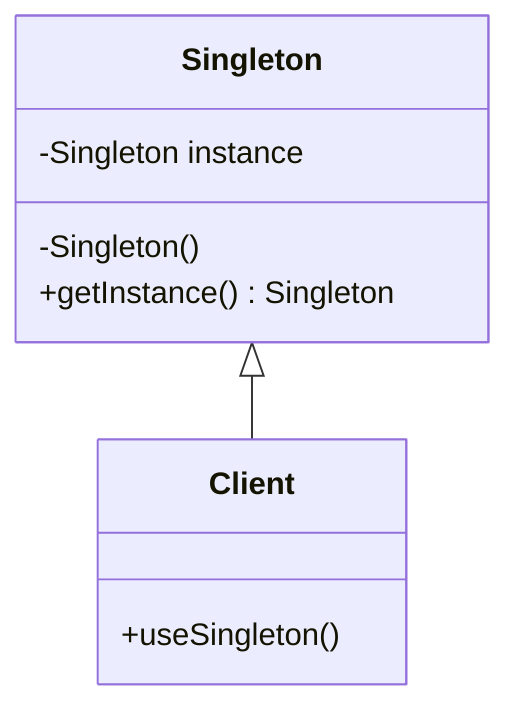
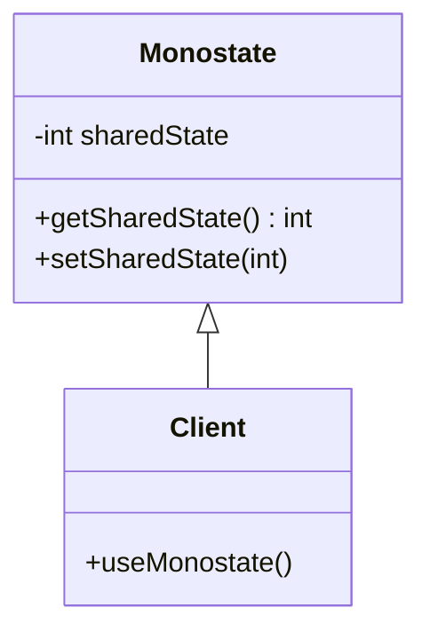

## 4.1 Singleton Design Pattern

The Singleton Design Pattern is a creational pattern that ensures a class has only one instance and provides a global access point to that instance. This pattern is particularly useful when exactly one object is needed to coordinate actions across the system. In this section, we will explore various ways to implement the Singleton pattern in C#, including thread-safe and lazy initialization techniques, and discuss the Monostate pattern as an alternative approach.

### Intent

The primary intent of the Singleton pattern is to control object creation, limiting the number of instances to one. This is useful in scenarios where a single point of control is necessary, such as managing a connection pool, logging, or configuration settings.

### Key Participants

- **Singleton Class**: The class that is responsible for creating and managing its single instance.
- **Client**: Any class that uses the Singleton instance.

### Applicability

Use the Singleton pattern when:
- There must be exactly one instance of a class, and it must be accessible to clients from a well-known access point.
- The sole instance should be extensible by subclassing, and clients should be able to use an extended instance without modifying their code.

### Implementing Singleton in C#

#### Basic Singleton Implementation

Let's start with a basic implementation of the Singleton pattern in C#.

```csharp
public class Singleton
{
    private static Singleton _instance;

    // Private constructor to prevent instantiation
    private Singleton() { }

    public static Singleton Instance
    {
        get
        {
            if (_instance == null)
            {
                _instance = new Singleton();
            }
            return _instance;
        }
    }
}
```

In this example, the `Singleton` class has a private static variable `_instance` that holds the single instance of the class. The constructor is private to prevent instantiation from outside the class. The `Instance` property provides a global access point to the instance.

#### Thread-Safe Singleton Implementation

The basic implementation is not thread-safe. In a multithreaded environment, multiple threads could create multiple instances of the Singleton class. To make it thread-safe, we can use a lock.

```csharp
public class ThreadSafeSingleton
{
    private static ThreadSafeSingleton _instance;
    private static readonly object _lock = new object();

    private ThreadSafeSingleton() { }

    public static ThreadSafeSingleton Instance
    {
        get
        {
            lock (_lock)
            {
                if (_instance == null)
                {
                    _instance = new ThreadSafeSingleton();
                }
                return _instance;
            }
        }
    }
}
```

Here, we use a `lock` to ensure that only one thread can access the instance creation code at a time.

#### Lazy Initialization Singleton

Lazy initialization delays the creation of the Singleton instance until it is needed. This can improve performance and resource usage.

```csharp
public class LazySingleton
{
    private static readonly Lazy<LazySingleton> _instance = new Lazy<LazySingleton>(() => new LazySingleton());

    private LazySingleton() { }

    public static LazySingleton Instance => _instance.Value;
}
```

In this implementation, we use the `Lazy<T>` class to handle the lazy initialization. The instance is created only when the `Instance` property is accessed for the first time.

#### Secure Singleton

A secure Singleton implementation ensures that the Singleton instance is not compromised by reflection or serialization.

```csharp
[Serializable]
public class SecureSingleton
{
    private static readonly SecureSingleton _instance = new SecureSingleton();

    private SecureSingleton() { }

    public static SecureSingleton Instance => _instance;

    // Prevents creating a new instance during deserialization
    protected SecureSingleton(SerializationInfo info, StreamingContext context)
    {
        throw new NotSupportedException("Cannot deserialize singleton");
    }
}
```

In this example, we prevent deserialization from creating a new instance by throwing an exception in the deserialization constructor.

#### Monostate Pattern

The Monostate pattern is an alternative to the Singleton pattern. Instead of ensuring a single instance, it ensures that all instances share the same state.

```csharp
public class Monostate
{
    private static int _sharedState;

    public int SharedState
    {
        get => _sharedState;
        set => _sharedState = value;
    }
}
```

In this pattern, all instances of the `Monostate` class share the same state through the static variable `_sharedState`.

### Diagrams

#### Singleton Class Diagram



**Figure 1:** This class diagram illustrates the Singleton pattern, showing the Singleton class with a private instance and a public method to access it.

#### Monostate Class Diagram



**Figure 2:** This class diagram illustrates the Monostate pattern, showing how multiple instances share the same state.

### Use Cases and Examples

#### Practical Scenarios for Singleton

1. **Configuration Management**: Use Singleton to manage configuration settings that need to be accessed globally.
2. **Logging**: Implement a Singleton logger to ensure a single point of logging across the application.
3. **Resource Management**: Manage resources like database connections or thread pools using Singleton to ensure efficient resource utilization.

#### Practical Scenarios for Monostate

1. **Shared Settings**: Use Monostate for settings that need to be consistent across multiple instances.
2. **State Management**: Manage shared state in applications where multiple objects need to reflect the same state.

### Design Considerations

- **When to Use**: Use Singleton when you need to ensure a single instance of a class. Consider Monostate when multiple instances are acceptable but need to share the same state.
- **Thread Safety**: Ensure thread safety in Singleton implementations, especially in multithreaded environments.
- **Lazy Initialization**: Use lazy initialization to improve performance and resource usage.
- **Security**: Secure Singleton implementations against reflection and serialization attacks.

### Differences and Similarities

- **Singleton vs. Monostate**: Singleton ensures a single instance, while Monostate allows multiple instances with shared state.
- **Thread Safety**: Both patterns require careful consideration of thread safety in concurrent environments.

### Try It Yourself

Experiment with the Singleton and Monostate patterns by modifying the code examples. Try implementing a thread-safe Singleton with double-checked locking or explore how Monostate can be used in a real-world application.

### Knowledge Check

- Explain the primary intent of the Singleton pattern.
- Describe how thread safety is achieved in Singleton implementations.
- Compare and contrast Singleton and Monostate patterns.

### Embrace the Journey

Remember, mastering design patterns is a journey. As you explore the Singleton pattern, consider how it can be applied in your projects. Keep experimenting, stay curious, and enjoy the process of learning and applying design patterns in C#.

## Quiz Time!



### What is the primary intent of the Singleton pattern?

- [x] To ensure a class has only one instance and provides a global access point.
- [ ] To allow multiple instances of a class with shared state.
- [ ] To create a family of related objects.
- [ ] To separate the construction of a complex object from its representation.

> **Explanation:** The Singleton pattern ensures a class has only one instance and provides a global access point to it.

### How can you make a Singleton implementation thread-safe?

- [x] Use a lock to synchronize access to the instance creation code.
- [ ] Use a public constructor.
- [ ] Use multiple threads to create instances.
- [ ] Use a static variable without synchronization.

> **Explanation:** A lock can be used to synchronize access to the instance creation code, ensuring thread safety.

### What is lazy initialization in the context of Singleton?

- [x] Delaying the creation of the Singleton instance until it is needed.
- [ ] Creating the Singleton instance at application startup.
- [ ] Using multiple threads to create the instance.
- [ ] Preventing the instance from being created.

> **Explanation:** Lazy initialization delays the creation of the Singleton instance until it is needed, improving performance and resource usage.

### What is the Monostate pattern?

- [x] A pattern where all instances share the same state.
- [ ] A pattern that ensures a single instance of a class.
- [ ] A pattern that creates a family of related objects.
- [ ] A pattern that separates construction from representation.

> **Explanation:** The Monostate pattern allows multiple instances of a class to share the same state.

### Which of the following is a use case for the Singleton pattern?

- [x] Configuration management
- [ ] Creating a family of related objects
- [ ] Separating construction from representation
- [ ] Allowing multiple instances with shared state

> **Explanation:** Singleton is commonly used for configuration management to ensure a single point of access to configuration settings.

### How can you prevent a Singleton instance from being compromised by serialization?

- [x] Throw an exception in the deserialization constructor.
- [ ] Use a public constructor.
- [ ] Use multiple threads to create instances.
- [ ] Use a static variable without synchronization.

> **Explanation:** Throwing an exception in the deserialization constructor prevents a new instance from being created during deserialization.

### What is the difference between Singleton and Monostate patterns?

- [x] Singleton ensures a single instance, while Monostate allows multiple instances with shared state.
- [ ] Singleton allows multiple instances, while Monostate ensures a single instance.
- [ ] Singleton and Monostate are identical patterns.
- [ ] Singleton is used for creating families of related objects.

> **Explanation:** Singleton ensures a single instance, while Monostate allows multiple instances with shared state.

### What is a common pitfall when implementing Singleton in a multithreaded environment?

- [x] Creating multiple instances due to lack of synchronization.
- [ ] Using a public constructor.
- [ ] Using a static variable without synchronization.
- [ ] Delaying the creation of the instance.

> **Explanation:** Without proper synchronization, multiple threads can create multiple instances of the Singleton class.

### Which pattern is suitable for managing shared settings across multiple instances?

- [x] Monostate pattern
- [ ] Singleton pattern
- [ ] Factory pattern
- [ ] Builder pattern

> **Explanation:** The Monostate pattern is suitable for managing shared settings across multiple instances.

### True or False: The Singleton pattern is always the best choice for managing global state.

- [ ] True
- [x] False

> **Explanation:** The Singleton pattern is not always the best choice for managing global state. It should be used judiciously, considering the specific requirements and constraints of the application.


