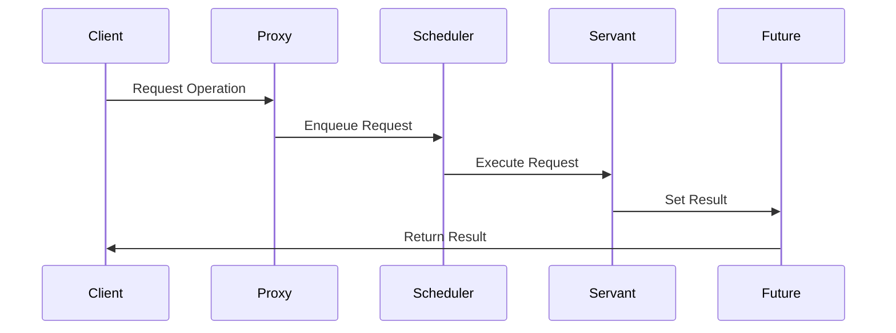

## 4.10 Active Object Pattern

In the realm of software design patterns, the Active Object Pattern stands out as a powerful tool for managing concurrency and simplifying synchronization. This pattern is particularly useful in high-performance applications where concurrent processing is essential. In this section, we will delve into the intricacies of the Active Object Pattern, explore its implementation in C#, and examine its use cases and benefits.

### Intent

The primary intent of the Active Object Pattern is to decouple method execution from method invocation. This separation allows for enhanced concurrency and simplifies synchronization, making it easier to manage complex operations that need to run concurrently.

### Key Participants

1. **Proxy**: Acts as an interface to the client, providing a way to invoke methods on the active object.
2. **Scheduler**: Manages the execution of requests, ensuring they are processed in the correct order.
3. **Servant**: The actual object that performs the operations requested by the client.
4. **Activation List**: A queue that holds pending requests until they can be processed.
5. **Future**: Represents the result of an asynchronous operation, allowing the client to retrieve the result once it is available.

### Applicability

The Active Object Pattern is applicable in scenarios where:
- There is a need to manage multiple concurrent operations.
- Synchronization complexity needs to be reduced.
- High-performance applications require efficient resource utilization.

### Implementing Active Object in C#

Implementing the Active Object Pattern in C# involves using proxies and threading constructs to manage asynchronous operations. Let's explore the steps involved in creating an active object.

#### Using Proxies and Threading Constructs

The proxy in the Active Object Pattern serves as an intermediary between the client and the servant. It provides a way to invoke methods asynchronously, allowing the client to continue executing without waiting for the operation to complete.

Here's a simple implementation of a proxy in C#:

```csharp
using System;
using System.Collections.Concurrent;
using System.Threading;
using System.Threading.Tasks;

public interface IActiveObject
{
    Task<int> CalculateAsync(int input);
}

public class ActiveObjectProxy : IActiveObject
{
    private readonly ConcurrentQueue<Func<Task<int>>> _taskQueue = new ConcurrentQueue<Func<Task<int>>>();
    private readonly AutoResetEvent _taskAvailable = new AutoResetEvent(false);

    public ActiveObjectProxy()
    {
        Task.Run(() => ProcessTasks());
    }

    public Task<int> CalculateAsync(int input)
    {
        var tcs = new TaskCompletionSource<int>();
        _taskQueue.Enqueue(async () =>
        {
            // Simulate a long-running operation
            await Task.Delay(1000);
            int result = input * input;
            tcs.SetResult(result);
            return result;
        });
        _taskAvailable.Set();
        return tcs.Task;
    }

    private async Task ProcessTasks()
    {
        while (true)
        {
            _taskAvailable.WaitOne();
            while (_taskQueue.TryDequeue(out var task))
            {
                await task();
            }
        }
    }
}
```

**Explanation:**

- **ConcurrentQueue**: Used to store tasks that need to be executed. This ensures thread-safe access to the queue.
- **AutoResetEvent**: Signals when a new task is available for processing.
- **TaskCompletionSource**: Provides a way to create a task that can be completed manually, allowing the result to be set once the operation is complete.

#### Managing Asynchronous Operations

The Active Object Pattern leverages asynchronous operations to enhance concurrency. By using tasks and threading constructs, we can efficiently manage multiple operations without blocking the main thread.

In the example above, the `CalculateAsync` method enqueues a task to be executed. The `ProcessTasks` method runs in a separate thread, processing tasks as they become available. This separation allows the client to continue executing without waiting for the operation to complete.

### Use Cases and Examples

The Active Object Pattern is particularly useful in high-performance applications that require concurrent processing. Let's explore some use cases where this pattern can be applied.

#### High-Performance Applications

In high-performance applications, such as real-time data processing systems or gaming engines, the Active Object Pattern can be used to manage concurrent operations efficiently. By decoupling method execution from invocation, the pattern allows for better resource utilization and reduced synchronization complexity.

#### Example: Real-Time Data Processing

Consider a real-time data processing system that needs to process incoming data streams concurrently. By using the Active Object Pattern, we can manage multiple data streams simultaneously, ensuring that each stream is processed efficiently without blocking the main thread.

```csharp
public class DataProcessor : IActiveObject
{
    public Task<int> CalculateAsync(int input)
    {
        // Implementation for processing data
    }
}

// Usage
var processor = new ActiveObjectProxy();
var resultTask = processor.CalculateAsync(42);
resultTask.ContinueWith(task => Console.WriteLine($"Result: {task.Result}"));
```

### Design Considerations

When implementing the Active Object Pattern, there are several design considerations to keep in mind:

- **Thread Safety**: Ensure that shared resources are accessed in a thread-safe manner.
- **Performance**: Consider the overhead of managing multiple threads and tasks.
- **Scalability**: Design the system to handle an increasing number of concurrent operations.

### Differences and Similarities

The Active Object Pattern is often compared to other concurrency patterns, such as the **Command Pattern** and the **Future Pattern**. While these patterns share similarities, they have distinct differences:

- **Command Pattern**: Focuses on encapsulating a request as an object, allowing for parameterization and queuing of requests. The Active Object Pattern, on the other hand, focuses on decoupling method execution from invocation.
- **Future Pattern**: Provides a way to retrieve the result of an asynchronous operation. The Active Object Pattern uses futures to represent the result of operations, but it also includes additional components, such as the scheduler and activation list, to manage concurrency.

### Visualizing the Active Object Pattern

To better understand the Active Object Pattern, let's visualize its components and interactions using a sequence diagram.



**Diagram Explanation:**

- The **Client** sends a request to the **Proxy**.
- The **Proxy** enqueues the request in the **Scheduler**.
- The **Scheduler** manages the execution of requests, sending them to the **Servant** for processing.
- The **Servant** performs the operation and sets the result in the **Future**.
- The **Future** returns the result to the **Client** once the operation is complete.

### Try It Yourself

To gain a deeper understanding of the Active Object Pattern, try modifying the code examples provided. Experiment with different types of operations, such as string manipulation or file I/O, and observe how the pattern manages concurrency and synchronization.

### Knowledge Check

Before we conclude, let's review some key takeaways from this section:

- The Active Object Pattern decouples method execution from invocation, enhancing concurrency and simplifying synchronization.
- It is particularly useful in high-performance applications that require efficient resource utilization.
- Key components of the pattern include the proxy, scheduler, servant, activation list, and future.
- When implementing the pattern, consider thread safety, performance, and scalability.

### Embrace the Journey

Remember, mastering design patterns is a journey. As you continue to explore and experiment with different patterns, you'll gain a deeper understanding of how to build scalable and maintainable applications. Keep experimenting, stay curious, and enjoy the journey!

## Quiz Time!



### What is the primary intent of the Active Object Pattern?

- [x] To decouple method execution from method invocation
- [ ] To encapsulate a request as an object
- [ ] To provide a way to retrieve the result of an asynchronous operation
- [ ] To manage the lifecycle of objects

> **Explanation:** The primary intent of the Active Object Pattern is to decouple method execution from method invocation, enhancing concurrency and simplifying synchronization.

### Which component of the Active Object Pattern acts as an interface to the client?

- [x] Proxy
- [ ] Scheduler
- [ ] Servant
- [ ] Future

> **Explanation:** The Proxy acts as an interface to the client, providing a way to invoke methods on the active object.

### What is the role of the Scheduler in the Active Object Pattern?

- [x] To manage the execution of requests
- [ ] To perform the operations requested by the client
- [ ] To represent the result of an asynchronous operation
- [ ] To signal when a new task is available

> **Explanation:** The Scheduler manages the execution of requests, ensuring they are processed in the correct order.

### Which C# construct is used to store tasks in the Active Object Pattern?

- [x] ConcurrentQueue
- [ ] List
- [ ] Dictionary
- [ ] Stack

> **Explanation:** ConcurrentQueue is used to store tasks in a thread-safe manner in the Active Object Pattern.

### What is the purpose of the TaskCompletionSource in the Active Object Pattern?

- [x] To create a task that can be completed manually
- [ ] To manage the execution of requests
- [ ] To perform the operations requested by the client
- [ ] To signal when a new task is available

> **Explanation:** TaskCompletionSource provides a way to create a task that can be completed manually, allowing the result to be set once the operation is complete.

### In which scenarios is the Active Object Pattern particularly useful?

- [x] High-performance applications requiring concurrent processing
- [ ] Applications with a single-threaded architecture
- [ ] Applications that do not require synchronization
- [ ] Applications with minimal resource utilization

> **Explanation:** The Active Object Pattern is particularly useful in high-performance applications that require concurrent processing and efficient resource utilization.

### Which pattern is often compared to the Active Object Pattern?

- [x] Command Pattern
- [ ] Singleton Pattern
- [ ] Observer Pattern
- [ ] Factory Pattern

> **Explanation:** The Command Pattern is often compared to the Active Object Pattern, as both involve managing requests, but they have distinct differences.

### What is the role of the Servant in the Active Object Pattern?

- [x] To perform the operations requested by the client
- [ ] To manage the execution of requests
- [ ] To represent the result of an asynchronous operation
- [ ] To signal when a new task is available

> **Explanation:** The Servant is the actual object that performs the operations requested by the client in the Active Object Pattern.

### What is the purpose of the Future in the Active Object Pattern?

- [x] To represent the result of an asynchronous operation
- [ ] To manage the execution of requests
- [ ] To perform the operations requested by the client
- [ ] To signal when a new task is available

> **Explanation:** The Future represents the result of an asynchronous operation, allowing the client to retrieve the result once it is available.

### True or False: The Active Object Pattern is only applicable in single-threaded applications.

- [ ] True
- [x] False

> **Explanation:** False. The Active Object Pattern is applicable in scenarios where multiple concurrent operations need to be managed, making it suitable for multi-threaded applications.


