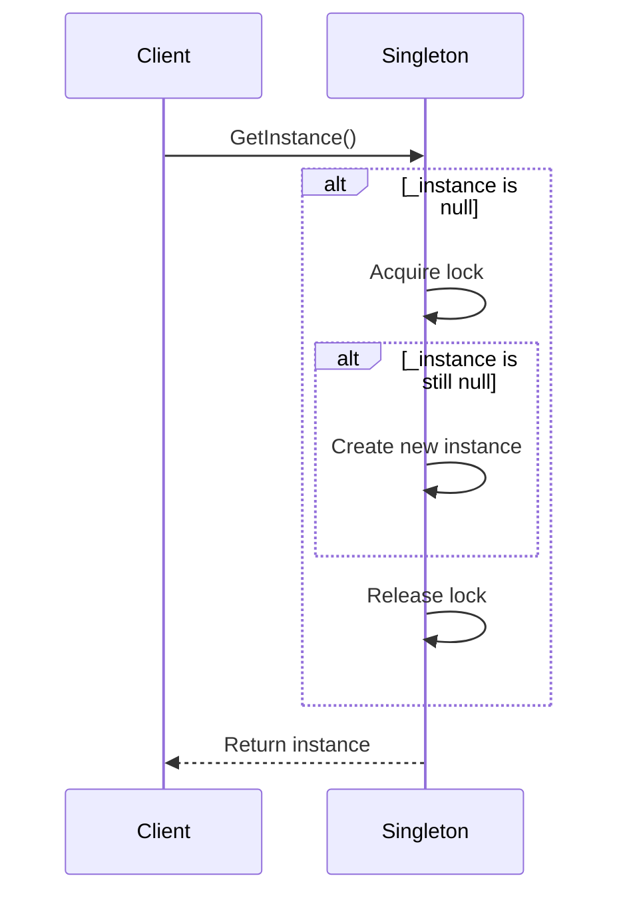

## 4.11 Double-Checked Locking Pattern

In the realm of software design patterns, the Double-Checked Locking (DCL) pattern stands out as a sophisticated technique aimed at optimizing performance in multithreaded environments. This pattern is particularly useful when implementing the Singleton pattern, where it ensures that a class has only one instance while minimizing the overhead associated with acquiring locks. In this section, we will delve into the intricacies of the Double-Checked Locking pattern, explore its implementation in C#, and examine its applicability in various scenarios.

### Intent

The primary intent of the Double-Checked Locking pattern is to reduce the overhead of acquiring a lock by first testing the locking criterion without actually acquiring the lock. This is particularly beneficial in scenarios where the lock is expensive to acquire and the condition being checked is expected to be true most of the time.

### Key Participants

- **Singleton Instance**: The object that is intended to be instantiated only once.
- **Lock Object**: An object used to synchronize access to the singleton instance.
- **Volatile Keyword**: Ensures visibility of changes to variables across threads.

### Applicability

The Double-Checked Locking pattern is applicable in scenarios where:

- You need to ensure that a class has only one instance.
- The cost of acquiring a lock is significant.
- The condition being checked is expected to be true most of the time.
- You are working in a multithreaded environment where performance is critical.

### Implementing Double-Checked Locking in C#

To implement the Double-Checked Locking pattern in C#, we need to use the `volatile` keyword and lock statements. The `volatile` keyword ensures that the instance variable is read from the main memory, not from the thread's local cache, thus ensuring visibility of changes across threads.

Here's a step-by-step guide to implementing the Double-Checked Locking pattern in C#:

#### Step 1: Define the Singleton Class

First, define the singleton class with a private constructor to prevent instantiation from outside the class.

```csharp
public class Singleton
{
    private static volatile Singleton _instance;
    private static readonly object _lock = new object();

    private Singleton()
    {
        // Private constructor to prevent instantiation
    }
}
```

#### Step 2: Implement the GetInstance Method

Next, implement the `GetInstance` method, which will return the singleton instance. This method will use the Double-Checked Locking pattern to ensure that the instance is created only once.

```csharp
public static Singleton GetInstance()
{
    if (_instance == null)
    {
        lock (_lock)
        {
            if (_instance == null)
            {
                _instance = new Singleton();
            }
        }
    }
    return _instance;
}
```

### Code Explanation

- **Volatile Keyword**: The `_instance` variable is declared as `volatile` to ensure that changes to it are visible across threads.
- **First Check**: The first `if` statement checks if the `_instance` is `null`. If it is not `null`, the method returns the existing instance without acquiring the lock.
- **Lock Statement**: If the `_instance` is `null`, the lock is acquired to ensure that only one thread can create the instance.
- **Second Check**: Inside the lock, the `_instance` is checked again to ensure that it is still `null` before creating a new instance. This prevents multiple threads from creating multiple instances.

### Visualizing Double-Checked Locking

To better understand the flow of the Double-Checked Locking pattern, let's visualize it using a sequence diagram.



### Design Considerations

When using the Double-Checked Locking pattern, consider the following:

- **Volatile Keyword**: Ensure that the singleton instance is declared as `volatile` to prevent issues with instruction reordering and visibility.
- **Lock Granularity**: Use fine-grained locks to minimize contention and improve performance.
- **Lazy Initialization**: Consider using lazy initialization techniques to further optimize performance.

### Differences and Similarities

The Double-Checked Locking pattern is often compared to other synchronization techniques, such as:

- **Eager Initialization**: Unlike eager initialization, which creates the instance at the time of class loading, DCL creates the instance only when it is needed.
- **Lazy Initialization**: DCL is a form of lazy initialization but with additional checks to minimize locking overhead.
- **Thread-Safe Singleton**: While both DCL and thread-safe singleton patterns ensure thread safety, DCL is more efficient due to reduced locking.

### Use Cases and Examples

The Double-Checked Locking pattern is commonly used in scenarios where performance is critical, such as:

- **Efficient Singleton Implementations**: In multithreaded environments, DCL is used to implement efficient singleton patterns without incurring the overhead of acquiring locks every time the instance is accessed.
- **Resource-Intensive Operations**: When creating an instance involves resource-intensive operations, DCL ensures that these operations are performed only once.

### Sample Code Snippet

Let's look at a complete example of the Double-Checked Locking pattern in C#:

```csharp
public class ConfigurationManager
{
    private static volatile ConfigurationManager _instance;
    private static readonly object _lock = new object();
    private string _configuration;

    private ConfigurationManager()
    {
        // Simulate a resource-intensive operation
        _configuration = LoadConfiguration();
    }

    public static ConfigurationManager GetInstance()
    {
        if (_instance == null)
        {
            lock (_lock)
            {
                if (_instance == null)
                {
                    _instance = new ConfigurationManager();
                }
            }
        }
        return _instance;
    }

    private string LoadConfiguration()
    {
        // Simulate loading configuration from a file or database
        return "Configuration Data";
    }

    public string GetConfiguration()
    {
        return _configuration;
    }
}
```

### Try It Yourself

To experiment with the Double-Checked Locking pattern, try the following:

- **Modify the Singleton Class**: Add additional methods or properties to the singleton class and observe how they behave in a multithreaded environment.
- **Simulate Multithreading**: Create multiple threads that access the singleton instance and verify that only one instance is created.
- **Measure Performance**: Use performance profiling tools to measure the impact of the Double-Checked Locking pattern on your application's performance.

### Knowledge Check

To reinforce your understanding of the Double-Checked Locking pattern, consider the following questions:

- What is the primary intent of the Double-Checked Locking pattern?
- How does the `volatile` keyword ensure visibility of changes across threads?
- Why is the second check inside the lock necessary?
- What are the potential pitfalls of using the Double-Checked Locking pattern?

### Embrace the Journey

Remember, mastering design patterns like Double-Checked Locking is just the beginning of your journey as a software engineer. As you continue to explore and experiment with different patterns, you'll gain a deeper understanding of how to build efficient, scalable, and maintainable applications. Keep experimenting, stay curious, and enjoy the journey!

## Quiz Time!



### What is the primary intent of the Double-Checked Locking pattern?

- [x] To reduce the overhead of acquiring a lock by first testing the locking criterion without actually acquiring the lock.
- [ ] To ensure that a class has only one instance.
- [ ] To improve performance in single-threaded environments.
- [ ] To simplify the implementation of the Singleton pattern.

> **Explanation:** The primary intent of the Double-Checked Locking pattern is to reduce the overhead of acquiring a lock by first testing the locking criterion without actually acquiring the lock.

### Why is the `volatile` keyword used in the Double-Checked Locking pattern?

- [x] To ensure visibility of changes to variables across threads.
- [ ] To prevent multiple threads from accessing the same variable.
- [ ] To improve the performance of the lock statement.
- [ ] To simplify the implementation of the Singleton pattern.

> **Explanation:** The `volatile` keyword is used to ensure visibility of changes to variables across threads, preventing issues with instruction reordering and visibility.

### What is the purpose of the second check inside the lock in the Double-Checked Locking pattern?

- [x] To ensure that the instance is still null before creating a new instance.
- [ ] To improve the performance of the lock statement.
- [ ] To simplify the implementation of the Singleton pattern.
- [ ] To prevent multiple threads from accessing the same variable.

> **Explanation:** The second check inside the lock ensures that the instance is still null before creating a new instance, preventing multiple threads from creating multiple instances.

### In which scenarios is the Double-Checked Locking pattern particularly useful?

- [x] In multithreaded environments where performance is critical.
- [ ] In single-threaded environments where performance is critical.
- [ ] In scenarios where the cost of acquiring a lock is insignificant.
- [ ] In scenarios where the condition being checked is expected to be false most of the time.

> **Explanation:** The Double-Checked Locking pattern is particularly useful in multithreaded environments where performance is critical and the cost of acquiring a lock is significant.

### How does the Double-Checked Locking pattern differ from eager initialization?

- [x] DCL creates the instance only when it is needed, while eager initialization creates the instance at the time of class loading.
- [ ] DCL creates the instance at the time of class loading, while eager initialization creates the instance only when it is needed.
- [ ] DCL and eager initialization are the same.
- [ ] DCL is used in single-threaded environments, while eager initialization is used in multithreaded environments.

> **Explanation:** DCL creates the instance only when it is needed, while eager initialization creates the instance at the time of class loading.

### What is a potential pitfall of using the Double-Checked Locking pattern?

- [x] Incorrect implementation can lead to multiple instances being created.
- [ ] It is not suitable for multithreaded environments.
- [ ] It always results in poor performance.
- [ ] It is too complex to implement.

> **Explanation:** Incorrect implementation of the Double-Checked Locking pattern can lead to multiple instances being created, especially if the `volatile` keyword is not used correctly.

### What is the role of the lock object in the Double-Checked Locking pattern?

- [x] To synchronize access to the singleton instance.
- [ ] To prevent multiple threads from accessing the same variable.
- [ ] To improve the performance of the lock statement.
- [ ] To simplify the implementation of the Singleton pattern.

> **Explanation:** The lock object is used to synchronize access to the singleton instance, ensuring that only one thread can create the instance at a time.

### How can you experiment with the Double-Checked Locking pattern?

- [x] Create multiple threads that access the singleton instance and verify that only one instance is created.
- [ ] Use the pattern in single-threaded environments to measure performance.
- [ ] Implement the pattern without using the `volatile` keyword.
- [ ] Avoid using the lock statement to simplify the implementation.

> **Explanation:** To experiment with the Double-Checked Locking pattern, create multiple threads that access the singleton instance and verify that only one instance is created.

### What is the benefit of using fine-grained locks in the Double-Checked Locking pattern?

- [x] To minimize contention and improve performance.
- [ ] To simplify the implementation of the Singleton pattern.
- [ ] To prevent multiple threads from accessing the same variable.
- [ ] To ensure visibility of changes to variables across threads.

> **Explanation:** Using fine-grained locks minimizes contention and improves performance by reducing the time that threads spend waiting for the lock.

### True or False: The Double-Checked Locking pattern is a form of lazy initialization.

- [x] True
- [ ] False

> **Explanation:** True. The Double-Checked Locking pattern is a form of lazy initialization, as it creates the instance only when it is needed.


