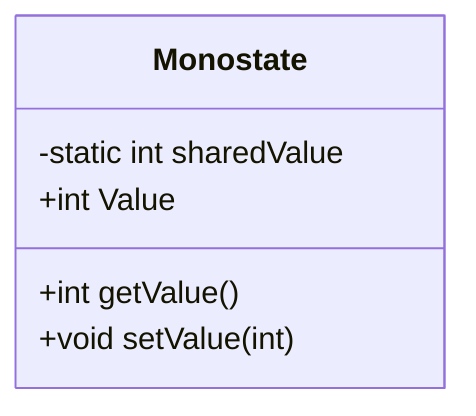
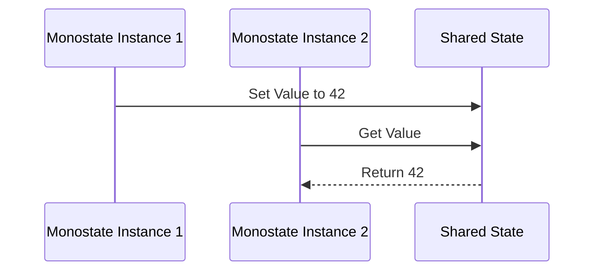

## 4.12 Monostate Pattern

The Monostate Pattern is a unique approach within the realm of creational design patterns that allows multiple instances of a class to share the same state. Unlike the Singleton Pattern, which restricts the instantiation of a class to a single object, the Monostate Pattern permits multiple instances while ensuring they all reflect the same state. This pattern is particularly useful in scenarios where global state management is required without the need to limit the number of instances.

### Intent

The primary intent of the Monostate Pattern is to ensure that all instances of a class share the same state. This is achieved by using static fields to hold the shared state, while allowing each instance to have its own identity. This pattern is beneficial in situations where you need to manage global state across multiple objects without enforcing a single instance constraint.

### Key Participants

- **Shared State**: The static fields that hold the state shared by all instances.
- **Instance Methods**: The methods that operate on the shared state, providing a way to interact with it through individual instances.

### Applicability

The Monostate Pattern is applicable in scenarios where:

- You need to manage global state across multiple instances.
- You want to avoid the restrictions of the Singleton Pattern.
- You require a more flexible approach to shared state management.

### Implementing Monostate in C#

To implement the Monostate Pattern in C#, we use static fields to hold the shared state. Each instance of the class accesses these static fields, ensuring that all instances reflect the same state.

```csharp
public class Monostate
{
    private static int sharedValue;

    public int Value
    {
        get { return sharedValue; }
        set { sharedValue = value; }
    }
}

// Usage
Monostate instance1 = new Monostate();
Monostate instance2 = new Monostate();

instance1.Value = 42;
Console.WriteLine(instance2.Value); // Outputs: 42
```

In this example, the `sharedValue` field is static, meaning it is shared across all instances of the `Monostate` class. When `instance1` sets the `Value` property, `instance2` reflects this change, demonstrating the shared state.

### Diagrams

To better understand the Monostate Pattern, let's visualize the shared state concept using a class diagram.



This diagram illustrates that the `sharedValue` is a static field, shared across all instances of the `Monostate` class.

### Use Cases and Examples

#### Managing Global Configuration

One common use case for the Monostate Pattern is managing global configuration settings. By using static fields to store configuration values, you can ensure that all parts of your application access the same configuration.

```csharp
public class Configuration
{
    private static string connectionString;

    public string ConnectionString
    {
        get { return connectionString; }
        set { connectionString = value; }
    }
}

// Usage
Configuration config1 = new Configuration();
Configuration config2 = new Configuration();

config1.ConnectionString = "Server=myServer;Database=myDB;";
Console.WriteLine(config2.ConnectionString); // Outputs: Server=myServer;Database=myDB;
```

In this example, the `Configuration` class uses the Monostate Pattern to manage a shared connection string across multiple instances.

#### Logging

Another practical application of the Monostate Pattern is in logging. By using a shared state for log settings, you can ensure consistent logging behavior across different parts of your application.

```csharp
public class Logger
{
    private static string logLevel;

    public string LogLevel
    {
        get { return logLevel; }
        set { logLevel = value; }
    }

    public void Log(string message)
    {
        Console.WriteLine($"[{logLevel}] {message}");
    }
}

// Usage
Logger logger1 = new Logger();
Logger logger2 = new Logger();

logger1.LogLevel = "INFO";
logger2.Log("This is a log message."); // Outputs: [INFO] This is a log message.
```

Here, the `Logger` class uses the Monostate Pattern to maintain a shared log level across multiple logger instances.

### Design Considerations

When using the Monostate Pattern, consider the following:

- **Thread Safety**: Since the shared state is static, you need to ensure thread safety when accessing or modifying it. Use synchronization mechanisms like locks to prevent race conditions.
- **Testing**: Testing classes that use the Monostate Pattern can be challenging due to the shared state. Consider using dependency injection or mock objects to isolate tests.
- **Performance**: Accessing static fields can have performance implications, especially in high-concurrency scenarios. Profile your application to ensure acceptable performance.

### Differences and Similarities

The Monostate Pattern is often compared to the Singleton Pattern. While both patterns manage shared state, they differ in their approach:

- **Singleton Pattern**: Restricts instantiation to a single object, ensuring a single point of access to the shared state.
- **Monostate Pattern**: Allows multiple instances, each reflecting the shared state, providing more flexibility in object creation.

### Try It Yourself

To deepen your understanding of the Monostate Pattern, try modifying the code examples:

- Add additional properties to the `Monostate` class and observe how they share state across instances.
- Implement thread safety in the `Logger` example using locks.
- Create a new use case where the Monostate Pattern can be applied, such as managing user preferences.

### Visualizing Shared State

To further illustrate the concept of shared state in the Monostate Pattern, consider the following sequence diagram:



This diagram shows how two instances of the `Monostate` class interact with the shared state, demonstrating the pattern's behavior.

### Knowledge Check

Before we conclude, let's pose some questions to reinforce your understanding of the Monostate Pattern:

1. What is the primary intent of the Monostate Pattern?
2. How does the Monostate Pattern differ from the Singleton Pattern?
3. What are some common use cases for the Monostate Pattern?
4. How can you ensure thread safety when using the Monostate Pattern?
5. What are the potential performance implications of using static fields in the Monostate Pattern?

### Embrace the Journey

Remember, mastering design patterns like the Monostate Pattern is an ongoing journey. As you continue to explore and apply these patterns, you'll gain deeper insights into software design and architecture. Keep experimenting, stay curious, and enjoy the process of learning and growing as a developer.

### Conclusion

The Monostate Pattern offers a flexible approach to managing shared state across multiple instances. By understanding its implementation, use cases, and design considerations, you can effectively apply this pattern in your C# applications. Whether you're managing global configuration, logging, or other shared state scenarios, the Monostate Pattern provides a valuable tool in your design pattern toolkit.

## Quiz Time!



### What is the primary intent of the Monostate Pattern?

- [x] To ensure all instances share the same state
- [ ] To restrict instantiation to a single object
- [ ] To provide a single point of access to shared state
- [ ] To manage state across distributed systems

> **Explanation:** The Monostate Pattern ensures that all instances of a class share the same state by using static fields.

### How does the Monostate Pattern differ from the Singleton Pattern?

- [x] It allows multiple instances
- [ ] It restricts instantiation to a single object
- [ ] It provides a single point of access to shared state
- [ ] It is used for managing distributed systems

> **Explanation:** Unlike the Singleton Pattern, the Monostate Pattern allows multiple instances, each reflecting the shared state.

### What is a common use case for the Monostate Pattern?

- [x] Managing global configuration
- [ ] Implementing a database connection pool
- [ ] Creating a single instance of a class
- [ ] Managing state across distributed systems

> **Explanation:** The Monostate Pattern is commonly used for managing global configuration settings across multiple instances.

### How can you ensure thread safety when using the Monostate Pattern?

- [x] Use synchronization mechanisms like locks
- [ ] Avoid using static fields
- [ ] Use dependency injection
- [ ] Implement a single instance of the class

> **Explanation:** To ensure thread safety, use synchronization mechanisms like locks when accessing or modifying static fields.

### What are the potential performance implications of using static fields in the Monostate Pattern?

- [x] Accessing static fields can have performance implications
- [ ] Static fields are always faster than instance fields
- [ ] Static fields have no impact on performance
- [ ] Static fields are only used in distributed systems

> **Explanation:** Accessing static fields can have performance implications, especially in high-concurrency scenarios.

### What is a key benefit of the Monostate Pattern over the Singleton Pattern?

- [x] Flexibility in object creation
- [ ] Restriction to a single instance
- [ ] Single point of access to shared state
- [ ] Management of distributed systems

> **Explanation:** The Monostate Pattern provides more flexibility in object creation compared to the Singleton Pattern.

### In the Monostate Pattern, what holds the shared state?

- [x] Static fields
- [ ] Instance fields
- [ ] Local variables
- [ ] Method parameters

> **Explanation:** Static fields hold the shared state in the Monostate Pattern.

### What is a potential challenge when testing classes that use the Monostate Pattern?

- [x] Isolating tests due to shared state
- [ ] Creating multiple instances
- [ ] Ensuring a single instance
- [ ] Managing distributed systems

> **Explanation:** Testing classes that use the Monostate Pattern can be challenging due to the shared state.

### How can you modify the Monostate Pattern to manage user preferences?

- [x] Add additional properties for user preferences
- [ ] Restrict instantiation to a single object
- [ ] Use instance fields for preferences
- [ ] Implement a single point of access

> **Explanation:** You can add additional properties to the Monostate class to manage user preferences.

### True or False: The Monostate Pattern is only applicable in distributed systems.

- [ ] True
- [x] False

> **Explanation:** The Monostate Pattern is applicable in various scenarios, not just distributed systems.


