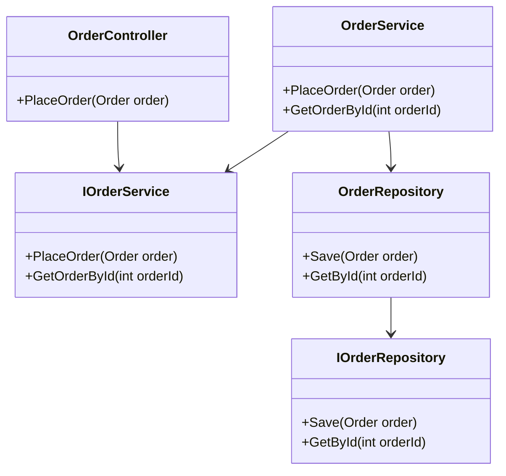

## 4.13 Service Layer Pattern

The Service Layer Pattern is a crucial architectural pattern in software design, particularly in enterprise applications. It defines an application's boundary with a layer that contains business logic, ensuring a clear separation from presentation and data access layers. This separation promotes a clean architecture, enhances maintainability, and facilitates testing.

### Intent

The primary intent of the Service Layer Pattern is to encapsulate business logic within a distinct layer, separating it from the user interface and data access layers. This separation ensures that changes in one layer do not affect others, promoting a modular and scalable architecture.

### Key Participants

1. **Service Layer**: Contains business logic and acts as a mediator between the presentation layer and the data access layer.
2. **Presentation Layer**: Handles user interactions and delegates business operations to the service layer.
3. **Data Access Layer**: Manages data retrieval and storage, providing data to the service layer.

### Applicability

- **Complex Business Transactions**: Use the Service Layer Pattern when your application requires complex business logic that spans multiple operations.
- **Consistency and Reusability**: When you need to ensure consistency and reusability of business logic across different parts of the application.
- **Decoupling**: To decouple business logic from the presentation and data access layers, facilitating easier maintenance and testing.

### Implementing Service Layer in C#

Implementing the Service Layer Pattern in C# involves structuring services to encapsulate business operations. Let's explore how to achieve this with a practical example.

#### Structuring Services

1. **Define Interfaces**: Start by defining interfaces for your services. This promotes loose coupling and allows for easy testing and swapping of implementations.

```csharp
public interface IOrderService
{
    void PlaceOrder(Order order);
    Order GetOrderById(int orderId);
}
```

2. **Implement Services**: Implement the service interfaces, encapsulating business logic within these classes.

```csharp
public class OrderService : IOrderService
{
    private readonly IOrderRepository _orderRepository;

    public OrderService(IOrderRepository orderRepository)
    {
        _orderRepository = orderRepository;
    }

    public void PlaceOrder(Order order)
    {
        // Business logic for placing an order
        if (order == null)
        {
            throw new ArgumentNullException(nameof(order));
        }

        // Additional business rules can be applied here

        _orderRepository.Save(order);
    }

    public Order GetOrderById(int orderId)
    {
        // Business logic for retrieving an order
        return _orderRepository.GetById(orderId);
    }
}
```

3. **Integrate with Presentation Layer**: Use the service layer in your presentation layer to handle business operations.

```csharp
public class OrderController : Controller
{
    private readonly IOrderService _orderService;

    public OrderController(IOrderService orderService)
    {
        _orderService = orderService;
    }

    public IActionResult PlaceOrder(Order order)
    {
        _orderService.PlaceOrder(order);
        return View("OrderConfirmation", order);
    }
}
```

### Use Cases and Examples

#### Complex Business Transactions

Consider an e-commerce application where placing an order involves multiple steps such as inventory check, payment processing, and order confirmation. The Service Layer Pattern can encapsulate these steps, ensuring that the business logic is centralized and reusable.

```csharp
public class OrderService : IOrderService
{
    private readonly IInventoryService _inventoryService;
    private readonly IPaymentService _paymentService;
    private readonly IOrderRepository _orderRepository;

    public OrderService(IInventoryService inventoryService, IPaymentService paymentService, IOrderRepository orderRepository)
    {
        _inventoryService = inventoryService;
        _paymentService = paymentService;
        _orderRepository = orderRepository;
    }

    public void PlaceOrder(Order order)
    {
        if (!_inventoryService.CheckStock(order))
        {
            throw new InvalidOperationException("Insufficient stock.");
        }

        if (!_paymentService.ProcessPayment(order))
        {
            throw new InvalidOperationException("Payment failed.");
        }

        _orderRepository.Save(order);
    }
}
```

#### Ensuring Consistency and Reusability

By centralizing business logic in the service layer, you ensure that all parts of the application use the same logic, reducing duplication and potential inconsistencies.

### Design Considerations

- **Transaction Management**: Consider how transactions are managed across service operations, especially when dealing with multiple data sources.
- **Error Handling**: Implement robust error handling within the service layer to manage exceptions and ensure system stability.
- **Performance**: Be mindful of performance implications, especially when services involve complex operations or external integrations.

### Differences and Similarities

The Service Layer Pattern is often confused with the Repository Pattern. While both aim to separate concerns, the Service Layer focuses on business logic, whereas the Repository Pattern deals with data access.

### Visualizing the Service Layer Pattern

Below is a class diagram illustrating the Service Layer Pattern in a typical application architecture.



### Try It Yourself

Experiment with the Service Layer Pattern by modifying the code examples. Try adding new business operations or integrating additional services, such as a notification service for order confirmations.

### Knowledge Check

- What is the primary purpose of the Service Layer Pattern?
- How does the Service Layer Pattern promote maintainability?
- What are the key differences between the Service Layer and Repository Patterns?

### Embrace the Journey

Remember, mastering the Service Layer Pattern is just one step in building robust and scalable applications. As you progress, continue to explore other design patterns and architectural principles. Keep experimenting, stay curious, and enjoy the journey!

## Quiz Time!



### What is the primary purpose of the Service Layer Pattern?

- [x] To encapsulate business logic within a distinct layer
- [ ] To manage data access operations
- [ ] To handle user interface interactions
- [ ] To optimize database queries

> **Explanation:** The Service Layer Pattern is designed to encapsulate business logic, separating it from presentation and data access layers.

### Which layer interacts directly with the Service Layer?

- [x] Presentation Layer
- [ ] Data Access Layer
- [ ] Database Layer
- [ ] Network Layer

> **Explanation:** The Presentation Layer interacts with the Service Layer to perform business operations.

### What is a key benefit of using the Service Layer Pattern?

- [x] Promotes modular and scalable architecture
- [ ] Reduces code complexity
- [ ] Increases database performance
- [ ] Simplifies UI design

> **Explanation:** The Service Layer Pattern promotes a modular and scalable architecture by separating business logic from other layers.

### How does the Service Layer Pattern enhance testability?

- [x] By isolating business logic for easier testing
- [ ] By reducing the number of test cases
- [ ] By simplifying UI components
- [ ] By optimizing data retrieval

> **Explanation:** The Service Layer Pattern enhances testability by isolating business logic, making it easier to test independently.

### What is a common use case for the Service Layer Pattern?

- [x] Complex business transactions
- [ ] Simple CRUD operations
- [ ] UI rendering
- [ ] Database indexing

> **Explanation:** The Service Layer Pattern is commonly used for complex business transactions that require coordination across multiple operations.

### Which pattern is often confused with the Service Layer Pattern?

- [x] Repository Pattern
- [ ] Singleton Pattern
- [ ] Observer Pattern
- [ ] Factory Pattern

> **Explanation:** The Repository Pattern is often confused with the Service Layer Pattern, but they serve different purposes.

### What should be considered when implementing the Service Layer Pattern?

- [x] Transaction Management
- [ ] UI Design
- [ ] Database Indexing
- [ ] Network Latency

> **Explanation:** Transaction management is crucial when implementing the Service Layer Pattern to ensure data consistency.

### How does the Service Layer Pattern promote reusability?

- [x] By centralizing business logic
- [ ] By reducing code duplication
- [ ] By optimizing database queries
- [ ] By simplifying UI components

> **Explanation:** The Service Layer Pattern promotes reusability by centralizing business logic, ensuring consistent use across the application.

### What is a potential pitfall of the Service Layer Pattern?

- [x] Overcomplicating simple applications
- [ ] Reducing code readability
- [ ] Increasing database load
- [ ] Slowing down UI rendering

> **Explanation:** Overcomplicating simple applications is a potential pitfall of the Service Layer Pattern, as it may introduce unnecessary complexity.

### True or False: The Service Layer Pattern is only applicable to large enterprise applications.

- [ ] True
- [x] False

> **Explanation:** The Service Layer Pattern can be applied to applications of various sizes, not just large enterprise applications.




