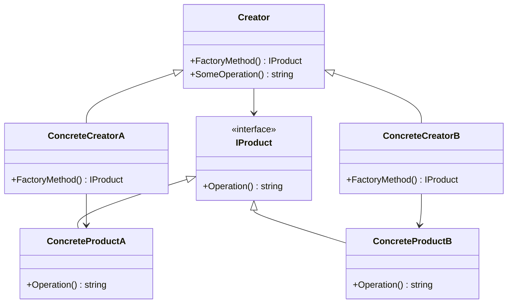

## 4.2 Factory Method Design Pattern

The Factory Method Design Pattern is a pivotal concept in software design, particularly within the realm of object-oriented programming. It provides a way to encapsulate the instantiation of objects, allowing subclasses to determine the specific type of objects that will be created. This pattern is part of the creational design patterns, which focus on class instantiation or object creation.

### Intent

The primary intent of the Factory Method Design Pattern is to define an interface for creating an object, but allow subclasses to alter the type of objects that will be created. This approach promotes loose coupling by eliminating the need for client code to specify the exact class of objects it needs to instantiate.

### Key Participants

1. **Product**: Defines the interface of objects the factory method creates.
2. **ConcreteProduct**: Implements the Product interface.
3. **Creator**: Declares the factory method, which returns an object of type Product. Creator may also define a default implementation of the factory method that returns a default ConcreteProduct object.
4. **ConcreteCreator**: Overrides the factory method to return an instance of a ConcreteProduct.

### Applicability

Use the Factory Method Design Pattern when:
- A class cannot anticipate the class of objects it must create.
- A class wants its subclasses to specify the objects it creates.
- You want to localize the knowledge of which class gets created.

### Implementing Factory Method in C#

Let's delve into the implementation of the Factory Method Design Pattern in C#. We'll explore using classes, interfaces, and abstract classes to create factories, and how to extend factories to add new product types without altering existing code.

#### Using Classes and Interfaces to Create Factories

In C#, interfaces and abstract classes play a crucial role in implementing the Factory Method pattern. They provide the necessary abstraction to define the factory method and the products it creates.

```csharp
// Product Interface
public interface IProduct
{
    string Operation();
}

// Concrete Products
public class ConcreteProductA : IProduct
{
    public string Operation()
    {
        return "{Result of ConcreteProductA}";
    }
}

public class ConcreteProductB : IProduct
{
    public string Operation()
    {
        return "{Result of ConcreteProductB}";
    }
}

// Creator Class
public abstract class Creator
{
    // Factory Method
    public abstract IProduct FactoryMethod();

    public string SomeOperation()
    {
        // Call the factory method to create a Product object.
        var product = FactoryMethod();
        // Now, use the product.
        return "Creator: The same creator's code has just worked with " + product.Operation();
    }
}

// Concrete Creators
public class ConcreteCreatorA : Creator
{
    public override IProduct FactoryMethod()
    {
        return new ConcreteProductA();
    }
}

public class ConcreteCreatorB : Creator
{
    public override IProduct FactoryMethod()
    {
        return new ConcreteProductB();
    }
}
```

In this example, `Creator` is an abstract class with a factory method `FactoryMethod()`. `ConcreteCreatorA` and `ConcreteCreatorB` are subclasses that override the factory method to create specific products.

#### Using Interfaces and Abstract Classes

Interfaces and abstract classes provide a flexible way to define the factory method and the products it creates. This approach allows for easy extension and modification of the product creation process.

```csharp
// Abstract Product
public interface IProduct
{
    string Operation();
}

// Concrete Products
public class ConcreteProductA : IProduct
{
    public string Operation()
    {
        return "{Result of ConcreteProductA}";
    }
}

public class ConcreteProductB : IProduct
{
    public string Operation()
    {
        return "{Result of ConcreteProductB}";
    }
}

// Abstract Creator
public abstract class Creator
{
    // Factory Method
    public abstract IProduct FactoryMethod();

    public string SomeOperation()
    {
        var product = FactoryMethod();
        return "Creator: The same creator's code has just worked with " + product.Operation();
    }
}

// Concrete Creators
public class ConcreteCreatorA : Creator
{
    public override IProduct FactoryMethod()
    {
        return new ConcreteProductA();
    }
}

public class ConcreteCreatorB : Creator
{
    public override IProduct FactoryMethod()
    {
        return new ConcreteProductB();
    }
}
```

Here, the `Creator` class is abstract, and the `FactoryMethod()` is defined as an abstract method. This allows subclasses to provide their own implementation of the factory method.

#### Factory Kit Pattern

The Factory Kit Pattern is a variation of the Factory Method pattern that groups related factory methods for streamlined usage. It provides a way to organize and manage multiple factory methods within a single interface.

```csharp
// Factory Kit Interface
public interface IFactory
{
    IProduct CreateProduct(string type);
}

// Factory Kit Implementation
public class FactoryKit : IFactory
{
    private readonly Dictionary<string, Func<IProduct>> _factories;

    public FactoryKit()
    {
        _factories = new Dictionary<string, Func<IProduct>>
        {
            { "A", () => new ConcreteProductA() },
            { "B", () => new ConcreteProductB() }
        };
    }

    public IProduct CreateProduct(string type)
    {
        if (_factories.ContainsKey(type))
        {
            return _factories[type]();
        }
        throw new ArgumentException("Invalid product type");
    }
}
```

In this example, the `FactoryKit` class implements the `IFactory` interface and provides a dictionary of factory methods. This approach allows for easy addition of new product types without modifying existing code.

#### Extending Factories

One of the key benefits of the Factory Method pattern is its extensibility. You can add new product types without changing existing code, which enhances flexibility and maintainability.

```csharp
// New Concrete Product
public class ConcreteProductC : IProduct
{
    public string Operation()
    {
        return "{Result of ConcreteProductC}";
    }
}

// Extending Factory Kit
public class ExtendedFactoryKit : FactoryKit
{
    public ExtendedFactoryKit()
    {
        _factories.Add("C", () => new ConcreteProductC());
    }
}
```

By extending the `FactoryKit` class, we can add new product types, such as `ConcreteProductC`, without altering the existing factory methods.

### Use Cases and Examples

The Factory Method Design Pattern is particularly useful in scenarios where flexibility and scalability are essential. Let's explore some common use cases where this pattern enhances software design.

#### Situations Where Factory Method Enhances Flexibility

1. **Plugin Architecture**: When developing a plugin-based application, the Factory Method pattern allows for dynamic loading and instantiation of plugins without hardcoding their classes.

2. **UI Component Libraries**: In UI libraries, different themes or styles can be implemented as separate products, allowing the application to switch themes dynamically.

3. **Data Access Layers**: In data access layers, the Factory Method pattern can be used to create different database connections or query objects based on configuration settings.

4. **Testing and Mocking**: The Factory Method pattern facilitates testing and mocking by allowing the creation of mock objects without modifying the client code.

### Design Considerations

When implementing the Factory Method Design Pattern, consider the following design considerations:

- **Decoupling**: The pattern promotes decoupling by separating the creation of objects from their usage.
- **Scalability**: It enhances scalability by allowing new product types to be added without modifying existing code.
- **Complexity**: The pattern can introduce complexity, especially when there are many product types or factory methods.
- **Performance**: Consider the performance implications of using factory methods, especially in performance-critical applications.

### Differences and Similarities

The Factory Method Design Pattern is often confused with other creational patterns, such as the Abstract Factory and Builder patterns. Here are some key differences and similarities:

- **Factory Method vs. Abstract Factory**: The Factory Method pattern focuses on creating a single product, while the Abstract Factory pattern provides an interface for creating families of related products.

- **Factory Method vs. Builder**: The Factory Method pattern is used for creating objects, while the Builder pattern is used for constructing complex objects step by step.

### Visualizing the Factory Method Pattern

To better understand the Factory Method Design Pattern, let's visualize its structure using a class diagram.



**Diagram Description**: The diagram illustrates the relationship between the `Creator`, `ConcreteCreator`, `IProduct`, and `ConcreteProduct` classes. The `Creator` class defines the factory method, which is overridden by `ConcreteCreator` classes to create specific `ConcreteProduct` instances.

### Try It Yourself

To deepen your understanding of the Factory Method Design Pattern, try modifying the code examples provided. Here are some suggestions:

- Add a new product type, such as `ConcreteProductC`, and update the factory methods to support it.
- Implement a new `ConcreteCreator` class that creates a different type of product.
- Experiment with different ways to organize and manage factory methods using the Factory Kit pattern.

### Knowledge Check

Before we conclude, let's reinforce your understanding of the Factory Method Design Pattern with a few questions:

- What is the primary intent of the Factory Method Design Pattern?
- How does the Factory Method pattern promote loose coupling?
- What are some common use cases for the Factory Method pattern?
- How does the Factory Method pattern differ from the Abstract Factory pattern?

### Embrace the Journey

Remember, mastering design patterns is a journey. As you continue to explore and apply the Factory Method Design Pattern in your projects, you'll gain a deeper understanding of its benefits and nuances. Keep experimenting, stay curious, and enjoy the process of becoming a more proficient software engineer.

## Quiz Time!



### What is the primary intent of the Factory Method Design Pattern?

- [x] To define an interface for creating an object, but allow subclasses to alter the type of objects that will be created.
- [ ] To create families of related or dependent objects.
- [ ] To separate the construction of a complex object from its representation.
- [ ] To provide a way to access the elements of an aggregate object sequentially.

> **Explanation:** The Factory Method Design Pattern defines an interface for creating an object, but allows subclasses to alter the type of objects that will be created.

### How does the Factory Method pattern promote loose coupling?

- [x] By separating the creation of objects from their usage.
- [ ] By allowing multiple interfaces to be implemented by a single class.
- [ ] By using inheritance to share code between classes.
- [ ] By encapsulating the details of object creation within a single class.

> **Explanation:** The Factory Method pattern promotes loose coupling by separating the creation of objects from their usage, allowing subclasses to determine the specific type of objects that will be created.

### Which of the following is a common use case for the Factory Method pattern?

- [x] Plugin architecture
- [ ] Singleton pattern
- [ ] Observer pattern
- [ ] Command pattern

> **Explanation:** The Factory Method pattern is commonly used in plugin architectures to allow dynamic loading and instantiation of plugins without hardcoding their classes.

### How does the Factory Method pattern differ from the Abstract Factory pattern?

- [x] The Factory Method pattern focuses on creating a single product, while the Abstract Factory pattern provides an interface for creating families of related products.
- [ ] The Factory Method pattern is used for constructing complex objects step by step, while the Abstract Factory pattern is used for creating a single product.
- [ ] The Factory Method pattern is used for creating families of related products, while the Abstract Factory pattern focuses on creating a single product.
- [ ] The Factory Method pattern is used for creating objects, while the Abstract Factory pattern is used for constructing complex objects step by step.

> **Explanation:** The Factory Method pattern focuses on creating a single product, while the Abstract Factory pattern provides an interface for creating families of related products.

### What role does the Creator class play in the Factory Method pattern?

- [x] It declares the factory method, which returns an object of type Product.
- [ ] It implements the Product interface.
- [ ] It provides a default implementation of the factory method.
- [ ] It overrides the factory method to return an instance of a ConcreteProduct.

> **Explanation:** The Creator class declares the factory method, which returns an object of type Product, and may also define a default implementation of the factory method.

### What is a key benefit of using the Factory Method pattern?

- [x] It enhances scalability by allowing new product types to be added without modifying existing code.
- [ ] It simplifies the code by reducing the number of classes.
- [ ] It improves performance by reducing the number of objects created.
- [ ] It ensures that only one instance of a class is created.

> **Explanation:** The Factory Method pattern enhances scalability by allowing new product types to be added without modifying existing code, promoting flexibility and maintainability.

### In the Factory Method pattern, what is the role of the ConcreteCreator class?

- [x] It overrides the factory method to return an instance of a ConcreteProduct.
- [ ] It declares the factory method, which returns an object of type Product.
- [ ] It implements the Product interface.
- [ ] It provides a default implementation of the factory method.

> **Explanation:** The ConcreteCreator class overrides the factory method to return an instance of a ConcreteProduct, allowing subclasses to determine the specific type of objects that will be created.

### What is the Factory Kit pattern?

- [x] A variation of the Factory Method pattern that groups related factory methods for streamlined usage.
- [ ] A pattern that provides an interface for creating families of related products.
- [ ] A pattern used for constructing complex objects step by step.
- [ ] A pattern that ensures only one instance of a class is created.

> **Explanation:** The Factory Kit pattern is a variation of the Factory Method pattern that groups related factory methods for streamlined usage, allowing for easy organization and management of multiple factory methods.

### True or False: The Factory Method pattern can introduce complexity, especially when there are many product types or factory methods.

- [x] True
- [ ] False

> **Explanation:** True. The Factory Method pattern can introduce complexity, especially when there are many product types or factory methods, as it requires careful management of the relationships between classes.

### What is a common scenario where the Factory Method pattern is used in UI component libraries?

- [x] Different themes or styles can be implemented as separate products, allowing the application to switch themes dynamically.
- [ ] Ensuring that only one instance of a UI component is created.
- [ ] Constructing complex UI components step by step.
- [ ] Providing an interface for creating families of related UI components.

> **Explanation:** In UI component libraries, different themes or styles can be implemented as separate products, allowing the application to switch themes dynamically using the Factory Method pattern.




