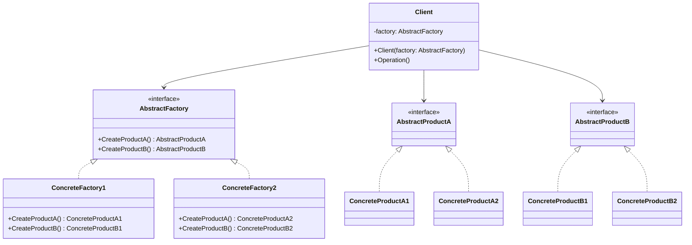

## 4.3 Abstract Factory Design Pattern

The Abstract Factory Design Pattern is a creational pattern that provides an interface for creating families of related or dependent objects without specifying their concrete classes. This pattern is particularly useful when a system needs to be independent of how its objects are created, composed, and represented. By employing the Abstract Factory pattern, developers can ensure that their code adheres to the Open/Closed Principle, making it easier to introduce new product families without altering existing code.

### Intent

The primary intent of the Abstract Factory Design Pattern is to encapsulate a group of individual factories that have a common theme. It provides a way to create objects that belong to a family of related products, ensuring that the objects created are compatible with each other. This pattern is often used when the system needs to be configured with one of multiple families of products.

### Key Participants

1. **AbstractFactory**: Declares an interface for operations that create abstract product objects.
2. **ConcreteFactory**: Implements the operations to create concrete product objects.
3. **AbstractProduct**: Declares an interface for a type of product object.
4. **ConcreteProduct**: Defines a product object to be created by the corresponding concrete factory and implements the AbstractProduct interface.
5. **Client**: Uses only interfaces declared by AbstractFactory and AbstractProduct classes.

### Diagram

Below is a class diagram illustrating the Abstract Factory Design Pattern:



### Implementing Abstract Factory in C#

#### Creating Abstract Factories and Concrete Implementations

To implement the Abstract Factory pattern in C#, we begin by defining interfaces for the abstract factory and the products. Then, we create concrete implementations for these interfaces.

```csharp
// Abstract Factory Interface
public interface IUIFactory
{
    IButton CreateButton();
    ICheckbox CreateCheckbox();
}

// Concrete Factory 1
public class WindowsUIFactory : IUIFactory
{
    public IButton CreateButton()
    {
        return new WindowsButton();
    }

    public ICheckbox CreateCheckbox()
    {
        return new WindowsCheckbox();
    }
}

// Concrete Factory 2
public class MacUIFactory : IUIFactory
{
    public IButton CreateButton()
    {
        return new MacButton();
    }

    public ICheckbox CreateCheckbox()
    {
        return new MacCheckbox();
    }
}

// Abstract Product A
public interface IButton
{
    void Paint();
}

// Concrete Product A1
public class WindowsButton : IButton
{
    public void Paint()
    {
        Console.WriteLine("Render a button in Windows style.");
    }
}

// Concrete Product A2
public class MacButton : IButton
{
    public void Paint()
    {
        Console.WriteLine("Render a button in Mac style.");
    }
}

// Abstract Product B
public interface ICheckbox
{
    void Paint();
}

// Concrete Product B1
public class WindowsCheckbox : ICheckbox
{
    public void Paint()
    {
        Console.WriteLine("Render a checkbox in Windows style.");
    }
}

// Concrete Product B2
public class MacCheckbox : ICheckbox
{
    public void Paint()
    {
        Console.WriteLine("Render a checkbox in Mac style.");
    }
}

// Client
public class Application
{
    private readonly IButton _button;
    private readonly ICheckbox _checkbox;

    public Application(IUIFactory factory)
    {
        _button = factory.CreateButton();
        _checkbox = factory.CreateCheckbox();
    }

    public void Paint()
    {
        _button.Paint();
        _checkbox.Paint();
    }
}
```

In this example, the `IUIFactory` interface defines methods for creating abstract products `IButton` and `ICheckbox`. The `WindowsUIFactory` and `MacUIFactory` are concrete factories that implement these methods to create Windows and Mac style UI components, respectively.

#### Managing Multiple Product Families

The Abstract Factory pattern is particularly useful when managing multiple product families. By encapsulating the creation logic within factories, we can easily switch between different product families without altering the client code.

```csharp
public class Program
{
    public static void Main(string[] args)
    {
        IUIFactory factory;
        string osType = "Windows"; // This could be determined at runtime

        if (osType == "Windows")
        {
            factory = new WindowsUIFactory();
        }
        else
        {
            factory = new MacUIFactory();
        }

        Application app = new Application(factory);
        app.Paint();
    }
}
```

In this code snippet, the `Program` class determines the operating system type at runtime and selects the appropriate factory. The `Application` class remains unchanged, demonstrating the flexibility and scalability of the Abstract Factory pattern.

#### Extensibility in Abstract Factories

One of the key benefits of the Abstract Factory pattern is its extensibility. Adding a new product family or a new product type is straightforward and does not require changes to existing code.

To add a new product family, simply create a new concrete factory and implement the abstract factory interface. To add a new product type, extend the abstract product interface and update the concrete factories to create the new product.

### Use Cases and Examples

The Abstract Factory pattern is widely used in scenarios where a system needs to be independent of how its objects are created. Some common use cases include:

- **UI Component Libraries**: In frameworks like WPF or Windows Forms, the Abstract Factory pattern can be used to create UI components that are consistent across different platforms.
- **Cross-Platform Applications**: Applications that need to run on multiple platforms can use the Abstract Factory pattern to create platform-specific components.
- **Database Access**: Abstract Factory can be used to create database connections and queries that are specific to different database management systems.

#### Example: UI Component Library

Consider a UI component library that needs to support both Windows and Mac platforms. By using the Abstract Factory pattern, we can create a consistent interface for creating UI components, while allowing for platform-specific implementations.

```csharp
// Abstract Factory Interface
public interface IUIComponentFactory
{
    IWindow CreateWindow();
    IMenu CreateMenu();
}

// Concrete Factory for Windows
public class WindowsComponentFactory : IUIComponentFactory
{
    public IWindow CreateWindow()
    {
        return new WindowsWindow();
    }

    public IMenu CreateMenu()
    {
        return new WindowsMenu();
    }
}

// Concrete Factory for Mac
public class MacComponentFactory : IUIComponentFactory
{
    public IWindow CreateWindow()
    {
        return new MacWindow();
    }

    public IMenu CreateMenu()
    {
        return new MacMenu();
    }
}

// Abstract Product for Window
public interface IWindow
{
    void Render();
}

// Concrete Product for Windows Window
public class WindowsWindow : IWindow
{
    public void Render()
    {
        Console.WriteLine("Render a window in Windows style.");
    }
}

// Concrete Product for Mac Window
public class MacWindow : IWindow
{
    public void Render()
    {
        Console.WriteLine("Render a window in Mac style.");
    }
}

// Abstract Product for Menu
public interface IMenu
{
    void Render();
}

// Concrete Product for Windows Menu
public class WindowsMenu : IMenu
{
    public void Render()
    {
        Console.WriteLine("Render a menu in Windows style.");
    }
}

// Concrete Product for Mac Menu
public class MacMenu : IMenu
{
    public void Render()
    {
        Console.WriteLine("Render a menu in Mac style.");
    }
}

// Client
public class UIManager
{
    private readonly IWindow _window;
    private readonly IMenu _menu;

    public UIManager(IUIComponentFactory factory)
    {
        _window = factory.CreateWindow();
        _menu = factory.CreateMenu();
    }

    public void RenderUI()
    {
        _window.Render();
        _menu.Render();
    }
}
```

In this example, the `IUIComponentFactory` interface defines methods for creating `IWindow` and `IMenu` components. The `WindowsComponentFactory` and `MacComponentFactory` provide platform-specific implementations for these components.

### Design Considerations

When implementing the Abstract Factory pattern, consider the following:

- **Complexity**: The Abstract Factory pattern can introduce additional complexity, especially when there are many product families and types. Ensure that the benefits of using the pattern outweigh the complexity it introduces.
- **Scalability**: The pattern is highly scalable, making it easy to add new product families and types. However, this scalability can lead to a large number of classes, which can be difficult to manage.
- **Consistency**: The pattern ensures that products created by a factory are consistent with each other, which is particularly important in UI component libraries and cross-platform applications.

### Differences and Similarities

The Abstract Factory pattern is often confused with the Factory Method pattern. While both patterns are used to create objects, there are key differences:

- **Abstract Factory**: Provides an interface for creating families of related objects. It is used when there are multiple product families that need to be created.
- **Factory Method**: Provides an interface for creating a single product. It is used when there is a single product that needs to be created, but the exact type is determined at runtime.

### Try It Yourself

To deepen your understanding of the Abstract Factory pattern, try modifying the code examples provided. Here are some suggestions:

- **Add a New Product Type**: Extend the abstract product interfaces to include a new product type, such as a toolbar or status bar, and update the concrete factories to create the new product.
- **Create a New Product Family**: Implement a new concrete factory for a different platform, such as Linux, and provide platform-specific implementations for the products.
- **Experiment with Different Client Configurations**: Modify the client code to dynamically select the appropriate factory based on user input or configuration settings.

### Knowledge Check

Before moving on, take a moment to review the key concepts covered in this section. Consider the following questions:

- What is the primary intent of the Abstract Factory Design Pattern?
- How does the Abstract Factory pattern ensure consistency among products?
- What are some common use cases for the Abstract Factory pattern?
- How does the Abstract Factory pattern differ from the Factory Method pattern?

### Embrace the Journey

Remember, mastering design patterns is a journey. As you continue to explore and experiment with the Abstract Factory pattern, you'll gain a deeper understanding of its benefits and limitations. Keep experimenting, stay curious, and enjoy the journey!

## Quiz Time!



### What is the primary intent of the Abstract Factory Design Pattern?

- [x] To provide an interface for creating families of related objects without specifying their concrete classes.
- [ ] To create a single object based on a condition.
- [ ] To define a skeleton of an algorithm in an operation.
- [ ] To separate the construction of a complex object from its representation.

> **Explanation:** The Abstract Factory Design Pattern provides an interface for creating families of related or dependent objects without specifying their concrete classes.

### Which of the following is a key participant in the Abstract Factory pattern?

- [x] AbstractFactory
- [ ] Singleton
- [ ] Observer
- [ ] Decorator

> **Explanation:** AbstractFactory is a key participant in the Abstract Factory pattern, responsible for declaring an interface for creating abstract product objects.

### How does the Abstract Factory pattern ensure consistency among products?

- [x] By encapsulating the creation logic within factories.
- [ ] By using a single instance of a class.
- [ ] By defining a skeleton of an algorithm.
- [ ] By allowing an object to alter its behavior when its internal state changes.

> **Explanation:** The Abstract Factory pattern ensures consistency among products by encapsulating the creation logic within factories, allowing for the creation of compatible products.

### What is a common use case for the Abstract Factory pattern?

- [x] UI Component Libraries
- [ ] Logging
- [ ] Caching
- [ ] Data Serialization

> **Explanation:** A common use case for the Abstract Factory pattern is UI component libraries, where consistent interfaces for creating UI components are needed.

### How does the Abstract Factory pattern differ from the Factory Method pattern?

- [x] Abstract Factory provides an interface for creating families of related objects, while Factory Method provides an interface for creating a single product.
- [ ] Abstract Factory is used for creating a single object, while Factory Method is used for creating families of related objects.
- [ ] Abstract Factory is a structural pattern, while Factory Method is a creational pattern.
- [ ] Abstract Factory is used for defining a skeleton of an algorithm, while Factory Method is used for creating a single product.

> **Explanation:** The Abstract Factory pattern provides an interface for creating families of related objects, while the Factory Method pattern provides an interface for creating a single product.

### What is a potential drawback of using the Abstract Factory pattern?

- [x] It can introduce additional complexity.
- [ ] It limits the number of objects that can be created.
- [ ] It requires the use of inheritance.
- [ ] It prevents the use of interfaces.

> **Explanation:** A potential drawback of using the Abstract Factory pattern is that it can introduce additional complexity, especially when there are many product families and types.

### What is the role of the Client in the Abstract Factory pattern?

- [x] To use only interfaces declared by AbstractFactory and AbstractProduct classes.
- [ ] To implement the operations to create concrete product objects.
- [ ] To declare an interface for a type of product object.
- [ ] To define a product object to be created by the corresponding concrete factory.

> **Explanation:** The Client in the Abstract Factory pattern uses only interfaces declared by AbstractFactory and AbstractProduct classes, ensuring independence from concrete implementations.

### Which of the following is a benefit of using the Abstract Factory pattern?

- [x] It ensures that products created by a factory are consistent with each other.
- [ ] It allows for the creation of a single instance of a class.
- [ ] It defines a skeleton of an algorithm in an operation.
- [ ] It allows an object to alter its behavior when its internal state changes.

> **Explanation:** A benefit of using the Abstract Factory pattern is that it ensures that products created by a factory are consistent with each other, which is important in scenarios like UI component libraries.

### What is a key consideration when implementing the Abstract Factory pattern?

- [x] Scalability
- [ ] Thread Safety
- [ ] Serialization
- [ ] Data Integrity

> **Explanation:** Scalability is a key consideration when implementing the Abstract Factory pattern, as it allows for easy addition of new product families and types.

### True or False: The Abstract Factory pattern is a structural design pattern.

- [ ] True
- [x] False

> **Explanation:** False. The Abstract Factory pattern is a creational design pattern, not a structural one.


