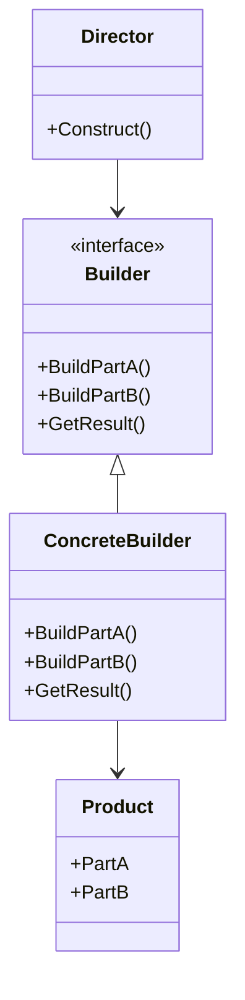

## 4.4 Builder Design Pattern

The Builder Design Pattern is a creational pattern that separates the construction of a complex object from its representation, allowing the same construction process to create various representations. This pattern is particularly useful when an object needs to be created with numerous optional parameters or when the construction process involves multiple steps.

### Intent

The primary intent of the Builder Design Pattern is to provide a flexible solution to constructing complex objects. It encapsulates the construction logic in a separate builder object, allowing the client to construct an object step-by-step, often using method chaining for improved readability and usability.

### Key Participants

1. **Builder**: Defines the abstract interface for creating parts of a Product object.
2. **ConcreteBuilder**: Implements the Builder interface and constructs and assembles parts of the product.
3. **Director**: Constructs an object using the Builder interface.
4. **Product**: Represents the complex object under construction.

### Applicability

Use the Builder Design Pattern when:
- The algorithm for creating a complex object should be independent of the parts that make up the object and how they are assembled.
- The construction process must allow different representations for the object that is constructed.
- You need to construct an object with numerous optional parameters.

### Implementing Builder in C#

#### Utilizing Builder Classes and Method Chaining

The Builder pattern in C# can be implemented using builder classes that encapsulate the construction logic. Method chaining is a common technique used in builders to allow for a fluent interface, making the code more readable and expressive.

```csharp
public class Car
{
    public string Engine { get; set; }
    public string Wheels { get; set; }
    public string Color { get; set; }
}

public class CarBuilder
{
    private Car _car = new Car();

    public CarBuilder SetEngine(string engine)
    {
        _car.Engine = engine;
        return this;
    }

    public CarBuilder SetWheels(string wheels)
    {
        _car.Wheels = wheels;
        return this;
    }

    public CarBuilder SetColor(string color)
    {
        _car.Color = color;
        return this;
    }

    public Car Build()
    {
        return _car;
    }
}

// Usage
var car = new CarBuilder()
    .SetEngine("V8")
    .SetWheels("Alloy")
    .SetColor("Red")
    .Build();
```

In this example, the `CarBuilder` class provides a fluent interface for constructing a `Car` object. Each method returns the builder itself, allowing for method chaining.

#### Step Builder Pattern

The Step Builder Pattern enhances the Builder pattern by enforcing a step-wise construction process. This pattern is particularly useful when certain steps are mandatory and must be executed in a specific order.

```csharp
public interface ICarBuilder
{
    ICarBuilder SetEngine(string engine);
    ICarBuilder SetWheels(string wheels);
    ICarBuilder SetColor(string color);
    Car Build();
}

public class StepCarBuilder : ICarBuilder
{
    private Car _car = new Car();

    public ICarBuilder SetEngine(string engine)
    {
        _car.Engine = engine;
        return this;
    }

    public ICarBuilder SetWheels(string wheels)
    {
        _car.Wheels = wheels;
        return this;
    }

    public ICarBuilder SetColor(string color)
    {
        _car.Color = color;
        return this;
    }

    public Car Build()
    {
        return _car;
    }
}

// Usage
var stepCar = new StepCarBuilder()
    .SetEngine("V6")
    .SetWheels("Steel")
    .SetColor("Blue")
    .Build();
```

The Step Builder Pattern ensures that the construction process is followed in a specific sequence, which can be beneficial for complex objects with dependencies between their parts.

#### Fluent Interfaces

Fluent interfaces are a technique used in the Builder pattern to enhance readability and usability. By using method chaining, fluent interfaces allow for a more natural and expressive way to construct objects.

```csharp
public class FluentCarBuilder
{
    private Car _car = new Car();

    public FluentCarBuilder WithEngine(string engine)
    {
        _car.Engine = engine;
        return this;
    }

    public FluentCarBuilder WithWheels(string wheels)
    {
        _car.Wheels = wheels;
        return this;
    }

    public FluentCarBuilder WithColor(string color)
    {
        _car.Color = color;
        return this;
    }

    public Car Build()
    {
        return _car;
    }
}

// Usage
var fluentCar = new FluentCarBuilder()
    .WithEngine("Electric")
    .WithWheels("Carbon Fiber")
    .WithColor("Green")
    .Build();
```

Fluent interfaces make the code more readable and intuitive, resembling natural language.

#### Use of Optional Parameters and Named Arguments

In C#, optional parameters and named arguments can be used to simplify the construction of objects with many optional parameters. However, the Builder pattern provides a more structured approach, especially when the construction process involves multiple steps.

```csharp
public class House
{
    public string Foundation { get; set; }
    public string Structure { get; set; }
    public string Roof { get; set; }
    public bool HasGarage { get; set; }
    public bool HasSwimmingPool { get; set; }
}

public class HouseBuilder
{
    private House _house = new House();

    public HouseBuilder SetFoundation(string foundation)
    {
        _house.Foundation = foundation;
        return this;
    }

    public HouseBuilder SetStructure(string structure)
    {
        _house.Structure = structure;
        return this;
    }

    public HouseBuilder SetRoof(string roof)
    {
        _house.Roof = roof;
        return this;
    }

    public HouseBuilder AddGarage(bool hasGarage)
    {
        _house.HasGarage = hasGarage;
        return this;
    }

    public HouseBuilder AddSwimmingPool(bool hasSwimmingPool)
    {
        _house.HasSwimmingPool = hasSwimmingPool;
        return this;
    }

    public House Build()
    {
        return _house;
    }
}

// Usage
var house = new HouseBuilder()
    .SetFoundation("Concrete")
    .SetStructure("Wood")
    .SetRoof("Shingles")
    .AddGarage(true)
    .AddSwimmingPool(false)
    .Build();
```

### Use Cases and Examples

The Builder Design Pattern is particularly useful in scenarios where complex configurations or objects need to be assembled step-by-step. Here are some common use cases:

1. **Building Complex Configurations**: When constructing objects with numerous optional parameters, the Builder pattern provides a clear and flexible solution.

2. **Assembling Objects Step-by-Step**: For objects that require a specific sequence of construction steps, the Builder pattern ensures that the process is followed correctly.

3. **Creating Immutable Objects**: The Builder pattern can be used to create immutable objects by only exposing the builder interface for construction and keeping the object's fields private.

4. **Constructing Composite Objects**: When an object is composed of multiple sub-objects, the Builder pattern can manage the construction of each component.

### Visualizing the Builder Pattern

To better understand the Builder Design Pattern, let's visualize its structure using a class diagram.



**Diagram Description**: This class diagram illustrates the relationship between the Director, Builder, ConcreteBuilder, and Product classes. The Director uses the Builder interface to construct a Product, while the ConcreteBuilder implements the Builder interface to create specific parts of the Product.

### Design Considerations

When implementing the Builder Design Pattern, consider the following:

- **Complexity**: The Builder pattern adds complexity to the codebase, so it should only be used when necessary.
- **Immutability**: Consider using the Builder pattern to create immutable objects, which can enhance thread safety and reliability.
- **Fluent Interfaces**: Use fluent interfaces to improve readability and usability, but be mindful of potential performance impacts due to method chaining.
- **Step Builder Pattern**: Use the Step Builder Pattern when the construction process requires a specific sequence of steps.

### Differences and Similarities

The Builder Design Pattern is often compared to other creational patterns, such as the Factory Method and Abstract Factory patterns. Here are some key differences and similarities:

- **Builder vs. Factory Method**: The Factory Method pattern focuses on creating a single object, while the Builder pattern constructs a complex object step-by-step.
- **Builder vs. Abstract Factory**: The Abstract Factory pattern provides an interface for creating families of related objects, whereas the Builder pattern constructs a single complex object.
- **Similarities**: Both the Builder and Factory patterns abstract the instantiation process, promoting flexibility and scalability.

### Try It Yourself

To deepen your understanding of the Builder Design Pattern, try modifying the code examples provided. Experiment with adding new methods to the builder classes, creating different representations of the objects, or implementing the Step Builder Pattern for a different use case.

### Knowledge Check

Before moving on, ensure you understand the following key points:

- The purpose and intent of the Builder Design Pattern.
- How to implement the Builder pattern in C# using builder classes and method chaining.
- The differences between the Builder pattern and other creational patterns.
- When to use the Builder pattern and its advantages.

Remember, mastering design patterns is a journey. As you continue to explore and experiment with different patterns, you'll gain a deeper understanding of their applications and benefits. Keep practicing, stay curious, and enjoy the process!

## Quiz Time!



### What is the primary intent of the Builder Design Pattern?

- [x] To separate the construction of a complex object from its representation.
- [ ] To create a single object with a factory method.
- [ ] To provide an interface for creating families of related objects.
- [ ] To ensure a class has only one instance.

> **Explanation:** The Builder Design Pattern's primary intent is to separate the construction of a complex object from its representation, allowing for different representations.

### Which of the following is a key participant in the Builder Design Pattern?

- [x] Builder
- [ ] Singleton
- [ ] Observer
- [ ] Adapter

> **Explanation:** The Builder is a key participant in the Builder Design Pattern, defining the interface for creating parts of a Product object.

### What technique is commonly used in the Builder pattern to enhance readability?

- [x] Method chaining
- [ ] Singleton pattern
- [ ] Observer pattern
- [ ] Adapter pattern

> **Explanation:** Method chaining is commonly used in the Builder pattern to enhance readability and provide a fluent interface.

### When should you consider using the Builder Design Pattern?

- [x] When constructing an object with numerous optional parameters.
- [ ] When you need to ensure a class has only one instance.
- [ ] When you want to observe changes in an object.
- [ ] When you need to adapt one interface to another.

> **Explanation:** The Builder Design Pattern is useful when constructing an object with numerous optional parameters or when the construction process involves multiple steps.

### What is a benefit of using the Step Builder Pattern?

- [x] It enforces a step-wise construction process.
- [ ] It ensures a class has only one instance.
- [ ] It allows observing changes in an object.
- [ ] It adapts one interface to another.

> **Explanation:** The Step Builder Pattern enforces a step-wise construction process, ensuring that certain steps are mandatory and executed in a specific order.

### How does the Builder pattern differ from the Factory Method pattern?

- [x] The Builder pattern constructs a complex object step-by-step.
- [ ] The Builder pattern creates a single object with a factory method.
- [ ] The Builder pattern provides an interface for creating families of related objects.
- [ ] The Builder pattern ensures a class has only one instance.

> **Explanation:** The Builder pattern constructs a complex object step-by-step, while the Factory Method pattern focuses on creating a single object.

### What is a similarity between the Builder and Abstract Factory patterns?

- [x] Both abstract the instantiation process.
- [ ] Both ensure a class has only one instance.
- [ ] Both allow observing changes in an object.
- [ ] Both adapt one interface to another.

> **Explanation:** Both the Builder and Abstract Factory patterns abstract the instantiation process, promoting flexibility and scalability.

### Which pattern is often used to create immutable objects?

- [x] Builder pattern
- [ ] Singleton pattern
- [ ] Observer pattern
- [ ] Adapter pattern

> **Explanation:** The Builder pattern is often used to create immutable objects by only exposing the builder interface for construction.

### What is a potential downside of using fluent interfaces?

- [x] Performance impacts due to method chaining.
- [ ] Difficulty in ensuring a class has only one instance.
- [ ] Challenges in observing changes in an object.
- [ ] Complexity in adapting one interface to another.

> **Explanation:** Fluent interfaces can have performance impacts due to method chaining, although they improve readability and usability.

### True or False: The Builder Design Pattern is useful for constructing objects with a specific sequence of steps.

- [x] True
- [ ] False

> **Explanation:** True. The Builder Design Pattern is useful for constructing objects with a specific sequence of steps, ensuring that the process is followed correctly.


