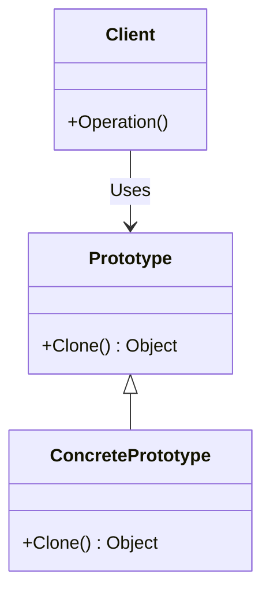

## 4.5 Prototype Design Pattern

The Prototype Design Pattern is a creational pattern that focuses on the cloning of objects. Instead of creating new instances through constructors, the Prototype pattern allows for the creation of new objects by copying an existing object, known as the prototype. This approach is particularly useful when the cost of creating a new instance is more expensive than copying an existing one.

### Intent

The primary intent of the Prototype Design Pattern is to:

- **Reduce the cost of creating objects**: By cloning existing objects, we can avoid the overhead associated with creating new instances from scratch.
- **Simplify the creation of complex objects**: When objects are complex and require significant setup, cloning can simplify the creation process.
- **Promote flexibility and scalability**: The pattern allows for easy creation of new object types without modifying existing code.

### Key Participants

- **Prototype**: This is the interface or abstract class that defines the method for cloning itself.
- **ConcretePrototype**: This class implements the cloning method to create a copy of itself.
- **Client**: The client is responsible for requesting a clone from the prototype.

### Implementing Prototype in C#

In C#, the Prototype pattern can be implemented using the `ICloneable` interface, which provides a standard method for cloning objects. Additionally, cloning can be achieved through deep and shallow copies, as well as serialization techniques.

#### Using the `ICloneable` Interface

The `ICloneable` interface in C# defines a single method, `Clone()`, which is used to create a copy of an object. Here's how you can implement the Prototype pattern using this interface:

```csharp
public class Prototype : ICloneable
{
    public string Name { get; set; }
    public int Age { get; set; }

    public object Clone()
    {
        return this.MemberwiseClone();
    }
}

public class Client
{
    public static void Main()
    {
        Prototype original = new Prototype { Name = "John", Age = 30 };
        Prototype clone = (Prototype)original.Clone();

        Console.WriteLine($"Original: {original.Name}, {original.Age}");
        Console.WriteLine($"Clone: {clone.Name}, {clone.Age}");
    }
}
```

In this example, the `Prototype` class implements the `ICloneable` interface, and the `Clone()` method uses `MemberwiseClone()` to create a shallow copy of the object.

#### Deep vs. Shallow Copy

When cloning objects, it's essential to understand the difference between deep and shallow copies:

- **Shallow Copy**: Copies the object's immediate values, but not the objects referenced by the object. Changes to referenced objects in the clone will affect the original.
- **Deep Copy**: Copies the object and all objects referenced by it, creating a fully independent clone.

##### Shallow Copy Example

The `MemberwiseClone()` method in C# creates a shallow copy. Here's an example:

```csharp
public class Address
{
    public string Street { get; set; }
    public string City { get; set; }
}

public class Person : ICloneable
{
    public string Name { get; set; }
    public Address Address { get; set; }

    public object Clone()
    {
        return this.MemberwiseClone();
    }
}

public class Client
{
    public static void Main()
    {
        Person original = new Person { Name = "Alice", Address = new Address { Street = "123 Main St", City = "Anytown" } };
        Person clone = (Person)original.Clone();

        clone.Address.City = "New City";

        Console.WriteLine($"Original Address: {original.Address.City}");
        Console.WriteLine($"Clone Address: {clone.Address.City}");
    }
}
```

In this example, changing the `City` property of the `clone` also changes the `City` property of the `original`, demonstrating the effects of a shallow copy.

##### Deep Copy Example

To create a deep copy, you need to manually clone the referenced objects:

```csharp
public class Address : ICloneable
{
    public string Street { get; set; }
    public string City { get; set; }

    public object Clone()
    {
        return new Address { Street = this.Street, City = this.City };
    }
}

public class Person : ICloneable
{
    public string Name { get; set; }
    public Address Address { get; set; }

    public object Clone()
    {
        Person clone = (Person)this.MemberwiseClone();
        clone.Address = (Address)this.Address.Clone();
        return clone;
    }
}

public class Client
{
    public static void Main()
    {
        Person original = new Person { Name = "Alice", Address = new Address { Street = "123 Main St", City = "Anytown" } };
        Person clone = (Person)original.Clone();

        clone.Address.City = "New City";

        Console.WriteLine($"Original Address: {original.Address.City}");
        Console.WriteLine($"Clone Address: {clone.Address.City}");
    }
}
```

In this deep copy example, the `Address` object is also cloned, ensuring that changes to the `clone` do not affect the `original`.

#### Serialization for Cloning

Serialization can be used to create deep copies of objects. This approach involves serializing the object to a memory stream and then deserializing it back into a new object.

```csharp
using System;
using System.IO;
using System.Runtime.Serialization;
using System.Runtime.Serialization.Formatters.Binary;

[Serializable]
public class Person
{
    public string Name { get; set; }
    public Address Address { get; set; }

    public Person DeepClone()
    {
        using (MemoryStream stream = new MemoryStream())
        {
            IFormatter formatter = new BinaryFormatter();
            formatter.Serialize(stream, this);
            stream.Seek(0, SeekOrigin.Begin);
            return (Person)formatter.Deserialize(stream);
        }
    }
}

public class Client
{
    public static void Main()
    {
        Person original = new Person { Name = "Alice", Address = new Address { Street = "123 Main St", City = "Anytown" } };
        Person clone = original.DeepClone();

        clone.Address.City = "New City";

        Console.WriteLine($"Original Address: {original.Address.City}");
        Console.WriteLine($"Clone Address: {clone.Address.City}");
    }
}
```

This method requires the objects to be marked as `[Serializable]`. The `DeepClone()` method uses a `MemoryStream` and `BinaryFormatter` to serialize and deserialize the object, creating a deep copy.

### Use Cases and Examples

The Prototype pattern is particularly useful in scenarios where:

- **Object creation is costly**: When creating new instances is resource-intensive, cloning can be a more efficient alternative.
- **Complex object initialization**: When objects require complex setup, cloning simplifies the process.
- **Dynamic object creation**: When the system needs to create objects dynamically at runtime, the Prototype pattern provides flexibility.

#### Example: Efficient Creation of Similar Objects

Consider a scenario where you need to create multiple instances of a complex object with slight variations. The Prototype pattern can be used to clone a base object and modify the necessary properties.

```csharp
public class Car : ICloneable
{
    public string Make { get; set; }
    public string Model { get; set; }
    public string Color { get; set; }

    public object Clone()
    {
        return this.MemberwiseClone();
    }
}

public class Client
{
    public static void Main()
    {
        Car prototype = new Car { Make = "Toyota", Model = "Corolla", Color = "Red" };

        Car car1 = (Car)prototype.Clone();
        car1.Color = "Blue";

        Car car2 = (Car)prototype.Clone();
        car2.Color = "Green";

        Console.WriteLine($"Car 1: {car1.Make}, {car1.Model}, {car1.Color}");
        Console.WriteLine($"Car 2: {car2.Make}, {car2.Model}, {car2.Color}");
    }
}
```

In this example, the `Car` class is cloned to create multiple instances with different colors, demonstrating the efficiency of the Prototype pattern in creating similar objects.

### Design Considerations

When implementing the Prototype pattern, consider the following:

- **Cloning Complexity**: Ensure that the cloning process is efficient and does not introduce unnecessary complexity.
- **Object Dependencies**: Be mindful of object dependencies and ensure that all necessary objects are cloned.
- **Serialization Overhead**: When using serialization for deep cloning, be aware of the performance overhead and ensure that all objects are serializable.

### Differences and Similarities

The Prototype pattern is often compared to other creational patterns, such as Factory Method and Abstract Factory. While these patterns focus on creating new instances, the Prototype pattern emphasizes cloning existing instances. This distinction makes the Prototype pattern particularly useful in scenarios where object creation is costly or complex.

### Visualizing the Prototype Pattern

To better understand the Prototype pattern, let's visualize the process of cloning objects using a class diagram.



In this diagram, the `Prototype` class defines the `Clone()` method, which is implemented by the `ConcretePrototype` class. The `Client` interacts with the `Prototype` to create new instances through cloning.

### Try It Yourself

To gain a deeper understanding of the Prototype pattern, try modifying the code examples provided:

- **Experiment with different object structures**: Add more properties to the `Person` or `Car` classes and observe how cloning affects them.
- **Implement custom cloning logic**: Modify the `Clone()` method to include custom logic for specific properties.
- **Test serialization with different formats**: Explore other serialization formats, such as JSON or XML, for deep cloning.

### Knowledge Check

Before we conclude, let's reinforce what we've learned with a few questions:

- **What is the primary intent of the Prototype pattern?**
- **How does a shallow copy differ from a deep copy?**
- **What are some use cases for the Prototype pattern?**

### Embrace the Journey

Remember, mastering design patterns is a journey. As you continue to explore and experiment with the Prototype pattern, you'll gain valuable insights into efficient object creation and software design. Keep experimenting, stay curious, and enjoy the journey!

## Quiz Time!



### What is the primary intent of the Prototype Design Pattern?

- [x] To create new objects by copying existing ones
- [ ] To define an interface for creating objects
- [ ] To separate the construction of a complex object from its representation
- [ ] To provide a way to access the elements of an aggregate object sequentially

> **Explanation:** The Prototype Design Pattern's primary intent is to create new objects by copying existing ones, known as prototypes.

### Which method in C# is commonly used for creating a shallow copy of an object?

- [x] MemberwiseClone()
- [ ] DeepClone()
- [ ] Copy()
- [ ] Clone()

> **Explanation:** The `MemberwiseClone()` method is used in C# to create a shallow copy of an object.

### What is the key difference between a shallow copy and a deep copy?

- [x] A shallow copy copies only the object's immediate values, while a deep copy copies all referenced objects as well.
- [ ] A shallow copy copies all referenced objects, while a deep copy copies only the object's immediate values.
- [ ] A shallow copy is faster than a deep copy.
- [ ] A deep copy is faster than a shallow copy.

> **Explanation:** A shallow copy copies only the object's immediate values, whereas a deep copy copies all referenced objects, creating a fully independent clone.

### What interface in C# is typically implemented to support cloning?

- [x] ICloneable
- [ ] IClonable
- [ ] ICopyable
- [ ] ISerializable

> **Explanation:** The `ICloneable` interface is implemented in C# to support cloning of objects.

### Which of the following is a use case for the Prototype pattern?

- [x] Efficient creation of similar objects
- [ ] Managing object dependencies
- [ ] Separating object construction from representation
- [ ] Providing a way to access elements of an aggregate object

> **Explanation:** The Prototype pattern is used for the efficient creation of similar objects by cloning existing ones.

### What is a potential downside of using serialization for cloning?

- [x] Serialization can introduce performance overhead.
- [ ] Serialization does not support deep copying.
- [ ] Serialization is not supported in C#.
- [ ] Serialization requires manual implementation of the Clone method.

> **Explanation:** Serialization can introduce performance overhead, especially when dealing with large or complex objects.

### How can you ensure that a deep copy is created when using the Prototype pattern?

- [x] Manually clone all referenced objects within the Clone method.
- [ ] Use the MemberwiseClone method.
- [ ] Implement the ISerializable interface.
- [ ] Use the Copy method.

> **Explanation:** To ensure a deep copy, you must manually clone all referenced objects within the `Clone` method.

### What is the role of the Client in the Prototype pattern?

- [x] To request a clone from the prototype
- [ ] To define the cloning method
- [ ] To implement the cloning logic
- [ ] To create new instances from scratch

> **Explanation:** The Client is responsible for requesting a clone from the prototype, utilizing the cloning capabilities provided by the pattern.

### True or False: The Prototype pattern is only useful for creating simple objects.

- [ ] True
- [x] False

> **Explanation:** False. The Prototype pattern is particularly useful for creating complex objects that require significant setup or are costly to create from scratch.

### Which of the following is NOT a key participant in the Prototype pattern?

- [ ] Prototype
- [ ] ConcretePrototype
- [ ] Client
- [x] Factory

> **Explanation:** The Factory is not a key participant in the Prototype pattern. The key participants are Prototype, ConcretePrototype, and Client.


